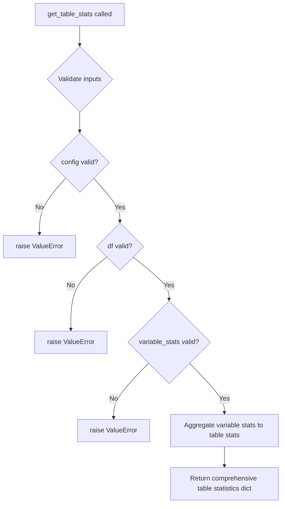

# `table.py`

## `src.ydata_profiling.model.table.get_table_stats` · *function*

## Summary:
Computes comprehensive table-level statistics summarizing the entire dataset structure and characteristics.

## Description:
This function aggregates variable-level statistics into meaningful table-level summaries that provide an overview of the dataset's structure, size, and quality. Table-level statistics typically include metadata such as row count, column count, memory usage, and dataset dimensions, along with quality indicators like duplicate rows and missing values.

As an abstract interface, this function defines the contract for computing table statistics in data profiling workflows. Concrete implementations provide the actual computation logic while maintaining consistency in the returned data structure.

## Args:
    config (Settings): Configuration settings controlling the profiling behavior and which statistics to compute
    df (Any): The input DataFrame containing the data to profile
    variable_stats (dict): Dictionary mapping column names to their respective statistical summaries

## Returns:
    dict: A dictionary containing table-level statistics including:
        - Dataset metadata (shape, dimensions, memory usage)
        - Quality indicators (duplicate rows, missing cells)
        - Structural information (row/column counts)

## Raises:
    NotImplementedError: This is a placeholder function that must be implemented by subclasses or concrete implementations

## Constraints:
    Preconditions:
    - config must be a valid Settings object
    - df must be a valid DataFrame-like object
    - variable_stats must be a dictionary mapping column names to their statistics
    
    Postconditions:
    - The returned dictionary contains comprehensive table-level statistics
    - All required metadata about the dataset structure is included

## Side Effects:
    None: This function does not perform any I/O operations or mutate external state

## Control Flow:


## Examples:
```python
# Typical implementation might return something like:
{
    'n_rows': 1000,
    'n_cols': 10,
    'memory_usage': 102400,
    'table_shape': (1000, 10),
    'duplicate_rows': 50,
    'missing_cells': 200,
    'total_cells': 10000
}

# Usage in a profiling workflow:
config = Settings()
df = pd.DataFrame({'A': [1, 2, 3], 'B': [4, 5, 6]})
variable_stats = {'A': {'mean': 2.0}, 'B': {'mean': 5.0}}
# Implementation would compute full table statistics from these inputs
```

