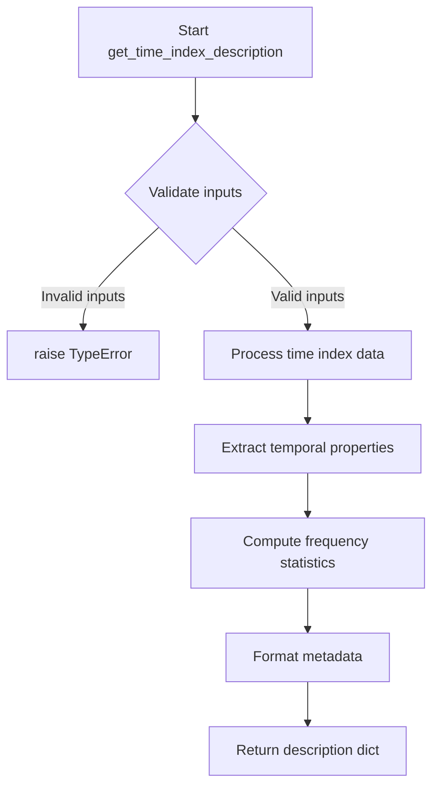

# `timeseries_index.py`

## `src.ydata_profiling.model.timeseries_index.get_time_index_description` · *function*

## Summary:
Placeholder function for extracting descriptive statistics about a time index column in time series data.

## Description:
This function serves as a placeholder for extracting and formatting descriptive information about the time index column from time series data. It is intended to analyze the temporal characteristics of time series data and provide structured metadata for reporting, visualization, or further analysis in time series profiling.

The function is part of a time series analysis framework and would typically be called during the profiling process when analyzing temporal data patterns. Currently, it raises NotImplementedError as the implementation is pending.

## Args:
    config (Settings): Configuration settings object containing profiling parameters and options
    df (Any): Dataframe or data structure containing time series data
    table_stats (dict): Dictionary containing pre-computed statistics about the entire table

## Returns:
    dict: A dictionary containing time index description information including temporal properties, frequency analysis, and metadata about the time column

## Raises:
    NotImplementedError: This function is not yet implemented and must be implemented with actual logic

## Constraints:
    Preconditions:
    - config parameter must be a valid Settings object
    - df parameter must contain valid time series data
    - table_stats parameter must be a dictionary with valid statistical information
    
    Postconditions:
    - Return value will be a dictionary with standardized keys for time index description

## Side Effects:
    None: This function does not perform any I/O operations or mutate external state

## Control Flow:

## Examples:
    # Typical usage in time series profiling workflow
    config = Settings()
    df = pd.DataFrame({'date': ['2023-01-01', '2023-01-02'], 'value': [1, 2]})
    table_stats = {'n_rows': 2, 'n_cols': 2}
    
    try:
        result = get_time_index_description(config, df, table_stats)
        print(result)
    except NotImplementedError:
        print("Function not yet implemented - needs implementation")

