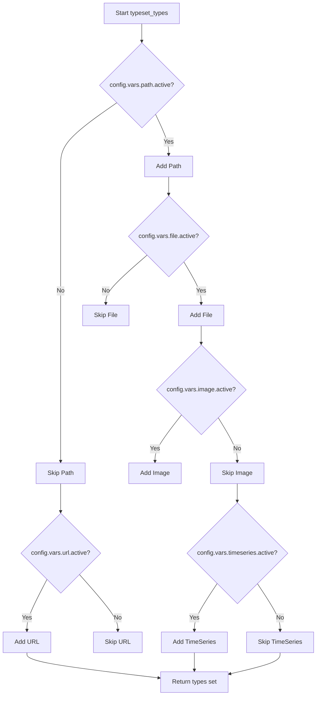
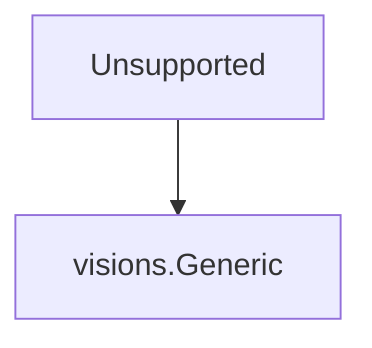
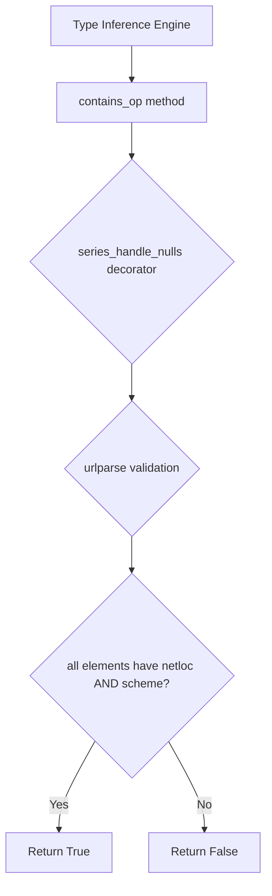
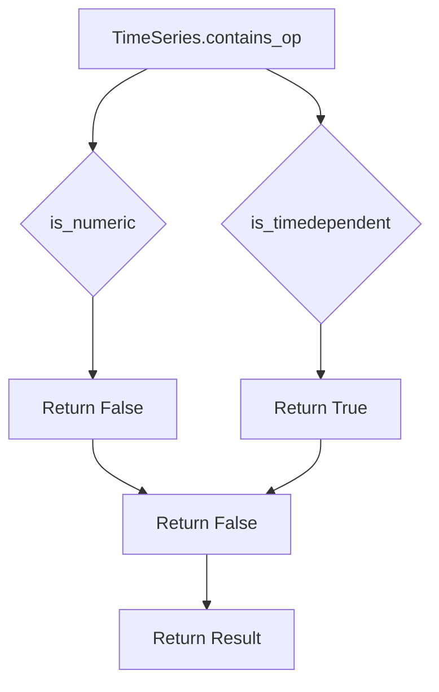

# `typeset.py`

## `src.ydata_profiling.model.typeset.series_handle_nulls` · *function*

## Summary:
Decorator that preprocesses pandas Series by handling null values before applying type checking logic.

## Description:
This decorator wraps a type checking function to automatically handle Series containing null values. It ensures that type inference functions receive clean data by removing null entries, while properly managing edge cases like completely empty Series after null removal.

## Args:
    fn (Callable[..., bool]): The type checking function to decorate, expected to accept (series: pd.Series, state: dict, *args, **kwargs) and return a boolean.

## Returns:
    Callable[..., bool]: A wrapped function that processes null values in the input Series before calling the original function.

## Raises:
    None explicitly raised - depends on the behavior of the wrapped function `fn`.

## Constraints:
    Preconditions:
    - Input series must be a pandas Series
    - State parameter must be a dictionary
    - The wrapped function `fn` must accept (series, state, *args, **kwargs) signature
    
    Postconditions:
    - If the series contains only null values, returns False without calling the wrapped function
    - If the series has null values, the wrapped function receives a null-free series
    - The state dictionary is updated with "hasnans" key if not already present

## Side Effects:
    None - This function doesn't perform I/O operations or mutate external state beyond updating the provided state dictionary.

## Control Flow:
```mermaid
flowchart TD
    A[series_handle_nulls called] --> B{hasnans in state?}
    B -- No --> C[state["hasnans"] = series.hasnans]
    C --> D[state["hasnans"] = series.hasnans]
    B -- Yes --> D
    D --> E{state["hasnans"]?}
    E -- Yes --> F[series = series.dropna()]
    F --> G{series.empty?}
    G -- Yes --> H[return False]
    G -- No --> I[fn(series, state, *args, **kwargs)]
    E -- No --> J[fn(series, state, *args, **kwargs)]
    H --> K[Return False]
    I --> K
    J --> K
```

## Examples:
```python
# Basic usage as decorator
@series_handle_nulls
def my_type_check(series, state, *args, **kwargs):
    return len(series) > 0

# Usage with a series containing nulls
import pandas as pd
series_with_nulls = pd.Series([1, 2, None, 4])
state = {}
result = my_type_check(series_with_nulls, state)  # Will drop nulls and check remaining data

# Usage with a series containing only nulls
series_only_nulls = pd.Series([None, None])
state = {}
result = my_type_check(series_only_nulls, state)  # Will return False immediately
```

## `src.ydata_profiling.model.typeset.typeset_types` · *function*

## Summary:
Creates and returns a set of VisionsBaseType classes representing supported data types for profiling, with conditional inclusion based on configuration settings.

## Description:
This function dynamically constructs a collection of VisionsBaseType subclasses that define various data types (Numeric, Text, DateTime, Categorical, Boolean, etc.) used for data profiling. The types are conditionally included based on configuration flags in the Settings object, allowing for flexible type detection based on project requirements. Each type implements type inference relations and contains operations to identify data of that type.

## Args:
    config (Settings): Configuration object containing flags that control which data types are included in the returned set.

## Returns:
    Set[visions.VisionsBaseType]: A set of VisionsBaseType subclasses that define supported data types for profiling.

## Raises:
    None explicitly raised

## Constraints:
    Preconditions:
    - The config parameter must be a valid Settings object with properly initialized variables
    - All configuration variables (vars.path.active, vars.file.active, etc.) must be accessible
    
    Postconditions:
    - Returns a set containing at least the basic types: Unsupported, Boolean, Numeric, Text, Categorical, DateTime
    - Additional types (URL, Path, File, Image, TimeSeries) are conditionally included based on config flags

## Side Effects:
    None

## Control Flow:


## Examples:
```python
# Basic usage with default configuration
config = Settings()
type_set = typeset_types(config)
print(len(type_set))  # Will include basic types like Numeric, Text, etc.

# Usage with path enabled
config = Settings()
config.vars.path.active = True
type_set = typeset_types(config)
# Will include Path type in addition to basic types
```

## `src.ydata_profiling.model.typeset.Unsupported` · *class*

## Summary:
Minimal class representing an unsupported data type that inherits from visions.Generic.

## Description:
The `Unsupported` class is a minimal implementation that inherits from `visions.Generic`. It serves as a placeholder in the type inference system for data types that cannot be classified or handled by the profiling system's type resolution mechanisms. This class provides the basic structure required by the type system framework without implementing any additional functionality.

## State:
- Inherits from `visions.Generic` (parent class state applies)
- No additional instance attributes or properties defined
- No constructor parameters or initialization logic

## Lifecycle:
- Creation: Automatically instantiated by the type inference system when a data type cannot be resolved to any supported type
- Usage: Used internally by the profiling system's type resolution framework
- Destruction: Managed by Python's garbage collection mechanism

## Method Map:


## Raises:
- No explicit exceptions defined in the class implementation
- Any exceptions would be inherited from the parent `visions.Generic` class

## Example:
```python
# This class is typically instantiated automatically by the type system
# and is not intended for direct instantiation by users
unsupported_instance = Unsupported()  # Created internally by type inference
```

## `src.ydata_profiling.model.typeset.Numeric` · *class*

## Summary:
Numeric represents a numeric data type in the ydata-profiling type inference system, identifying pandas Series containing numeric values while excluding boolean data.

## Description:
The Numeric class is a fundamental type specification within the ydata-profiling framework that enables automatic detection and classification of numeric data. It inherits from visions.VisionsBaseType and implements the core logic for determining whether a pandas Series should be categorized as numeric data.

This class serves as a crucial building block in the type inference system, helping the profiling engine distinguish between different data types such as numeric, string, boolean, and categorical data. It specifically excludes boolean data types from numeric classification, ensuring accurate data profiling.

The class implements two essential methods: get_relations() which defines how numeric types relate to other data types in the system (including relationships with Unsupported and Text types), and contains_op() which performs the actual validation logic to determine if a series qualifies as numeric.

## State:
- Inherits from visions.VisionsBaseType
- No explicit instance attributes defined
- The contains_op method takes a pandas Series and state dictionary as parameters
- Uses pandas type checking functions (pdt.is_numeric_dtype and pdt.is_bool_dtype) to validate numeric data

## Lifecycle:
- Creation: Automatically instantiated by the type inference system when needed for type validation
- Usage: Called internally by the profiling system during data analysis to classify columns
- Destruction: Managed by Python's garbage collection

## Method Map:
```mermaid
flowchart TD
    A[Numeric.get_relations] --> B[IdentityRelation(Unsupported)]
    A --> C[InferenceRelation(Text)]
    C --> D[string_is_numeric]
    C --> E[string_to_numeric]
    F[Numeric.contains_op] --> G[pdt.is_numeric_dtype]
    F --> H[pdt.is_bool_dtype]
```

## Raises:
- No explicit exceptions documented in the class definition
- May raise exceptions from underlying pandas type checking functions or decorated methods

## Example:
```python
# This class is used internally by the profiling system
# Example of internal usage pattern:
# series = pd.Series([1, 2, 3, 4, 5])
# numeric_type = Numeric()
# result = numeric_type.contains_op(series, {})
# The result would be True for numeric data, False for non-numeric data
```

### `src.ydata_profiling.model.typeset.Numeric.get_relations` · *method*

## Summary:
Defines the type relationships for the Numeric class, establishing identity with Unsupported and inference capability from Text type.

## Description:
This static method returns a sequence of TypeRelation objects that define how the Numeric type relates to other types in the ydata-profiling typeset system. It specifies two fundamental relationships:
1. An IdentityRelation with the Unsupported type, indicating Numeric and Unsupported are considered equivalent types
2. An InferenceRelation from the Text type, enabling conversion of textual numeric representations to actual numeric values

The inference relation uses the string_is_numeric function with a pre-configured k parameter (likely a Settings object) to validate if text data represents numeric values, and string_to_numeric to perform the actual conversion from text to numeric format.

This method is part of the type inference framework that enables automatic detection and categorization of data types in datasets.

## Args:
    None

## Returns:
    Sequence[TypeRelation]: A sequence containing exactly two TypeRelation objects:
        - IdentityRelation(Unsupported): Indicates Numeric type is identical to Unsupported type
        - InferenceRelation(Text, relationship=lambda, transformer=string_to_numeric): Defines inference from Text type to Numeric type using validation and transformation functions

## Raises:
    None explicitly raised

## State Changes:
    None

## Constraints:
    Preconditions:
        - This method is designed to be called as a static method of the Numeric class
        - The method assumes the existence of classes Unsupported and Text in the typeset hierarchy
        - The method depends on a config variable (expected to be a Settings object) being available in the enclosing scope

    Postconditions:
        - Returns exactly two TypeRelation objects in a specific order
        - The returned relations accurately reflect the intended type relationships for numeric inference

## Side Effects:
    None

### `src.ydata_profiling.model.typeset.Numeric.contains_op` · *method*

## Summary:
Determines whether a pandas Series contains numeric data (excluding boolean data) for type inclusion validation.

## Description:
This static method implements a type validation operation for the Numeric type within the ydata-profiling typeset framework. It evaluates whether a given pandas Series should be considered as belonging to the numeric type set by checking if the series has a numeric dtype while excluding boolean dtypes. This method is part of the type inference system that assists in automatically identifying appropriate numeric data types for statistical analysis and profiling operations.

The method is decorated with `@multimethod`, `@series_not_empty`, and `@series_handle_nulls` which provide additional processing capabilities for multimodal dispatch, empty series handling, and null value management respectively.

## Args:
    series (pd.Series): A pandas Series object to be evaluated for numeric type membership
    state (dict): A dictionary containing metadata about the series, including potential null value information

## Returns:
    bool: True if the series has a numeric dtype and is not a boolean dtype, False otherwise

## Raises:
    None explicitly raised by this method. Exceptions may be raised by underlying pandas dtype checking functions.

## State Changes:
    Attributes READ: None - this method only reads input parameters
    Attributes WRITTEN: None - this method does not modify instance state

## Constraints:
    Preconditions:
    - The `series` parameter must be a valid pandas Series object
    - The `state` parameter must be a dictionary (can be empty)
    
    Postconditions:
    - Returns a boolean value indicating numeric type membership
    - The method does not alter the input series or state dictionary

## Side Effects:
    None directly caused by this method. However, the decorators may perform additional processing including:
    - Null value handling via `@series_handle_nulls` 
    - Empty series validation via `@series_not_empty`
    - Multimodal dispatch behavior via `@multimethod`

## `src.ydata_profiling.model.typeset.Text` · *class*

## Summary:
Text is a Visions data type classifier that identifies pandas Series containing textual string data, excluding categorical data.

## Description:
The Text class is a Visions type implementation used in ydata-profiling for automatic data type detection. It identifies Series that contain string data but are not categorical, enabling appropriate text-specific analysis and reporting. This class is part of the type inference system that helps the profiler understand data characteristics for generating meaningful statistics and visualizations.

The class is used internally by the Visions type system and is not directly instantiated by users. It defines the conditions under which a Series should be classified as Text type.

## State:
- Inherits all state from visions.VisionsBaseType parent class
- No additional instance attributes defined in this class
- The contains_op method takes two parameters:
  - series: A pandas Series to be evaluated for text type
  - state: A dictionary containing metadata about the series

## Lifecycle:
- Creation: Automatically created by the Visions type system during type inference initialization
- Usage: Called internally by the type inference engine during type classification
- Destruction: Managed by Python garbage collection

## Method Map:
```mermaid
flowchart TD
    A[Type Inference Engine] --> B[contains_op method]
    B --> C{not pdt.is_categorical_dtype(series)?}
    C -->|Yes| D{pdt.is_string_dtype(series)?}
    D -->|Yes| E{series_is_string(series,state)?}
    E -->|Yes| F[Return True]
    E -->|No| G[Return False]
    D -->|No| G
    C -->|No| G
```

## Raises:
- May raise exceptions from pandas dtype checking operations
- May raise exceptions from series_is_string function (TypeError, ValueError)
- May raise exceptions from decorator functions if they encounter errors

## Example:
```python
# This class is used internally by the profiling system
# During type inference, the system evaluates:
# series = pd.Series(['hello', 'world', 'test'])
# text_type = Text()
# result = text_type.contains_op(series, {})
# result would be True if series contains valid string data
# The class helps determine appropriate analysis methods for text data
```

### `src.ydata_profiling.model.typeset.Text.get_relations` · *method*

## Summary:
Returns the type relations defining how the Text type maps to other types in the type system.

## Description:
This static method defines the type relationships for the Text type within the visions type system. It specifies that Text is identically mapped to the Unsupported type, indicating that text data is treated as an unsupported type in this particular type hierarchy.

## Args:
    None

## Returns:
    Sequence[TypeRelation]: A sequence containing a single IdentityRelation that maps Text to Unsupported.

## Raises:
    None

## State Changes:
    None

## Constraints:
    Preconditions: None
    Postconditions: The returned sequence always contains exactly one IdentityRelation with Unsupported as its target type.

## Side Effects:
    None

### `src.ydata_profiling.model.typeset.Text.contains_op` · *method*

## Summary:
Determines whether a pandas Series should be classified as containing text/string data based on dtype and content validation.

## Description:
This static method serves as a type detection operation for identifying text data within a pandas Series. It evaluates whether a series meets the criteria for being categorized as textual data by checking both its data type characteristics and content consistency. The method is part of the Text type detection system in the ydata-profiling library's type inference framework.

The method is called during the automated type inference process when the profiling system attempts to categorize data columns. It's specifically used to distinguish between different data types, particularly when deciding whether a column containing string-like data should be treated as text rather than other categories like numeric or categorical.

## Args:
    series (pd.Series): A pandas Series containing the data to be evaluated for text classification
    state (dict): A dictionary containing metadata about the series, including null value status and other processing state information

## Returns:
    bool: True if the series should be classified as containing text data (not categorical, is string dtype, and passes content validation); False otherwise

## Raises:
    None explicitly raised by this method. Exceptions may occur internally from underlying pandas operations or the `series_is_string` function.

## State Changes:
    Attributes READ: None - this method only reads from the input parameters
    Attributes WRITTEN: None - this method is stateless and doesn't modify any object attributes

## Constraints:
    Preconditions:
    - The input series must be a valid pandas Series object
    - The state dictionary should be properly initialized with any required metadata
    - The series should not be completely empty (handled by @series_not_empty decorator)
    
    Postconditions:
    - The method returns a boolean value indicating text classification eligibility
    - The method is idempotent and produces consistent results for the same inputs

## Side Effects:
    None directly caused by this method. However, the @series_handle_nulls decorator may modify the series temporarily by removing null values before processing, though this is handled internally.

## `src.ydata_profiling.model.typeset.DateTime` · *class*

## Summary:
DateTime is a datetime type implementation in the YData Profiling visions type system for identifying and validating datetime data in pandas Series.

## Description:
The DateTime class extends visions.VisionsBaseType to provide datetime type detection capabilities within the YData Profiling framework. It enables the profiling system to recognize datetime data and establish appropriate type relationships with other data types. This class is automatically integrated into the type inference system during profiling operations.

## State:
- Inherits from visions.VisionsBaseType with standard type system functionality
- No instance attributes defined beyond parent class inheritance
- The contains_op method processes pandas Series objects and state dictionaries
- The get_relations method defines type relationships with other data types

## Lifecycle:
- Creation: Automatically instantiated by the visions type system during typeset initialization
- Usage: Invoked by the type inference engine when determining column data types
- Destruction: Managed by Python's garbage collection mechanism

## Method Map:
```mermaid
graph TD
    A[get_relations] --> B[IdentityRelation(Unsupported)]
    A --> C[InferenceRelation(Text)]
    C --> D[string_is_datetime]
    C --> E[string_to_datetime]
    contains_op --> F[pd.is_datetime64_any_dtype]
    contains_op --> G[series.dropna().apply(type)]
    contains_op --> H[isin([datetime.date, datetime.datetime])]
```

## Raises:
- No explicit exceptions declared in method signatures
- Exceptions may propagate from underlying visions type system operations
- Decorators (series_not_empty, series_handle_nulls) handle null value processing internally

## Example:
```python
# The DateTime class is used internally by the profiling system
# Typical instantiation occurs during typeset construction

# Usage in type inference context:
# is_datetime = DateTime.contains_op(series, state_dict)
# relations = DateTime.get_relations()
```

### `src.ydata_profiling.model.typeset.DateTime.get_relations` · *method*

## Summary:
Returns the type relations for the DateTime type, defining how it relates to other data types in the profiling system.

## Description:
This method defines the type inference relationships for the DateTime type. It specifies that DateTime can be identified as an Unsupported type through identity relation, and can be inferred from Text type through a string-to-datetime conversion process.

## Args:
    None

## Returns:
    Sequence[TypeRelation]: A sequence containing two TypeRelation objects:
        - IdentityRelation(Unsupported): Establishes that DateTime is identical to Unsupported type
        - InferenceRelation(Text, relationship=string_is_datetime, transformer=string_to_datetime): Defines that Text type can be inferred as DateTime type using string_is_datetime for validation and string_to_datetime for transformation

## Raises:
    None explicitly raised

## State Changes:
    Attributes READ: None
    Attributes WRITTEN: None

## Constraints:
    Preconditions: None
    Postconditions: The returned sequence contains exactly two TypeRelation objects in the specified order

## Side Effects:
    None

### `src.ydata_profiling.model.typeset.DateTime.contains_op` · *method*

## Summary:
Determines whether a pandas Series contains datetime data by checking for datetime64 dtypes or builtin datetime objects.

## Description:
This method evaluates whether a given pandas Series contains datetime data. It first checks if the series has a datetime64 dtype, and if not, examines whether all non-null values are instances of Python's built-in datetime types (datetime.date or datetime.datetime). This method is used in type inference to identify datetime-like data within a series.

## Args:
    series (pd.Series): The pandas Series to evaluate for datetime content
    state (dict): A state dictionary containing contextual information for type inference

## Returns:
    bool: True if the series contains datetime data (either datetime64 dtype or builtin datetime objects), False otherwise

## Raises:
    None explicitly raised

## State Changes:
    Attributes READ: None
    Attributes WRITTEN: None

## Constraints:
    Preconditions: 
    - The series parameter must be a valid pandas Series
    - The state parameter must be a dictionary
    
    Postconditions:
    - Returns a boolean value indicating datetime content presence
    - Does not modify the input series or state

## Side Effects:
    None

## `src.ydata_profiling.model.typeset.Categorical` · *class*

## Summary:
Represents the categorical data type in the profiling system, defining how to identify and transform categorical data from other types.

## Description:
The Categorical class is a type definition within the ydata-profiling system that identifies categorical data and establishes relationships for type inference. It serves as a bridge between different data representations, allowing the system to recognize when data should be treated as categorical based on its characteristics or transformation from other types.

This class is part of the type system that enables automatic data type detection and conversion during data profiling. It's particularly useful for identifying when numeric or textual data should be interpreted as categorical variables.

## State:
- Inherits from visions.VisionsBaseType, which provides base type functionality
- Contains no instance attributes beyond those inherited from the parent class
- The class uses a global config variable (referenced in lambda expressions but not defined in this scope) for threshold configurations in type inference relations

## Lifecycle:
- Creation: Automatically instantiated as part of the type system initialization
- Usage: Called by the profiling system during type inference and validation phases
- Destruction: Managed by Python's garbage collection

## Method Map:
```mermaid
flowchart TD
    A[Categorical.get_relations] --> B[IdentityRelation(Unsupported)]
    A --> C[InferenceRelation(Numeric, numeric_is_category)]
    A --> D[InferenceRelation(Text, string_is_category)]
    E[Categorical.contains_op] --> F[is_categorical_dtype(series) AND NOT is_bool_dtype(series)]
```

## Raises:
- No explicit exceptions raised by the constructor
- Exceptions may be raised by underlying vision library functions or type checking utilities

## Example:
```python
# The Categorical class is typically used internally by the profiling system
# to identify and categorize data types automatically

# When the system encounters data that could be categorical:
# 1. It checks if the data matches the contains_op criteria
# 2. It evaluates type relations to determine if it should be inferred as categorical
# 3. It applies appropriate transformations if needed

# Typical usage pattern (internal to the system):
# series = pd.Series(['A', 'B', 'A', 'C'])
# is_categorical = Categorical.contains_op(series, {})
```

### `src.ydata_profiling.model.typeset.Categorical.get_relations` · *method*

## Summary:
Returns the type relations that define how the Categorical type infers and transforms other data types.

## Description:
This static method defines the type relationships for the Categorical type within the type system. It specifies how Categorical can be identified as the same type as Unsupported, and how it can be inferred from Numeric and Text types through specific relationship functions.

## Returns:
    Sequence[TypeRelation]: A sequence containing three TypeRelation objects:
        1. IdentityRelation(Unsupported) - Defines that Categorical is identical to Unsupported type
        2. InferenceRelation(Numeric) - Defines inference from Numeric type using numeric_is_category relationship
        3. InferenceRelation(Text) - Defines inference from Text type using string_is_category relationship

## State Changes:
    Attributes READ: config (used in lambda functions)
    Attributes WRITTEN: None

## Constraints:
    Preconditions: The config variable must be available in the scope where this method is called
    Postconditions: The returned sequence always contains exactly three TypeRelation objects in the specified order

## Side Effects:
    None

### `src.ydata_profiling.model.typeset.Categorical.contains_op` · *method*

## Summary:
Checks if a pandas Series has a categorical data type (excluding boolean types) for type inclusion validation.

## Description:
This static method implements a type validation operation for the Categorical type within the ydata-profiling typeset framework. It determines whether a given pandas Series should be considered as belonging to the categorical type set by evaluating its data type properties. The method specifically excludes boolean data types from categorical classification.

The method is part of the type inference system that assists in automatically identifying appropriate data types for statistical analysis and profiling operations. It is decorated with `@multimethod`, `@series_not_empty`, and `@series_handle_nulls` which provide additional processing capabilities for multimodal dispatch, empty series handling, and null value management respectively.

## Args:
    series (pd.Series): A pandas Series object to be evaluated for categorical type membership
    state (dict): A dictionary containing metadata about the series, including potential null value information

## Returns:
    bool: True if the series has a categorical dtype and is not a boolean dtype, False otherwise

## Raises:
    None explicitly raised by this method. Exceptions may be raised by underlying pandas dtype checking functions.

## State Changes:
    Attributes READ: None - this method only reads input parameters
    Attributes WRITTEN: None - this method does not modify instance state

## Constraints:
    Preconditions:
    - The `series` parameter must be a valid pandas Series object
    - The `state` parameter must be a dictionary (can be empty)
    
    Postconditions:
    - Returns a boolean value indicating categorical type membership
    - The method does not alter the input series or state dictionary

## Side Effects:
    None directly caused by this method. However, the decorators may perform additional processing including:
    - Null value handling via `@series_handle_nulls` 
    - Empty series validation via `@series_not_empty`
    - Multimodal dispatch behavior via `@multimethod`

## `src.ydata_profiling.model.typeset.Boolean` · *class*

## Summary:
Boolean type implementation for the visions type inference system, used to identify and validate boolean data in pandas Series.

## Description:
The Boolean class extends visions.VisionsBaseType to provide type detection and validation for boolean data within the visions type inference framework. It identifies boolean values in various formats including native boolean dtypes and string representations that map to boolean values through configurable mappings.

This class implements the core type inference logic for boolean data by defining type relationships and validation operations. It is designed to be used internally by the visions type inference system to automatically detect boolean columns in datasets.

## State:
- Inherits from visions.VisionsBaseType, which provides the foundational type infrastructure for type inference systems
- Uses config.vars.bool.mappings for string-to-boolean conversion mappings (configuration-dependent)
- Contains no instance variables beyond those inherited from the parent class
- The contains_op method operates on pandas Series and state dictionaries, with internal handling of null values through decorators

## Lifecycle:
- Creation: Instantiated automatically by the visions type inference system when type detection is performed
- Usage: Called internally by the type inference engine when determining data types through the contains_op method
- No explicit destruction required - relies on Python garbage collection

## Method Map:
```mermaid
flowchart TD
    A[Boolean.get_relations()] --> B[Returns Sequence[TypeRelation]]
    B --> C[IdentityRelation(Unsupported)]
    B --> D[InferenceRelation(Text)]
    D --> E[string_is_bool relationship]
    D --> F[string_to_bool transformer]
    G[Boolean.contains_op()] --> H[@multimethod decorator]
    G --> I[@series_not_empty decorator]
    G --> J[@series_handle_nulls decorator]
    H --> K[pdt.is_object_dtype check]
    I --> L[pdt.is_bool_dtype check]
    K --> M{series.isin({True,False})?}
    M -->|Yes| N[return True]
    M -->|No| O[return False]
    L --> P[return pdt.is_bool_dtype(series)]
```

## Raises:
- No explicit exceptions raised by the constructor (__init__)
- The contains_op method may raise exceptions during type conversion operations, but these are handled internally by decorators

## Example:
```python
# This class is typically used internally by the visions type inference system
# Example of how it might be used in type detection:
import pandas as pd
from ydata_profiling.model.typeset import Boolean

# Create a boolean series with native boolean dtype
bool_series = pd.Series([True, False, True])

# The contains_op method would be called internally to validate this as boolean
# result = Boolean.contains_op(bool_series, {})

# For string-based boolean detection:
string_bool_series = pd.Series(['true', 'false', 'TRUE'])
# This would use the string_is_bool relationship to detect boolean-like strings
# The inference system would apply string_to_bool transformer to convert them
```

### `src.ydata_profiling.model.typeset.Boolean.get_relations` · *method*

## Summary:
Returns type relations for boolean type inference and conversion within the ydata-profiling system.

## Description:
This static method defines the type relationships for boolean data types in the ydata-profiling type system. It returns a sequence of TypeRelation objects that enable the system to identify and convert boolean values from different data representations, particularly text formats.

The method specifically creates:
1. An IdentityRelation mapping boolean types to Unsupported types
2. An InferenceRelation mapping Text types to boolean types with validation and transformation functions

This enables the profiling system to recognize boolean-like strings (like "true"/"false", "yes"/"no") and convert them to proper boolean types during type inference.

## Args:
    None

## Returns:
    Sequence[TypeRelation]: A sequence containing exactly two TypeRelation objects:
        - IdentityRelation(Unsupported): Establishes identity relationship with unsupported types
        - InferenceRelation(Text, relationship_func, transformer_func): Establishes inference relationship with Text types using:
          * relationship_func: Validates text representations of booleans using config.vars.bool.mappings
          * transformer_func: Converts validated text to boolean values using config.vars.bool.mappings

## Raises:
    None explicitly raised

## State Changes:
    None - This is a static method that doesn't modify instance state

## Constraints:
    Preconditions:
        - config.vars.bool.mappings must be a dictionary mapping string representations to boolean values
        - Text and Unsupported must be valid type identifiers in the visions type system
        - Helper functions string_is_bool, string_to_bool, and to_bool must be properly implemented
    
    Postconditions:
        - Always returns exactly two TypeRelation objects in a sequence
        - The relations are properly configured for type inference operations

## Side Effects:
    None - This method performs no I/O operations or external service calls

### `src.ydata_profiling.model.typeset.Boolean.contains_op` · *method*

## Summary:
Determines whether a pandas Series contains boolean values by checking data type and value consistency.

## Description:
This method serves as a type checking operation for the Boolean type in the ydata-profiling typeset system. It evaluates whether a given pandas Series contains exclusively boolean values (True/False or 1/0). The method handles two primary cases: object dtype series where it verifies all values are boolean literals, and native boolean dtype series where it uses direct type checking.

The method is decorated with `@series_handle_nulls` which automatically removes null values before processing, ensuring robust handling of missing data. This approach allows the method to work consistently across different data representations while maintaining performance.

## Args:
    series (pd.Series): A pandas Series to evaluate for boolean content
    state (dict): A dictionary containing metadata about the series, including null value tracking

## Returns:
    bool: True if the series contains exclusively boolean values, False otherwise

## Raises:
    None explicitly raised. The method includes a try-except block to gracefully handle potential errors during object dtype evaluation.

## State Changes:
    Attributes READ: None
    Attributes WRITTEN: None

## Constraints:
    Preconditions:
    - The input series must be a valid pandas Series object
    - The state dictionary should be properly initialized with null tracking information
    
    Postconditions:
    - Returns a boolean indicating whether all values in the series are boolean
    - The method handles null values through the @series_handle_nulls decorator

## Side Effects:
    None directly caused by this method. However, the @series_handle_nulls decorator may modify the series by dropping null values before processing.

## `src.ydata_profiling.model.typeset.URL` · *class*

## Summary:
URL is a Visions data type classifier that identifies pandas Series containing valid URL strings.

## Description:
The URL class is a Visions type implementation used in ydata-profiling for automatic data type detection. It identifies Series that contain valid URL strings by validating that each element has both a network location (netloc) and scheme (like http, https, ftp, etc.) components. This class enables appropriate URL-specific analysis and reporting in the profiling system.

This class is part of the type inference system that helps the profiler understand data characteristics for generating meaningful statistics and visualizations. The class is used internally by the Visions type system and is not directly instantiated by users.

The URL type has an identity relationship with the Text type, meaning that all valid URLs are also considered text data, but not all text data is URLs.

## State:
- Inherits all state from visions.VisionsBaseType parent class
- No additional instance attributes defined in this class
- The contains_op method takes two parameters:
  - series: A pandas Series to be evaluated for URL type
  - state: A dictionary containing metadata about the series

## Lifecycle:
- Creation: Automatically created by the Visions type system during type inference initialization
- Usage: Called internally by the type inference engine during type classification
- Destruction: Managed by Python garbage collection

## Method Map:


## Raises:
- AttributeError: Raised when elements in the series don't support the urlparse operation (though handled gracefully)
- May raise exceptions from underlying pandas operations during series processing

## Example:
```python
# This class is used internally by the profiling system
# During type inference, the system evaluates:
# series = pd.Series(['https://www.example.com', 'http://test.org/path'])
# url_type = URL()
# result = url_type.contains_op(series, {})
# result would be True if all series elements are valid URLs

# Example with invalid URLs:
# series = pd.Series(['https://www.example.com', 'not_a_url'])
# result = url_type.contains_op(series, {})
# result would be False because 'not_a_url' doesn't have proper URL structure

# Example with mixed data:
# series = pd.Series(['https://example.com', 'not a url', None])
# result = url_type.contains_op(series, {})
# result would be False due to the presence of invalid URL elements
```

### `src.ydata_profiling.model.typeset.URL.get_relations` · *method*

## Summary:
Returns the type relations that define how URL type maps to other types in the profiling system, establishing an identity relationship with the Text type.

## Description:
This static method defines the type inference relationships for the URL type within the ydata-profiling type system. It returns a sequence containing a single IdentityRelation that indicates the URL type is identical to the Text type in the type inference framework. This allows the profiling system to treat URL data as text data during type analysis operations.

The method is part of the Visions type inference framework and is called during data profiling to determine how URL-type data should be categorized and processed. By establishing an identity relationship with Text, the system treats URLs as text representations that can be analyzed using text-based analytical methods.

## Args:
    None

## Returns:
    Sequence[TypeRelation]: A sequence containing exactly one TypeRelation object:
        - IdentityRelation(Text): Establishes that URL type is identical to Text type in the type inference system

## Raises:
    None explicitly raised

## State Changes:
    Attributes READ: None - this is a static method that doesn't access instance state
    Attributes WRITTEN: None - this is a static method that doesn't modify state

## Constraints:
    Preconditions:
        - The Text type must be properly defined in the visions type system
        - IdentityRelation must be importable from visions.relations
        - The method must be called in a context where the type system is initialized
        
    Postconditions:
        - Always returns exactly one TypeRelation object in a sequence
        - The returned relation is an IdentityRelation connecting URL to Text type

## Side Effects:
    None - This method performs no I/O operations or external service calls

### `src.ydata_profiling.model.typeset.URL.contains_op` · *method*

## Summary:
Checks if all elements in a pandas Series are valid URLs by verifying they contain both network location and scheme components.

## Description:
This static method serves as a type checking operation for URL data within the ydata-profiling type system. It validates whether all elements in a given pandas Series represent valid URL structures by parsing each element with `urlparse` and ensuring each parsed URL has both a network location (`netloc`) and scheme component.

The method is decorated with `@series_handle_nulls` which automatically handles null/NaN values in the input series before processing, making it robust for real-world data that may contain missing values. This decorator removes null values and handles edge cases where all values might be null.

## Args:
    series (pandas.Series): A pandas Series containing potential URL strings to validate
    state (dict): A dictionary containing metadata about the series, including null value status

## Returns:
    bool: True if all non-null elements in the series are valid URLs (contain both netloc and scheme), False otherwise

## Raises:
    None explicitly raised - the method catches AttributeError internally

## State Changes:
    Attributes READ: None - this is a static method that doesn't access instance state
    Attributes WRITTEN: None - this is a static method that doesn't modify state

## Constraints:
    Preconditions:
        - The series parameter must be a valid pandas Series object
        - The state parameter must be a dictionary (can be empty)
        
    Postconditions:
        - Returns a boolean value indicating URL validity for all elements
        - Handles null values gracefully through the @series_handle_nulls decorator

## Side Effects:
    None - This method performs no I/O operations or external service calls. It only processes the input data locally.

## Known Callers:
    This method is invoked by the Visions type inference system during data profiling operations when determining whether a column's data should be classified as URL type. It's part of the type checking pipeline that validates data against specific structural requirements for URL classification.

## `src.ydata_profiling.model.typeset.Path` · *class*

## Summary:
Represents a data type for absolute file system paths in the data profiling system, classified as equivalent to text data.

## Description:
The Path class is a specialized type detector within the data profiling framework that identifies and validates absolute file system paths. It inherits from visions.VisionsBaseType and implements the standard interface for type detection in the Visions library. This class treats file paths as a specialized variant of text data, establishing an identity relationship with the Text type through its get_relations() method.

The class is primarily used by the type inference system to detect when a pandas Series contains absolute file paths, enabling appropriate statistical analysis and reporting for path data. It leverages standard library functions to validate path format and integrates with the null-handling mechanisms of the profiling system.

## State:
- Inherits all state from visions.VisionsBaseType parent class
- No additional instance attributes defined
- The contains_op method operates on series data and state dictionary parameters
- Class invariants: All instances represent valid path type detection logic

## Lifecycle:
- Creation: Automatically instantiated by the Visions type detection system during data profiling
- Usage: Called internally by the type inference engine when analyzing data columns for type classification
- Destruction: Managed by Python garbage collection when no longer referenced by the profiling system

## Method Map:
```mermaid
flowchart TD
    A[Path.get_relations] --> B[Returns IdentityRelation(Text)]
    A --> C[Establishes Path ≡ Text]
    
    D[Path.contains_op] --> E[@multimethod decorator]
    D --> F[@series_handle_nulls decorator]
    D --> G[os.path.isabs(p) for p in series]
    G --> H{All paths absolute?}
    H -->|Yes| I[Return True]
    H -->|No| J[Return False]
    F --> K{Has NaN values?}
    K -->|Yes| L[series.dropna()]
    K -->|No| L
    L --> G
```

## Raises:
- TypeError: Raised internally when os.path.isabs() fails on elements in the series, causing contains_op to return False
- No explicit exceptions are raised by __init__ as this is a static class with no constructor

## Example:
```python
# The Path type would be automatically detected when profiling data containing absolute file paths
# Example data that would be recognized as Path type:
# ['/home/user/document.txt', '/var/log/system.log', '/tmp/cache/data.json']

# Usage in profiling context:
# When a pandas Series contains absolute paths, the Visions system 
# recognizes this as Path type and applies appropriate analysis
```

### `src.ydata_profiling.model.typeset.Path.get_relations` · *method*

## Summary:
Returns the type relations that define how the Path type relates to other data types in the profiling system, establishing an identity relationship with the Text type.

## Description:
This static method defines the type inference relationships for the Path type within the ydata-profiling type system. It returns a sequence containing a single IdentityRelation that indicates the Path type is identical to the Text type in the type inference framework. This allows the profiling system to treat path data (file paths) as text data during type analysis operations.

The method is invoked by the Visions type inference system when determining column data types during profiling operations, enabling proper classification of columns containing file path data.

## Args:
    None

## Returns:
    Sequence[TypeRelation]: A sequence containing exactly one TypeRelation object:
        - IdentityRelation(Text): Establishes that Path type is identical to Text type in the type inference system

## Raises:
    None explicitly raised

## State Changes:
    Attributes READ: None - this is a static method that doesn't access instance state
    Attributes WRITTEN: None - this is a static method that doesn't modify state

## Constraints:
    Preconditions:
        - The Text type must be properly defined in the typeset hierarchy
        - IdentityRelation must be importable from visions.relations
        - The method must be called in a context where the type system is initialized
        
    Postconditions:
        - Always returns exactly one TypeRelation object in a sequence
        - The returned relation is an IdentityRelation connecting Path to Text type

## Side Effects:
    None - This method performs no I/O operations or external service calls

### `src.ydata_profiling.model.typeset.Path.contains_op` · *method*

## Summary:
Determines whether all elements in a pandas Series represent absolute file paths.

## Description:
This function serves as a type checking operation within the ydata-profiling typeset system. It evaluates whether every element in the provided pandas Series represents an absolute file path using `os.path.isabs()`. This is typically used during data type inference to identify columns containing file path data.

## Args:
    series (pd.Series): A pandas Series containing potential path strings to evaluate
    state (dict): A state dictionary containing contextual information for the type checking operation

## Returns:
    bool: True if all elements in the series are absolute paths, False otherwise

## Raises:
    TypeError: When processing elements that cannot be interpreted as paths (e.g., non-string types)

## State Changes:
    Attributes READ: None
    Attributes WRITTEN: None

## Constraints:
    Preconditions: The series should contain elements that can be converted to strings for path evaluation
    Postconditions: Returns a boolean value indicating whether all paths are absolute

## Side Effects:
    I/O: Uses os.path.isabs() which may involve filesystem operations
    External service calls: None
    Mutations to objects outside self: None

## `src.ydata_profiling.model.typeset.File` · *class*

## Summary:
Represents a file path type in the data profiling system that validates existence of file paths.

## Description:
The File class is a Visions type that identifies and validates file path data within a pandas Series. It establishes an identity relationship with the Path type, meaning that file paths and path strings are treated as equivalent types in the type inference system. This class provides validation logic to confirm that file paths exist on the filesystem.

The class is part of the type inference framework used by ydata-profiling to categorize data types accurately. It's designed to work in conjunction with other type definitions in the same typeset to provide comprehensive data type analysis.

## State:
- Inherits from visions.VisionsBaseType, providing standard type checking capabilities
- Has no instance attributes beyond those inherited from the parent class
- The contains_op method operates on a pandas Series of potential file paths and a state dictionary
- The get_relations method defines an IdentityRelation with the Path type

## Lifecycle:
- Creation: Instantiated automatically by the Visions type system during type inference
- Usage: Called internally by the type inference engine when determining column data types
- Destruction: Managed by Python's garbage collection when no longer referenced

## Method Map:
```mermaid
flowchart TD
    A[File.get_relations] --> B[Returns IdentityRelation(Path)]
    A --> C[File.contains_op]
    C --> D[os.path.exists check]
    D --> E[Series validation]
    E --> F[Return boolean result]
```

## Raises:
- No explicit exceptions raised by the constructor
- The contains_op method may raise exceptions from os.path.exists() or pandas operations, but these are handled by the series_handle_nulls decorator

## Example:
```python
# Used internally by ydata-profiling during type inference
import pandas as pd
from ydata_profiling.model.typeset import File

# During profiling, if a column contains file paths, 
# the system will identify them as File type
file_series = pd.Series(['/path/to/file1.txt', '/path/to/file2.txt'])
# File.contains_op(file_series, {}) would return True if both files exist
# This method is called by the type inference system to validate the type
```

### `src.ydata_profiling.model.typeset.File.get_relations` · *method*

## Summary:
Returns the type relations for the Path type, specifically defining an identity relationship for path data types.

## Description:
This method provides the type relation definitions for Path data types within the profiling system. It returns a sequence containing a single IdentityRelation that establishes the relationship between Path objects and themselves. This is typically used in type inference systems to define how path data should be handled during data profiling operations.

The method is part of a type set implementation that manages how different data types are recognized and processed during automated data analysis.

## Args:
    None

## Returns:
    Sequence[TypeRelation]: A sequence containing a single IdentityRelation for the Path type.

## Raises:
    None explicitly raised

## State Changes:
    Attributes READ: None - this method is read-only
    Attributes WRITTEN: None - this method is read-only

## Constraints:
    Preconditions: None
    Postconditions: Always returns a sequence with exactly one IdentityRelation for Path type

## Side Effects:
    None - this method performs no I/O or external service calls

### `src.ydata_profiling.model.typeset.File.contains_op` · *method*

## Summary:
Checks whether all file paths in a pandas Series exist on the filesystem.

## Description:
This function evaluates whether every path contained in the provided pandas Series exists as a file or directory on the local filesystem. It's designed to be used as part of a type inference or validation system for file path data.

## Args:
    series (pd.Series): A pandas Series containing file paths as strings
    state (dict): A dictionary containing processing state information (unused in current implementation)

## Returns:
    bool: True if all paths in the series exist, False otherwise

## Raises:
    None explicitly raised

## State Changes:
    Attributes READ: None
    Attributes WRITTEN: None

## Constraints:
    Preconditions: The series should contain string representations of file paths
    Postconditions: Returns a boolean value indicating existence of all paths

## Side Effects:
    I/O operations: Makes filesystem calls via `os.path.exists()` for each path in the series

## `src.ydata_profiling.model.typeset.Image` · *class*

## Summary:
Represents an image file path type in the data profiling system that validates image file paths using the imghdr module.

## Description:
The Image class is a Visions type that identifies and validates image file paths within a pandas Series. It establishes an identity relationship with the File type, meaning that image file paths and file paths are treated as equivalent types in the type inference system. This class provides validation logic to confirm that file paths represent valid image files by checking their magic numbers using the imghdr module.

The class is part of the type inference framework used by ydata-profiling to categorize data types accurately. It's designed to work in conjunction with other type definitions in the same typeset to provide comprehensive data type analysis for image-related file paths.

## State:
- Inherits from visions.VisionsBaseType, providing standard type checking capabilities
- Has no instance attributes beyond those inherited from the parent class
- The contains_op method operates on a pandas Series of potential image file paths and a state dictionary
- The get_relations method defines an IdentityRelation with the File type
- The contains_op method returns True if all elements in the series are valid image file paths

## Lifecycle:
- Creation: Instantiated automatically by the Visions type system during type inference
- Usage: Called internally by the type inference engine when determining column data types
- Destruction: Managed by Python's garbage collection when no longer referenced

## Method Map:
```mermaid
flowchart TD
    A[Image.get_relations] --> B[Returns IdentityRelation(File)]
    A --> C[Image.contains_op]
    C --> D[imghdr.what check for each path]
    D --> E[Series validation]
    E --> F[Return boolean result]
```

## Raises:
- No explicit exceptions raised by the constructor
- The contains_op method may raise exceptions from imghdr.what() or pandas operations, but these are handled by the series_handle_nulls decorator

## Example:
```python
# Used internally by ydata-profiling during type inference
import pandas as pd
from ydata_profiling.model.typeset import Image

# During profiling, if a column contains image file paths, 
# the system will identify them as Image type
image_series = pd.Series(['/path/to/image1.jpg', '/path/to/image2.png'])
# Image.contains_op(image_series, {}) would return True if both files are valid images
# This method is called by the type inference system to validate the type
```

### `src.ydata_profiling.model.typeset.Image.get_relations` · *method*

## Summary:
Returns the type relations that define how the Image type relates to other data types in the profiling system, establishing an identity relationship with the File type.

## Description:
This static method defines the type inference relationships for the Image type within the ydata-profiling type system. It returns a sequence containing a single IdentityRelation that indicates the Image type is identical to the File type in the type inference framework. This allows the profiling system to treat image file paths and file paths equivalently during data type analysis.

The method follows the established pattern used by other type definitions in the typeset module, where each type defines its relationships through TypeRelation objects. This implementation uses IdentityRelation to specify that Image and File types are considered equivalent during type inference operations.

This method is invoked by the Visions type inference system when determining column data types during profiling operations, enabling proper classification of columns containing image file paths.

## Args:
    None

## Returns:
    Sequence[TypeRelation]: A sequence containing exactly one TypeRelation object:
        - IdentityRelation(File): Establishes that Image type is identical to File type in the type inference system

## Raises:
    None explicitly raised

## State Changes:
    Attributes READ: None - this is a static method that doesn't access instance state
    Attributes WRITTEN: None - this is a static method that doesn't modify state

## Constraints:
    Preconditions:
        - The File class must be properly defined in the typeset module
        - IdentityRelation must be importable from visions.relations
        - The method must be called in a context where the type system is initialized
        
    Postconditions:
        - Always returns exactly one TypeRelation object in a sequence
        - The returned relation is an IdentityRelation connecting Image to File type

## Side Effects:
    None - This method performs no I/O operations or external service calls

### `src.ydata_profiling.model.typeset.Image.contains_op` · *method*

## Summary:
Checks whether all elements in a pandas Series are valid image files by examining their file headers.

## Description:
This static method implements the contains operation for the Image type in the Visions type system. It determines whether a given pandas Series contains exclusively image file paths or data that can be identified as images through their magic number headers. The method is used during type inference to validate if a series should be classified as containing image data.

## Args:
    series (pd.Series): A pandas Series containing potential image file paths or data
    state (dict): A dictionary containing processing state information (unused in current implementation)

## Returns:
    bool: True if all elements in the series are valid images according to imghdr.what(), False otherwise

## Raises:
    None explicitly raised

## State Changes:
    Attributes READ: None
    Attributes WRITTEN: None

## Constraints:
    Preconditions: 
    - The series should contain file paths or binary image data
    - Each element in the series should be convertible to a string path for imghdr.what() to process
    
    Postconditions:
    - Returns boolean value indicating whether all elements are images
    - Empty series returns True (vacuous truth)

## Side Effects:
    None

## `src.ydata_profiling.model.typeset.TimeSeries` · *class*

## Summary:
Identifies numeric data series with temporal dependencies for time series classification.

## Description:
The TimeSeries class implements a type detection mechanism for identifying numeric data series that exhibit temporal dependencies through autocorrelation analysis. It is part of the visions type system used by ydata-profiling to classify data types during automated profiling.

This class specifically targets numeric series that show autocorrelation patterns, distinguishing time series data from regular numeric data. It integrates with the broader type inference system to provide semantic understanding of data columns.

## State:
- Inherits from visions.VisionsBaseType
- Implements get_relations() method returning Sequence[TypeRelation] 
- Implements contains_op() method for time series detection
- References configuration values through config.vars.timeseries.autocorrelation and config.vars.timeseries.lags
- Uses pandas dtype checking functions (pdt.is_numeric_dtype, pdt.is_bool_dtype)

## Lifecycle:
- Creation: Instantiated automatically by the visions type system during type detection initialization
- Usage: Invoked by the profiling engine's type inference process when analyzing data columns
- Destruction: Managed by the parent visions type system's lifecycle management

## Method Map:


## Raises:
- RuntimeWarning: May be raised during autocorrelation calculations but is suppressed by warnings.catch_warnings()

## Example:
```python
# Used internally by the profiling system
# TimeSeries.get_relations() returns [IdentityRelation(Numeric)]
# TimeSeries.contains_op(series, state) determines time series characteristics
```

### `src.ydata_profiling.model.typeset.TimeSeries.get_relations` · *method*

## Summary:
Returns the type relationships for the TimeSeries type, establishing that TimeSeries is identically classified as Numeric.

## Description:
This static method defines the type relationships for the TimeSeries class within the ydata-profiling type inference system. It establishes that any data identified as TimeSeries is also fundamentally classified as Numeric, creating an identity relationship between these two type categories.

The method is called during the type inference process when the profiling system needs to understand how TimeSeries relates to other data types in the system. This relationship is important for proper data classification and analysis.

## Returns:
    Sequence[TypeRelation]: A sequence containing a single IdentityRelation that maps TimeSeries to Numeric type. The IdentityRelation indicates that TimeSeries and Numeric represent the same type classification.

## State Changes:
    Attributes READ: None
    Attributes WRITTEN: None

## Constraints:
    Preconditions: None
    Postconditions: Always returns a sequence with exactly one IdentityRelation(Numeric)

## Side Effects:
    None

### `src.ydata_profiling.model.typeset.TimeSeries.contains_op` · *method*

## Summary:
Determines whether a pandas Series should be classified as a time series based on numeric data properties and temporal dependencies.

## Description:
This static method evaluates if a given pandas Series represents time series data by checking two conditions: first, that the series contains numeric data (excluding boolean values); second, that the series exhibits temporal dependencies through autocorrelation analysis. This method is part of the TimeSeries type inference system within the ydata-profiling library.

The method is decorated with `@series_handle_nulls` which automatically removes null values from the input series before processing, ensuring robust type detection even when data contains missing values.

## Args:
    series (pd.Series): The pandas Series to evaluate for time series classification
    state (dict): A dictionary containing metadata about the series, including null value status

## Returns:
    bool: True if the series is numeric and exhibits time-dependent patterns (autocorrelation above threshold), False otherwise

## Raises:
    None explicitly raised by this method. Exceptions may occur during autocorrelation calculations in the underlying pandas methods.

## State Changes:
    Attributes READ: 
    - state["hasnans"] (accessed via series_handle_nulls decorator)
    
    Attributes WRITTEN: 
    - None directly modified by this method

## Constraints:
    Preconditions:
    - The input series must be a valid pandas Series object
    - The state dictionary should be properly initialized with relevant metadata
    
    Postconditions:
    - Returns a boolean value indicating time series classification
    - The original series and state are not modified

## Side Effects:
    - May perform I/O operations during autocorrelation calculations
    - Uses warnings.catch_warnings() to suppress RuntimeWarnings during autocorrelation computation
    - Accesses global configuration settings (config.vars.timeseries.autocorrelation, config.vars.timeseries.lags)

## `src.ydata_profiling.model.typeset.ProfilingTypeSet` · *class*

## Summary:
A specialized VisionsTypeset implementation that provides a configurable type system for data profiling, extending the base Visions type detection with ydata-profiling specific configurations and type schemas.

## Description:
The ProfilingTypeSet class serves as the core type detection system for ydata-profiling, providing a specialized implementation of VisionsTypeset that integrates with the ydata-profiling configuration system. It dynamically constructs a set of supported data types based on the provided Settings configuration, enabling conditional inclusion of advanced types such as Path, File, Image, URL, and TimeSeries based on user preferences.

This class acts as a bridge between the Visions type detection framework and ydata-profiling's configuration system, allowing for flexible type inference that adapts to different profiling requirements. It also supports custom type schema definitions that map keys to specific type objects for specialized use cases.

## State:
- config: Settings
  - Type: ydata_profiling.config.Settings
  - Purpose: Configuration object that determines which data types are included in the type set
  - Valid range: Must be a properly initialized Settings object
  - Invariant: Should not be modified after initialization
  
- type_schema: dict
  - Type: dict
  - Purpose: Custom mapping of keys to type objects for specialized type schema handling
  - Valid range: Dictionary mapping keys to type names (strings) that will be resolved to actual type objects
  - Invariant: Initialized during construction and remains constant

## Lifecycle:
- Creation: Instantiate with a Settings object and optional type_schema dictionary
- Usage: Used primarily by the profiling system to detect and classify data types in datasets
- Destruction: Managed automatically by Python's garbage collection

## Method Map:
```mermaid
graph TD
    A[ProfilingTypeSet.__init__] --> B[typeset_types(config)]
    B --> C[super().__init__(types)]
    C --> D[_init_type_schema(type_schema)]
    D --> E[Return initialized ProfilingTypeSet]
    
    A --> F[Access self.types]
    F --> G[Type resolution via _get_type]
```

## Raises:
- ValueError: Raised by _get_type method when a requested type name is not found in the available type set
- ValidationError: May be raised by Pydantic during Settings initialization if invalid values are provided
- Exception: May be raised by parent class initialization if there are issues with type registration

## Example:
```python
from ydata_profiling.config import Settings
from ydata_profiling.model.typeset import ProfilingTypeSet

# Create configuration with path support enabled
config = Settings()
config.vars.path.active = True

# Initialize the profiling type set
type_set = ProfilingTypeSet(config)

# Initialize with custom type schema
custom_schema = {"my_column": "numeric"}
type_set_with_schema = ProfilingTypeSet(config, custom_schema)

# Access available types
print(len(type_set.types))  # Number of supported types based on config
```

### `src.ydata_profiling.model.typeset.ProfilingTypeSet.__init__` · *method*

## Summary:
Initializes a ProfilingTypeSet instance with configuration and type schema, setting up the type detection system based on ydata-profiling settings.

## Description:
Configures the ProfilingTypeSet with a Settings object and optional type schema, initializing the underlying type detection system by constructing a set of supported data types based on configuration flags and registering them with the parent VisionsTypeset class.

This method serves as the primary entry point for creating a ProfilingTypeSet instance, orchestrating the setup of the type system by:
1. Storing the provided configuration object
2. Dynamically constructing the set of supported types using typeset_types()
3. Initializing the parent VisionsTypeset with these types while suppressing UserWarnings
4. Setting up the custom type schema mapping

The method is designed to be called during object instantiation and handles the complete initialization of the type detection system, ensuring that all configuration-based type inclusion decisions are properly applied.

## Args:
    config (Settings): Configuration object that determines which data types are included in the type set. Must be a properly initialized Settings object.
    type_schema (dict, optional): Custom mapping of keys to type names for specialized type schema handling. Defaults to None, which results in an empty schema.

## Returns:
    None: This method initializes the object's state and does not return a value.

## Raises:
    ValueError: Raised by _init_type_schema() when any type name in the schema cannot be found in the available type set.
    Exception: May be raised by parent class initialization if there are issues with type registration.

## State Changes:
    Attributes READ: None
    Attributes WRITTEN: 
    - self.config: Stores the provided Settings object
    - self.type_schema: Stores the processed type schema dictionary

## Constraints:
    Preconditions:
    - The config parameter must be a valid Settings object with properly initialized variables
    - All configuration variables (vars.path.active, vars.file.active, etc.) must be accessible
    
    Postconditions:
    - self.config is set to the provided Settings object
    - self.type_schema is initialized with either the provided schema or an empty dictionary
    - The parent VisionsTypeset is properly initialized with the configured type set

## Side Effects:
    - Suppresses UserWarning messages during parent class initialization
    - May raise exceptions from parent class initialization or type schema processing

### `src.ydata_profiling.model.typeset.ProfilingTypeSet._init_type_schema` · *method*

## Summary:
Initializes a type schema dictionary by converting type names to actual type objects using the type set's lookup mechanism.

## Description:
Processes a dictionary mapping keys to type names and resolves each type name to its corresponding type object from the type set. This method is called during the initialization of the ProfilingTypeSet to transform a configuration dictionary containing type names into a dictionary of actual type objects that can be used for type inference and validation.

This method is separated from inline processing to provide a clean abstraction layer for type schema initialization, making the initialization process more readable and maintainable. It encapsulates the logic for converting string type identifiers into actual type objects, which is a common pattern in the type system.

The method is invoked during the `__init__` method of ProfilingTypeSet, specifically in the line `self.type_schema = self._init_type_schema(type_schema or {})`, where it processes the type schema configuration passed to the constructor.

## Args:
    type_schema (dict): A dictionary mapping keys to type name strings that should be resolved to actual type objects. If None, an empty dictionary is used.

## Returns:
    dict: A dictionary with the same keys as the input, but with values converted to actual type objects from the type set. Returns an empty dictionary if input is None or empty.

## Raises:
    ValueError: When any type name in the schema cannot be found in the available type set.

## State Changes:
    Attributes READ: self.types (via _get_type method)
    Attributes WRITTEN: None

## Constraints:
    Preconditions: The ProfilingTypeSet must be properly initialized with a valid type set before calling this method.
    Postconditions: All type names in the input dictionary are successfully resolved to valid type objects, or a ValueError is raised.

## Side Effects:
    None

### `src.ydata_profiling.model.typeset.ProfilingTypeSet._get_type` · *method*

## Summary:
Retrieves a type from the type set by its name, enabling type resolution for schema configuration.

## Description:
Searches through the available types in the type set to find and return a type whose name matches the provided type name (case-insensitive). This method is primarily used internally by `_init_type_schema` to resolve type names to actual type objects when initializing type schemas.

## Args:
    type_name (str): The name of the type to retrieve, case-insensitive.

## Returns:
    visions.VisionsBaseType: The matching type object from the type set.

## Raises:
    ValueError: When no type with the specified name is found in the type set.

## State Changes:
    Attributes READ: self.types
    Attributes WRITTEN: None

## Constraints:
    Preconditions: The type set must be initialized with valid types before calling this method.
    Postconditions: Returns a valid visions.VisionsBaseType instance or raises ValueError.

## Side Effects:
    None

