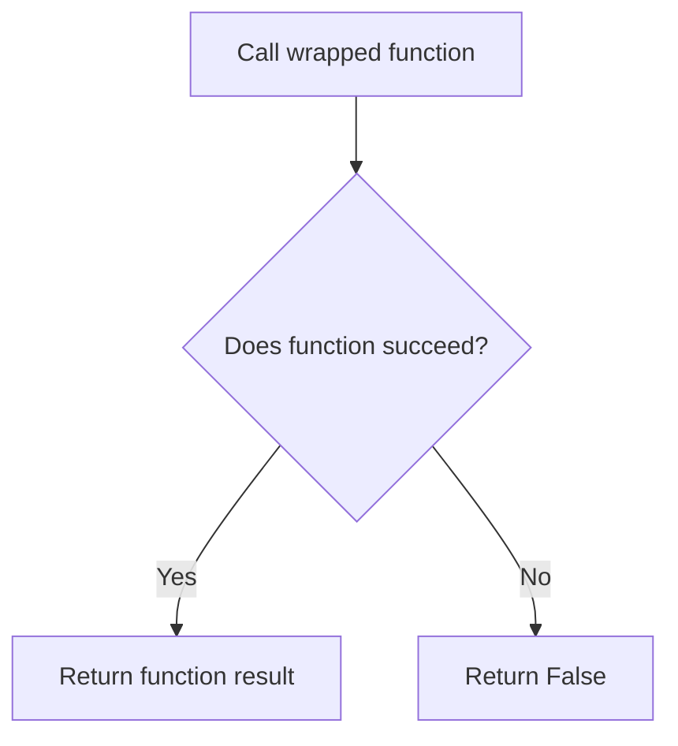
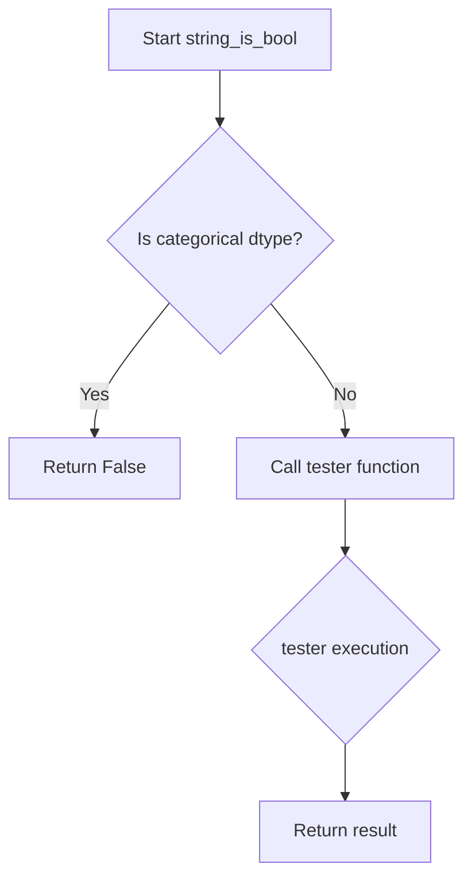
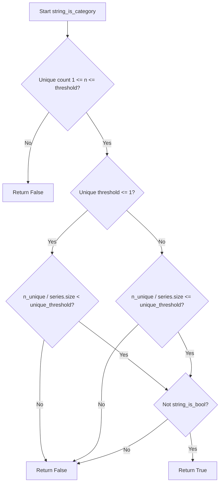

# `typeset_relations.py`

## `src.ydata_profiling.model.typeset_relations.is_nullable` · *function*

## Summary:
Determines whether a pandas Series contains any non-null values by checking if its count is greater than zero.

## Description:
This function evaluates whether a given pandas Series has any elements that are not null/missing. It's used in the ydata-profiling library during type inference and validation processes to assess data characteristics. The function returns True if the series contains at least one non-null value, and False if the series is empty or contains only null values.

The function is part of the typeset relations module, which handles relationships between different data types in the profiling process. Note: The function signature uses `pd.Series` but the import statement shows `import pandas as pd`, suggesting a potential type annotation inconsistency in the source code.

## Args:
    series (pandas.Series): The pandas Series to evaluate for nullability
    state (dict): A state dictionary containing contextual information for the evaluation process (unused in current implementation)

## Returns:
    bool: True if the series contains at least one non-null value, False otherwise

## Raises:
    None explicitly raised

## Constraints:
    Preconditions:
    - The series parameter must be a valid pandas Series object
    - The state parameter must be a dictionary (though the function doesn't appear to use it)
    
    Postconditions:
    - Returns a boolean value indicating presence of non-null values

## Side Effects:
    None

## Control Flow:
```mermaid
flowchart TD
    A[Start is_nullable] --> B{series.count() > 0?}
    B -->|True| C[Return True]
    B -->|False| D[Return False]
```

## Examples:
```python
import pandas as pd

# Example 1: Series with values
series1 = pd.Series([1, 2, 3])
result1 = is_nullable(series1, {})  # Returns True

# Example 2: Series with null values only
series2 = pd.Series([None, None, None])
result2 = is_nullable(series2, {})  # Returns False

# Example 3: Empty series
series3 = pd.Series([])
result3 = is_nullable(series3, {})  # Returns False

# Example 4: Series with mixed values
series4 = pd.Series([1, None, 3, None])
result4 = is_nullable(series4, {})  # Returns True
```

## `src.ydata_profiling.model.typeset_relations.try_func` · *function*

## Summary:
Decorator that wraps a function to catch all exceptions and return False instead of propagating errors.

## Description:
The `try_func` decorator creates a safe wrapper around any callable function. When the wrapped function is called, if it raises any exception (including unexpected ones), the decorator catches it and returns False instead of letting the exception bubble up. This is particularly useful in type checking or validation scenarios where graceful failure is preferred over program termination.

This function extracts the error-handling logic into a reusable component, allowing other functions to be made "safe" without duplicating try-except blocks throughout the codebase.

## Args:
    fn (Callable): The function to wrap with exception handling

## Returns:
    Callable: A decorated version of the input function that always returns a boolean value

## Raises:
    None: Exceptions are caught and converted to False return values

## Constraints:
    Preconditions:
    - Input `fn` must be a callable object
    - The wrapped function should accept a pandas Series as its first argument
    
    Postconditions:
    - The returned function will always return a boolean value (True or False)
    - No exceptions will be raised from the wrapped function call

## Side Effects:
    None: This function does not perform any I/O operations or mutate external state

## Control Flow:


## Examples:
```python
# Example usage in type checking context
@try_func
def is_numeric_type(series: pd.Series) -> bool:
    return pd.api.types.is_numeric_dtype(series)

# Safe type checking - won't raise exceptions
result = is_numeric_type(invalid_series)  # Returns False instead of raising
```

## `src.ydata_profiling.model.typeset_relations.string_is_bool` · *function*

## Summary:
Determines whether a pandas Series contains only boolean-like string values from a given key set.

## Description:
This function evaluates if all non-null values in a pandas Series are contained within the keys of a provided dictionary mapping string representations to boolean values. It serves as a type validation utility in data profiling, specifically identifying string columns that represent boolean data. Categorical data types are excluded from consideration as they are handled separately.

## Args:
    series (pd.Series): The pandas Series to evaluate for boolean-like string content
    state (dict): A state dictionary that may contain contextual information for evaluation (not directly used in core logic)
    k (Dict[str, bool]): Dictionary mapping string representations to boolean values, used to validate if series values are valid boolean-like strings

## Returns:
    bool: True if all non-null values in the series are present as keys in dictionary k, False otherwise. Returns False immediately if the series has categorical dtype.

## Raises:
    None explicitly raised - though underlying operations may raise exceptions that are caught by the @try_func decorator

## Constraints:
    Preconditions:
        - series must be a valid pandas Series object
        - k must be a dictionary with string keys
        - state can be any dictionary (used for context but not validated)
    
    Postconditions:
        - Returns a boolean value indicating whether all series values are valid boolean-like strings
        - Categorical series always return False regardless of content

## Side Effects:
    None - This function is pure and doesn't modify external state or perform I/O operations

## Control Flow:


## Examples:
```python
# Example 1: Valid boolean-like strings
k = {"true": True, "false": False, "yes": True, "no": False}
series = pd.Series(["true", "false", "yes"])
result = string_is_bool(series, {}, k)  # Returns True

# Example 2: Invalid string values
k = {"true": True, "false": False}
series = pd.Series(["true", "maybe", "false"])
result = string_is_bool(series, {}, k)  # Returns False

# Example 3: Categorical series
k = {"true": True, "false": False}
series = pd.Categorical(["true", "false", "true"])
result = string_is_bool(series, {}, k)  # Returns False immediately

# Example 4: With null values (handled by @series_handle_nulls)
k = {"true": True, "false": False}
series = pd.Series(["true", None, "false"])
result = string_is_bool(series, {}, k)  # Returns True (nulls ignored)

# Example 5: Empty series
k = {"true": True, "false": False}
series = pd.Series([], dtype="object")
result = string_is_bool(series, {}, k)  # Returns True (vacuous truth)
```

## `src.ydata_profiling.model.typeset_relations.string_to_bool` · *function*

## Summary:
Converts string values in a pandas Series to boolean values using a provided mapping dictionary.

## Description:
This function transforms string representations of boolean values into actual boolean types by applying a lowercase conversion followed by a dictionary-based mapping. It is designed to handle string-to-boolean conversion in data profiling workflows where string representations of boolean values need to be standardized.

## Args:
    series (pandas.Series): A pandas Series containing string values to be converted to booleans
    state (dict): A dictionary containing processing state information (purpose unclear from function signature)
    k (Dict[str, bool]): A mapping dictionary that maps string keys to boolean values

## Returns:
    pandas.Series: A pandas Series with string values converted to boolean values according to the mapping dictionary. String values that do not match any key in the mapping dictionary will result in NaN values.

## Raises:
    None explicitly raised in the function body

## Constraints:
    Preconditions:
    - The series parameter must be a valid pandas Series object
    - The k parameter must be a dictionary with string keys and boolean values
    
    Postconditions:
    - The returned Series will have the same length as the input series
    - All string values in the input series will be converted to boolean values or NaN

## Side Effects:
    None

## Control Flow:
```mermaid
flowchart TD
    A[Input Series] --> B[series.str.lower()]
    B --> C[map(k)]
    C --> D[Output Boolean Series]
```

## Examples:
    # Basic usage with standard boolean strings
    mapping = {"true": True, "false": False}
    series = pandas.Series(["True", "FALSE", "true"])
    result = string_to_bool(series, {}, mapping)
    # Result: [True, False, True]
    
    # With missing mappings (results in NaN)
    mapping = {"yes": True, "no": False}
    series = pandas.Series(["Yes", "NO", "maybe"])
    result = string_to_bool(series, {}, mapping)
    # Result: [True, False, NaN]

## `src.ydata_profiling.model.typeset_relations.numeric_is_category` · *function*

## Summary:
Determines whether a numeric series should be treated as categorical based on the number of unique values compared to a configured threshold.

## Description:
This function evaluates if a numeric series contains a small enough number of unique values to be considered categorical for profiling purposes. It's used in the type inference system to make decisions about how to categorize numeric data during data profiling. The function compares the count of unique values in the series against a configurable threshold defined in the Settings object.

## Args:
    series (pd.Series): A pandas Series containing numeric data to evaluate
    state (dict): A dictionary containing processing state information (unused in current implementation)
    k (Settings): Configuration object containing profiling settings, specifically the low_categorical_threshold parameter

## Returns:
    bool: True if the series has between 1 and the configured threshold number of unique values (inclusive), False otherwise

## Raises:
    None explicitly raised by this function

## Constraints:
    Preconditions:
    - The series parameter must be a valid pandas Series
    - The k parameter must be a valid Settings object with vars.num.low_categorical_threshold attribute
    - The series should contain numeric data (though the function doesn't validate this)

    Postconditions:
    - Returns a boolean value indicating whether the numeric series should be treated as categorical
    - The returned value is determined solely by the comparison 1 <= n_unique <= threshold

## Side Effects:
    None

## Control Flow:
```mermaid
flowchart TD
    A[Start: numeric_is_category]
    B[Calculate n_unique = series.nunique()]
    C[Get threshold = k.vars.num.low_categorical_threshold]
    D{1 <= n_unique <= threshold?}
    E[Return True]
    F[Return False]
    
    A --> B --> C --> D
    D -- Yes --> E
    D -- No --> F
```

## Examples:
```python
import pandas as pd
from ydata_profiling.config import Settings

# Example 1: Series with few unique values (should return True)
series1 = pd.Series([1, 2, 2, 3, 3, 3])
settings = Settings()
settings.vars.num.low_categorical_threshold = 5
result1 = numeric_is_category(series1, {}, settings)  # Returns True

# Example 2: Series with many unique values (should return False)
series2 = pd.Series([1, 2, 3, 4, 5, 6, 7, 8, 9, 10])
settings.vars.num.low_categorical_threshold = 5
result2 = numeric_is_category(series2, {}, settings)  # Returns False

# Example 3: Series with exactly threshold unique values (should return True)
series3 = pd.Series([1, 2, 3, 4, 5])
settings.vars.num.low_categorical_threshold = 5
result3 = numeric_is_category(series3, {}, settings)  # Returns True
```

## `src.ydata_profiling.model.typeset_relations.to_category` · *function*

## Summary:
Converts a pandas Series to a categorical string representation while normalizing missing value representations.

## Description:
Transforms a pandas Series into a string dtype, specifically handling cases where missing values are represented as string literals ("nan" or "<NA>") rather than actual NaN values. This normalization ensures consistent data representation for downstream processing in type inference systems.

## Args:
    series (pandas.Series): Input pandas Series to convert to categorical string representation
    state (dict): Processing state dictionary (currently unused in implementation)

## Returns:
    pandas.Series: A pandas Series with string dtype where string representations of missing values ("nan", "<NA>") are converted to actual NaN values

## Raises:
    None explicitly raised

## Constraints:
    Preconditions:
    - Input series should be a valid pandas Series object
    - The state parameter is accepted for interface compatibility but not currently utilized
    
    Postconditions:
    - Output series will have string dtype (pandas nullable string type)
    - Any string representations of NaN values ("nan", "<NA>") will be converted to actual NaN values
    - Original data integrity is preserved except for NaN normalization

## Side Effects:
    None

## Control Flow:
```mermaid
flowchart TD
    A[Start: to_category] --> B{series.hasnans?}
    B -- Yes --> C[series.astype(str)]
    B -- No --> C[series.astype(str)]
    C --> D{hasnans?}
    D -- Yes --> E[val.replace("nan", np.nan)]
    E --> F[E.replace("<NA>", np.nan)]
    F --> G[val.astype("string")]
    D -- No --> G
    G --> H[Return val]
```

## Examples:
```python
import pandas as pd
import numpy as np

# Example 1: Series with regular values
series1 = pd.Series(['A', 'B', 'C'])
result1 = to_category(series1, {})
# Returns: Series with string dtype containing ['A', 'B', 'C']

# Example 2: Series with NaN values as strings
series2 = pd.Series(['A', 'nan', 'C', '<NA>'])
result2 = to_category(series2, {})
# Returns: Series with string dtype containing ['A', nan, 'C', nan]

# Example 3: Series without missing values
series3 = pd.Series([1, 2, 3])
result3 = to_category(series3, {})
# Returns: Series with string dtype containing ['1', '2', '3']
```

## `src.ydata_profiling.model.typeset_relations.series_is_string` · *function*

## Summary:
Determines whether a pandas Series contains exclusively string data by validating both initial samples and full conversion compatibility.

## Description:
This function serves as a type validation utility that checks if a pandas Series should be classified as containing string data. It performs two-stage validation: first examining a sample of the initial values, then attempting a full conversion and comparison to ensure consistency across the entire series. This approach balances performance with accuracy for type detection systems.

## Args:
    series (pandas.Series): The pandas Series to validate as string type
    state (dict): A state dictionary containing contextual information for type checking (purpose not clearly defined from function implementation alone)

## Returns:
    bool: True if the series contains exclusively string data, False otherwise

## Raises:
    None explicitly raised - catches TypeError and ValueError exceptions internally

## Constraints:
    Preconditions:
    - The series parameter must be a valid pandas Series object
    - The state parameter must be a dictionary (though not actively used in function logic)
    
    Postconditions:
    - Returns a boolean value indicating string type classification
    - Function execution is guaranteed to complete without raising unhandled exceptions

## Side Effects:
    None - This function is pure and does not modify external state or perform I/O operations

## Control Flow:
```mermaid
flowchart TD
    A[Start series_is_string] --> B{First 5 values all str?}
    B -- No --> C[Return False]
    B -- Yes --> D[Attempt series.astype(str)]
    D --> E{Conversion successful?}
    E -- No --> F[Return False]
    E -- Yes --> G[Compare converted vs original]
    G --> H[Return comparison result]
```

## Examples:
```python
# Valid string series
import pandas as pd
series = pd.Series(['a', 'b', 'c'])
result = series_is_string(series, {})
# Returns True

# Mixed type series  
series = pd.Series(['a', 1, 'c'])
result = series_is_string(series, {})
# Returns False

# Numeric series
series = pd.Series([1, 2, 3])
result = series_is_string(series, {})
# Returns False
```

## `src.ydata_profiling.model.typeset_relations.string_is_category` · *function*

## Summary:
Determines whether a pandas Series should be classified as a categorical variable based on unique value count and percentage thresholds.

## Description:
This function evaluates if a pandas Series qualifies as a categorical variable by examining the number of unique values relative to configured thresholds. It ensures that string columns that represent boolean data are excluded from categorical classification. This logic is part of the type inference system that helps determine appropriate data types for statistical analysis and reporting.

The function is called during the data profiling process when determining variable types, particularly in scenarios where automatic type inference needs to distinguish between categorical and other data types.

## Args:
    series (pd.Series): The pandas Series to evaluate for categorical classification
    state (dict): A state dictionary containing contextual information for type inference (not directly used in core logic)
    k (Settings): Configuration object containing categorical and boolean thresholds for type classification

## Returns:
    bool: True if the series should be classified as categorical, False otherwise. Returns False when:
    - The series has 0 unique values or more than the cardinality threshold unique values
    - The percentage of unique values exceeds the configured threshold
    - The series contains boolean-like string values (as determined by string_is_bool)

## Raises:
    None explicitly raised - though underlying pandas operations may raise exceptions that are handled by the framework

## Constraints:
    Preconditions:
        - series must be a valid pandas Series object
        - k must be a properly initialized Settings object with cat and bool configurations
        - state can be any dictionary (used for context but not validated)
    
    Postconditions:
        - Returns a boolean value indicating whether the series should be treated as categorical
        - The returned value is independent of the series' current dtype

## Side Effects:
    None - This function is pure and doesn't modify external state or perform I/O operations

## Control Flow:


## Examples:
```python
# Example 1: Series with acceptable unique values and percentage
settings = Settings()
settings.vars.cat.cardinality_threshold = 10
settings.vars.cat.percentage_cat_threshold = 0.5
series = pd.Series(["A", "B", "C", "A", "B"])  # 3 unique values out of 5 total
result = string_is_category(series, {}, settings)  # Returns True

# Example 2: Series exceeding cardinality threshold
settings = Settings()
settings.vars.cat.cardinality_threshold = 5
settings.vars.cat.percentage_cat_threshold = 0.5
series = pd.Series(["A", "B", "C", "D", "E", "F", "A"])  # 6 unique values out of 7 total
result = string_is_category(series, {}, settings)  # Returns False

# Example 3: Series with too high percentage of unique values
settings = Settings()
settings.vars.cat.cardinality_threshold = 10
settings.vars.cat.percentage_cat_threshold = 0.3
series = pd.Series(["A", "B", "C", "D", "E", "F", "G", "H", "I", "J", "K"])  # 11 unique values out of 11 total
result = string_is_category(series, {}, settings)  # Returns False

# Example 4: Series that would be boolean-like (excluded from categorization)
settings = Settings()
settings.vars.cat.cardinality_threshold = 10
settings.vars.cat.percentage_cat_threshold = 0.5
settings.vars.bool.mappings = {"true": True, "false": False}
series = pd.Series(["true", "false", "true"])  # Boolean-like strings
result = string_is_category(series, {}, settings)  # Returns False (due to string_is_bool check)
```

## `src.ydata_profiling.model.typeset_relations.string_is_datetime` · *function*

## Summary:
Determines whether a pandas Series of strings can be successfully converted to datetime objects.

## Description:
This function evaluates whether a given pandas Series containing string values can be parsed into datetime objects. It attempts to convert the series using the `string_to_datetime` utility function and checks if any of the conversions resulted in valid datetime values. This function is used in data profiling to identify columns that contain datetime-like string data.

The function is designed to be robust against conversion errors - if any exception occurs during the conversion process, it gracefully returns False rather than propagating the error.

## Args:
    series (pd.Series): A pandas Series containing string values to test for datetime conversion
    state (dict): A dictionary containing processing state information (currently unused in implementation)

## Returns:
    bool: True if at least one value in the series can be converted to a datetime object, False otherwise

## Raises:
    None explicitly raised - the function catches all exceptions (using bare except) and returns False

## Constraints:
    Preconditions:
    - Input series must be a valid pandas Series
    - Input series should contain string representations that could potentially be parsed as dates
    
    Postconditions:
    - Function always returns a boolean value (True or False)
    - No modifications are made to the input series
    - The function handles all conversion exceptions gracefully

## Side Effects:
    None

## Control Flow:
```mermaid
flowchart TD
    A[Start string_is_datetime] --> B[Try string_to_datetime(series, state)]
    B --> C{Exception raised?}
    C -->|Yes| D[Return False]
    C -->|No| E[Check if all converted values are NA]
    E --> F{All values NA?}
    F -->|Yes| G[Return False]
    F -->|No| H[Return True]
```

## Examples:
    # Test with datetime-compatible strings
    import pandas as pd
    series = pd.Series(['2023-01-01', '2023-01-02', 'invalid_date'])
    result = string_is_datetime(series, {})
    # Returns: True (because first two values can be converted)
    
    # Test with non-datetime strings
    series = pd.Series(['apple', 'banana', 'cherry'])
    result = string_is_datetime(series, {})
    # Returns: False (no values can be converted to datetime)
    
    # Test with mixed valid/invalid dates
    series = pd.Series(['2023-01-01', '', '2023-12-31'])
    result = string_is_datetime(series, {})
    # Returns: True (first and last values can be converted)
    
    # Test with all invalid dates
    series = pd.Series(['not_a_date', 'also_not_valid', ''])
    result = string_is_datetime(series, {})
    # Returns: False (no values can be converted to datetime)
```

## `src.ydata_profiling.model.typeset_relations.string_is_numeric` · *function*

## Summary:
Determines whether a pandas Series containing string data should be classified as numeric rather than categorical for profiling purposes.

## Description:
This function evaluates if a string-type pandas Series should be treated as numeric data during data profiling. It serves as part of the type inference system by checking if string values can be converted to numeric types while ensuring they don't represent boolean values or should be categorized as discrete values.

The function is called during type inference to make decisions about how to classify string columns that might contain numeric representations. It specifically excludes boolean-like strings and considers whether the numeric representation should be treated as categorical based on unique value counts.

## Args:
    series (pd.Series): A pandas Series containing string data to evaluate for numeric classification
    state (dict): A dictionary containing processing state information (currently unused in implementation)
    k (Settings): Configuration object containing profiling settings, specifically the low_categorical_threshold parameter

## Returns:
    bool: True if the series contains string representations of numeric values that should be treated as numeric (and not categorical), False otherwise

## Raises:
    None explicitly raised by this function

## Constraints:
    Preconditions:
        - The series parameter must be a valid pandas Series object
        - The state parameter must be a dictionary (though currently unused)
        - The k parameter must be a valid Settings object with vars.num.low_categorical_threshold attribute
    
    Postconditions:
        - Returns a boolean value indicating whether the string series should be treated as numeric
        - The function will return False for boolean-like series regardless of numeric conversion success

## Side Effects:
    None

## Control Flow:
```mermaid
flowchart TD
    A[Start string_is_numeric]
    B{is_bool_dtype(series) OR object_is_bool(series,state)?}
    C[Return False]
    D[try: series.astype(float)]
    E[Convert to numeric with pd.to_numeric(errors="coerce")]
    F{r.hasnans AND r.count() == 0?}
    G[Return False]
    H[except: Any exception]
    I[Return False]
    J[Return NOT numeric_is_category(series,state,k)]
    
    A --> B
    B -- Yes --> C
    B -- No --> D
    D --> E
    E --> F
    F -- Yes --> G
    F -- No --> J
    H --> I
    I --> J
```

## Examples:
```python
import pandas as pd
from ydata_profiling.config import Settings

# Example 1: String series with numeric values
series1 = pd.Series(["1", "2", "3", "4"])
settings = Settings()
settings.vars.num.low_categorical_threshold = 5
result1 = string_is_numeric(series1, {}, settings)  # Returns True

# Example 2: String series with boolean-like values
series2 = pd.Series(["True", "False", "True"])
result2 = string_is_numeric(series2, {}, settings)  # Returns False

# Example 3: String series with mixed content
series3 = pd.Series(["1", "2", "abc", "4"])
result3 = string_is_numeric(series3, {}, settings)  # Returns False

# Example 4: String series with all NaN values
series4 = pd.Series([None, None, None])
result4 = string_is_numeric(series4, {}, settings)  # Returns False
```

## `src.ydata_profiling.model.typeset_relations.string_to_datetime` · *function*

## Summary:
Converts a pandas Series of string values to datetime objects with pandas version compatibility handling.

## Description:
This function serves as a compatibility wrapper for pandas' `to_datetime` function, ensuring proper datetime conversion behavior across different pandas versions. It automatically selects the appropriate datetime parsing strategy based on whether the installed pandas version is 1.x or 2.x.

## Args:
    series (pd.Series): A pandas Series containing string representations of dates/times to be converted
    state (dict): A dictionary containing processing state information (unused in current implementation)

## Returns:
    pd.Series: A pandas Series with datetime objects converted from the input string series

## Raises:
    None explicitly raised in the function body

## Constraints:
    Preconditions:
    - Input series must be a valid pandas Series
    - Input series should contain string representations of dates/times that can be parsed by pandas
    
    Postconditions:
    - Output series contains datetime objects
    - Original series data is preserved in converted form

## Side Effects:
    None

## Control Flow:
```mermaid
flowchart TD
    A[Start string_to_datetime] --> B{is_pandas_1()}
    B -->|True| C[pd.to_datetime(series)]
    B -->|False| D[pd.to_datetime(series, format="mixed")]
    C --> E[Return datetime series]
    D --> E
```

## Examples:
    # Basic usage
    import pandas as pd
    series = pd.Series(['2023-01-01', '2023-01-02', '2023-01-03'])
    result = string_to_datetime(series, {})
    # Returns: Series with datetime objects
    
    # With mixed date formats
    series = pd.Series(['2023-01-01', '01/02/2023', '2023.01.03'])
    result = string_to_datetime(series, {})
    # Returns: Series with datetime objects, handling mixed formats
```

## `src.ydata_profiling.model.typeset_relations.string_to_numeric` · *function*

## Summary:
Converts a pandas Series containing string representations of numbers into numeric data types, gracefully handling invalid values by replacing them with NaN.

## Description:
This function serves as a utility for type conversion in data profiling workflows, specifically transforming string columns that contain numeric data into proper numeric formats. It is designed to handle mixed-type data where some entries may not be convertible to numbers, ensuring data processing continues without interruption.

The function is typically used during data type inference and transformation phases in profiling pipelines where string representations of numbers need to be converted to numeric types for mathematical operations or statistical analysis.

## Args:
    series (pd.Series): A pandas Series containing string values that may represent numeric data
    state (dict): A dictionary containing processing state information (currently unused in implementation)

## Returns:
    pd.Series: A pandas Series with converted numeric data, where invalid string values are replaced with NaN

## Raises:
    None explicitly raised - relies on pandas to_numeric behavior

## Constraints:
    Preconditions:
        - Input series should be a valid pandas Series object
        - The series should contain elements that can be interpreted as numeric values or null-like values
        
    Postconditions:
        - Output series will have the same length as input series
        - Invalid conversions result in NaN values rather than exceptions
        - Data type of returned series will be numeric (float64 or int64 depending on values)

## Side Effects:
    None - This is a pure function that doesn't modify external state or perform I/O operations

## Control Flow:
```mermaid
flowchart TD
    A[Input Series] --> B{pd.to_numeric with errors="coerce"}
    B --> C[Converted Numeric Series]
    C --> D[Return Result]
```

## Examples:
```python
# Basic usage
import pandas as pd
series = pd.Series(['1', '2', 'three', '4.5'])
result = string_to_numeric(series, {})
# Returns: Series([1.0, 2.0, nan, 4.5])

# With all valid numeric strings
series = pd.Series(['10', '20', '30'])
result = string_to_numeric(series, {})
# Returns: Series([10.0, 20.0, 30.0])
```

## `src.ydata_profiling.model.typeset_relations.to_bool` · *function*

## Summary:
Converts a pandas Series to boolean type, using nullable boolean dtype when NaN values are present.

## Description:
Transforms a pandas Series into boolean type, automatically selecting between standard boolean and nullable boolean dtypes based on whether the input series contains missing values. When the series contains NaN values, it uses a nullable boolean dtype to preserve the missing value information; otherwise, it uses standard boolean dtype.

## Args:
    series (pd.Series): Input pandas Series to convert to boolean type

## Returns:
    pd.Series: A pandas Series with boolean dtype, using nullable boolean dtype if input contains NaN values, standard bool dtype otherwise

## Raises:
    None explicitly raised

## Constraints:
    Preconditions:
    - Input must be a valid pandas Series object
    - Series should contain values compatible with boolean conversion
    
    Postconditions:
    - Output Series will have boolean dtype
    - If input contains NaN values, output will use a nullable boolean dtype
    - If input doesn't contain NaN values, output will use standard boolean dtype

## Side Effects:
    None

## Control Flow:
```mermaid
flowchart TD
    A[Input Series] --> B{Has NaN Values?}
    B -->|Yes| C[Select hasnan_bool_name dtype]
    B -->|No| D[Select bool dtype]
    C --> E[Return series.astype(hasnan_bool_name)]
    D --> E
```

## Examples:
```python
import pandas as pd

# Example with no NaN values
series1 = pd.Series([True, False, True])
result1 = to_bool(series1)
# Returns: Series with bool dtype

# Example with NaN values  
series2 = pd.Series([True, False, None])
result2 = to_bool(series2)
# Returns: Series with nullable boolean dtype to preserve NaN
```

## `src.ydata_profiling.model.typeset_relations.object_is_bool` · *function*

## Summary:
Determines whether an object-type pandas Series contains exclusively boolean values (True/False).

## Description:
This function serves as a type checker that validates if all elements in an object-dtype pandas Series are boolean-like values. It's designed to help with data type inference and profiling by identifying when an object column should be treated as a boolean type despite having object dtype.

The function specifically targets object dtype columns and performs a membership test against the set {True, False} for each element. This logic is extracted into its own function to provide a clean interface for type detection systems while encapsulating the complexity of boolean validation.

## Args:
    series (pd.Series): A pandas Series to validate for boolean content
    state (dict): A dictionary containing processing state information (unused in current implementation)

## Returns:
    bool: True if all elements in the series are either True or False, False otherwise

## Raises:
    None explicitly raised, though the try/except block handles potential exceptions during iteration

## Constraints:
    Preconditions:
        - The series parameter must be a valid pandas Series object
        - The state parameter must be a dictionary (though currently unused)
    
    Postconditions:
        - Returns a boolean value indicating whether all elements are boolean-like

## Side Effects:
    None

## Control Flow:
```mermaid
flowchart TD
    A[Start object_is_bool] --> B{is_object_dtype(series)?}
    B -- Yes --> C[Create bool_set = {True, False}]
    C --> D[Try all(item in bool_set for item in series)]
    D --> E{Exception occurred?}
    E -- Yes --> F[ret = False]
    E -- No --> G[ret = result of all() check]
    F --> H[Return ret]
    G --> H
    B -- No --> I[Return False]
```

## Examples:
```python
# Valid boolean series
series1 = pd.Series([True, False, True])
result1 = object_is_bool(series1, {})  # Returns True

# Mixed content series  
series2 = pd.Series([True, "yes", False])
result2 = object_is_bool(series2, {})  # Returns False

# Non-object dtype series
series3 = pd.Series([1, 0, 1])
result3 = object_is_bool(series3, {})  # Returns False
```

