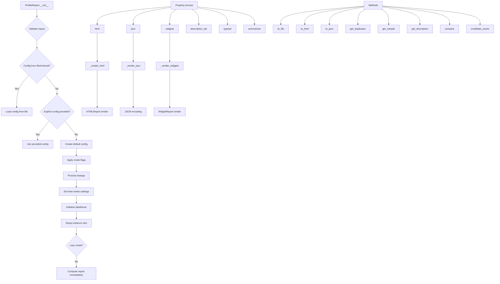

# `profile_report.py`

## `src.ydata_profiling.profile_report.ProfileReport` · *class*

## Summary:
A comprehensive data profiling report generator that creates detailed statistical summaries, visualizations, and insights for pandas and Spark DataFrames.

## Description:
The ProfileReport class serves as the primary interface for generating data profiling reports. It analyzes datasets to provide statistical summaries, data quality assessments, variable type detection, and various visualization options. The class supports multiple data types (pandas DataFrame, Spark DataFrame), different analysis modes (minimal, time-series, explorative), and various output formats (HTML, JSON, interactive widgets).

This class is typically instantiated by users who want to analyze their datasets programmatically. It acts as a central coordinator that orchestrates the data analysis process, manages caching, and provides convenient methods for exporting reports in different formats. The class supports lazy evaluation by default, computing reports only when requested.

## State:
- df: Optional[Union[pd.DataFrame, sDataFrame]] - The input dataframe to profile
- config: Settings - Configuration object controlling analysis behavior  
- _df_hash: Optional[str] - Cached hash of the dataframe for identification (computed on first access)
- _sample: Optional[dict] - Sample data configuration
- _type_schema: Optional[dict] - Type schema specification
- _typeset: Optional[VisionsTypeset] - Type detection system (computed on first access)
- _summarizer: Optional[BaseSummarizer] - Data summarization strategy (computed on first access)
- _description_set: BaseDescription - Cached analysis results (computed on first access)
- _report: Root - Cached report structure (computed on first access)
- _html: str - Cached HTML report (computed on first access)
- _widgets: Any - Cached widget representation (computed on first access)
- _json: str - Cached JSON report (computed on first access)

## Lifecycle:
Creation: Instantiate with a DataFrame and optional configuration parameters. The constructor validates inputs and initializes configuration settings. By default, computation is lazy (reports are computed only when accessed).
Usage: Access properties like `.html`, `.json`, or `.widgets` to generate reports on-demand. Use methods like `.to_file()`, `.to_html()`, `.to_json()` for export. Call `.invalidate_cache()` to clear cached results.
Destruction: No explicit cleanup required; relies on Python's garbage collection.

## Method Map:


## Raises:
- ValueError: When initializing with no DataFrame and lazy=False, or when config_file and minimal are both specified, or when an empty pandas DataFrame is provided, or when an empty Spark DataFrame is provided
- NotImplementedError: When trying to use time-series mode with Spark DataFrames
- RuntimeError: When attempting to use widgets interface with comparing reports
- TypeError: When invalid parameter types are provided (inherited from type checking)

## Example:
```python
import pandas as pd
from ydata_profiling import ProfileReport

# Create a profile report
df = pd.read_csv('data.csv')
profile = ProfileReport(df, title="My Dataset Report")

# Generate different output formats
html_report = profile.to_html()
json_report = profile.to_json()

# Export to file
profile.to_file('report.html')

# Access specific information
duplicates = profile.get_duplicates()
sample = profile.get_sample()
rejected_vars = profile.get_rejected_variables()

# Compare two reports
profile2 = ProfileReport(df2)
comparison = profile.compare(profile2)
```

### `src.ydata_profiling.profile_report.ProfileReport.__init__` · *method*

## Summary:
Initializes a ProfileReport object with configuration settings and prepares it for data profiling, supporting both pandas and Spark DataFrames with various analysis modes.

## Description:
The ProfileReport constructor creates a profiling report instance by validating inputs, setting up configuration parameters, and preparing internal state for subsequent analysis. It supports multiple initialization paths based on configuration sources and handles both pandas and Spark DataFrames with appropriate settings adjustments.

This method is responsible for establishing the foundation of the profiling workflow, including:
- Input validation to ensure compatibility
- Configuration resolution from multiple sources (files, explicit settings, defaults)
- Mode-specific configuration application (explorative, sensitive, dark_mode, orange_mode)
- Time-series analysis setup when enabled
- DataFrame initialization with sorting and indexing for time-series data
- Lazy evaluation setup to defer heavy computation until needed

## Args:
    df (Optional[Union[pd.DataFrame, sDataFrame]]): Input DataFrame to profile, or None if lazy=True. Must not be empty when provided.
    minimal (bool): Enable minimal configuration mode, which uses a predefined minimal configuration file. Defaults to False.
    tsmode (bool): Enable time-series analysis mode. Defaults to False.
    sortby (Optional[str]): Column name to sort time-series data by. Required when tsmode=True. Defaults to None.
    sensitive (bool): Enable sensitive data analysis mode. Defaults to False.
    explorative (bool): Enable explorative analysis mode. Defaults to False.
    dark_mode (bool): Enable dark theme for reports. Defaults to False.
    orange_mode (bool): Enable orange theme for reports. Defaults to False.
    sample (Optional[dict]): Sample data configuration. Defaults to None.
    config_file (Optional[Union[Path, str]]): Path to YAML configuration file. Mutually exclusive with minimal=True. Defaults to None.
    lazy (bool): Enable lazy evaluation mode where report is computed only on first access. Defaults to True.
    typeset (Optional[VisionsTypeset]): Custom typeset for type detection. Defaults to None.
    summarizer (Optional[BaseSummarizer]): Custom summarizer for data summarization. Defaults to None.
    config (Optional[Settings]): Explicit configuration object. Defaults to None.
    type_schema (Optional[dict]): Schema specification for data types. Defaults to None.
    **kwargs: Additional configuration parameters that will be merged into the final configuration.

## Returns:
    None: This method initializes the instance and does not return any value.

## Raises:
    ValueError: Raised when:
        - df is None and lazy=False (non-lazy mode requires DataFrame)
        - config_file is not None and minimal is True (mutually exclusive arguments)
        - DataFrame is empty (pandas or spark)
    NotImplementedError: Raised when:
        - tsmode is True with Spark DataFrame (time-series not supported for Spark)
    TypeError: Raised when invalid parameter types are provided (inherited from type checking)

## State Changes:
    Attributes READ:
    - None (reads parameters, not instance attributes)

    Attributes WRITTEN:
    - self.df: Stores the initialized dataframe
    - self.config: Stores the resolved configuration object
    - self._df_hash: Initializes to None (will be computed on first access)
    - self._sample: Stores the sample configuration
    - self._type_schema: Stores the type schema specification
    - self._typeset: Stores the typeset for type detection
    - self._summarizer: Stores the summarizer for data summarization

## Constraints:
    Preconditions:
    - When lazy=False, df must not be None
    - When config_file is provided, minimal must be False
    - When df is provided, it must not be empty
    - When tsmode is True, df must be a pandas DataFrame (Spark not supported)
    - When tsmode and sortby are both specified, sortby must reference a valid column in df

    Postconditions:
    - All input parameters are validated for compatibility
    - Configuration is properly resolved from the specified sources
    - Instance attributes are initialized with appropriate values
    - Time-series settings are correctly applied when enabled
    - DataFrame is properly initialized for analysis

## Side Effects:
    - I/O operation: Reading configuration files when config_file is specified
    - Potential computation: Immediate report generation when lazy=False
    - External service calls: None (no external services involved)

### `src.ydata_profiling.profile_report.ProfileReport.__validate_inputs` · *method*

## Summary:
Validates input parameters for ProfileReport initialization to ensure compatibility and prevent runtime errors.

## Description:
This private method performs input validation during ProfileReport object construction. It checks for incompatible parameter combinations and ensures data integrity before proceeding with report generation. The validation occurs early in the __init__ method to fail fast with descriptive error messages.

## Args:
    df (Optional[Union[pd.DataFrame, sDataFrame]]): Input DataFrame or Spark DataFrame, or None if lazy=True
    minimal (bool): Flag indicating minimal configuration mode
    tsmode (bool): Flag indicating time-series analysis mode
    config_file (Optional[Union[Path, str]]): Path to configuration file, or None
    lazy (bool): Flag indicating lazy evaluation mode

## Returns:
    None: This method does not return any value

## Raises:
    ValueError: Raised when:
        - df is None and lazy is False (non-lazy mode requires DataFrame)
        - config_file is not None and minimal is True (mutually exclusive arguments)
        - DataFrame is empty (pandas or spark)
    NotImplementedError: Raised when:
        - tsmode is True with Spark DataFrame (time-series not supported for Spark)

## State Changes:
    Attributes READ: None
    Attributes WRITTEN: None

## Constraints:
    Preconditions:
        - When lazy=False, df must not be None
        - When config_file is provided, minimal must be False
        - When df is provided, it must not be empty
        - When tsmode is True, df must be a pandas DataFrame (Spark not supported)

    Postconditions:
        - All input parameters are validated for compatibility
        - Appropriate exceptions are raised for invalid combinations

## Side Effects:
    None: This method performs only validation checks and does not cause any I/O operations or external service calls.

### `src.ydata_profiling.profile_report.ProfileReport.__initialize_dataframe` · *method*

## Summary:
Initializes and processes a dataframe for time series analysis by sorting and setting index according to configuration settings.

## Description:
This private method prepares a pandas DataFrame for time series profiling by applying sorting and index configuration when time series analysis is enabled in the report settings. It ensures that time series data is properly ordered and indexed for subsequent analysis steps.

## Args:
    df (Optional[Union[pd.DataFrame, sDataFrame]]): Input dataframe to initialize, can be pandas or spark DataFrame
    report_config (Settings): Configuration settings for the report, containing time series specific options

## Returns:
    Optional[Union[pd.DataFrame, sDataFrame]]: The potentially modified dataframe with appropriate sorting and indexing applied, or the original dataframe if no processing was performed

## Raises:
    None explicitly raised

## State Changes:
    None - This method doesn't modify any instance attributes directly

## Constraints:
    Preconditions:
    - The input df must be either None or a valid pandas DataFrame when time series processing is enabled
    - report_config must be a valid Settings object with proper time series configuration
    
    Postconditions:
    - If time series analysis is active and df is a pandas DataFrame, the returned dataframe will be sorted appropriately
    - If sortby is specified in time series config, the dataframe will be sorted by that column and set as index
    - If sortby is not specified, the dataframe will be sorted by its index

## Side Effects:
    None - This method performs in-place operations on the dataframe but doesn't cause external I/O or mutations beyond the dataframe itself

### `src.ydata_profiling.profile_report.ProfileReport.invalidate_cache` · *method*

## Summary:
Clears cached rendering and reporting properties from the ProfileReport object to ensure fresh data generation on subsequent accesses.

## Description:
This method invalidates cached properties of the ProfileReport to force regeneration of rendered content when accessed again. It provides fine-grained control over which cached elements to clear by accepting a subset parameter. The method is typically called when underlying data or configuration changes, ensuring that subsequent property accesses (like html, json, widgets) regenerate their content rather than returning stale cached values.

Known callers:
- Called internally by the ProfileReport.compare() method when creating comparison reports to ensure clean state
- Potentially called by external code that modifies the underlying DataFrame or configuration

This logic is separated into its own method rather than being inlined because:
1. It provides a standardized way to clear caches across different parts of the system
2. It allows selective clearing of cache subsets (rendering vs report vs full cache)
3. It centralizes the cache invalidation logic for maintainability
4. It prevents accidental cache misses that could occur if cache clearing were scattered throughout the codebase

## Args:
    subset (Optional[str], default=None): Specifies which subset of cached properties to invalidate. Valid values are:
        - None: Invalidate all cached properties (default behavior)
        - "rendering": Invalidate rendering-related caches (_widgets, _json, _html)
        - "report": Invalidate report structure cache (_report) plus all rendering caches
        - Any other value raises ValueError

## Returns:
    None: This method does not return any value

## Raises:
    ValueError: Raised when the subset parameter is provided but not one of the allowed values: None, "rendering", or "report"

## State Changes:
    Attributes READ: 
    - self._widgets: Widget rendering cache
    - self._json: JSON rendering cache  
    - self._html: HTML rendering cache
    - self._report: Report structure cache
    - self._description_set: Description set cache

    Attributes WRITTEN:
    - self._widgets: Set to None to invalidate widget cache
    - self._json: Set to None to invalidate JSON cache
    - self._html: Set to None to invalidate HTML cache
    - self._report: Set to None to invalidate report structure cache
    - self._description_set: Set to None to invalidate description set cache

## Constraints:
    Preconditions:
    - The ProfileReport instance must be properly initialized
    - The subset parameter must be one of the allowed values (None, "rendering", "report")
    
    Postconditions:
    - Specified cached properties are cleared and will be regenerated on next access
    - All cached properties are cleared when subset=None (default)
    - No other object state is modified

## Side Effects:
    None: This method only modifies internal cached properties and does not perform any I/O operations or external service calls.

### `src.ydata_profiling.profile_report.ProfileReport.typeset` · *method*

## Summary:
Returns the profiling typeset for the dataset, initializing it lazily if needed.

## Description:
This method provides access to the VisionsTypeset object that represents the inferred data types for each column in the dataset. The typeset is computed once and cached for subsequent accesses using a lazy initialization pattern. This approach ensures efficient resource usage while maintaining consistent type inference throughout the profiling process.

The method follows a standard caching pattern where the typeset is created only on first access and then reused for all subsequent calls. When first accessed, it initializes a ProfilingTypeSet using the configuration and type schema.

## Args:
    None

## Returns:
    Optional[VisionsTypeset]: The VisionsTypeset object containing type information for all columns. The return value will be None only if the underlying initialization fails or if the ProfilingTypeSet cannot be constructed properly.

## Raises:
    None explicitly raised

## State Changes:
    Attributes READ: self._typeset, self.config, self._type_schema
    Attributes WRITTEN: self._typeset (only during first initialization)

## Constraints:
    Preconditions: 
    - self.config must be a valid configuration object
    - self._type_schema must be properly initialized
    - The method assumes that _typeset is either None or already initialized
    
    Postconditions:
    - After first call, self._typeset will contain a ProfilingTypeSet instance
    - The returned value will be consistent across calls after initialization

## Side Effects:
    None

### `src.ydata_profiling.profile_report.ProfileReport.summarizer` · *method*

## Summary:
Returns the summarizer instance for profiling data, creating it lazily if needed.

## Description:
This property method provides access to the summarizer instance used for generating profile summaries. It implements lazy initialization, creating the summarizer only when first accessed and caching it for subsequent accesses. The summarizer is initialized with the profiling typeset from the current report instance.

## Args:
    None

## Returns:
    BaseSummarizer: An instance of BaseSummarizer (specifically PandasProfilingSummarizer) used for profiling data summarization.

## Raises:
    None explicitly raised

## State Changes:
    Attributes READ: self._summarizer, self.typeset
    Attributes WRITTEN: self._summarizer (only during initialization)

## Constraints:
    Preconditions: The ProfileReport instance must have a valid typeset attribute
    Postconditions: Returns a BaseSummarizer instance that can be used for summarizing profiling data

## Side Effects:
    None

### `src.ydata_profiling.profile_report.ProfileReport.description_set` · *method*

## Summary:
Returns the cached statistical description of the DataFrame, generating it on first access and storing it for subsequent calls.

## Description:
This method serves as a lazy-loaded property that computes and caches the comprehensive statistical description of the underlying DataFrame. It ensures that the expensive operation of analyzing the entire dataset is performed only once, improving performance for repeated accesses. The method delegates to the `describe_df` function (which is the `describe` function from `ydata_profiling.model.describe`) to perform the actual analysis.

The method is called during various stages of report generation, such as when rendering HTML, JSON, or widget outputs, and when accessing various properties that depend on the description data. It's part of the caching mechanism that prevents redundant computations during report generation.

## Args:
    None

## Returns:
    BaseDescription: A structured object containing comprehensive statistical descriptions, analyses, and metadata about the DataFrame including table statistics, variable descriptions, correlations, missing data patterns, alerts, and sample data.

## Raises:
    ValueError: When the underlying DataFrame is None and the describe function attempts to process it.

## State Changes:
    Attributes READ: self._description_set, self.config, self.df, self.summarizer, self.typeset, self._sample
    Attributes WRITTEN: self._description_set (only set on first access, subsequent calls return cached value)

## Constraints:
    Preconditions:
    - The ProfileReport instance must have valid config, df, summarizer, typeset, and _sample attributes
    - The underlying DataFrame must be valid for analysis (not None)
    
    Postconditions:
    - On first call, self._description_set is populated with a BaseDescription object
    - Subsequent calls return the cached BaseDescription object without recomputation
    - The returned BaseDescription object contains all analysis results in a structured format

## Side Effects:
    - Performs computation-intensive data analysis on first access
    - May update progress bars during analysis via tqdm
    - Creates a progress bar visualization during execution
    - Calls external functions that may perform their own side effects

### `src.ydata_profiling.profile_report.ProfileReport.df_hash` · *method*

## Summary:
Computes and caches a SHA256 hash of the profiled dataframe for identification purposes.

## Description:
This property method computes a cryptographic hash of the underlying dataframe using SHA256 algorithm. The hash is computed only once and cached in the `_df_hash` attribute for subsequent accesses. This enables efficient identification and comparison of dataframes without repeatedly recomputing the hash.

## Args:
    None

## Returns:
    Optional[str]: A hexadecimal SHA256 hash string prefixed with a hash prefix, or None if no dataframe is available.

## Raises:
    None

## State Changes:
    Attributes READ: self._df_hash, self.df
    Attributes WRITTEN: self._df_hash (only on first access)

## Constraints:
    Preconditions: 
    - The method can be called regardless of whether `self.df` is None or not
    - If `self.df` is None, the method returns None without attempting to compute a hash
    
    Postconditions:
    - On first call with a non-None dataframe, `self._df_hash` is set to the computed hash
    - Subsequent calls return the cached value stored in `self._df_hash`
    - If `self.df` is None, `self._df_hash` remains None

## Side Effects:
    None

### `src.ydata_profiling.profile_report.ProfileReport.report` · *method*

## Summary:
Returns the structured report representation, generating it on first access and caching the result for subsequent accesses.

## Description:
This property provides access to the structured report data that forms the foundation of the profiling report. It implements a lazy evaluation pattern where the report structure is only generated once and then cached in `self._report`. Subsequent calls return the cached version without re-computing the entire report structure.

The method is called internally by other properties like `html`, `json`, and `widgets` when they need to render the report content. It serves as the central hub for report structure generation in the profiling workflow.

Known callers:
- `ProfileReport.html` property (via `self.report` access)
- `ProfileReport.json` property (via `self.report` access) 
- `ProfileReport.widgets` property (via `self.report` access)
- `ProfileReport._render_html()` method
- `ProfileReport._render_widgets()` method
- `ProfileReport._render_json()` method

This logic is its own method rather than being inlined because:
1. It provides a centralized location for report structure generation
2. It enables lazy evaluation with proper caching behavior
3. It decouples report structure generation from rendering logic
4. It allows multiple rendering formats (HTML, JSON, widgets) to share the same base structure
5. It makes testing and debugging easier by isolating the structure generation

## Returns:
    Root: A Root object containing the complete hierarchical structure of the report with sections, containers, and renderable components.

## State Changes:
    Attributes READ: 
    - self._report: Check if cached value exists
    - self.config: Configuration settings for report generation
    - self.description_set: Descriptive statistics and analysis data
    
    Attributes WRITTEN:
    - self._report: Set to the generated report structure on first access

## Constraints:
    Preconditions:
    - The ProfileReport instance must be properly initialized with data and configuration
    - Both `self.config` and `self.description_set` must be accessible
    
    Postconditions:
    - On first access, `self._report` is populated with the complete report structure
    - Subsequent accesses return the cached value without re-computation
    - The returned Root object represents a complete, valid report structure

## Side Effects:
    - May initialize `self._report` on first access
    - Calls `get_report_structure()` which uses tqdm progress bar for user feedback
    - Accesses and potentially initializes `self.description_set` if not already cached

### `src.ydata_profiling.profile_report.ProfileReport.html` · *method*

## Summary:
Returns the HTML report content, generating it on first access and caching the result for subsequent accesses.

## Description:
This property provides access to the HTML representation of the profiling report. It implements a lazy evaluation pattern where the HTML content is only generated once and then cached in `self._html`. Subsequent calls return the cached version without re-computing the entire report.

The method is typically called when users want to access or export the HTML report content. It integrates with the broader profiling workflow by ensuring HTML generation happens only when needed, improving performance for repeated accesses.

## Args:
    None

## Returns:
    str: The HTML content of the profiling report

## Raises:
    None explicitly raised

## State Changes:
    Attributes READ: self._html (to check if None), self.report (via property), self.description_set (via property)
    Attributes WRITTEN: self._html (only when initially None, setting it to the rendered HTML)

## Constraints:
    Preconditions: The ProfileReport instance must be properly initialized with data and configuration
    Postconditions: The returned HTML string contains a complete, valid HTML report of the data profile

## Side Effects:
    I/O: May involve file operations when creating HTML assets if config.html.inline is False
    External service calls: None
    Mutations to objects outside self: None

### `src.ydata_profiling.profile_report.ProfileReport.json` · *method*

## Summary:
Returns the JSON representation of the profile report, caching the result for subsequent accesses.

## Description:
Provides access to the JSON-formatted profile report data. This property implements lazy evaluation and caching - the JSON is only generated when first accessed and then stored in `self._json` for future accesses. This approach improves performance by avoiding repeated expensive JSON generation operations.

The method delegates to the internal `_render_json()` method which processes the profiling results and converts them to a JSON-compatible format with proper serialization of complex data types.

Known callers:
- Direct property access: `profile_report.json`
- Indirect access via: `ProfileReport.to_json()` method

This method exists as a property to provide a clean, consistent interface for accessing the JSON representation while maintaining the caching behavior that optimizes performance for repeated accesses.

## Returns:
    str: A JSON-formatted string containing the complete profile report data with proper serialization of all data types.

## State Changes:
    Attributes READ:
    - self._json: Check if cached value exists
    - self._render_json(): Called when cache miss occurs
    
    Attributes WRITTEN:
    - self._json: Set to the generated JSON string on first access

## Constraints:
    Preconditions:
    - The `self._render_json()` method must be callable and return a valid JSON string
    - The `self.description_set` property must be accessible (implicitly required by `_render_json`)
    
    Postconditions:
    - On first access, `self._json` is populated with the JSON string
    - Subsequent accesses return the cached value without re-computation
    - The returned string is a valid JSON representation of the profile data

## Side Effects:
    - May initialize `self._json` on first access
    - Calls `self._render_json()` which uses tqdm progress bar for user feedback
    - Accesses and potentially initializes `self.description_set` indirectly through `_render_json`

### `src.ydata_profiling.profile_report.ProfileReport.widgets` · *method*

## Summary:
Returns the widget-based representation of the profiling report, initializing it if necessary.

## Description:
This method provides access to the widget interface for the profiling report. It serves as a lazy initializer for the widget representation, creating it only when first accessed. The method prevents widget rendering for comparison reports by raising a RuntimeError, requiring HTML rendering instead for such cases.

## Args:
    None

## Returns:
    Any: The widget representation of the profiling report, typically a Jupyter widget or similar interactive component that can be displayed in notebook environments.

## Raises:
    RuntimeError: When attempting to render widgets for comparing reports (when description_set.table["n"] is a list with more than one element). The error message specifically states that widgets interface is not supported for comparing reports and suggests using HTML rendering instead.

## State Changes:
    Attributes READ: 
        - self.description_set.table["n"]
        - self._widgets
    
    Attributes WRITTEN:
        - self._widgets (only when initialized via _render_widgets call)

## Constraints:
    Preconditions:
        - The ProfileReport instance must be properly initialized
        - The description_set must have a table attribute with an "n" key that can be either a scalar or list
    
    Postconditions:
        - Returns a widget representation that can be displayed in Jupyter notebooks
        - The widget representation is cached in self._widgets for subsequent calls
        - For comparison reports, raises RuntimeError instead of returning widgets

## Side Effects:
    - May initialize and cache widget representation in self._widgets
    - Calls self._render_widgets() which may involve widget creation logic

### `src.ydata_profiling.profile_report.ProfileReport.get_duplicates` · *method*

## Summary:
Returns the duplicate rows detected in the dataset, if any duplicates exist.

## Description:
This method provides access to the duplicate detection results that were computed during the profiling analysis. It retrieves the duplicates DataFrame from the description set, which contains information about rows that appear more than once in the dataset. The method is part of the ProfileReport class's public API for accessing analysis results.

The duplicates are identified by comparing all columns in the DataFrame. When duplicates are found, they are returned as a DataFrame containing only the duplicated rows (with their original indices preserved). If no duplicates exist, the method returns None.

## Args:
    None

## Returns:
    Optional[pd.DataFrame]: A DataFrame containing the duplicate rows found in the dataset, or None if no duplicates were detected. The DataFrame will have the same structure as the original dataset but only include rows that appear multiple times. Each duplicate row will appear in the result with its original index.

## Raises:
    None

## State Changes:
    Attributes READ: 
    - self.description_set: The property that computes and caches the analysis results
    - self.description_set.duplicates: The specific field containing duplicate detection results

## Constraints:
    Preconditions:
    - The ProfileReport must have been initialized with a DataFrame or the analysis must have been performed
    - The duplicates analysis must have been enabled in the configuration (this is typically enabled by default)
    
    Postconditions:
    - The method returns either a DataFrame with duplicate rows or None
    - No modification to the ProfileReport's state occurs

## Side Effects:
    None

### `src.ydata_profiling.profile_report.ProfileReport.get_sample` · *method*

## Summary:
Returns the sample data dictionary associated with the profiling report.

## Description:
This method provides access to the sample data that was collected during the profiling process. The sample data represents a subset or representative sample of the original dataset that was analyzed. This method serves as a convenient accessor for retrieving the sample information stored within the profiling report's description set.

The method is called during various stages of report generation and analysis when sample data needs to be accessed for display, comparison, or further processing. It's part of the public API for retrieving sample information from a completed profiling report.

## Args:
    None

## Returns:
    dict: A dictionary containing the sample data and associated metadata. The dictionary typically includes information about the sampled rows from the original dataset, such as the sampled DataFrame, sample size, and other relevant metadata about how the sample was selected.

## Raises:
    None explicitly raised by this method

## State Changes:
    Attributes READ: self.description_set
    Attributes WRITTEN: None

## Constraints:
    Preconditions: The ProfileReport instance must have been initialized with a DataFrame or the sample data must be available in the description_set
    Postconditions: Returns the sample data dictionary from the description_set, or None if no sample data exists

## Side Effects:
    None

### `src.ydata_profiling.profile_report.ProfileReport.get_description` · *method*

## Summary:
Returns the cached data profiling description set containing comprehensive analysis results for the dataset.

## Description:
This method provides access to the pre-computed data profiling results that were generated during the initial analysis of the dataset. The returned `BaseDescription` object contains comprehensive metadata, variable-level statistics, correlations, missing value patterns, alerts, and sample data that summarize the dataset characteristics.

The method serves as a simple getter that accesses the cached `description_set` property, which ensures that the expensive computation of profiling results happens only once and is reused for subsequent calls. This follows the standard caching pattern used throughout the ProfileReport class.

Known callers:
- Direct programmatic access when users want to retrieve the raw profiling results for further processing or inspection
- Internal framework methods that need to access the underlying analysis data for rendering or processing

This logic is separated into its own method rather than being inlined because:
1. It provides a clean public API for accessing the profiling results
2. It maintains consistency with the property-based caching pattern used elsewhere in the class
3. It allows for potential future enhancements while maintaining backward compatibility
4. It provides explicit access to the raw description data without triggering rendering or serialization operations

## Args:
    None

## Returns:
    BaseDescription: An object containing all profiling results including:
        - analysis: Metadata about the analysis run
        - table: General table-level statistics
        - variables: Detailed analysis for each variable/column
        - correlations: Correlation matrix and related analysis
        - missing: Missing value pattern analysis
        - alerts: Detected anomalies or issues
        - sample: Sample data from the dataset
        - duplicates: Duplicate detection results
        - package: Package version information

## Raises:
    None

## State Changes:
    Attributes READ: self.description_set (accessed via property)
    Attributes WRITTEN: None

## Constraints:
    Preconditions: The ProfileReport object must have been initialized with a valid dataset or configuration
    Postconditions: The returned BaseDescription object is fully populated with analysis results

## Side Effects:
    None

### `src.ydata_profiling.profile_report.ProfileReport.get_rejected_variables` · *method*

## Summary:
Returns a set of column names that have been rejected during profiling due to alert conditions.

## Description:
This method extracts column names from alerts that were flagged with the REJECTED alert type. These are columns that failed certain validation checks or profiling criteria during the analysis process. The method is designed to provide a quick way to identify problematic columns that should be excluded from further analysis.

## Args:
    None

## Returns:
    set: A set of strings representing column names that have been rejected by the profiling process.

## Raises:
    None explicitly raised

## State Changes:
    Attributes READ: self.description_set, self.description_set.alerts
    Attributes WRITTEN: None

## Constraints:
    Preconditions: 
    - self.description_set must be initialized (not None)
    - self.description_set.alerts must be iterable
    - AlertType.REJECTED must be defined in the AlertType enum
    
    Postconditions:
    - Returns a set of strings (column names)
    - Each returned column name corresponds to an alert with alert_type == AlertType.REJECTED

## Side Effects:
    None

### `src.ydata_profiling.profile_report.ProfileReport.to_file` · *method*

## Summary:
Saves the profiling report to a file in either JSON or HTML format, with optional automatic download or browser opening.

## Description:
Exports the current profiling report to a file at the specified location. The method automatically determines the output format based on the file extension (.json or .html). For HTML reports, it can create necessary assets if not in inline mode. The method also provides an option to automatically download the file in Google Colab or open it in a browser.

Known callers:
- Direct method invocation by users wanting to export reports to files
- Used in automated reporting pipelines where reports need to be saved to disk

This logic is separated into its own method rather than being inlined because it encapsulates the complete file export workflow including format detection, content generation, file writing, and optional user interaction features. This makes it reusable and keeps the main export logic centralized.

## Args:
    output_file (Union[str, Path]): Path to the output file. Extension determines format (.json or .html).
    silent (bool): If False, automatically attempts to download the file in Colab or open in browser. Defaults to True.

## Returns:
    None: This method performs file I/O operations and does not return a value.

## Raises:
    None explicitly raised. May propagate exceptions from underlying file operations or I/O operations.

## State Changes:
    Attributes READ:
    - self.config: Configuration settings for HTML assets, progress bar, and report generation
    - self._html: HTML content cache (via to_html method)
    - self._json: JSON content cache (via to_json method)
    
    Attributes WRITTEN:
    - self.config.html.assets_path: Set to parent directory of output file when creating HTML assets
    - self.config.html.assets_prefix: Set to derived prefix when creating HTML assets

## Constraints:
    Preconditions:
    - The ProfileReport instance must be properly initialized with data
    - The output_file path must be writable
    - The file extension must be either .json or .html (or another extension that gets converted to .html)
    
    Postconditions:
    - The specified file will contain the exported report content
    - For HTML reports, assets will be created if needed and configured in the config
    - Progress bar will be displayed during file writing (if enabled)

## Side Effects:
    - Creates files on disk at the specified output path
    - May create additional asset files for HTML reports (CSS, JS, images)
    - Writes data to the filesystem using UTF-8 encoding
    - Displays progress bar during file writing
    - Attempts to download file in Google Colab environment or opens in browser when silent=False

### `src.ydata_profiling.profile_report.ProfileReport._render_html` · *method*

*No documentation generated.*

### `src.ydata_profiling.profile_report.ProfileReport._render_widgets` · *method*

## Summary:
Renders a widget-based representation of the profile report structure for interactive notebook environments.

## Description:
This method transforms the standard report structure into a widget-compatible format by applying a mapping that converts regular renderable components to their widget equivalents. It's designed to be used in Jupyter notebook environments to provide interactive visualizations of the profiling results. The method leverages the WidgetReport class to perform the transformation and rendering process.

The method is called internally by the widgets property when the widget cache is empty, and it caches the result in self._widgets for subsequent accesses.

## Args:
    None

## Returns:
    Any: The rendered widget structure that can be displayed in Jupyter notebooks or other widget-enabled environments. Typically returns a widget object or collection of widgets.

## Raises:
    None directly raised by this method. However, the widgets property that calls this method may raise RuntimeError when attempting to render widgets for comparing reports (multiple datasets).

## State Changes:
    Attributes READ: 
    - self.report: The underlying report structure to be transformed
    - self.config.progress_bar: Controls whether progress bar is shown during rendering
    
    Attributes WRITTEN:
    - self._widgets: Cached result of widget rendering to avoid recomputation

## Constraints:
    Preconditions:
    - The report structure must be available (self.report property should be accessible)
    - The configuration should be properly initialized
    - Should not be called for comparison reports (multiple datasets)
    
    Postconditions:
    - Returns a widget-compatible structure ready for display
    - The widget rendering result is cached in self._widgets for future access

## Side Effects:
    - Creates a deep copy of the report structure to avoid modifying the original
    - Uses tqdm progress bar for user feedback during rendering
    - May involve I/O operations when creating widget representations

### `src.ydata_profiling.profile_report.ProfileReport._render_json` · *method*

## Summary:
Creates a JSON-formatted string representation of the profile report by processing and serializing the descriptive statistics.

## Description:
This private method generates a JSON representation of the profiling results by transforming the internal description set through multiple processing steps. It's primarily used internally by the `json` property and `to_json()` method to provide JSON output of the profile report. The method ensures proper serialization of complex data types and applies redaction policies for sensitive information.

The resulting JSON contains comprehensive statistical summaries, variable analyses, alerts, and metadata about the dataset, formatted in a structured way suitable for programmatic consumption or storage.

Known callers:
- `ProfileReport.json` property (cached access)
- `ProfileReport.to_json()` method (direct access)

This method is separated from inline logic to provide a clean abstraction layer for JSON generation, making it reusable and testable independently from the property access pattern.

## Returns:
    str: A JSON-formatted string containing the complete profile report data with proper serialization of all data types and application of redaction policies.

## State Changes:
    Attributes READ:
    - self.description_set: The processed profiling results to serialize
    - self.config: Configuration settings for redaction and progress bar control
    
    Attributes WRITTEN:
    - self._json: Cached JSON result (set by the json property wrapper)

## Constraints:
    Preconditions:
    - The `self.description_set` property must be accessible and return a valid BaseDescription object
    - The `self.config` property must be properly initialized with valid Settings
    
    Postconditions:
    - The returned string is a valid JSON representation of the profile data
    - Sensitive information is appropriately redacted according to configuration
    - All complex data types are properly serialized to basic Python types

## Side Effects:
    - Uses tqdm progress bar for user feedback (when enabled via config)
    - May perform I/O operations during JSON serialization
    - Accesses and potentially initializes `self.description_set` if not already cached

### `src.ydata_profiling.profile_report.ProfileReport.to_html` · *method*

## Summary:
Returns the HTML representation of the profile report.

## Description:
This method provides access to the pre-computed HTML content of the profile report. It serves as a getter method that exposes the HTML representation that was previously generated during report creation or processing.

## Args:
    None

## Returns:
    str: The HTML string containing the formatted profile report content.

## Raises:
    None

## State Changes:
    Attributes READ: self.html
    Attributes WRITTEN: None

## Constraints:
    Preconditions: The ProfileReport instance must have been initialized and processed to populate the html attribute.
    Postconditions: The returned HTML string is immutable and represents the static report content.

## Side Effects:
    None

### `src.ydata_profiling.profile_report.ProfileReport.to_json` · *method*

## Summary:
Returns the JSON representation of the profiling report.

## Description:
Provides access to the JSON-formatted profiling report data. This method returns a cached JSON string that contains all the statistical summaries, alerts, and metadata from the profiling process. The JSON is generated lazily on first access and cached for subsequent calls.

Known callers:
- Direct method invocation by users wanting to retrieve JSON report data
- Called internally by `to_file()` when exporting reports in JSON format
- Used in automated reporting pipelines where JSON data needs to be processed programmatically

This logic is its own method rather than being inlined because it provides a clean interface for accessing the JSON representation while maintaining proper caching semantics. It separates the concern of JSON serialization from file export operations.

## Returns:
    str: A JSON-formatted string containing the complete profiling report data structure.

## State Changes:
    Attributes READ:
    - self._json: Cached JSON content (generated on first access)
    - self.description_set: Underlying data structure used to generate JSON content
    
    Attributes WRITTEN:
    - self._json: Set to the generated JSON content on first access (cached)

## Constraints:
    Preconditions:
    - The ProfileReport instance must be properly initialized with data
    - The report must have been generated (either lazily or explicitly)
    
    Postconditions:
    - Returns a valid JSON string representing the complete profiling report
    - The JSON content is cached after first generation for performance

## Side Effects:
    - Generates JSON content on first call (involves serialization of report data)
    - May trigger computation of underlying report data if not already computed
    - No external I/O operations performed (only returns cached/generated data)

### `src.ydata_profiling.profile_report.ProfileReport.to_notebook_iframe` · *method*

## Summary:
Displays the profile report as an interactive HTML iframe within a Jupyter notebook environment.

## Description:
This method renders the profile report as an interactive iframe and displays it in the current Jupyter notebook cell output. It is primarily used internally by Jupyter notebooks when displaying ProfileReport objects, but can also be called directly to show the report in a notebook environment. The method handles the creation of an appropriate iframe representation based on the configuration settings.

## Args:
    None

## Returns:
    None

## Raises:
    None

## State Changes:
    Attributes READ: self.config, self
    Attributes WRITTEN: None

## Constraints:
    Preconditions:
    - Must be called in a Jupyter notebook environment
    - ProfileReport object must be properly initialized
    - IPython must be available in the environment
    
    Postconditions:
    - The report is displayed in the notebook cell output
    - No modifications are made to the ProfileReport instance state

## Side Effects:
    - Calls IPython.display.display() to render content in notebook
    - May trigger warnings to be suppressed via warnings.catch_warnings()
    - Creates and displays an HTML iframe containing the profiling report

### `src.ydata_profiling.profile_report.ProfileReport.to_widgets` · *method*

## Summary:
Displays the profile report as interactive widgets within a Jupyter notebook environment.

## Description:
This method renders and displays the profiling report as interactive widgets in a Jupyter notebook. It is designed specifically for notebook environments and provides an interactive visualization of data profiling results. The method handles special cases such as Google Colab compatibility warnings and ensures proper display using IPython's display functionality.

## Args:
    None

## Returns:
    None

## Raises:
    RuntimeError: When attempting to display widgets for comparing reports (multiple dataframes), as widget interface is not supported for comparisons.

## State Changes:
    Attributes READ: self.widgets
    Attributes WRITTEN: None

## Constraints:
    Preconditions:
    - Must be called in a Jupyter notebook environment
    - ProfileReport object must be properly initialized
    - IPython must be available in the environment
    - Cannot be used with comparison reports (multiple dataframes)
    
    Postconditions:
    - The report widgets are displayed in the notebook cell output
    - No modifications are made to the ProfileReport instance state

## Side Effects:
    - Calls IPython.display.display() to render content in notebook
    - May issue warnings about Google Colab ipywidgets limitations
    - Accesses and potentially computes the widgets property which may involve rendering operations

### `src.ydata_profiling.profile_report.ProfileReport._repr_html_` · *method*

## Summary:
Displays the profile report as an interactive HTML iframe within a Jupyter notebook environment.

## Description:
This special method is invoked by Jupyter notebooks to render the profile report in HTML format. It serves as the primary display mechanism for ProfileReport objects in notebook environments, creating an interactive visualization that allows users to explore data profiling results directly in their notebook interface.

## Args:
    None

## Returns:
    None

## Raises:
    None

## State Changes:
    Attributes READ: self.config, self
    Attributes WRITTEN: None

## Constraints:
    Preconditions: 
    - Must be called in a Jupyter notebook environment
    - ProfileReport object must be properly initialized
    - IPython must be available in the environment
    
    Postconditions:
    - The report is displayed in the notebook cell output
    - No modifications are made to the ProfileReport instance state

## Side Effects:
    - Calls IPython.display.display() to render content in notebook
    - May trigger warnings to be suppressed via warnings.catch_warnings()
    - Creates and displays an HTML iframe containing the profiling report

### `src.ydata_profiling.profile_report.ProfileReport.__repr__` · *method*

## Summary:
Returns a string representation of the ProfileReport object, currently returning an empty string.

## Description:
This method provides a string representation of the ProfileReport instance. The current implementation simply returns an empty string, which is incomplete and not useful for debugging or identification purposes. A proper implementation should provide meaningful information about the data being profiled, such as the dataframe shape or column count.

Known callers:
- Python interpreter when displaying the object directly in REPL
- Debugging tools that rely on __repr__ for object visualization
- Logging systems that automatically call __repr__ on objects

This logic is separated into its own method to follow Python conventions for object representation and to allow customization of how the object appears when printed or displayed.

## Args:
    None

## Returns:
    str: Currently returns an empty string. In a proper implementation, should return a descriptive string about the dataframe being profiled.

## Raises:
    None

## State Changes:
    Attributes READ: 
    - self.df: The dataframe being profiled (would be used to determine shape and size in a proper implementation)
    - self.description_set: Analysis results that could provide additional metadata in a proper implementation
    
    Attributes WRITTEN: None

## Constraints:
    Preconditions:
    - The method should not raise exceptions during normal operation
    - Should gracefully handle cases where self.df is None
    
    Postconditions:
    - Always returns a string value
    - Should be concise and informative for debugging purposes

## Side Effects:
    None

### `src.ydata_profiling.profile_report.ProfileReport.compare` · *method*

## Summary:
Creates a comparison report between this ProfileReport and another ProfileReport instance.

## Description:
This method enables comparison of two dataset profiling reports to highlight differences and similarities. It serves as a convenient wrapper around the core comparison functionality that merges two ProfileReport objects into a single comparison report. The method is typically used in data analysis workflows where multiple datasets need to be compared side-by-side to identify patterns, discrepancies, or trends.

The comparison process validates both reports, aligns their configurations, and generates a unified report that displays comparative statistics and insights. This method is particularly useful for monitoring data quality over time or comparing different subsets of the same dataset.

## Args:
    other (ProfileReport): Another ProfileReport instance to compare against this instance
    config (Optional[Settings], default=None): Optional configuration settings to apply to the comparison. If not provided, uses the configuration from this instance

## Returns:
    ProfileReport: A new ProfileReport instance containing the merged comparison results showing differences and similarities between the two datasets

## Raises:
    ValueError: When ProfileReport objects are not initialized with DataFrames (if applicable)
    TypeError: When mixing different report types or when report types are inconsistent (handled by underlying compare function)

## State Changes:
    Attributes READ: self.config
    Attributes WRITTEN: None

## Constraints:
    Preconditions:
        - The 'other' parameter must be a valid ProfileReport instance
        - Both ProfileReport instances must be properly initialized with DataFrames
    Postconditions:
        - Returns a valid ProfileReport object with merged comparison data
        - Both input ProfileReport instances remain unmodified
        - Configuration settings are properly applied to the resulting comparison report

## Side Effects:
    None - This method does not perform any I/O operations or mutate external state. It delegates to the compare function which may modify internal configurations of ProfileReport objects when a custom config is provided and compute=True.

