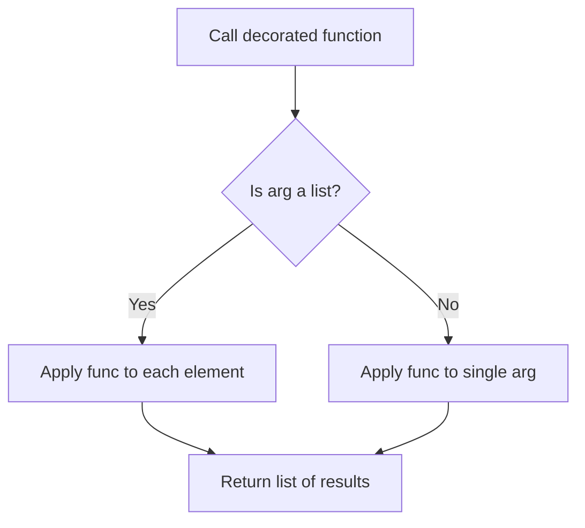
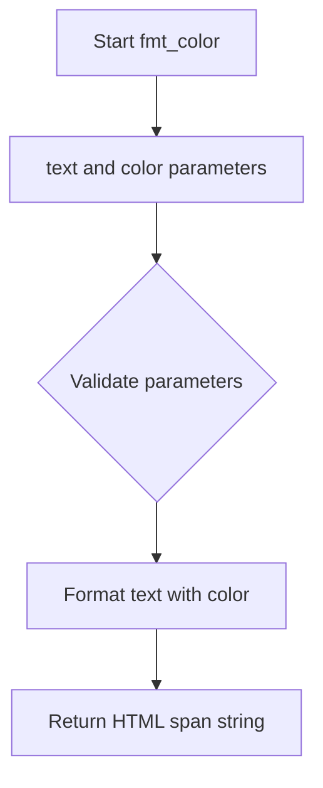
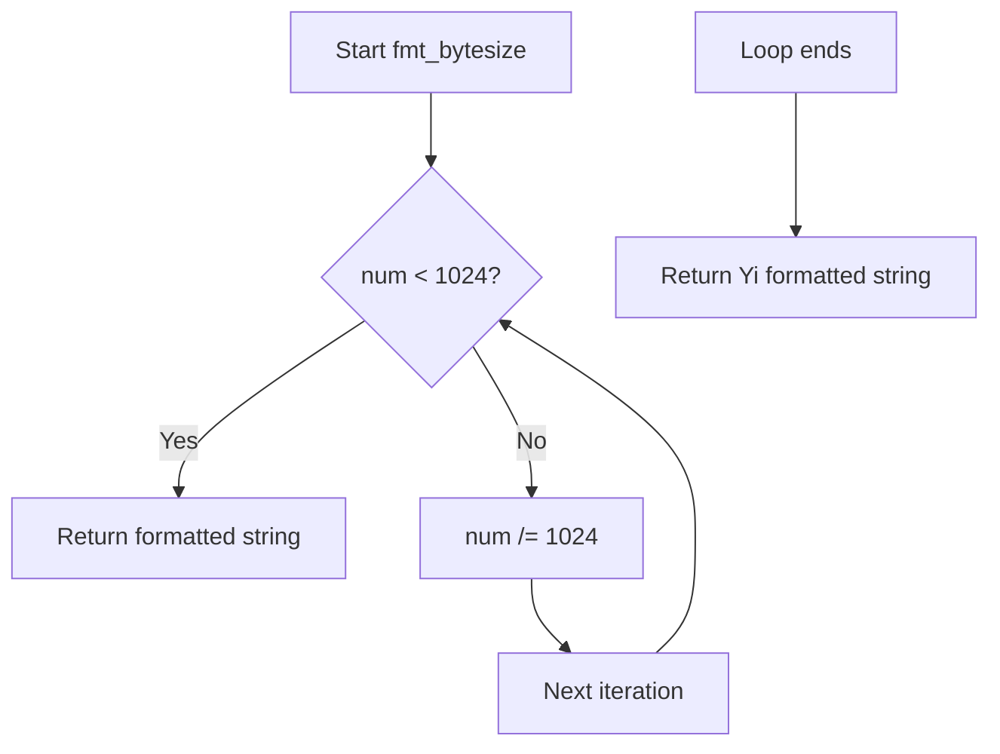
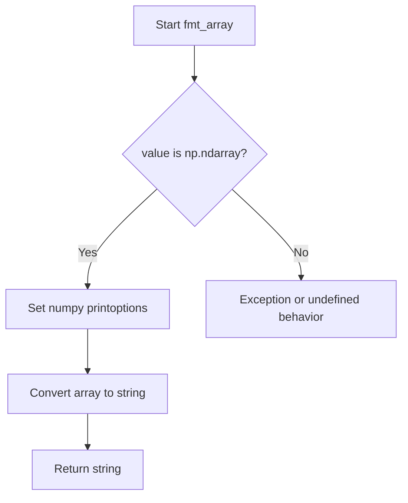

# `formatters.py`

## `src.ydata_profiling.report.formatters.list_args` · *function*

## Summary:
Decorator that enables a function to process either a single argument or a list of arguments uniformly.

## Description:
The `list_args` decorator transforms a function to automatically handle both scalar inputs and list inputs by applying the function to each element of a list when provided. This allows functions to be used seamlessly with either single values or collections of values without requiring separate implementations.

This utility is particularly useful for formatting functions that need to apply the same transformation to individual values or entire arrays of values.

## Args:
    func (Callable): The function to be decorated. This function should accept at least one positional argument followed by optional *args and **kwargs.

## Returns:
    Callable: A new function that behaves like the original function but can handle both single arguments and lists of arguments.

## Raises:
    None: This decorator itself does not raise exceptions, though the wrapped function may raise exceptions based on its own implementation.

## Constraints:
    Preconditions:
    - The input `func` must be a callable object
    - The wrapped function must be able to handle the types of arguments it receives
    
    Postconditions:
    - When a single argument is passed, the result matches the behavior of calling `func` directly
    - When a list is passed, the result is a list where `func` was applied to each element

## Side Effects:
    None: The decorator does not cause any I/O operations or external state mutations. It only modifies the behavior of the input function.

## Control Flow:


## Examples:
```python
# Example usage
@list_args
def uppercase(text):
    return text.upper()

# Works with single string
result1 = uppercase("hello")  # Returns "HELLO"

# Works with list of strings  
result2 = uppercase(["hello", "world"])  # Returns ["HELLO", "WORLD"]
```

## `src.ydata_profiling.report.formatters.fmt_color` · *function*

## Summary:
Wraps text in an HTML span element with a specified color styling.

## Description:
Formats text by wrapping it in an HTML span tag with an inline CSS color style attribute. This utility function is used to apply colored formatting to text elements in HTML reports.

## Args:
    text (str): The text content to be wrapped with color formatting.
    color (str): The CSS color value to apply to the text (e.g., 'red', '#FF0000', 'rgb(255,0,0)').

## Returns:
    str: An HTML string containing the original text wrapped in a span element with the specified color style.

## Raises:
    None: This function does not raise any exceptions.

## Constraints:
    Preconditions:
        - The `text` parameter must be a string.
        - The `color` parameter must be a string representing a valid CSS color value.
    Postconditions:
        - The returned string will always be an HTML span element with the specified color style.
        - The original text content is preserved within the span element.

## Side Effects:
    None: This function has no side effects beyond returning a formatted string.

## Control Flow:


## Examples:
    >>> fmt_color("Error message", "red")
    '<span style="color:red">Error message</span>'
    
    >>> fmt_color("Success", "#00FF00")
    '<span style="color:#00FF00">Success</span>'

## `src.ydata_profiling.report.formatters.fmt_class` · *function*

## Summary:
Wraps text in an HTML span element with the specified CSS class attribute.

## Description:
This utility function creates an HTML span element containing the provided text with the given CSS class applied. It serves as a simple formatting helper for generating styled HTML content within the profiling report generation process.

## Args:
    text (str): The text content to be wrapped in the HTML span element.
    cls (str): The CSS class name to apply to the span element.

## Returns:
    str: An HTML string representing a span element with the specified class and text content.

## Raises:
    None: This function does not raise any exceptions.

## Constraints:
    Preconditions:
        - The `text` parameter must be a string
        - The `cls` parameter must be a string
    
    Postconditions:
        - The returned string is always a valid HTML span element with the specified class
        - The text content is properly escaped (though this function doesn't perform escaping itself)

## Side Effects:
    None: This function has no side effects beyond returning a string.

## Control Flow:
```mermaid
flowchart TD
    A[Start fmt_class] --> B[text and cls parameters]
    B --> C{Validate parameters}
    C --> D{Both are strings?}
    D -->|Yes| E[Create span HTML]
    E --> F[Return formatted string]
    D -->|No| G[Proceed anyway (no validation)]
    G --> E
```

## Examples:
    >>> fmt_class("Hello World", "highlight")
    '<span class="highlight">Hello World</span>'
    
    >>> fmt_class("Important Text", "error")
    '<span class="error">Important Text</span>'

## `src.ydata_profiling.report.formatters.fmt_bytesize` · *function*

## Summary:
Formats a numeric byte size into a human-readable string with appropriate binary prefixes.

## Description:
Converts a raw byte count into a formatted string using binary prefixes (Ki, Mi, Gi, etc.) for better readability. This function is commonly used in data profiling reports to display file sizes, memory usage, or dataset dimensions in an easily understandable format.

## Args:
    num (float): The numeric byte size to format.
    suffix (str): The unit suffix to append (default is "B" for bytes).

## Returns:
    str: A formatted string representing the byte size with appropriate binary prefix (e.g., "1.5 KiB", "2.3 MiB").

## Raises:
    None: This function does not raise any exceptions.

## Constraints:
    Preconditions:
        - The input `num` should be a numeric value (int or float)
        - The `suffix` parameter should be a string
    
    Postconditions:
        - The returned string will always include a numeric value and a binary prefix
        - The result will be formatted with exactly one decimal place

## Side Effects:
    None: This function has no side effects.

## Control Flow:


## Examples:
    >>> fmt_bytesize(1024)
    '1.0 KiB'
    
    >>> fmt_bytesize(1536)
    '1.5 KiB'
    
    >>> fmt_bytesize(1048576)
    '1.0 MiB'
    
    >>> fmt_bytesize(1073741824)
    '1.0 GiB'
```

## `src.ydata_profiling.report.formatters.fmt_percent` · *function*

## Summary:
Formats a floating-point value as a percentage string with special handling for edge cases near 0% and 100%.

## Description:
Converts a decimal value (typically between 0 and 1) into a human-readable percentage string. This function provides special formatting for values that are extremely close to 0% or 100% to improve readability by showing them as "< 0.1%" or "> 99.9%" respectively.

## Args:
    value (float): The decimal value to format as a percentage (typically between 0 and 1).
    edge_cases (bool): Whether to apply special edge case handling. Defaults to True.

## Returns:
    str: A formatted percentage string. Returns "< 0.1%" for values that round to 0 but are greater than 0, "> 99.9%" for values that round to 1 but are less than 1, and standard formatted percentage otherwise.

## Raises:
    None

## Constraints:
    Preconditions:
        - The value parameter should be a numeric type convertible to float
        - When edge_cases=True, the function applies special rounding logic
    
    Postconditions:
        - Always returns a string representation of a percentage
        - Edge case handling only applies when edge_cases=True

## Side Effects:
    None

## Control Flow:
```mermaid
flowchart TD
    A[Start fmt_percent] --> B{edge_cases AND round(value,3)==0 AND value>0?}
    B -- Yes --> C[Return "< 0.1%"]
    B -- No --> D{edge_cases AND round(value,3)==1 AND value<1?}
    D -- Yes --> E[Return "> 99.9%"]
    D -- No --> F[Return "{value*100:2.1f}%"]
```

## Examples:
    >>> fmt_percent(0.0005)
    '< 0.1%'
    >>> fmt_percent(0.9995)
    '> 99.9%'
    >>> fmt_percent(0.5)
    '50.0%'
    >>> fmt_percent(0.0001, edge_cases=False)
    '0.0%'

## `src.ydata_profiling.report.formatters.fmt_timespan` · *function*

## Summary:
Formats numeric time values into human-readable string representations with appropriate units.

## Description:
Converts a time duration expressed in seconds (or compatible time types) into a readable string format. The function automatically selects the most appropriate time units (nanoseconds to years) and applies proper pluralization and formatting conventions. When the duration is less than 60 seconds and not in detailed mode, it returns a simplified representation.

## Args:
    num_seconds (Any): Time duration in seconds, or timedelta object to convert to seconds. Accepts numeric types (int, float) or timedelta objects.
    detailed (bool): Flag indicating whether to include all available time units. Defaults to False.
    max_units (int): Maximum number of time units to display when not in detailed mode. Defaults to 3.

## Returns:
    str: Human-readable time duration string with appropriate units and pluralization.

## Raises:
    None explicitly raised, though underlying conversions may raise ValueError for invalid inputs.

## Constraints:
    Preconditions:
    - num_seconds must be convertible to a numeric value representing seconds
    - max_units must be a positive integer
    
    Postconditions:
    - Returns a properly formatted string with time units
    - String contains at least one time unit when duration > 0
    - Pluralization is applied correctly based on unit counts

## Side Effects:
    None

## Control Flow:
```mermaid
flowchart TD
    A[Start fmt_timespan] --> B{num_seconds < 60 AND not detailed?}
    B -- Yes --> C[round_number(num_seconds)]
    C --> D[pluralize(count, "second")]
    B -- No --> E[num_seconds = coerce_seconds(num_seconds)]
    E --> F[num_seconds = decimal.Decimal(str(num_seconds))]
    F --> G{detailed?}
    G -- Yes --> H[relevant_units = reversed(time_units[0:])]
    G -- No --> I[relevant_units = reversed(time_units[3:])]
    H --> J[Iterate through relevant_units]
    I --> J
    J --> K{unit != last_unit?}
    K -- Yes --> L[count = int(num_seconds / divider)]
    K -- No --> M[count = round_number(num_seconds / divider)]
    L --> N{count not in (0, "0")?}
    M --> N
    N -- Yes --> O[result.append(pluralize(count, singular, plural))]
    N -- No --> P[Continue loop]
    J --> Q{len(result) == 1?}
    Q -- Yes --> R[return result[0]]
    Q -- No --> S{not detailed?}
    S -- Yes --> T[result = result[:max_units]]
    S -- No --> U[Skip slicing]
    T --> V[concatenate(result)]
    U --> V
    V --> W[End]
```

## Examples:
    >>> fmt_timespan(30)
    '30 seconds'
    
    >>> fmt_timespan(125)
    '2 minutes and 5 seconds'
    
    >>> fmt_timespan(3661, detailed=True)
    '1 hour, 1 minute and 1 second'
    
    >>> fmt_timespan(0.001, detailed=False)
    '1 millisecond'
```

## `src.ydata_profiling.report.formatters.fmt_timespan_timedelta` · *function*

## Summary:
Formats timedelta objects into human-readable time span strings or numeric values with specified precision.

## Description:
Processes input values that may be timedelta objects or numeric values, converting timedelta objects to seconds and formatting them appropriately. When the input is a pandas Timedelta object, it extracts the total seconds and applies microsecond/nanosecond corrections before formatting with the timespan formatter. For non-timedelta inputs, it applies numeric formatting with the specified precision.

## Args:
    delta (Any): Input value to format, either a pandas Timedelta object or numeric value representing time/duration
    detailed (bool): Flag indicating whether to include all available time units in the output. Defaults to False
    max_units (int): Maximum number of time units to display when not in detailed mode. Defaults to 3
    precision (int): Number of significant digits to display for numeric values. Defaults to 10

## Returns:
    str: Human-readable time duration string for timedelta inputs, or formatted numeric string for other inputs

## Raises:
    None explicitly raised

## Constraints:
    Preconditions:
    - The delta parameter can be any type, but must be compatible with pandas Timedelta operations when processing timedeltas
    - When delta is a Timedelta, the internal conversion to seconds should succeed
    - When delta is not a Timedelta, fmt_numeric should handle the formatting properly
    
    Postconditions:
    - Returns a properly formatted string representation of the time duration or numeric value
    - For Timedelta inputs, returns a human-readable time span string
    - For non-Timedelta inputs, returns a formatted numeric string

## Side Effects:
    None

## Control Flow:
```mermaid
flowchart TD
    A[Start fmt_timespan_timedelta] --> B{isinstance(delta, pd.Timedelta)?}
    B -- Yes --> C[num_seconds = delta.total_seconds()]
    C --> D{delta.microseconds > 0?}
    D -- Yes --> E[num_seconds += delta.microseconds * 1e-6]
    E --> F{delta.nanoseconds > 0?}
    F -- Yes --> G[num_seconds += delta.nanoseconds * 1e-9]
    G --> H[fmt_timespan(num_seconds, detailed, max_units)]
    B -- No --> I[fmt_numeric(delta, precision)]
    H --> J[End]
    I --> J
```

## Examples:
    >>> fmt_timespan_timedelta(pd.Timedelta('1 day 2 hours 30 minutes'))
    '1 day, 2 hours and 30 minutes'
    
    >>> fmt_timespan_timedelta(pd.Timedelta('500 milliseconds'))
    '500 milliseconds'
    
    >>> fmt_timespan_timedelta(123.456)
    '123.456'
    
    >>> fmt_timespan_timedelta(0.000123, precision=3)
    '0.000123'
```

## `src.ydata_profiling.report.formatters.fmt_numeric` · *function*

## Summary:
Formats numeric values with specified precision and converts scientific notation to HTML superscript format for report display.

## Description:
This function takes a floating-point number and formats it with a given precision, specifically handling scientific notation by converting it to HTML superscript format for proper rendering in web-based data profiling reports. The function ensures that very large or very small numbers are displayed in a readable format while maintaining mathematical accuracy.

## Args:
    value (float): The numeric value to format
    precision (int, optional): Number of significant digits to display. Defaults to 10.

## Returns:
    str: Formatted string representation of the numeric value. Scientific notation is converted to HTML format like "1.23 × 10<sup>-4</sup>".

## Raises:
    None explicitly raised

## Constraints:
    Preconditions:
    - The value parameter must be a numeric type that can be formatted with Python's .g format specifier
    - The precision parameter must be a non-negative integer
    
    Postconditions:
    - Returns a string representation of the number
    - Scientific notation is converted to HTML superscript format when present

## Side Effects:
    None

## Control Flow:
```mermaid
flowchart TD
    A[Start fmt_numeric] --> B[value formatted with {:.{precision}g}]
    B --> C{Contains e+ or e-?}
    C -->|Yes| D[Replace e+ with × 10<sup>]
    C -->|Yes| E[Replace e- with × 10<sup>]
    D --> F[Add </sup> to close tag]
    E --> F
    F --> G[Remove <sup>0 from <sup>0]
    G --> H[Add sign to <sup> tag]
    H --> I[Return formatted string]
    C -->|No| J[Return formatted string directly]
```

## Examples:
    >>> fmt_numeric(123.456)
    '123.456'
    
    >>> fmt_numeric(0.000123)
    '0.000123'
    
    >>> fmt_numeric(1.23e-4)
    '1.23 × 10<sup>-4</sup>'
    
    >>> fmt_numeric(1.23e5, precision=3)
    '1.23 × 10<sup>5</sup>'
```

## `src.ydata_profiling.report.formatters.fmt_number` · *function*

## Summary:
Formats an integer value with locale-aware number grouping.

## Description:
Converts an integer into a string representation with thousands separators according to the current locale settings. This function provides standardized number formatting that respects regional conventions for digit grouping.

## Args:
    value (int): The integer value to format with locale-aware grouping.

## Returns:
    str: A string representation of the integer with appropriate thousands separators based on locale settings.

## Raises:
    None

## Constraints:
    Preconditions:
    - Input must be an integer type
    - Input should be within the range representable by Python's int type
    
    Postconditions:
    - Output is always a string with proper locale-based number formatting
    - The formatted string maintains the numeric value of the input

## Side Effects:
    None

## Control Flow:
```mermaid
flowchart TD
    A[Start fmt_number] --> B[value:int]
    B --> C{Input validation}
    C --> D[Format with f"{value:n}"]
    D --> E[Return formatted string]
```

## Examples:
    >>> fmt_number(1000)
    '1,000'
    
    >>> fmt_number(1234567)
    '1,234,567'
    
    >>> fmt_number(-42)
    '-42'

## `src.ydata_profiling.report.formatters.fmt_array` · *function*

## Summary:
Formats a numpy array into a compact string representation suitable for display in reports.

## Description:
Converts a numpy array into a string representation with controlled formatting. This function is used to create readable array representations for reporting purposes, particularly in the ydata-profiling library where compact display of array data is needed.

## Args:
    value (np.ndarray): The numpy array to format for display
    threshold (Any, optional): Controls how many array elements are displayed at the edges. Defaults to np.nan which uses numpy's default behavior.

## Returns:
    str: A string representation of the formatted array with limited display elements

## Raises:
    None explicitly raised

## Constraints:
    Preconditions:
    - The input value must be a valid numpy array
    - The threshold parameter should be compatible with numpy's printoptions
    
    Postconditions:
    - Returns a string representation of the array
    - The returned string follows numpy's formatting conventions with controlled display limits

## Side Effects:
    None

## Control Flow:


## Examples:
    # Basic usage
    arr = np.array([1, 2, 3, 4, 5])
    result = fmt_array(arr)
    # Returns: '[1 2 3 ... 4 5]'
    
    # With custom threshold
    arr = np.array([[1, 2, 3, 4], [5, 6, 7, 8]])
    result = fmt_array(arr, threshold=1)
    # Returns: '[[1 2 ... 4]\n [5 6 ... 8]]'

## `src.ydata_profiling.report.formatters.fmt` · *function*

## Summary:
Formats values for display in reports, applying appropriate formatting based on data type.

## Description:
Formats values for display in data profiling reports, with specialized handling for numeric and non-numeric types. For numeric values (float or int), it applies specialized numeric formatting via `fmt_numeric`. For all other types, it applies HTML escaping followed by string conversion to ensure safe display in web-based reports.

## Args:
    value (Any): The value to format for display. Can be of any type.

## Returns:
    str: A formatted string representation of the input value, suitable for display in reports.

## Raises:
    None explicitly raised

## Constraints:
    Preconditions:
    - Input value can be of any type
    - The `fmt_numeric` function must be available and properly handle numeric values
    
    Postconditions:
    - Returns a string representation of the input value
    - Numeric values are formatted with scientific notation conversion to HTML superscript format
    - Non-numeric values are HTML-escaped to prevent XSS vulnerabilities

## Side Effects:
    None

## Control Flow:
```mermaid
flowchart TD
    A[Start fmt] --> B{Value type is float or int?}
    B -->|Yes| C[Call fmt_numeric(value)]
    B -->|No| D[Apply escape(value) then str()]
    C --> E[Return formatted numeric string]
    D --> E
```

## Examples:
    >>> fmt(123.456)
    '123.456'
    
    >>> fmt(1.23e-4)
    '1.23 × 10<sup>-4</sup>'
    
    >>> fmt("hello")
    'hello'
    
    >>> fmt("<script>alert('xss')</script>")
    '&lt;script&gt;alert(&#x27;xss&#x27;)&lt;/script&gt;'
```

## `src.ydata_profiling.report.formatters.fmt_monotonic` · *function*

## Summary:
Converts an integer monotonicity indicator to a human-readable descriptive string.

## Description:
Maps integer values representing different monotonicity patterns to descriptive text labels. This function is used to present monotonicity analysis results in a user-friendly format, translating numerical indicators into clear linguistic descriptions of data trends.

## Args:
    value (int): Integer representing monotonicity pattern, where:
        -2: Strictly decreasing
        -1: Decreasing  
        0: Not monotonic
        1: Increasing
        2: Strictly increasing

## Returns:
    str: Human-readable description of the monotonicity pattern:
        - "Strictly increasing" for value = 2
        - "Increasing" for value = 1
        - "Not monotonic" for value = 0
        - "Decreasing" for value = -1
        - "Strictly decreasing" for value = -2

## Raises:
    ValueError: When value is not an integer in the range [-2, 2]

## Constraints:
    Preconditions:
        - Input must be an integer
        - Input must be within range [-2, 2]
    Postconditions:
        - Output is always one of the five predefined string literals
        - Function raises ValueError for invalid inputs

## Side Effects:
    None

## Control Flow:
```mermaid
flowchart TD
    A[Start fmt_monotonic] --> B{value == 2?}
    B -- Yes --> C[Return "Strictly increasing"]
    B -- No --> D{value == 1?}
    D -- Yes --> E[Return "Increasing"]
    D -- No --> F{value == 0?}
    F -- Yes --> G[Return "Not monotonic"]
    F -- No --> H{value == -1?}
    H -- Yes --> I[Return "Decreasing"]
    H -- No --> J{value == -2?}
    J -- Yes --> K[Return "Strictly decreasing"]
    J -- No --> L[Raise ValueError]
```

## Examples:
    >>> fmt_monotonic(2)
    'Strictly increasing'
    >>> fmt_monotonic(-1)
    'Decreasing'
    >>> fmt_monotonic(0)
    'Not monotonic'
    >>> fmt_monotonic(5)
    ValueError: Value should be integer ranging from -2 to 2.

## `src.ydata_profiling.report.formatters.help` · *function*

## Summary:
Generates HTML markup for help badges used in report tooltips.

## Description:
Creates HTML elements for displaying help information in reports. When a URL is provided, it generates a clickable badge with a hyperlink; otherwise, it creates a static badge. This function centralizes the formatting of help elements to ensure consistent styling throughout the reporting system.

## Args:
    title (str): The tooltip text that appears when hovering over the help badge
    url (Optional[str]): The URL to link to when the badge is clicked, or None for a static badge

## Returns:
    str: HTML string containing either a clickable badge with anchor tag or a static badge span element

## Raises:
    None: This function does not raise any exceptions

## Constraints:
    Preconditions:
    - The title parameter must be a string
    - The url parameter, if provided, must be a valid URL string or None
    
    Postconditions:
    - Returns valid HTML string with proper badge formatting
    - The returned HTML maintains consistent styling across the application

## Side Effects:
    None: This function has no side effects

## Control Flow:
```mermaid
flowchart TD
    A[Start help()] --> B{url is not None?}
    B -->|Yes| C[Return anchor tag with badge]
    B -->|No| D[Return span tag with badge]
    C --> E[End]
    D --> E
```

## Examples:
```python
# Create a static help badge
badge_html = help("Column statistics")
# Returns: '<span class="badge pull-right" style="color:#fff;background-color:#337ab7;" title="Column statistics">?</span>'

# Create a clickable help badge
badge_html = help("Data types", "https://example.com/data-types")
# Returns: '<a title="Data types" href="https://example.com/data-types"><span class="badge pull-right" style="color:#fff;background-color:#337ab7;" title="Data types">?</span></a>'
```

## `src.ydata_profiling.report.formatters.fmt_badge` · *function*

## Summary:
Converts parenthetical numeric values into HTML badge elements for enhanced visual presentation.

## Description:
Formats string values by replacing patterns like "(number)" with HTML span elements having the "badge" CSS class. This function serves as a formatting utility to enhance the visual representation of numerical counts or statistics within report outputs.

## Args:
    value (str): Input string that may contain parenthetical numeric values to be converted into badges.

## Returns:
    str: Modified string where all parenthetical numeric patterns have been replaced with HTML badge elements.

## Raises:
    None explicitly raised, but may raise re.error if the regex pattern is malformed (though this is unlikely given the fixed pattern).

## Constraints:
    Preconditions:
    - Input must be a string type
    - Parenthetical patterns must contain only digits (no decimals, negative numbers, or other characters)
    
    Postconditions:
    - Output string will have all matching parenthetical patterns converted to HTML badge elements
    - Non-matching portions of the input remain unchanged

## Side Effects:
    None - this function is pure and has no side effects.

## Control Flow:
```mermaid
flowchart TD
    A[Input String] --> B{Contains "(\\d+)" pattern?}
    B -- Yes --> C[Replace with <span class="badge">\\1</span>]
    B -- No --> D[Return unchanged]
    C --> E[Output String]
    D --> E
```

## Examples:
    >>> fmt_badge("Items (15)")
    'Items <span class="badge">15</span>'
    
    >>> fmt_badge("Errors (3) and Warnings (7)")
    'Errors <span class="badge">3</span> and Warnings <span class="badge">7</span>'
    
    >>> fmt_badge("No badges here")
    'No badges here'
```

