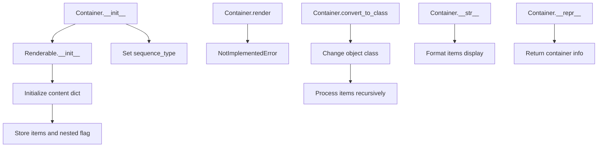

# `container.py`

## `src.ydata_profiling.report.presentation.core.container.Container` · *class*

## Summary:
A Container is a renderable component that holds a sequence of other renderable items and defines their presentation structure.

## Description:
The Container class serves as a structural element in the report presentation layer, grouping multiple Renderable components together. It acts as a container for organizing and presenting collections of UI elements. Common use cases include grouping related report sections, creating lists or sequences of components, and managing hierarchical presentation structures.

This class provides a foundation for creating structured layouts in reports while maintaining the ability to convert objects to different container types through class conversion utilities.

## State:
- items: Sequence[Renderable] - A sequence of renderable components stored in this container
- sequence_type: str - Defines the type or category of sequence being represented (e.g., "list", "grid", "table")
- nested: bool - Flag indicating whether this container contains nested containers (default: False)
- name: Optional[str] - Human-readable identifier for the container (inherited from Renderable)
- anchor_id: Optional[str] - HTML anchor ID for linking to this container (inherited from Renderable)
- classes: Optional[str] - CSS classes for styling this container (inherited from Renderable)

The Container maintains a content dictionary inherited from Renderable that stores all configuration parameters including items and nested flag.

## Lifecycle:
- Creation: Instantiate with a sequence of Renderable items, sequence_type string, and optional metadata
- Usage: Typically used to group related renderable components together for presentation purposes
- Destruction: No explicit cleanup required; relies on Python garbage collection

## Method Map:


## Raises:
- NotImplementedError: When the render() method is called (must be implemented by subclasses)

## Example:
```python
# Create a container with multiple renderable items
items = [header_component, table_component, chart_component]
container = Container(
    items=items,
    sequence_type="list",
    name="report-section",
    classes="section-container"
)

# Convert an existing renderable to a container type
Container.convert_to_class(existing_object, lambda x: x)
```

### `src.ydata_profiling.report.presentation.core.container.Container.__init__` · *method*

*No documentation generated.*

### `src.ydata_profiling.report.presentation.core.container.Container.__str__` · *method*

## Summary:
Returns a formatted string representation of the Container object showing its type and items.

## Description:
Provides a human-readable string representation of a Container instance that displays the container type followed by a numbered list of its items. This method is automatically invoked when the container is converted to a string (e.g., via str() function or print() statements) and is primarily used for debugging and development purposes.

The string representation follows a hierarchical format where each item is indented for readability. When items are multi-line strings, newlines are properly escaped with tab indentation to maintain formatting.

Known callers:
- Python interpreter when converting Container objects to strings via str() or print()
- Debugging sessions where Container objects are displayed
- Logging systems that automatically call __str__ on objects

This logic is separated into its own method to follow Python conventions for object representation and to provide a clear, readable debug view of Container objects without affecting the main functionality of the class.

## Args:
    None: This method takes no parameters beyond the implicit self reference.

## Returns:
    str: A formatted string representation of the Container showing "Container" followed by each item on a new line with numeric indexing and proper indentation.

## Raises:
    None: This method does not raise any exceptions under normal circumstances.

## State Changes:
    Attributes READ:
    - self.content: Reads the content dictionary to check for "items" key and access items
    - self.content["items"]: Accesses the items list from content when present

    Attributes WRITTEN: None

## Constraints:
    Preconditions:
    - The Container instance must be properly initialized
    - The content dictionary must be accessible (not None)
    - Items in content["items"] must be convertible to strings

    Postconditions:
    - The method returns a string representation without modifying the object's state
    - The returned string accurately reflects the container's structure and items

## Side Effects:
    None: This method performs no I/O operations, external service calls, or mutations to objects outside self. It only reads from existing instance attributes and returns a formatted string.

### `src.ydata_profiling.report.presentation.core.container.Container.__repr__` · *method*

## Summary:
Returns a string representation of the Container object that includes its name when available.

## Description:
Provides a concise textual representation of a Container instance for debugging and development purposes. This method is automatically called by Python's repr() function and is useful for inspecting Container objects in interactive environments or logs.

The representation follows the pattern "Container(name=<name>)" when a name is provided during initialization, or simply "Container" when no name is specified. This behavior aligns with Python conventions for __repr__ methods, providing clear identification of the object type and its identifying characteristics.

## Args:
    None: This method takes no parameters beyond the implicit self reference.

## Returns:
    str: A string representation of the Container object. Format is either "Container" or "Container(name=<name>)" depending on whether a name was provided during initialization.

## Raises:
    None: This method does not raise any exceptions.

## State Changes:
    Attributes READ:
    - self.content: Reads the content dictionary to check for the presence of "name" key
    - self.content["name"]: Accesses the name value from content when the key exists

    Attributes WRITTEN: None

## Constraints:
    Preconditions:
    - The Container instance must be properly initialized
    - The content dictionary must be accessible (not None)
    - The "name" key in content, if present, must be a string or convertible to string

    Postconditions:
    - The method returns a string representation without modifying the object's state
    - The returned string accurately reflects whether a name was provided during initialization

## Side Effects:
    None: This method performs no I/O operations, external service calls, or mutations to objects outside self. It only reads from existing instance attributes and returns a string.

### `src.ydata_profiling.report.presentation.core.container.Container.render` · *method*

## Summary:
Abstract method that processes contained renderable items and returns a formatted presentation representation.

## Description:
This abstract method defines the rendering interface for container elements in the presentation layer. As a required method of the Renderable abstract base class, it must be implemented by concrete subclasses to define how the container's items should be rendered into a presentation format. The method takes no parameters and returns a formatted representation suitable for display in reports or dashboards.

## Args:
    None

## Returns:
    Any: A formatted representation of the container's contents, typically a string, HTML fragment, or other presentation format. The exact return type depends on the implementing subclass and target output format (e.g., HTML, Markdown, JSON).

## Raises:
    NotImplementedError: Raised when this abstract method is called directly on the Container base class without a concrete implementation.

## State Changes:
    Attributes READ: 
    - self.content["items"]: The sequence of renderable items stored in the container
    - self.sequence_type: The type identifier for the container's sequence structure
    
    Attributes WRITTEN: None

## Constraints:
    Preconditions:
    - The Container instance must be properly initialized with items and sequence_type
    - Subclasses must implement this method to provide concrete rendering behavior
    
    Postconditions:
    - When implemented, the method returns a valid presentation representation of the container's contents
    - The returned value should be appropriate for the target presentation format

## Side Effects:
    None

### `src.ydata_profiling.report.presentation.core.container.Container.convert_to_class` · *method*

## Summary:
Converts a Renderable object to a different class and processes its contained items.

## Description:
This function changes the class of a Renderable object to the specified class and recursively processes any items contained within the object's content. It's typically used during report presentation rendering to dynamically change object types while maintaining content structure.

## Args:
    cls: The target class to convert the Renderable object to (must be a class type)
    obj: A Renderable object whose class will be changed (must be an instance of Renderable)
    flv: A callable function that processes each item in the object's content (must be callable)

## Returns:
    None: This function modifies the object in-place and doesn't return anything

## Raises:
    None: This function does not explicitly raise exceptions, though underlying operations may raise exceptions

## State Changes:
    Attributes READ: 
        - obj.content (reads the content dictionary to check for "items")
    Attributes WRITTEN:
        - obj.__class__ (changes the object's class to cls)

## Constraints:
    Preconditions:
        - obj must be an instance of Renderable or a subclass
        - obj.content must be a dictionary-like object
        - flv must be callable
    Postconditions:
        - obj.__class__ will be set to cls
        - If items exist in obj.content, flv will be called on each item

## Side Effects:
    None: This function only modifies the object's class and calls the provided function on items, with no external I/O or service calls

