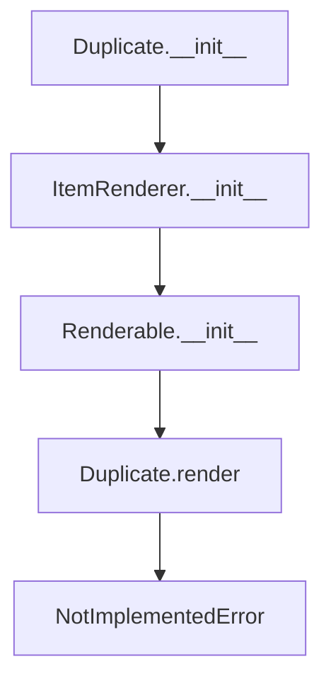

# `duplicate.py`

## `src.ydata_profiling.report.presentation.core.duplicate.Duplicate` · *class*

## Summary:
Represents a duplicate data visualization component in report presentations.

## Description:
The Duplicate class serves as a base renderer for displaying duplicate data findings in data profiling reports. It inherits from ItemRenderer and is specifically designed to handle DataFrame objects containing duplicate records. This component acts as a foundation for creating visual representations of duplicate data patterns, enabling users to identify and analyze duplicated entries in datasets during exploratory data analysis.

The class is intended to be subclassed rather than used directly, as the render() method raises NotImplementedError and must be implemented by child classes to provide actual visualization capabilities.

## State:
- item_type: str - Set to "duplicate" indicating the type of rendered item
- content: dict - Contains the duplicate DataFrame under the key "duplicate"
- name: str - Optional identifier for the component instance
- anchor_id: str - Optional HTML anchor identifier for linking
- classes: str - Optional CSS classes for styling

## Lifecycle:
- Creation: Instantiate with a name string and a pandas DataFrame containing duplicate data
- Usage: Typically used within report generation pipelines where duplicate data needs to be visualized
- Destruction: No special cleanup required; relies on Python's garbage collection

## Method Map:


## Raises:
- NotImplementedError: When the render() method is called, as it must be implemented by subclasses

## Example:
```python
import pandas as pd
from ydata_profiling.report.presentation.core.duplicate import Duplicate

# Create a sample duplicate DataFrame
duplicate_data = pd.DataFrame({
    'id': [1, 2, 3, 4],
    'value': ['A', 'B', 'A', 'C']
})

# Create Duplicate instance (this would typically be done through a subclass)
duplicate_component = Duplicate(name="my_duplicates", duplicate=duplicate_data)

# In practice, this component would be subclassed for actual rendering:
# class MyDuplicateRenderer(Duplicate):
#     def render(self):
#         # Implementation for rendering duplicates
#         pass
```

### `src.ydata_profiling.report.presentation.core.duplicate.Duplicate.__init__` · *method*

## Summary:
Initializes a Duplicate component with duplicate data for report presentation, setting up the rendering framework.

## Description:
Constructs a Duplicate instance that encapsulates duplicate data for visualization in profiling reports. This method initializes the component's internal state by calling the parent class constructors to properly establish the rendering framework. The Duplicate class is designed to be subclassed, with actual rendering implemented in derived classes.

## Args:
    name (str): Unique identifier for the duplicate component instance, used for referencing in reports
    duplicate (pandas.DataFrame): DataFrame containing duplicate records to be displayed in the report
    **kwargs: Additional keyword arguments passed to parent constructors (name, anchor_id, classes)

## Returns:
    None: This method initializes the object state but does not return a value

## Raises:
    None: This method does not raise exceptions directly

## State Changes:
    Attributes READ: None
    Attributes WRITTEN: 
    - self.item_type: Set to "duplicate" to identify the component type
    - self.content: Dictionary containing the duplicate DataFrame under key "duplicate"
    - Other inherited attributes from Renderable and ItemRenderer

## Constraints:
    Preconditions:
    - The duplicate parameter must be a valid pandas DataFrame containing duplicate data
    - The name parameter must be a string
    - The Duplicate class should be used as a base class for actual implementations

    Postconditions:
    - The instance is properly initialized with item_type set to "duplicate"
    - The duplicate DataFrame is stored in the content dictionary under the "duplicate" key
    - All parent class initialization is completed successfully through the inheritance chain

## Side Effects:
    None: This method performs no I/O operations or external service calls

## Lifecycle Context:
This method is called during object instantiation in the report generation pipeline. It establishes the foundational structure for duplicate data visualization components, preparing them for rendering by subclasses that implement the abstract render() method.

### `src.ydata_profiling.report.presentation.core.duplicate.Duplicate.__repr__` · *method*

*No documentation generated.*

### `src.ydata_profiling.report.presentation.core.duplicate.Duplicate.render` · *method*

## Summary:
Raises NotImplementedError indicating that the render method needs to be implemented for displaying duplicate data in reports.

## Description:
This method is part of the abstract rendering interface defined by the Renderable base class. It is intended to convert the stored duplicate data into a presentation-ready format, but currently raises NotImplementedError to indicate incomplete implementation. The method would typically be overridden by subclasses to provide concrete rendering logic for duplicate data visualization.

## Args:
    None

## Returns:
    This method does not return anything as it raises NotImplementedError.

## Raises:
    NotImplementedError: Always raised by this implementation to indicate that the method needs to be implemented by subclasses.

## State Changes:
    Attributes READ: 
    - self.content (accessed via parent class properties)
    - self.content["duplicate"] (the duplicate DataFrame stored in content)
    
    Attributes WRITTEN: None

## Constraints:
    Preconditions: 
    - The Duplicate instance must be properly initialized with duplicate data
    - The duplicate data should be a pandas DataFrame
    
    Postconditions: 
    - This method always raises NotImplementedError (no postcondition applies)

## Side Effects:
    None

