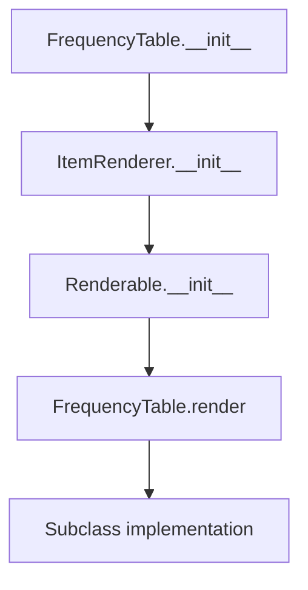

# `frequency_table.py`

## `src.ydata_profiling.report.presentation.core.frequency_table.FrequencyTable` · *class*

## Summary:
Represents a frequency table component for data profiling reports that displays categorical data distributions.

## Description:
The FrequencyTable class is a specialized renderer for displaying frequency distributions of categorical data in data profiling reports. It inherits from ItemRenderer and serves as a container for frequency data that will be rendered in HTML or other formats. This class is part of the presentation layer responsible for formatting and displaying statistical information about data distributions.

## State:
- rows: list - Collection of frequency data rows to display, where each row typically contains a category and its count/frequency
- redact: bool - Flag indicating whether sensitive data should be redacted from display
- item_type: str - Set to "frequency_table" by constructor, identifies the type of component
- content: dict - Dictionary containing the configuration data including rows and redact flag
- name: str - Optional identifier for the component (inherited from Renderable)
- anchor_id: str - Optional anchor identifier for HTML linking (inherited from Renderable)
- classes: str - Optional CSS classes for styling (inherited from Renderable)

## Lifecycle:
- Creation: Instantiate with rows (list of frequency data) and redact (bool) parameters
- Usage: Call render() method to generate the formatted output (implementation is deferred to subclasses)
- Destruction: No special cleanup required, relies on Python garbage collection

## Method Map:


## Raises:
- TypeError: If rows parameter is not a list or redact parameter is not a boolean
- NotImplementedError: When render() method is called (as it must be implemented by subclasses)

## Example:
```python
# Create a frequency table with sample data
rows = [
    {"category": "A", "count": 10},
    {"category": "B", "count": 5}
]
table = FrequencyTable(rows=rows, redact=False)

# The render method would be implemented by subclasses
# table.render()  # Would raise NotImplementedError
```

### `src.ydata_profiling.report.presentation.core.frequency_table.FrequencyTable.__init__` · *method*

## Summary:
Initializes a frequency table component with rows of data and redaction settings.

## Description:
Constructs a FrequencyTable instance that represents a frequency distribution of categorical data. This method sets up the internal state with the provided rows and redaction configuration, and initializes the parent class hierarchy to properly configure the component for rendering. The frequency table is designed to display categorical data distributions in data profiling reports.

## Args:
    rows (list): Collection of frequency data rows to display, where each row typically contains a category and its count/frequency
    redact (bool): Flag indicating whether sensitive data should be redacted from display
    **kwargs: Additional keyword arguments passed to parent class constructors for name, anchor_id, and classes configuration

## Returns:
    None: This method initializes the object state and does not return a value

## Raises:
    TypeError: If rows parameter is not a list or redact parameter is not a boolean
    TypeError: If any kwargs contain invalid types for parent class parameters

## State Changes:
    Attributes READ: None
    Attributes WRITTEN: 
    - self.item_type: Set to "frequency_table" 
    - self.content: Set to dictionary containing "rows" and "redact" keys
    - self.content["name"]: Set if name is provided in kwargs
    - self.content["anchor_id"]: Set if anchor_id is provided in kwargs
    - self.content["classes"]: Set if classes is provided in kwargs

## Constraints:
    Preconditions:
    - rows parameter must be a list
    - redact parameter must be a boolean
    - All kwargs must be valid parameters for parent class constructors
    
    Postconditions:
    - self.item_type is set to "frequency_table"
    - self.content contains the rows and redact configuration
    - Parent class initialization is completed successfully

## Side Effects:
    None: This method performs no I/O operations or external service calls

### `src.ydata_profiling.report.presentation.core.frequency_table.FrequencyTable.__repr__` · *method*

## Summary:
Returns a string representation of the FrequencyTable object for debugging and logging purposes.

## Description:
This method provides a standardized string representation of FrequencyTable instances, returning the literal string "FrequencyTable". It is called automatically when the built-in repr() function is applied to a FrequencyTable instance, and is also used by Python's interactive interpreter to display object representations.

## Args:
    None

## Returns:
    str: The string "FrequencyTable" that uniquely identifies this object type.

## Raises:
    None

## State Changes:
    Attributes READ: None
    Attributes WRITTEN: None

## Constraints:
    Preconditions: None
    Postconditions: Always returns the string "FrequencyTable"

## Side Effects:
    None

### `src.ydata_profiling.report.presentation.core.frequency_table.FrequencyTable.render` · *method*

## Summary:
Raises NotImplementedError indicating that subclasses must implement frequency table rendering logic.

## Description:
This abstract method defines the interface for rendering frequency table content in a presentation format. As required by the Renderable base class, subclasses must override this method to generate a displayable representation of the frequency table data. The current implementation raises NotImplementedError to enforce proper subclassing and implementation.

## Args:
    None

## Returns:
    Any: The return type annotation indicates Any, but this method never returns due to the NotImplementedError being raised.

## Raises:
    NotImplementedError: Always raised by this base implementation to signal that subclasses must provide concrete rendering logic.

## State Changes:
    Attributes READ: 
    - self.content (contains rows and redact settings inherited from parent classes)
    - self.item_type (inherited from ItemRenderer)

## Constraints:
    Preconditions:
    - This method should only be called on concrete subclasses that have implemented the render method
    - The FrequencyTable instance must be properly initialized with rows and redact parameters
    
    Postconditions:
    - The method always raises NotImplementedError when called on the base class
    - Concrete implementations must provide a valid rendering mechanism that produces presentation-ready output

## Side Effects:
    None

## Usage Context:
This method is typically called during report generation when the presentation layer needs to render frequency table data. Implementers should return HTML, JSON, or other presentation formats suitable for the target output medium.

