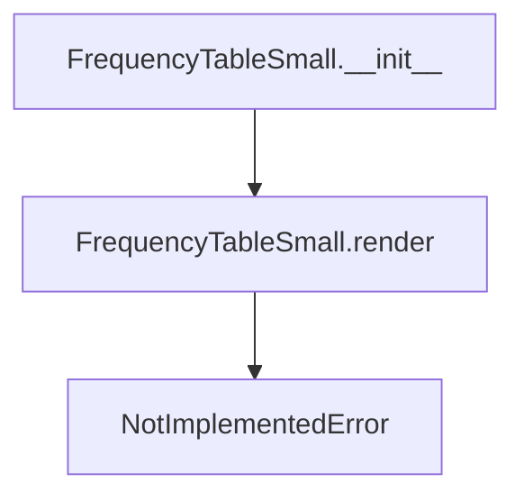

# `frequency_table_small.py`

## `src.ydata_profiling.report.presentation.core.frequency_table_small.FrequencyTableSmall` · *class*

## Summary:
A specialized renderer for displaying small frequency tables in data profiling reports.

## Description:
The FrequencyTableSmall class represents a lightweight frequency table visualization component used in data profiling reports. It inherits from ItemRenderer and implements the abstract render method that would typically generate HTML or other presentation formats for frequency data. This class is designed to display categorical data frequencies in a compact format suitable for smaller datasets or space-constrained report sections.

This class serves as a building block in the report generation pipeline, specifically for creating frequency distribution displays that show the count or percentage of occurrences for different categories in a dataset. It's part of a larger system for automated data profiling and reporting.

## State:
- rows: List[Any] - A list containing frequency data rows, typically tuples or dictionaries representing category-frequency pairs. Each row usually contains a category label and its corresponding frequency count.
- redact: bool - A flag indicating whether sensitive data should be redacted from the display. When True, potentially identifying information may be masked or hidden.
- item_type: str - Set to "frequency_table_small" by constructor, identifying this component type in the rendering system
- content: dict - Dictionary containing the configuration parameters (rows and redact) passed to the parent Renderable class

## Lifecycle:
- Creation: Instantiate with rows (list of frequency data) and redact (boolean flag) parameters. The constructor calls the parent's __init__ with the item type identifier and content dictionary.
- Usage: Typically called by report generation systems that require frequency table rendering. The render() method is expected to be invoked by the presentation layer to generate the actual display output.
- Destruction: No explicit cleanup required; relies on Python garbage collection. The class follows standard Python object lifecycle management.

## Method Map:


## Raises:
- NotImplementedError: Raised by the render() method which must be implemented by subclasses or concrete implementations in the rendering pipeline

## Example:
```python
# Create a frequency table with sample data
rows = [("Category A", 10), ("Category B", 5), ("Category C", 15)]
table = FrequencyTableSmall(rows=rows, redact=False)

# The render method would typically be called by the reporting system
# table.render()  # Would raise NotImplementedError
# This class is meant to be subclassed or used as part of a larger rendering framework
```

### `src.ydata_profiling.report.presentation.core.frequency_table_small.FrequencyTableSmall.__init__` · *method*

## Summary:
Initializes a frequency table small component with rows of data and redaction settings.

## Description:
Configures the frequency table small renderer with categorical frequency data and redaction preferences. This method establishes the foundational structure for frequency table presentation by setting the item type identifier and storing the frequency data along with redaction flags in the content dictionary.

## Args:
    rows (List[Any]): A list of frequency data entries, typically containing category labels and their corresponding counts or percentages.
    redact (bool): Boolean flag indicating whether sensitive data should be masked or hidden from display.
    **kwargs: Additional keyword arguments passed through to the parent class constructor for name, anchor_id, and classes configuration.

## Returns:
    None: This method initializes the object state and does not return a value.

## Raises:
    None: This method does not explicitly raise exceptions, though parent class constructors may raise exceptions for invalid arguments.

## State Changes:
    Attributes READ: None
    Attributes WRITTEN: 
    - self.item_type: Set to "frequency_table_small"
    - self.content: Populated with rows and redact parameters

## Constraints:
    Preconditions:
    - rows parameter must be a valid list structure
    - redact parameter must be a boolean value
    - All kwargs must be valid parameters accepted by the parent Renderable class
    
    Postconditions:
    - The object is initialized with item_type set to "frequency_table_small"
    - The content dictionary contains the rows and redact parameters
    - The object maintains proper inheritance from Renderable and ItemRenderer classes

## Side Effects:
    None: This method performs no I/O operations or external service calls. It only initializes internal object state.

### `src.ydata_profiling.report.presentation.core.frequency_table_small.FrequencyTableSmall.__repr__` · *method*

## Summary:
Returns a string representation of the FrequencyTableSmall object for debugging and logging purposes.

## Description:
This method implements Python's magic `__repr__` method to provide a standardized string representation of FrequencyTableSmall instances. It is typically used for debugging, logging, and development purposes to quickly identify objects of this type.

## Args:
    None

## Returns:
    str: Always returns the literal string "FrequencyTableSmall"

## Raises:
    None

## State Changes:
    Attributes READ: None
    Attributes WRITTEN: None

## Constraints:
    Preconditions: None
    Postconditions: The returned string is always exactly "FrequencyTableSmall"

## Side Effects:
    None

The method is intentionally kept simple as it's a standard Python representation method. It doesn't depend on any instance attributes and always returns the same constant string regardless of the object's state.

### `src.ydata_profiling.report.presentation.core.frequency_table_small.FrequencyTableSmall.render` · *method*

## Summary:
Renders the small frequency table as a formatted HTML representation.

## Description:
This method implements the abstract render interface defined by the parent Renderable class. It is responsible for converting the stored frequency data into a formatted HTML representation suitable for display in data profiling reports. The method must be implemented by subclasses to provide the actual rendering logic.

## Args:
    None

## Returns:
    Any: The rendered representation of the frequency table, typically HTML content or a similar formatted structure.

## Raises:
    NotImplementedError: Always raised by this base implementation, as the actual rendering logic must be implemented by subclasses.

## State Changes:
    Attributes READ: 
    - self.content: Accesses the stored frequency data and configuration
    - self.content["rows"]: Reads the frequency data rows to be rendered
    - self.content["redact"]: Reads the redaction flag to determine if sensitive data should be hidden

    Attributes WRITTEN: None

## Constraints:
    Preconditions: 
    - The instance must be properly initialized with rows and redact parameters
    - The rows parameter should contain valid frequency data structures
    
    Postconditions: 
    - This base implementation always raises NotImplementedError
    - Subclasses must implement this method to return a valid rendered representation

## Side Effects:
    None

