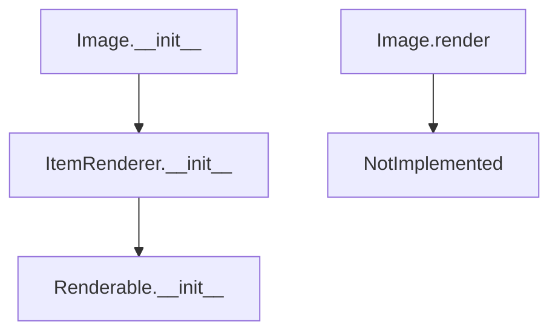

# `image.py`

## `src.ydata_profiling.report.presentation.core.image.Image` · *class*

## Summary:
Represents an image element in a report presentation with associated metadata for rendering.

## Description:
The Image class is a specialized renderer for images within the ydata-profiling report generation system's presentation layer. It encapsulates image data and metadata such as path/URL, format, alternative text, and optional captions for inclusion in reports. This class ensures proper validation of image data before inclusion in presentations.

## State:
- image: str - Path or URL to the image resource
- image_format: ImageType - Format of the image (PNG, JPEG, SVG, etc.)
- alt: str - Alternative text for accessibility purposes
- caption: Optional[str] - Optional caption text for the image
- item_type: str - Fixed value "image" indicating the type of presentation element
- content: dict - Dictionary containing all image metadata including image, image_format, alt, and caption

## Lifecycle:
- Creation: Instantiate with image path/URL, image format, and alternative text. Caption is optional.
- Usage: Call render() method to generate presentation-ready output (implementation deferred in base class)
- Destruction: No explicit cleanup required; relies on Python garbage collection

## Method Map:


## Raises:
- ValueError: When the image parameter is None, with descriptive error message including alt and caption values

## Example:
```python
from ydata_profiling.config import ImageType
from ydata_profiling.report.presentation.core.image import Image

# Create an image with caption
img = Image(
    image="path/to/chart.png",
    image_format=ImageType.PNG,
    alt="Distribution chart of age variable",
    caption="Figure 1: Age distribution"
)

# Create an image without caption
img_no_caption = Image(
    image="path/to/graph.svg",
    image_format=ImageType.SVG,
    alt="Correlation heatmap"
)

# The render method must be implemented by subclasses
# img.render()  # Would raise NotImplementedError
```

### `src.ydata_profiling.report.presentation.core.image.Image.__init__` · *method*

## Summary:
Initializes an Image component with image data, format, and accessibility attributes.

## Description:
Constructs an Image object that represents an image in a report presentation. This method validates that the image path is not null and sets up the underlying item renderer with appropriate metadata for rendering.

## Args:
    image (str): Path or URL to the image resource.
    image_format (ImageType): Format of the image (e.g., PNG, JPEG).
    alt (str): Alternative text for accessibility.
    caption (Optional[str]): Optional caption for the image. Defaults to None.
    **kwargs: Additional keyword arguments passed to the parent ItemRenderer constructor.

## Returns:
    None: This method initializes the object and does not return a value.

## Raises:
    ValueError: When the image parameter is None, with a descriptive error message including alt and caption values.

## State Changes:
    Attributes READ: None
    Attributes WRITTEN: 
    - self.item_type (set to "image")
    - Other attributes inherited from ItemRenderer via super().__init__()

## Constraints:
    Preconditions:
    - The image parameter must not be None
    - image must be a valid string path or URL
    - image_format must be a valid ImageType enum value
    
    Postconditions:
    - The object is initialized as an ItemRenderer with item_type="image"
    - All provided parameters are stored in the content dictionary

## Side Effects:
    None: This method performs no I/O operations or external service calls.

### `src.ydata_profiling.report.presentation.core.image.Image.__repr__` · *method*

## Summary:
Returns a string representation of the Image object indicating its type.

## Description:
This method provides a string representation of the Image object, typically used for debugging and logging purposes. The method returns a constant string "Image" to indicate the object type, following Python's `__repr__` convention.

## Args:
    None

## Returns:
    str: Always returns the string "Image" to identify the object type.

## Raises:
    None

## State Changes:
    Attributes READ: None
    Attributes WRITTEN: None

## Constraints:
    Preconditions: None
    Postconditions: The method always returns the same string value "Image".

## Side Effects:
    None

### `src.ydata_profiling.report.presentation.core.image.Image.render` · *method*

## Summary:
Renders the image component into a displayable format, typically HTML, for inclusion in profile reports.

## Description:
The render method is responsible for converting the stored image data (path, format, alt text, and optional caption) into a presentation-ready format. This method is intended to be overridden by subclasses to provide specific rendering logic for different output formats. The base implementation raises NotImplementedError to enforce proper subclassing.

This method is called during the report generation pipeline when the presentation layer needs to convert the image component into its final visual representation for display in HTML reports or other output formats.

## Args:
    None

## Returns:
    Any: The rendered representation of the image, typically HTML markup or a similar presentation format. The exact return type depends on the implementing subclass.

## Raises:
    NotImplementedError: Always raised by the base implementation to indicate that subclasses must override this method with their specific rendering logic.

## State Changes:
    Attributes READ: 
    - self.content["image"]: The image file path or data URI
    - self.content["image_format"]: The format of the image (svg or png)
    - self.content["alt"]: Alternative text for accessibility
    - self.content["caption"]: Optional caption text for the image
    - self.item_type: The type identifier for this component ("image")

    Attributes WRITTEN: None

## Constraints:
    Preconditions:
    - The Image instance must have been properly initialized with valid parameters
    - The image path must be accessible or valid for rendering
    - The image_format must be one of the supported values from ImageType (svg or png)

    Postconditions:
    - The method must return a valid presentation format for the image
    - The returned format should be compatible with the target output medium (HTML, etc.)

## Side Effects:
    None

