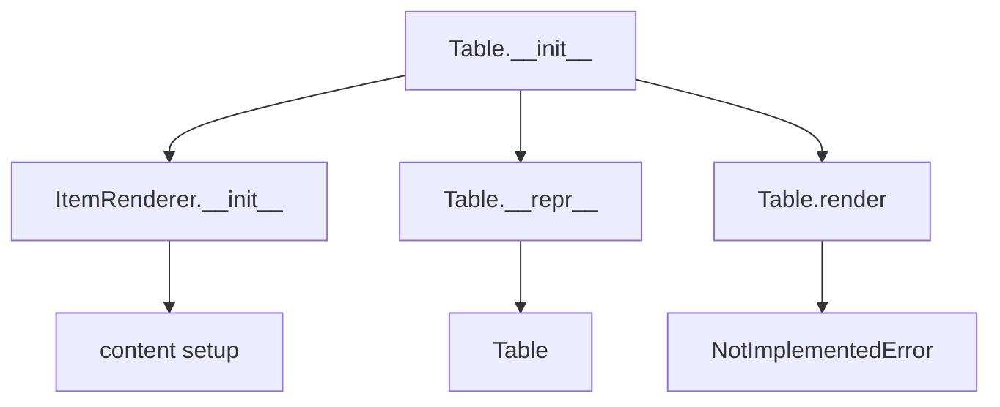

# `table.py`

## `src.ydata_profiling.report.presentation.core.table.Table` · *class*

## Summary:
Table is a concrete implementation of ItemRenderer that represents tabular data for report presentation in the ydata profiling system.

## Description:
The Table class serves as a specialized renderer for displaying structured data in tabular format within profiling reports. It extends ItemRenderer to provide a standardized interface for table-based content while maintaining consistency with other report elements. This class is typically instantiated by report generators when tabular data needs to be displayed in the final output.

The motivation for this abstraction is to separate the conceptual representation of tabular data from its presentation logic, allowing for different rendering strategies while maintaining a consistent interface for report components.

## State:
- rows: Sequence - Collection of data rows to be displayed in the table; must be iterable containing table data
- style: Style - Configuration object containing visual styling parameters for table presentation
- name: Optional[str] - Human-readable identifier for the table, stored in content dictionary
- caption: Optional[str] - Optional descriptive caption for the table, stored in content dictionary

## Lifecycle:
- Creation: Instantiate with required rows and style parameters, optionally providing name and caption
- Usage: Call render() method to generate presentation-ready output (implementation must be provided by subclasses)
- Destruction: Inherits standard object lifecycle management from ItemRenderer parent class

## Method Map:


## Raises:
- NotImplementedError: Raised by render() method which must be implemented by subclasses

## Example:
```python
from ydata_profiling.config import Style
from ydata_profiling.report.presentation.core.table import Table

# Create a table with sample data
rows = [
    ["Name", "Age", "City"],
    ["Alice", 25, "New York"],
    ["Bob", 30, "San Francisco"]
]

style = Style()
table = Table(rows, style, name="Demographics", caption="User demographics table")

# Note: render() method raises NotImplementedError and must be implemented by subclasses
# result = table.render()  # Would raise NotImplementedError

# Typical usage would involve creating a subclass that implements render()
class HTMLTable(Table):
    def render(self):
        # Implementation for HTML table rendering
        return f"<table name='{self.name}'>{self.rows}</table>"
```

### `src.ydata_profiling.report.presentation.core.table.Table.__init__` · *method*

## Summary:
Initializes a table item renderer with rows, styling configuration, and optional metadata.

## Description:
Constructs a Table object that represents a tabular data structure for report generation. This method sets up the internal state by storing the table's data rows, styling configuration, and optional identifying metadata (name and caption) in the parent Renderable class's content dictionary.

The method delegates to the parent ItemRenderer.__init__ which establishes the item type as "table" and stores all provided parameters in a structured content dictionary. This approach allows for consistent handling of different report item types while maintaining type-specific behavior through the render() method implementation.

## Args:
    rows (Sequence): Collection of table rows to be displayed in the report
    style (Style): Styling configuration object containing visual parameters for the table
    name (Optional[str]): Human-readable identifier for the table, defaults to None
    caption (Optional[str]): Optional caption text for the table, defaults to None
    **kwargs: Additional keyword arguments passed to the parent constructor

## Returns:
    None: This method initializes the object state and returns nothing

## Raises:
    None: This method does not explicitly raise exceptions, though parent constructors may raise validation errors

## State Changes:
    Attributes READ: None
    Attributes WRITTEN: 
    - self.content: Dictionary containing all provided parameters (rows, name, caption, style) under respective keys
    - self.item_type: Set to "table" by the parent ItemRenderer.__init__ call

## Constraints:
    Preconditions:
    - rows parameter must be a sequence-like object (list, tuple, etc.)
    - style parameter must be a valid Style instance
    - All parameters must be compatible with the parent Renderable class's content storage mechanism
    
    Postconditions:
    - The object is properly initialized with item_type set to "table"
    - All provided parameters are stored in the content dictionary
    - The object maintains proper inheritance from ItemRenderer and Renderable

## Side Effects:
    None: This method performs no I/O operations or external service calls

### `src.ydata_profiling.report.presentation.core.table.Table.__repr__` · *method*

## Summary:
Returns a string representation of the Table object indicating its type.

## Description:
Provides a concise string identifier for Table instances, primarily intended for debugging and development purposes. This implementation follows Python conventions by returning a simple descriptive string that identifies the object type without including instance-specific details.

## Args:
    None

## Returns:
    str: Always returns the literal string "Table" to identify the object type.

## Raises:
    None

## State Changes:
    Attributes READ: None
    Attributes WRITTEN: None

## Constraints:
    Preconditions: None
    Postconditions: The method always returns the same string "Table" regardless of the object's internal state.

## Side Effects:
    None

### `src.ydata_profiling.report.presentation.core.table.Table.render` · *method*

## Summary:
Renders the table data into a presentation-ready format for inclusion in profiling reports.

## Description:
Abstract method that must be implemented by subclasses to convert tabular data into a formatted presentation representation. This method is responsible for transforming the table's structured data (rows, style, name, and caption) into an appropriate output format such as HTML, Markdown, or other presentation formats suitable for report generation.

The method is part of the rendering pipeline in the ydata profiling report presentation system, where different item types are rendered according to their specific presentation requirements while maintaining consistent metadata handling.

## Args:
    None - This is an instance method that operates on the Table instance's stored data

## Returns:
    Any - The rendered representation of the table, typically HTML string or similar presentation format

## Raises:
    NotImplementedError - This abstract method must be implemented by subclasses

## State Changes:
    Attributes READ: 
    - self.content["rows"] - The sequence of table rows to render
    - self.content["style"] - Styling configuration for the table
    - self.content["name"] - Optional human-readable identifier
    - self.content["caption"] - Optional table caption
    
    Attributes WRITTEN: None - This is a pure virtual method with no state modifications

## Constraints:
    Preconditions:
    - The Table instance must be properly initialized with valid rows and style parameters
    - Subclasses implementing this method must handle all possible row data structures appropriately
    
    Postconditions:
    - Must return a valid presentation format representation of the table data
    - Should handle edge cases such as empty tables gracefully

## Side Effects:
    None - This method does not perform I/O operations or mutate external state

