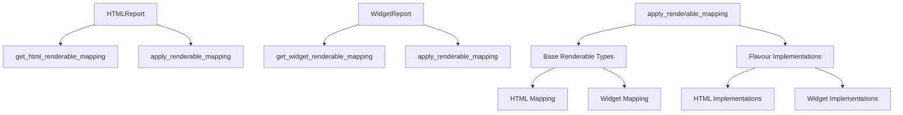

# `src.ydata_profiling.report.presentation.flavours`

## Tree:
```
flavours/
├── html/
├── widget/
└── flavours.py
```

## Role:
Provides core transformation logic for switching between HTML and Widget presentation flavours in data profiling reports.

## Description:
This module implements the presentation flavour switching mechanism that enables the same report structure to be rendered in different formats (HTML, Jupyter widgets). It contains the core logic for converting abstract renderable components into flavour-specific implementations through mapping-based transformations.

The module serves as the bridge between the abstract presentation layer and concrete flavour implementations, allowing the report generation system to produce outputs tailored to different environments (web browsers vs Jupyter notebooks) without duplicating the underlying data model.

## Components:
*   `HTMLReport` - Converts a Root structure to HTML-flavored renderable components by applying an HTML renderable mapping
*   `WidgetReport` - Converts a Root structure to widget-based renderable components for Jupyter notebook presentations  
*   `apply_renderable_mapping` - Generic utility for applying flavour-specific type mappings to convert renderable components
*   `get_html_renderable_mapping` - Creates mapping from core renderable types to their HTML implementation counterparts
*   `get_widget_renderable_mapping` - Creates mapping from core renderable types to their widget implementation counterparts



## Public API:
*   `HTMLReport(structure: Root)` - Converts a Root structure containing base renderable components to their HTML-specific implementations. Modifies the structure in-place and returns it.
*   `WidgetReport(structure: Root)` - Converts a Root structure containing base renderable components to their widget-based implementations for Jupyter notebooks. Modifies the structure in-place and returns it.
*   `apply_renderable_mapping(mapping: Dict[Type[Renderable], Type[Renderable]], structure: Renderable, flavour: Callable)` - Applies a mapping dictionary to convert a renderable structure from one flavour to another by changing the runtime class of components.
*   `get_html_renderable_mapping()` - Returns a dictionary mapping core renderable types to their HTML implementation classes.
*   `get_widget_renderable_mapping()` - Returns a dictionary mapping core renderable types to their widget implementation classes.

## Dependencies:
*   Internal imports:
    *   `ydata_profiling.report.presentation.core` - Base renderable component definitions and abstract interfaces
    *   `ydata_profiling.report.presentation.flavours.html` - HTML-specific renderable implementations
    *   `ydata_profiling.report.presentation.flavours.widget` - Widget-specific renderable implementations
*   External imports:
    *   `typing` - Type hinting support for function signatures and type annotations

## Constraints:
*   All transformations require that the target flavour implementations exist for all renderable types in the structure
*   The mapping functions must return complete dictionaries with all required type mappings
*   Transformations modify the structure in-place, so the original structure is altered
*   Thread safety: Functions are stateless and can be safely used in multi-threaded environments
*   The caller must ensure that the appropriate flavour-specific implementations are available in the respective submodules
*   All renderable components must be of types that exist in the mapping dictionaries

---

## Files

- [`flavours.py`](flavours/flavours.md)

