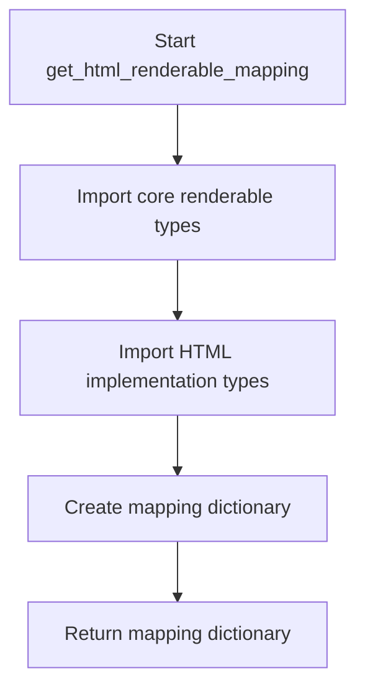
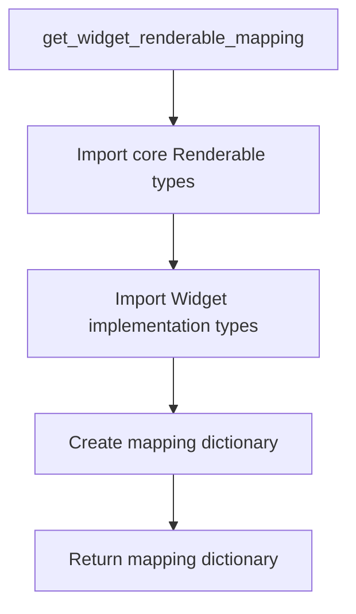

# `flavours.py`

## `src.ydata_profiling.report.presentation.flavours.flavours.apply_renderable_mapping` · *function*

## Summary:
Applies a renderable type mapping to convert a structure from one presentation flavour to another.

## Description:
This function serves as a utility for converting Renderable objects between different presentation flavours (such as HTML and Widget) by applying a pre-defined mapping. It looks up the concrete type of the provided structure in a mapping dictionary and invokes the convert_to_class class method on the corresponding target type, effectively changing the runtime class of the structure to its flavour-specific implementation.

The function is typically used in report generation pipelines where renderable objects need to be transformed from their base representation to a specific presentation format (HTML, Widget, etc.) during the rendering process. This enables polymorphic conversion of renderable objects based on their type and the desired output flavour.

## Args:
    mapping (Dict[Type[Renderable], Type[Renderable]]): A dictionary mapping base Renderable types to their corresponding flavour-specific implementations. Keys are Renderable subclasses, values are their flavour counterparts (e.g., Table -> HTMLTable).
    structure (Renderable): An instance of a Renderable subclass that needs to be converted to a different flavour representation. This object's class will be modified in-place.
    flavour (Callable): A callable parameter (likely representing the target flavour) that is passed to the convert_to_class method during conversion. This parameter is typically used by the flavour-specific implementations.

## Returns:
    None: This function modifies the structure parameter in-place and does not return a value.

## Raises:
    KeyError: If the type of the structure is not found in the mapping dictionary. This occurs when the structure's type is not present as a key in the mapping parameter.

## Constraints:
    Preconditions:
    - The mapping dictionary must contain an entry for the type of the structure parameter
    - The structure parameter must be an instance of a Renderable subclass
    - The mapping dictionary must map to valid Renderable subclasses that have a convert_to_class class method
    - The convert_to_class method must be callable with the structure and flavour parameters

    Postconditions:
    - The structure parameter's class will be changed to the corresponding type in the mapping
    - The structure maintains all its existing attributes and data
    - The structure is now an instance of the mapped flavour-specific type

## Side Effects:
    None: This function only modifies the class of the structure parameter in-place and does not affect external state or I/O resources.

## Control Flow:
```mermaid
flowchart TD
    A[Start apply_renderable_mapping] --> B[Get type(structure)]
    B --> C[Lookup type in mapping]
    C --> D{Type found in mapping?}
    D -->|No| E[KeyError raised]
    D -->|Yes| F[Call mapping[type].convert_to_class(structure, flavour)]
    F --> G[structure class changed to mapping[type]]
    G --> H[End]
```

## Examples:
```python
# Typical usage in a report generation pipeline
from ydata_profiling.report.presentation.flavours.flavours import apply_renderable_mapping
from ydata_profiling.report.presentation.core import Table, Variable
from ydata_profiling.report.presentation.flavours.html import HTMLTable, HTMLVariable

# Create a mapping from base types to HTML implementations
html_mapping = {
    Table: HTMLTable,
    Variable: HTMLVariable
}

# Create a base renderable structure
base_table = Table(rows=[["A", "B"], [1, 2]])

# Apply the mapping to convert to HTML flavour
apply_renderable_mapping(html_mapping, base_table, lambda x: x)  # flavour callable

# The base_table is now an HTMLTable instance with the same content
# but with HTML-specific rendering behavior
```

## `src.ydata_profiling.report.presentation.flavours.flavours.get_html_renderable_mapping` · *function*

## Summary:
Creates a mapping between core renderable types and their HTML implementation counterparts for report generation.

## Description:
This function establishes a registry that maps base renderable component types to their corresponding HTML rendering implementations. It serves as a central configuration point for the HTML presentation flavour, enabling the conversion of abstract renderable components into concrete HTML representations during report generation.

## Args:
    None

## Returns:
    Dict[Type[Renderable], Type[Renderable]]: A dictionary mapping core renderable types to their HTML implementation classes. Each key is a base renderable type from the core presentation module, and each value is the corresponding HTML-specific implementation from the HTML flavour module.

## Raises:
    None

## Constraints:
    Preconditions:
    - All referenced renderable types must be properly imported and defined
    - The HTML implementation classes must exist and be compatible with their core counterparts
    
    Postconditions:
    - Returns a complete mapping dictionary containing all supported renderable types
    - All mappings are valid type-to-type associations

## Side Effects:
    None

## Control Flow:


## Examples:
```python
# Typical usage in HTML presentation system
html_mapping = get_html_renderable_mapping()
# Returns: {Container: HTMLContainer, Variable: HTMLVariable, ...}
```

## `src.ydata_profiling.report.presentation.flavours.flavours.HTMLReport` · *function*

## Summary:
Converts a report structure from its base representation to HTML-flavored renderable components by applying an HTML renderable mapping.

## Description:
The HTMLReport function serves as a transformation utility that converts a Root structure containing base renderable components into their HTML-specific implementations. This function is a key component in the HTML presentation flavour pipeline, enabling the conversion of abstract report structures into concrete HTML-renderable objects that can be processed by HTML rendering engines.

This function is typically called during the report generation process when HTML output is requested, serving as a bridge between the abstract presentation layer and the concrete HTML rendering implementation. It leverages a pre-defined mapping between base renderable types and their HTML counterparts to perform the conversion in-place.

## Args:
    structure (Root): The root structure containing the report components to be converted to HTML presentation format. This parameter represents the complete report structure that needs to be transformed for HTML rendering.

## Returns:
    Root: The same structure object, but with all contained renderable components converted to their HTML-specific implementations. The returned object is identical to the input structure but with modified component types.

## Raises:
    KeyError: If any component type in the structure is not found in the HTML renderable mapping dictionary. This occurs when a renderable type in the structure does not have a corresponding HTML implementation registered in the mapping.

## Constraints:
    Preconditions:
    - The structure parameter must be an instance of Root or its subclass
    - All components within the structure must be of types that exist in the HTML renderable mapping
    - The get_html_renderable_mapping() function must return a valid mapping dictionary
    
    Postconditions:
    - The structure object is modified in-place to contain HTML-specific renderable components
    - All components in the structure are converted to their HTML flavour equivalents
    - The returned structure maintains the same hierarchical organization as the input

## Side Effects:
    None: This function only modifies the class types of components within the structure parameter in-place and does not affect external state or I/O resources.

## Control Flow:
```mermaid
flowchart TD
    A[HTMLReport(structure)] --> B[get_html_renderable_mapping()]
    B --> C[Apply mapping to structure components]
    C --> D[apply_renderable_mapping(mapping, structure, HTMLReport)]
    D --> E[Structure components converted to HTML types]
    E --> F[Return structure]
```

## Examples:
```python
# Typical usage in report generation pipeline
from ydata_profiling.report.presentation.flavours.flavours import HTMLReport
from ydata_profiling.report.presentation.core import Root

# Create a report structure with base renderable components
report_structure = Root(content={...})

# Convert to HTML presentation flavour
html_report = HTMLReport(report_structure)

# The html_report now contains HTML-specific renderable components
# that can be rendered to HTML using appropriate rendering engines
```

## `src.ydata_profiling.report.presentation.flavours.flavours.get_widget_renderable_mapping` · *function*

## Summary:
Creates a mapping from core Renderable types to their widget implementation counterparts for presentation rendering.

## Description:
This function establishes a registry that maps abstract core renderable types to their concrete widget-based implementations. It serves as a central configuration point for the widget flavour presentation system, enabling dynamic selection of appropriate widget classes based on renderable type. The mapping is used by the widget presentation layer to determine which concrete widget class should be instantiated when rendering a particular type of content.

## Args:
    None

## Returns:
    Dict[Type[Renderable], Type[Renderable]]: A dictionary mapping core Renderable types to their corresponding Widget implementation types. Each key-value pair represents a type relationship where the key is a core renderable type and the value is the widget variant that should be used for rendering.

## Raises:
    None

## Constraints:
    Preconditions:
    - All referenced core Renderable types must be properly imported and defined
    - All widget implementation types must be properly imported and defined
    - The function assumes all core types have corresponding widget implementations
    
    Postconditions:
    - Returns a dictionary with exactly 13 key-value pairs
    - All keys are valid Renderable type classes
    - All values are valid Widget subclass types

## Side Effects:
    None

## Control Flow:


## Examples:
```python
# Typical usage in widget presentation system
mapping = get_widget_renderable_mapping()
widget_class = mapping[Container]  # Returns WidgetContainer
```

## `src.ydata_profiling.report.presentation.flavours.flavours.WidgetReport` · *function*

## Summary:
Converts a renderable structure to use widget-based implementations for Jupyter notebook presentations.

## Description:
The WidgetReport function transforms a Root renderable structure by applying a mapping that converts core Renderable types to their corresponding widget-based implementations. This enables the structure to be rendered using ipywidgets in Jupyter notebook environments rather than HTML. The function serves as a key component in the widget presentation flavour pipeline, bridging the gap between abstract renderable objects and concrete widget implementations.

This logic is extracted into its own function rather than being inlined because it encapsulates the entire transformation process from base renderable types to widget-specific implementations, providing a clean separation between the structure definition and its presentation flavour conversion.

## Args:
    structure (Root): The root renderable structure that needs to be converted to widget-based representations. This is typically a hierarchical structure containing various renderable components like containers, tables, alerts, etc.

## Returns:
    Root: The same structure object, but with all its constituent renderable components converted to their widget-based equivalents. The structure is modified in-place and returned for chaining purposes.

## Raises:
    KeyError: If any component type in the structure is not found in the widget renderable mapping. This occurs when a renderable type in the structure does not have a corresponding widget implementation registered in the mapping.

## Constraints:
    Preconditions:
    - The structure parameter must be an instance of Root or a subclass thereof
    - All renderable components within the structure must have corresponding widget implementations in the mapping
    - The get_widget_renderable_mapping() function must return a valid mapping dictionary
    
    Postconditions:
    - The structure parameter's renderable components are converted to their widget-based equivalents
    - The structure maintains all its original data and hierarchy
    - The returned structure is identical to the input structure but with updated component types

## Side Effects:
    None: This function only modifies the class types of renderable components within the structure in-place and does not affect external state or I/O resources.

## Control Flow:
```mermaid
flowchart TD
    A[WidgetReport(structure)] --> B[get_widget_renderable_mapping()]
    B --> C[Apply mapping to structure components]
    C --> D[apply_renderable_mapping(mapping, structure, WidgetReport)]
    D --> E[Return structure]
```

## Examples:
```python
# Basic usage in a widget-based report generation pipeline
from ydata_profiling.report.presentation.flavours.flavours import WidgetReport
from ydata_profiling.report.presentation.core import Root

# Create a root structure (typically built by report generation)
root_structure = Root()

# Convert to widget-based representations
widget_root = WidgetReport(root_structure)

# The widget_root now contains all components converted to widget implementations
# ready for rendering in Jupyter notebooks
```

