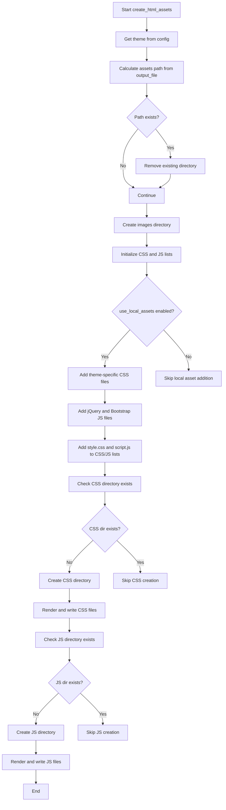

# `templates.py`

## `src.ydata_profiling.report.presentation.flavours.html.templates.template` · *function*

## Summary:
Retrieves a Jinja2 template from the global template environment by name.

## Description:
This function serves as a centralized accessor for HTML templates used in report generation. It provides a clean interface to fetch templates from the global Jinja2 environment, abstracting away the direct access to the template engine.

## Args:
    template_name (str): The name of the template to retrieve from the Jinja2 environment.

## Returns:
    jinja2.Template: A Jinja2 template object that can be rendered with context data.

## Raises:
    jinja2.TemplateNotFound: When the specified template name does not exist in the Jinja2 environment.

## Constraints:
    Preconditions:
        - The global `jinja2_env` must be properly initialized before calling this function
        - The `template_name` must correspond to an existing template in the environment
    
    Postconditions:
        - Returns a valid Jinja2 Template object
        - Does not modify any global state

## Side Effects:
    None - This function is pure and has no side effects beyond accessing the global template environment.

## Control Flow:
```mermaid
flowchart TD
    A[Call template()] --> B{template_name exists?}
    B -- Yes --> C[Return jinja2.Template]
    B -- No --> D[Throw jinja2.TemplateNotFound]
```

## `src.ydata_profiling.report.presentation.flavours.html.templates.create_html_assets` · *function*

## Summary:
Creates and organizes HTML assets including CSS and JavaScript files for report generation.

## Description:
This function prepares the necessary static assets (CSS and JavaScript files) for HTML report generation by either copying local assets or rendering template-based assets to disk. It handles directory setup, asset cleanup, and conditional inclusion of theme-specific resources based on configuration settings.

The function is extracted into its own component to separate asset preparation logic from report generation, enabling cleaner code organization and easier testing of asset handling independently from the main reporting pipeline.

## Args:
    config (Settings): Configuration object containing HTML report settings including asset paths, theme preferences, and local asset usage flags.
    output_file (Path): The path to the output file that determines the base directory for asset placement.

## Returns:
    None: This function performs file system operations and returns no value.

## Raises:
    jinja2.TemplateNotFound: When a requested template file cannot be found in the Jinja2 environment.
    OSError: When file system operations fail due to permission issues or invalid paths.
    IOError: When file read/write operations encounter errors.

## Constraints:
    Preconditions:
        - The config parameter must be a valid Settings object with properly initialized HTML configuration
        - The output_file parameter must be a valid pathlib.Path object
        - The global jinja2_env must be properly initialized for template rendering
        
    Postconditions:
        - Asset directories (css, js, images) are created under the configured assets_prefix path
        - CSS and JavaScript files are written to their respective directories
        - Theme-specific CSS files are included when a theme is specified
        - Local assets are only copied when config.html.use_local_assets is True

## Side Effects:
    - Creates directories on the file system (css, js, images folders)
    - Writes files to the file system (CSS and JS assets)
    - Removes existing asset directories if they already exist (via shutil.rmtree)
    - Modifies the file system state by creating new asset files

## Control Flow:


## Examples:
```python
from pathlib import Path
from ydata_profiling.config import Settings, Html, Style, Theme

# Basic usage with default configuration
config = Settings()
output_file = Path("report.html")
create_html_assets(config, output_file)

# Usage with custom theme and local assets disabled
config = Settings(
    html=Html(
        use_local_assets=False, 
        style=Style(theme=Theme.flatly)
    )
)
output_file = Path("custom_report.html")
create_html_assets(config, output_file)

# Usage with custom assets prefix
config = Settings(
    html=Html(
        assets_prefix="my_assets/",
        use_local_assets=True
    )
)
output_file = Path("report.html")
create_html_assets(config, output_file)
```

