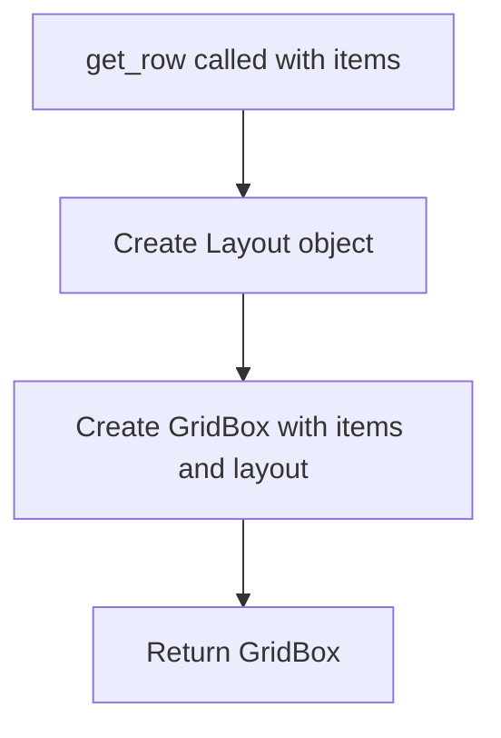

# `alerts.py`

## `src.ydata_profiling.report.presentation.flavours.widget.alerts.get_row` · *function*

## Summary:
Creates a GridBox widget with a 75%/25% column layout from a list of widgets.

## Description:
This function encapsulates the creation of a GridBox widget with a predefined layout configuration suitable for displaying alert items in a two-column format. It's designed to standardize the presentation of alert information in the widget-based report interface.

## Args:
    items (List[widgets.Widget]): A list of ipywidgets.Widget objects to be arranged in the grid box.

## Returns:
    widgets.GridBox: A GridBox widget instance configured with width="100%" and grid_template_columns="75% 25%".

## Raises:
    None explicitly raised.

## Constraints:
    Preconditions:
    - The items parameter must be a list of ipywidgets.Widget objects
    - Each item in the list must be a valid widget instance
    
    Postconditions:
    - Returns a GridBox widget with the specified layout configuration
    - The returned widget maintains the order of items as provided in the input list

## Side Effects:
    None.

## Control Flow:


## Examples:
```python
from ipywidgets import HTML, Button
from ydata_profiling.report.presentation.flavours.widget.alerts import get_row

# Create widgets
html_widget = HTML("Alert message")
button_widget = Button(description="Dismiss")

# Create row with widgets
row = get_row([html_widget, button_widget])
```

## `src.ydata_profiling.report.presentation.flavours.widget.alerts.WidgetAlerts` · *class*

## Summary:
WidgetAlerts renders data quality alerts as interactive ipywidgets in a grid layout, providing visual indicators and descriptive buttons for each alert type.

## Description:
The WidgetAlerts class is a concrete implementation of the Alerts base class designed specifically for rendering data quality alerts in Jupyter notebook environments using ipywidgets. It transforms alert data into a visually organized grid of HTML content and disabled buttons, where each alert is displayed with appropriate styling based on its severity level.

This class is typically instantiated by the report generation pipeline when creating widget-based visualizations for data profiling reports. It leverages the ipywidgets library to create interactive UI elements that help users quickly identify and understand various data quality issues detected during profiling.

## State:
- content: dict, inherited from Alerts parent class, containing the "alerts" key with a list of alert objects to be rendered
- self.content["alerts"]: List[Alert], the collection of alert objects to display, where each alert has an alert_type.name attribute
- styles: dict, maps alert type names to CSS button styles ("warning", "danger", "info", or empty string)
- items: list, accumulates HTML and Button widgets for each processed alert

## Lifecycle:
- Creation: Instantiated with alert data and styling configuration via the parent Alerts constructor
- Usage: Called by the report generation system when rendering widget-based alerts, typically through the render() method
- Destruction: Managed automatically by Python's garbage collection

## Method Map:
```mermaid
graph TD
    A[WidgetAlerts.render] --> B[Initialize styles dict]
    B --> C[Iterate over self.content['alerts']]
    C --> D{alert_type != "rejected"?}
    D -->|Yes| E[Create HTML widget from template]
    E --> F[Create styled Button widget]
    F --> G[Append both to items list]
    D -->|No| H[Skip alert]
    C --> I[Call get_row(items)]
    I --> J[Return widgets.GridBox]
```

## Raises:
- None explicitly raised by WidgetAlerts.render() method
- However, underlying exceptions may occur from:
  - Template rendering failures when accessing templates.template()
  - Widget creation errors from ipywidgets.Button or HTML constructors
  - Invalid alert objects that don't have expected attributes

## Example:
```python
from ydata_profiling.report.presentation.flavours.widget.alerts import WidgetAlerts
from ipywidgets import widgets

# Create alert data (simplified example)
alerts_data = {
    "alerts": [
        # Alert objects with alert_type.name attributes
    ]
}

# Create WidgetAlerts instance
widget_alerts = WidgetAlerts(alerts_data)

# Render the alerts as widgets
grid_box = widget_alerts.render()

# The result is a widgets.GridBox containing HTML and Button widgets
```

### `src.ydata_profiling.report.presentation.flavours.widget.alerts.WidgetAlerts.render` · *method*

*No documentation generated.*

