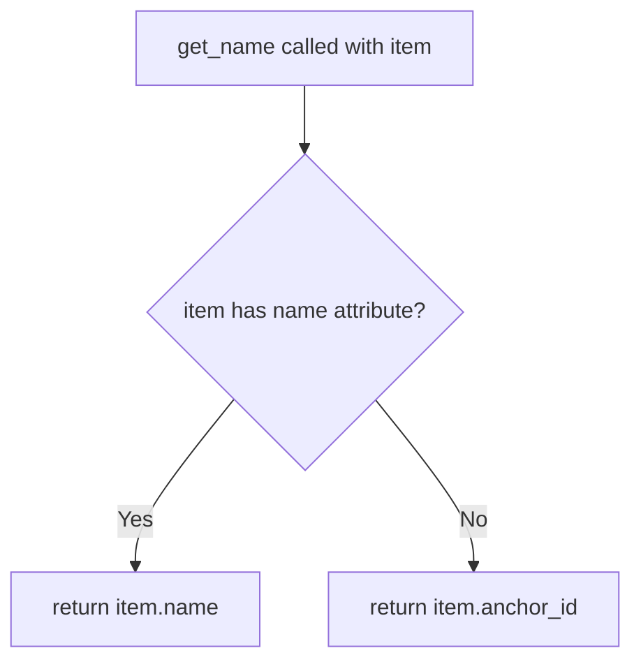
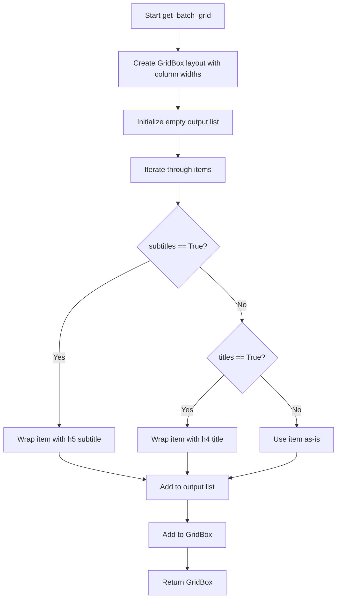

# `container.py`

## `src.ydata_profiling.report.presentation.flavours.widget.container.get_name` · *function*

## Summary:
Retrieves a human-readable identifier from a renderable object by prioritizing the 'name' attribute over the 'anchor_id' attribute.

## Description:
This utility function extracts a display name from renderable objects in the reporting system. It follows a priority order: first checking for a 'name' attribute, and falling back to the 'anchor_id' attribute if 'name' is not available. This approach ensures consistent identification of renderable components regardless of their specific implementation details.

The function is designed to handle different types of renderable objects that may or may not have a 'name' attribute, providing a unified way to obtain identifying information for UI elements in widget-based presentations.

## Args:
    item (Renderable): A renderable object that may have either a 'name' or 'anchor_id' attribute

## Returns:
    str: The value of the 'name' attribute if present, otherwise the value of the 'anchor_id' attribute

## Raises:
    None explicitly raised

## Constraints:
    Preconditions:
    - The input must be a Renderable object (or object with the required attributes)
    - The object must have either a 'name' attribute or an 'anchor_id' attribute
    
    Postconditions:
    - Returns a string value representing the identifier
    - The returned string is either the name or anchor_id of the item

## Side Effects:
    None

## Control Flow:


## Examples:
```python
# Example 1: Item with name attribute
renderable_with_name = SomeRenderableClass(name="my_section", anchor_id="sec123")
name = get_name(renderable_with_name)  # Returns "my_section"

# Example 2: Item with anchor_id but no name attribute  
renderable_without_name = SomeRenderableClass(anchor_id="sec456")
name = get_name(renderable_without_name)  # Returns "sec456"
```

## `src.ydata_profiling.report.presentation.flavours.widget.container.get_tabs` · *function*

## Summary:
Creates an interactive tab widget from a list of renderable items, mapping each item to a tab with its associated title.

## Description:
This function transforms a list of renderable objects into a Jupyter widgets Tab container. Each renderable item is rendered to produce its visual representation, and a corresponding tab title is derived from the item's metadata. The resulting tab widget allows users to navigate between different rendered content sections.

The function is extracted into its own component to encapsulate the logic for creating tabbed interfaces in widget-based presentations, separating concerns between data preparation and UI construction.

## Args:
    items (List[Renderable]): A list of renderable objects that will become individual tabs in the resulting widget

## Returns:
    widgets.Tab: A configured ipywidgets.Tab instance containing all the rendered items as children with appropriate titles

## Raises:
    None explicitly raised

## Constraints:
    Preconditions:
    - All items in the input list must be Renderable objects
    - Each Renderable item must have either a 'name' or 'anchor_id' attribute (required by get_name function)
    
    Postconditions:
    - The returned Tab widget has the same number of children as input items
    - Each child in the tab widget corresponds to a rendered version of the input items
    - Each tab has a title derived from the respective item's metadata

## Side Effects:
    None

## Control Flow:
```mermaid
flowchart TD
    A[get_tabs called with items] --> B{items empty?}
    B -->|Yes| C[Create empty Tab]
    B -->|No| D[Initialize children and titles lists]
    D --> E[For each item in items]
    E --> F[item.render() → children]
    F --> G[get_name(item) → titles]
    G --> H[Create widgets.Tab()]
    H --> I[tab.children = children]
    I --> J[Set titles using tab.set_title()]
    J --> K[Return tab]
```

## Examples:
```python
# Basic usage with multiple renderable items
from ydata_profiling.report.presentation.core.renderable import Renderable
from ydata_profiling.report.presentation.flavours.widget.container import get_tabs

# Create sample renderable items
item1 = Renderable({"title": "Summary"}, name="summary")
item2 = Renderable({"title": "Details"}, name="details")

# Create tabbed interface
tabs_widget = get_tabs([item1, item2])
```

## `src.ydata_profiling.report.presentation.flavours.widget.container.get_list` · *function*

## Summary:
Creates a vertical box widget containing rendered representations of a list of renderable components.

## Description:
This function transforms a list of renderable components into a vertical box layout by rendering each item and placing them in a widgets.VBox container. It serves as a utility for constructing widget-based presentations in the ydata-profiling report generation system.

The function is specifically designed for the widget presentation flavour, where UI components need to be organized vertically in a container. It abstracts the common pattern of taking renderable items and converting them to their widget representation in a vertical layout.

## Args:
    items (List[Renderable]): A list of renderable components that support the render() method. Each item must be an instance of a class that inherits from Renderable.

## Returns:
    widgets.VBox: A vertical box widget containing the rendered representations of all input items, arranged vertically in order.

## Raises:
    None explicitly raised - however, any exceptions from individual item.render() calls will propagate up.

## Constraints:
    Preconditions:
    - All items in the input list must be instances of Renderable or classes that inherit from Renderable
    - Each item must implement a valid render() method that returns a widget-compatible object
    
    Postconditions:
    - The returned widgets.VBox will contain exactly one child widget for each input renderable item
    - The order of items in the VBox matches the order in the input list

## Side Effects:
    None - This function is pure and doesn't modify external state or perform I/O operations.

## Control Flow:
```mermaid
flowchart TD
    A[get_list called with items] --> B{items list empty?}
    B -- Yes --> C[Return empty VBox]
    B -- No --> D[Iterate through items]
    D --> E[Call item.render() for each item]
    E --> F[Collect rendered widgets]
    F --> G[Create widgets.VBox with rendered items]
    G --> H[Return VBox]
```

## Examples:
```python
# Basic usage with multiple renderable items
from ydata_profiling.report.presentation.core.renderable import Renderable
from ydata_profiling.report.presentation.flavours.widget.container import get_list

# Assuming we have renderable components
renderable_items = [header_component, table_component, chart_component]
widget_container = get_list(renderable_items)

# Usage in a larger widget hierarchy
from ipywidgets import VBox
container_widget = VBox([
    title_widget,
    get_list([summary_component, stats_component]),
    footer_widget
])
```

## `src.ydata_profiling.report.presentation.flavours.widget.container.get_named_list` · *function*

## Summary:
Creates a vertically stacked widget container displaying a list of renderable items with their associated names in a widget-based reporting interface.

## Description:
Generates a widgets.VBox layout that organizes a sequence of renderable objects by displaying each item's name (extracted via the get_name helper function) followed by the rendered content of that item. This function is specifically designed for widget-based presentation systems where renderable components need to be displayed with descriptive labels.

The function encapsulates the common pattern of creating labeled lists of UI components, separating concerns between name extraction and UI layout construction. This design promotes code reuse and maintains consistency in how named renderable items are displayed across the widget presentation system, particularly within the container hierarchy of the reporting framework.

## Args:
    items (List[Renderable]): A list of renderable objects that will be displayed with their respective names. Each item must be a Renderable instance with either a 'name' attribute or an 'anchor_id' attribute.

## Returns:
    widgets.VBox: A vertical box container widget containing the named renderable items, where each item is displayed with its name in bold followed by the rendered content. The order of items in the returned container matches the order of items in the input list.

## Raises:
    None explicitly raised

## Constraints:
    Preconditions:
    - All items in the input list must be Renderable objects
    - Each Renderable object must have either a 'name' attribute or an 'anchor_id' attribute (required by get_name helper function)
    
    Postconditions:
    - Returns a widgets.VBox instance
    - Each item in the input list appears exactly once in the output container
    - The returned container displays items in the same order as the input list

## Side Effects:
    None

## Control Flow:
```mermaid
flowchart TD
    A[get_named_list called with items] --> B[For each item in items]
    B --> C{item has name/anchor_id?}
    C --> D[get_name(item) to extract label]
    D --> E[item.render() to get content]
    E --> F[Create VBox with label and content]
    F --> G[Add VBox to result VBox]
    G --> H[Return final VBox]
```

## Examples:
```python
# Basic usage with renderable items in widget-based reporting
from ydata_profiling.report.presentation.core.renderable import Renderable
from ydata_profiling.report.presentation.flavours.widget.container import get_named_list
from ipywidgets import widgets

# Create sample renderable items with names
item1 = Renderable({"title": "Section 1"}, name="Introduction")
item2 = Renderable({"title": "Section 2"}, anchor_id="section2")

# Generate named list for widget display
named_list = get_named_list([item1, item2])
# Returns a VBox containing two VBox children:
# - First VBox with "<strong>Introduction</strong>" and rendered content
# - Second VBox with "<strong>section2</strong>" and rendered content

# Typical usage in a container context
from ydata_profiling.report.presentation.core.container import Container

# Create a container that holds named items
container_items = [item1, item2]
container = Container(items=container_items, sequence_type="list")
# The container's render method would internally use get_named_list for widget presentation
```

## `src.ydata_profiling.report.presentation.flavours.widget.container.get_row` · *function*

## Summary:
Creates a grid layout widget containing rendered renderable items with responsive column sizing.

## Description:
Generates a widgets.GridBox instance with appropriate CSS grid template columns based on the number of renderable items provided. This function abstracts the complexity of creating different grid layouts for varying numbers of columns, making it easier to construct consistent row layouts in widget-based report presentations.

## Args:
    items (List[Renderable]): A list of renderable objects to display in the grid layout. Must contain between 1 and 4 items inclusive.

## Returns:
    widgets.GridBox: A grid box widget containing the rendered items arranged in a responsive grid layout.

## Raises:
    ValueError: When the number of items is not between 1 and 4 inclusive, indicating that the layout is undefined for this number of columns.

## Constraints:
    Preconditions:
        - Items list must contain Renderable objects
        - Items list length must be between 1 and 4 inclusive
    Postconditions:
        - Returns a valid widgets.GridBox instance
        - All items in the input list are rendered and contained in the returned GridBox

## Side Effects:
    None

## Control Flow:
```mermaid
flowchart TD
    A[get_row called with items] --> B{len(items) == 1?}
    B -- Yes --> C[Set layout 100% width, 100% column]
    B -- No --> D{len(items) == 2?}
    D -- Yes --> E[Set layout 100% width, 50% 50% columns]
    D -- No --> F{len(items) == 3?}
    F -- Yes --> G[Set layout 100% width, 25% 25% 50% columns]
    F -- No --> H{len(items) == 4?}
    H -- Yes --> I[Set layout 100% width, 25% 25% 25% 25% columns]
    H -- No --> J[Raise ValueError]
    C --> K[Return GridBox]
    E --> K
    G --> K
    I --> K
    J --> K
```

## Examples:
```python
# Create a single item row
items = [renderable1]
grid_box = get_row(items)

# Create a two-item row
items = [renderable1, renderable2]
grid_box = get_row(items)

# Create a four-item row
items = [renderable1, renderable2, renderable3, renderable4]
grid_box = get_row(items)

# This would raise ValueError
items = [renderable1, renderable2, renderable3, renderable4, renderable5]
# get_row(items)  # Would raise ValueError
```

## `src.ydata_profiling.report.presentation.flavours.widget.container.get_batch_grid` · *function*

## Summary:
Creates a widget-based grid layout for displaying batches of renderable items with optional title/subtitle formatting.

## Description:
The `get_batch_grid` function generates a responsive grid layout using ipywidgets' GridBox to organize renderable items in a specified batch configuration. It dynamically constructs column widths based on batch size and applies conditional formatting to items based on whether titles or subtitles should be displayed.

This function is typically called when rendering report sections that need to display multiple components in a grid format, such as dashboard widgets or multi-panel visualizations. The function extracts presentation logic for grid creation and item formatting into a reusable component, separating layout concerns from content rendering logic.

## Args:
- items (List[Renderable]): A list of renderable components to be displayed in the grid
- batch_size (int): Number of columns in the resulting grid layout (must be positive)
- titles (bool): Flag indicating whether to wrap each item with a title header (h4)
- subtitles (bool): Flag indicating whether to wrap each item with a subtitle header (h5)

## Returns:
- widgets.GridBox: A grid layout containing the formatted renderable items arranged in the specified batch configuration

## Raises:
- None explicitly raised by this function

## Constraints:
- Preconditions: 
  - `batch_size` must be a positive integer
  - `items` must be a list of objects implementing the Renderable interface
  - The function handles the case where both `titles` and `subtitles` are True by prioritizing subtitles over titles
- Postconditions:
  - Returns a valid widgets.GridBox instance
  - All items in the input list are rendered and included in the output grid

## Side Effects:
- None

## Control Flow:


## Examples:
```python
# Basic usage with no titles or subtitles
items = [chart1, table1, text1]
grid = get_batch_grid(items, batch_size=3, titles=False, subtitles=False)

# Usage with subtitles (titles ignored when subtitles=True)
items = [chart1, table1, text1]
grid = get_batch_grid(items, batch_size=2, titles=False, subtitles=True)

# Usage with titles
items = [chart1, table1, text1]
grid = get_batch_grid(items, batch_size=2, titles=True, subtitles=False)
```

## `src.ydata_profiling.report.presentation.flavours.widget.container.get_accordion` · *function*

## Summary:
Creates an interactive accordion widget from a list of renderable items, where each item becomes a collapsible panel with a title.

## Description:
This function transforms a list of renderable objects into an interactive ipywidgets.Accordion component. Each renderable item is rendered to generate its content, and a title is extracted using the get_name utility function to label each accordion panel. This provides a user-friendly way to organize and display multiple report components in a compact, expandable interface.

The function encapsulates the common pattern of converting renderable items into accordion panels, separating the concerns of content rendering from UI widget construction. This extraction allows for consistent accordion creation across different presentation contexts while keeping the widget-specific logic isolated.

## Args:
    items (List[Renderable]): A list of renderable objects that will become the panels of the accordion. Each item must be a Renderable instance with a render() method and either a 'name' or 'anchor_id' attribute.

## Returns:
    widgets.Accordion: An ipywidgets.Accordion instance containing the rendered content of each item as separate panels, with titles derived from the items' identifiers.

## Raises:
    None explicitly raised

## Constraints:
    Preconditions:
    - The input list must contain only Renderable objects
    - Each Renderable object must have either a 'name' attribute or an 'anchor_id' attribute (required by get_name function)
    - The items list may be empty, in which case an empty accordion is returned
    
    Postconditions:
    - Returns a valid widgets.Accordion instance
    - Each panel in the accordion corresponds to one item in the input list
    - Panel titles are set according to the get_name function's logic

## Side Effects:
    None

## Control Flow:
```mermaid
flowchart TD
    A[get_accordion called with items] --> B{items empty?}
    B -->|Yes| C[Create empty Accordion]
    B -->|No| D[Initialize children and titles lists]
    D --> E[For each item in items]
    E --> F[item.render() → children]
    F --> G[get_name(item) → titles]
    G --> H[Create Accordion with children]
    H --> I[Set titles for each panel]
    I --> J[Return accordion]
```

## Examples:
```python
# Basic usage with multiple renderable items
from ydata_profiling.report.presentation.core.renderable import Renderable
from ydata_profiling.report.presentation.flavours.widget.container import get_accordion

# Create some sample renderable items
items = [
    Renderable({"title": "Section 1", "content": "Data for section 1"}, name="section_1"),
    Renderable({"title": "Section 2", "content": "Data for section 2"}, name="section_2")
]

# Create accordion widget
accordion = get_accordion(items)
# Returns an ipywidgets.Accordion with two panels titled "section_1" and "section_2"
```

## `src.ydata_profiling.report.presentation.flavours.widget.container.WidgetContainer` · *class*

*No documentation generated.*

### `src.ydata_profiling.report.presentation.flavours.widget.container.WidgetContainer.render` · *method*

## Summary:
Renders the container content as a specific widget type based on the sequence type configuration.

## Description:
Transforms the container's content into a specific ipywidgets.Widget instance based on the configured sequence type. This method serves as the primary rendering entry point for WidgetContainer objects, delegating to specialized helper functions that create appropriate widget layouts for different presentation needs.

The method is called during the report generation pipeline when widget-based visualization is required, typically in Jupyter notebook environments where interactive widgets are displayed. It maps different sequence types to their corresponding widget constructors to maintain consistent presentation patterns across the profiling report interface.

## Args:
    None - This is an instance method that operates on self, which must be a WidgetContainer instance with properly initialized sequence_type and content attributes

## Returns:
    widgets.Widget: A rendered widget instance containing the container's content arranged according to the sequence type specification. The specific widget type depends on the sequence_type:
    - widgets.VBox for "list" and "named_list" 
    - widgets.Tab for "tabs", "sections", and "select"
    - widgets.Accordion for "accordion"
    - widgets.GridBox for "grid" and "batch_grid"

## Raises:
    ValueError: When the sequence_type is not recognized or supported, with error message including the unrecognized sequence type

## State Changes:
    Attributes READ: 
    - self.sequence_type: Determines which widget rendering path to take
    - self.content: Provides the items and configuration parameters for widget construction
    
    Attributes WRITTEN: None

## Constraints:
    Preconditions:
    - self.sequence_type must be one of the supported types: "list", "named_list", "tabs", "sections", "select", "accordion", "grid", "batch_grid"
    - self.content must be a dictionary containing the required keys for the selected sequence type:
      * For "list" and "named_list": "items" key with list of Renderable objects
      * For "tabs", "sections", "select", "accordion": "items" key with list of Renderable objects  
      * For "grid": "items" key with list of Renderable objects (1-4 items)
      * For "batch_grid": "items", "batch_size" keys with list of Renderable objects and positive integer batch_size
    - All items in content["items"] must be Renderable instances

    Postconditions:
    - Returns a valid widgets.Widget instance
    - The returned widget contains all items from self.content["items"] arranged according to the sequence type

## Side Effects:
    None - This method is pure and doesn't perform I/O operations or modify external state

