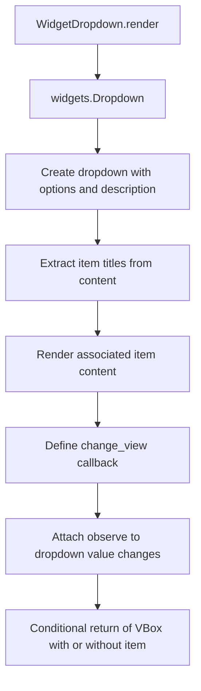

# `dropdown.py`

## `src.ydata_profiling.report.presentation.flavours.widget.dropdown.WidgetDropdown` · *class*

## Summary:
WidgetDropdown is a concrete implementation of the Dropdown class that renders an interactive dropdown widget using ipywidgets, allowing users to select from a list of options to view associated content.

## Description:
WidgetDropdown creates an interactive dropdown UI element that displays a selectable menu with associated content. It inherits from the abstract Dropdown class and implements the render() method to produce a widget-based dropdown using the ipywidgets library. This component is used in report generation systems to provide collapsible or selectable content sections in interactive environments like Jupyter notebooks.

The dropdown allows users to choose from predefined options, and when an option is selected, it dynamically updates an associated content area. This is particularly useful for creating hierarchical or categorized report views where content can be expanded or collapsed based on user selection.

## State:
- content: dict - Dictionary containing dropdown configuration with keys:
  - "items": list of strings representing available dropdown options
  - "name": string describing the dropdown title/description
  - "item": Container object containing associated content to display when an option is selected
- The class inherits all standard Renderable attributes through its inheritance chain

## Lifecycle:
- Creation: Instantiate with a content dictionary containing "items", "name", and optionally "item" keys
- Usage: Call render() method to generate the ipywidgets.VBox containing the dropdown and associated content
- Destruction: Relies on Python garbage collection; no explicit cleanup required

## Method Map:


## Raises:
- None explicitly raised by __init__
- The render() method may raise exceptions from ipywidgets operations if invalid parameters are provided

## Example:
```python
# Create a dropdown with associated content
from ydata_profiling.report.presentation.core import Container
from ydata_profiling.report.presentation.flavours.widget.dropdown import WidgetDropdown

# Create associated content container
content_items = [text_component1, text_component2]
content_container = Container(items=content_items, sequence_type="list")

# Create dropdown with options and associated content
dropdown_content = {
    "items": ["Summary", "Details", "Analysis"],
    "name": "Report Sections",
    "item": content_container
}

dropdown_widget = WidgetDropdown(content=dropdown_content)
widget_box = dropdown_widget.render()  # Returns widgets.VBox
```

### `src.ydata_profiling.report.presentation.flavours.widget.dropdown.WidgetDropdown.render` · *method*

## Summary:
Creates an interactive dropdown widget that dynamically displays associated content when selections are made.

## Description:
The render method generates a Jupyter-compatible dropdown widget that enables users to select from predefined options. When a selection is made, it automatically updates the associated content component to display the corresponding item. This method is specifically designed for widget-based report generation in Jupyter environments.

This method exists to provide an interactive user experience in generated reports, allowing users to navigate between different content sections without requiring separate navigation controls. It's particularly useful for creating collapsible or switchable content areas in data analysis reports.

## Args:
    None

## Returns:
    widgets.VBox: A vertical box container holding the dropdown widget and its associated content, or just the dropdown if no content is specified. The returned widget integrates seamlessly with Jupyter notebook environments.

## Raises:
    None explicitly raised

## State Changes:
    Attributes READ: 
    - self.content["items"]: List of selectable options for the dropdown
    - self.content["name"]: String label/title for the dropdown
    - self.content["item"]: Associated content container (can be None)
    
    Attributes WRITTEN:
    - item.selected_index: Modified in the change_view callback to reflect dropdown selection

## Constraints:
    Preconditions:
    - self.content["items"] must be a list of selectable options that can be displayed in a dropdown
    - self.content["name"] must be a string for the dropdown label
    - self.content["item"] must either be None or a valid Container instance with content that has a render() method
    - The associated content items must have a .name attribute for proper mapping
    
    Postconditions:
    - Returns a widgets.VBox containing the dropdown and optionally its associated content
    - The dropdown widget is properly initialized with options and description
    - Event observer is attached to handle selection changes
    - The change_view callback correctly maps dropdown selections to content indices

## Side Effects:
    - Creates ipywidgets.Dropdown and widgets.VBox instances
    - Attaches event observers to the dropdown widget via the observe() method
    - Modifies the selected_index attribute of the associated content component when a selection is made
    - Triggers UI updates in Jupyter notebook environments when selections change

