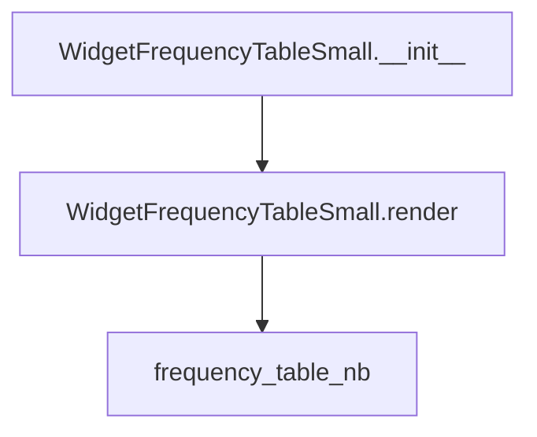

# `frequency_table_small.py`

## `src.ydata_profiling.report.presentation.flavours.widget.frequency_table_small.WidgetFrequencyTableSmall` · *class*

## Summary:
WidgetFrequencyTableSmall is a specialized renderer that displays small frequency tables using ipywidgets in Jupyter environments.

## Description:
This class implements the widget-based presentation flavor for frequency tables in data profiling reports. It inherits from FrequencyTableSmall and provides a concrete implementation of the render method that generates interactive ipywidgets for visualizing frequency distributions. The component is designed to work within Jupyter notebooks and provides a user-friendly interface for viewing categorical data frequency distributions.

The class serves as a bridge between the abstract frequency table representation and its concrete widget-based visualization, making it suitable for interactive data exploration in notebook environments.

## State:
- Inherits all attributes from FrequencyTableSmall parent class including:
  - rows: List[Any] - A list containing frequency data rows, typically tuples or dictionaries representing category-frequency pairs
  - redact: bool - A flag indicating whether sensitive data should be redacted from the display
  - item_type: str - Set to "frequency_table_small" by constructor
  - content: dict - Dictionary containing the configuration parameters (rows and redact) passed to the parent Renderable class

## Lifecycle:
- Creation: Instantiate with rows (list of frequency data) and redact (boolean flag) parameters, similar to the parent class
- Usage: Called by report generation systems that require widget-based frequency table rendering. The render() method is invoked to generate the actual ipywidgets display output
- Destruction: No explicit cleanup required; relies on Python garbage collection

## Method Map:


## Raises:
- KeyError: If any dictionary in self.content["rows"] lacks required keys ('count', 'n', 'label', 'extra_class') when frequency_table_nb is called
- TypeError: If any value in the dictionaries is incompatible with widgets.FloatProgress constructor when frequency_table_nb is called

## Example:
```python
# Create a frequency table with sample data
rows = [[
    {"count": 10, "n": 100, "label": "Category A", "extra_class": "missing"},
    {"count": 25, "n": 100, "label": "Category B", "extra_class": "other"},
    {"count": 65, "n": 100, "label": "Category C", "extra_class": ""}
]]
table = WidgetFrequencyTableSmall(rows=rows, redact=False)

# Render the widget for display in Jupyter
widget = table.render()  # Returns widgets.VBox with interactive progress bars
```

### `src.ydata_profiling.report.presentation.flavours.widget.frequency_table_small.WidgetFrequencyTableSmall.render` · *method*

## Summary:
Renders a frequency table as an interactive Jupyter widget container with progress bars and labels.

## Description:
Transforms frequency table data into a vertical box container of interactive ipywidgets for visualization in Jupyter environments. This method serves as the concrete implementation of the abstract render method from the parent FrequencyTableSmall class, specifically designed for widget-based presentations.

The render method is called during the report generation pipeline when a frequency table needs to be displayed in a Jupyter notebook environment. It leverages the frequency_table_nb helper function to create the actual widget representation from the frequency data stored in self.content["rows"].

## Args:
    None

## Returns:
    widgets.VBox: A vertical box container holding horizontal boxes, each containing a FloatProgress widget and a Label widget representing frequency data. The FloatProgress widgets display progress bars with different styling based on the 'extra_class' value.

## Raises:
    KeyError: If any dictionary in the input rows lacks required keys ('count', 'n', 'label', 'extra_class').
    TypeError: If any value in the dictionaries is incompatible with widgets.FloatProgress constructor.

## State Changes:
    Attributes READ: self.content
    Attributes WRITTEN: None

## Constraints:
    Preconditions:
    - self.content["rows"] must be a list containing at least one list
    - The first list in rows must contain dictionaries with required keys: 'count', 'n', 'label', 'extra_class'
    - All values in the dictionaries must be compatible with widgets.FloatProgress constructor
    
    Postconditions:
    - Returns a widgets.VBox instance
    - Each item in the VBox is a widgets.HBox containing a FloatProgress and Label
    - The FloatProgress widgets have styling based on 'extra_class': "danger" for "missing", "info" for "other", and "" (default) for others

## Side Effects:
    None

## `src.ydata_profiling.report.presentation.flavours.widget.frequency_table_small.frequency_table_nb` · *function*

## Summary:
Creates a vertical box container of progress bars and labels representing frequency table data for Jupyter notebook display.

## Description:
This function transforms frequency table data into interactive ipywidgets for visualization in Jupyter environments. It processes the first dataset in the nested rows structure and generates appropriate widget layouts based on the classification of each data point (missing, other, or regular). This function is part of the widget presentation flavour for ydata-profiling reports.

## Args:
    rows (List[List[dict]]): A nested list where the first inner list contains dictionaries with frequency data fields including 'count', 'n', 'label', and 'extra_class'. Each dictionary must contain these keys for proper operation.

## Returns:
    widgets.VBox: A vertical box container holding horizontal boxes, each containing a FloatProgress widget and a Label widget representing frequency data. The FloatProgress widgets display progress bars with different styling based on the 'extra_class' value.

## Raises:
    KeyError: If any dictionary in the input rows lacks required keys ('count', 'n', 'label', 'extra_class').
    TypeError: If any value in the dictionaries is incompatible with widgets.FloatProgress constructor.

## Constraints:
    Preconditions:
    - Input rows must be a list containing at least one list
    - The first list in rows must contain dictionaries with required keys: 'count', 'n', 'label', 'extra_class'
    - All values in the dictionaries must be compatible with widgets.FloatProgress constructor
    
    Postconditions:
    - Returns a widgets.VBox instance
    - Each item in the VBox is a widgets.HBox containing a FloatProgress and Label
    - The FloatProgress widgets have styling based on 'extra_class': "danger" for "missing", "info" for "other", and "" (default) for others

## Side Effects:
    None

## Control Flow:
```mermaid
flowchart TD
    A[Start frequency_table_nb] --> B{rows[0] exists?}
    B -- Yes --> C[Initialize items list]
    C --> D[Iterate fq_rows = rows[0]]
    D --> E{row["extra_class"] == "missing"?}
    E -- Yes --> F[Create danger style FloatProgress]
    F --> G[Add HBox to items]
    E -- No --> H{row["extra_class"] == "other"?}
    H -- Yes --> I[Create info style FloatProgress]
    I --> J[Add HBox to items]
    H -- No --> K[Create default style FloatProgress]
    K --> L[Add HBox to items]
    L --> M[Return widgets.VBox(items)]
    B -- No --> N[Return empty widgets.VBox]
```

## Examples:
```python
# Basic usage with sample data
sample_data = [[
    {"count": 10, "n": 100, "label": "Category A", "extra_class": "missing"},
    {"count": 25, "n": 100, "label": "Category B", "extra_class": "other"},
    {"count": 65, "n": 100, "label": "Category C", "extra_class": ""}
]]

widget_container = frequency_table_nb(sample_data)
```

