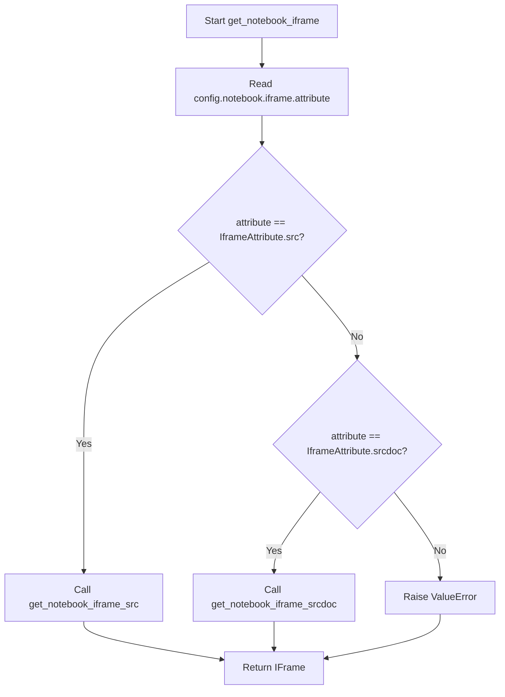

# `notebook.py`

## `src.ydata_profiling.report.presentation.flavours.widget.notebook.get_notebook_iframe_srcdoc` · *function*

## Summary:
Generates an HTML iframe element for displaying profile reports within Jupyter notebook environments.

## Description:
This function creates an HTML iframe element that embeds a profile report's HTML representation within a Jupyter notebook. It retrieves iframe dimensions from configuration settings and safely embeds the profile HTML content using the srcdoc attribute to prevent XSS vulnerabilities.

The function is specifically designed for notebook-based environments where interactive visualization of profiling results is required. It encapsulates the logic for creating iframe elements that can be directly rendered by Jupyter's display system.

## Args:
    config (Settings): Configuration object containing notebook-specific settings including iframe dimensions (width and height)
    profile (ProfileReport): The profile report object whose HTML representation will be embedded in the iframe

## Returns:
    HTML: An IPython HTML object containing a properly formatted iframe element that renders the profile report in Jupyter notebooks

## Raises:
    None explicitly raised in the function body

## Constraints:
    Preconditions:
    - config must contain a valid notebook.iframe configuration with width and height attributes
    - profile must be a valid ProfileReport instance with a to_html() method that returns a string
    - The profile.to_html() method must return a valid HTML string suitable for embedding in srcdoc

    Postconditions:
    - Returns a properly formatted HTML iframe element wrapped in IPython's HTML class
    - The iframe has appropriate attributes for notebook display (width, height, frameborder, allowfullscreen)
    - The HTML content is properly escaped to prevent XSS attacks

## Side Effects:
    None

## Control Flow:
```mermaid
flowchart TD
    A[Start get_notebook_iframe_srcdoc] --> B[Extract width from config.notebook.iframe.width]
    B --> C[Extract height from config.notebook.iframe.height]
    C --> D[Call profile.to_html()]
    D --> E[Escape HTML content with html.escape()]
    E --> F[Construct iframe HTML string with srcdoc]
    F --> G[Wrap in IPython HTML() constructor]
    G --> H[Return HTML object]
```

## Examples:
```python
# Basic usage in a Jupyter notebook cell
from ydata_profiling import ProfileReport
from ydata_profiling.config import Settings

# Create a profile report
df = pd.read_csv('data.csv')
profile = ProfileReport(df, title="Data Profiling Report")

# Configure notebook settings
config = Settings()
config.notebook.iframe.width = 800
config.notebook.iframe.height = 600

# Generate iframe for notebook display
html_iframe = get_notebook_iframe_srcdoc(config, profile)
html_iframe  # This will render the iframe in the notebook
```

## `src.ydata_profiling.report.presentation.flavours.widget.notebook.get_notebook_iframe_src` · *function*

## Summary:
Creates an IFrame object that displays a profiling report in a Jupyter notebook environment by saving the report to a temporary HTML file.

## Description:
Generates a temporary HTML file containing the profiling report and returns an IFrame object configured with the appropriate dimensions from the settings. This function is specifically designed for embedding profiling reports within Jupyter notebook environments, allowing users to view detailed data analysis directly in their notebooks.

The function separates the concerns of report generation and display by:
1. Creating a temporary HTML file with a unique identifier
2. Saving the profile report to that file using the ProfileReport.to_file method
3. Returning an IFrame that references the temporary file with configured dimensions

This approach ensures clean separation between report generation logic and presentation layer, making it easier to manage temporary files and configure display properties independently.

## Args:
    config (Settings): Configuration object containing notebook-specific settings including iframe dimensions
    profile (ProfileReport): The profiling report instance to be displayed in the iframe

## Returns:
    IFrame: An IPython IFrame object configured with the temporary HTML file path and specified dimensions

## Raises:
    None explicitly raised. May propagate exceptions from:
    - Directory creation operations (if tmp_dir cannot be created)
    - File I/O operations during profile.to_file()
    - IFrame construction if invalid parameters are provided

## Constraints:
    Preconditions:
    - config must be a valid Settings instance with notebook.iframe.width and height attributes
    - profile must be a valid ProfileReport instance that can be serialized to HTML
    - The system must have write permissions to the "./ipynb_tmp" directory
    
    Postconditions:
    - A temporary HTML file is created in the "./ipynb_tmp" directory with a unique name
    - The profile report is written to the temporary file
    - An IFrame object is returned with proper dimensions configured

## Side Effects:
    - Creates a temporary directory "./ipynb_tmp" if it doesn't exist
    - Writes a temporary HTML file to the "./ipynb_tmp" directory with a UUID-based filename
    - The temporary file remains on disk until manually cleaned up or system cleanup occurs

## Control Flow:
```mermaid
flowchart TD
    A[Start get_notebook_iframe_src] --> B[Generate unique temp filename]
    B --> C[Ensure temp directory exists]
    C --> D[Save profile to temp file]
    D --> E[Import IFrame (local)]
    E --> F[Create IFrame with temp file path]
    F --> G[Configure IFrame dimensions from config]
    G --> H[Return IFrame object]
```

## Examples:
```python
from ydata_profiling import ProfileReport
from ydata_profiling.config import Settings

# Create a profile report
df = pd.DataFrame({'col1': [1, 2, 3], 'col2': ['a', 'b', 'c']})
profile = ProfileReport(df, title="Sample Report")

# Configure notebook settings
config = Settings()
config.notebook.iframe.width = 800
config.notebook.iframe.height = 600

# Get iframe for notebook display
iframe = get_notebook_iframe_src(config, profile)
iframe  # This will render the report in the notebook cell
```

## `src.ydata_profiling.report.presentation.flavours.widget.notebook.get_notebook_iframe` · *function*

## Summary:
Selects and generates an appropriate iframe representation for displaying a profiling report in Jupyter notebook environments based on configured iframe attributes.

## Description:
This function acts as a dispatcher that chooses between two different iframe generation strategies based on the configured iframe attribute setting. It provides a unified interface for notebook display by delegating to either `get_notebook_iframe_src` or `get_notebook_iframe_srcdoc` depending on whether the "src" or "srcdoc" attribute is configured.

The function enforces a clear separation of concerns by:
1. Reading the iframe attribute configuration from the Settings object
2. Delegating to specialized handlers for each iframe type
3. Maintaining a single entry point for iframe generation in notebook contexts

This design allows for flexible embedding strategies while keeping the core logic centralized and maintainable.

## Args:
    config (Settings): Configuration object containing notebook-specific settings including the iframe attribute selection
    profile (ProfileReport): The profiling report instance to be displayed in the iframe

## Returns:
    Union[IFrame, HTML]: Returns an IFrame object when using "src" attribute or an HTML object when using "srcdoc" attribute

## Raises:
    ValueError: When the iframe attribute is set to an unsupported value (not "src" or "srcdoc")

## Constraints:
    Preconditions:
    - config must be a valid Settings instance with a notebook.iframe.attribute attribute
    - profile must be a valid ProfileReport instance that can be processed by the delegated functions
    - The iframe attribute in config must be one of the supported IframeAttribute values

    Postconditions:
    - Returns either an IFrame or HTML object appropriate for notebook display
    - The returned object will contain properly formatted content for the specified iframe strategy

## Side Effects:
    None directly caused by this function, though the returned objects may cause side effects when displayed in notebooks (such as temporary file creation when using the "src" strategy)

## Control Flow:


## Examples:
```python
from ydata_profiling import ProfileReport
from ydata_profiling.config import Settings, IframeAttribute

# Create a profile report
df = pd.DataFrame({'col1': [1, 2, 3], 'col2': ['a', 'b', 'c']})
profile = ProfileReport(df, title="Sample Report")

# Configure notebook settings with src attribute
config = Settings()
config.notebook.iframe.attribute = IframeAttribute.src
config.notebook.iframe.width = 800
config.notebook.iframe.height = 600

# Get iframe for notebook display
iframe = get_notebook_iframe(config, profile)
iframe  # This will render the report in the notebook cell

# Configure with srcdoc attribute instead
config.notebook.iframe.attribute = IframeAttribute.srcdoc
html_iframe = get_notebook_iframe(config, profile)
html_iframe  # This will also render the report but uses a different embedding strategy
```

