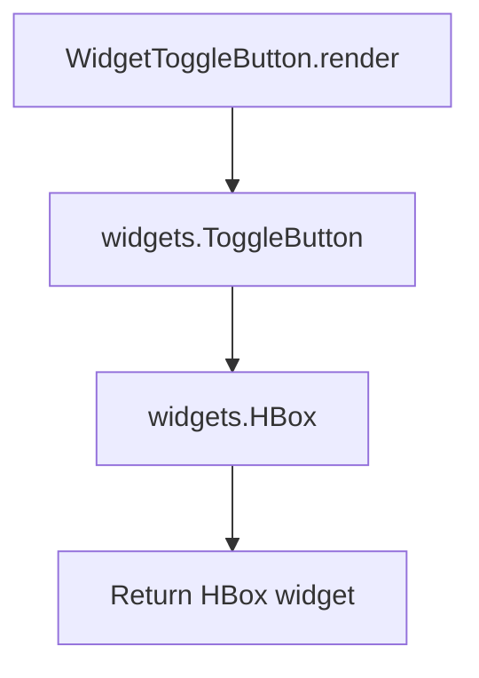

# `toggle_button.py`

## `src.ydata_profiling.report.presentation.flavours.widget.toggle_button.WidgetToggleButton` · *class*

## Summary:
WidgetToggleButton is a concrete implementation of ToggleButton that renders an interactive toggle button using the ipywidgets library for use in Jupyter notebook report presentations.

## Description:
WidgetToggleButton provides a widget-based implementation of the ToggleButton interface specifically designed for Jupyter notebook environments. It creates an interactive toggle button element that users can click to switch between on/off states, commonly used for filtering or toggling visibility of report sections in interactive data profiling reports.

This class bridges the abstract ToggleButton interface with concrete ipywidgets implementation, enabling rich interactive experiences within Jupyter notebooks. It is part of the widget-based presentation flavour of the ydata profiling system.

## State:
- content: dict - Dictionary containing the "text" key used for the toggle button label
- item_type: str - Set to "toggle_button" by parent class, identifies this component type
- name: Optional[str] - Human-readable identifier for the button, inherited from parent class
- anchor_id: Optional[str] - Unique identifier for HTML anchors, inherited from parent class
- classes: Optional[str] - CSS classes for styling, inherited from parent class

## Lifecycle:
- Creation: Instantiate with text parameter and optional keyword arguments for name, anchor_id, and classes
- Usage: Call render() method to generate the ipywidgets.HBox containing the toggle button
- Destruction: Inherits standard Python object lifecycle management; no special cleanup required

## Method Map:


## Raises:
- KeyError: If self.content does not contain the "text" key required for button description
- AttributeError: If ipywidgets module is not available or widgets.ToggleButton is not accessible

## Example:
```python
# Create a toggle button with text label
toggle = WidgetToggleButton({"text": "Show Details"}, name="details_toggle")

# Render the widget for display in Jupyter notebook
widget = toggle.render()

# The widget can now be displayed in a Jupyter cell
display(widget)
```

### `src.ydata_profiling.report.presentation.flavours.widget.toggle_button.WidgetToggleButton.render` · *method*

## Summary:
Creates and configures a widget-based toggle button with specific layout properties for display in Jupyter environments.

## Description:
The render method transforms a WidgetToggleButton instance into a widgets.HBox container containing a styled ToggleButton widget. This method is responsible for creating the visual representation of the toggle button using ipywidgets, applying specific layout configurations to ensure proper alignment and sizing within the Jupyter notebook interface.

The method is part of the widget-based presentation flavour implementation, specifically designed for interactive report elements in Jupyter environments. It creates a toggle button with the text content from self.content["text"] and applies layout properties to make it display properly within the widget container.

## Args:
    None

## Returns:
    widgets.HBox: A horizontal box container holding a configured ToggleButton widget with specific layout properties applied

## Raises:
    None

## State Changes:
    Attributes READ: 
    - self.content: Dictionary containing the text field used for the toggle button description
    
    Attributes WRITTEN: 
    - None

## Constraints:
    Preconditions:
    - The WidgetToggleButton instance must be properly initialized with required parameters
    - self.content["text"] must be a valid string value
    - The ipywidgets library must be available in the execution environment
    
    Postconditions:
    - Returns a properly configured widgets.HBox instance
    - The returned HBox contains exactly one ToggleButton widget
    - All layout properties are correctly applied to both the toggle button and container

## Side Effects:
    None

