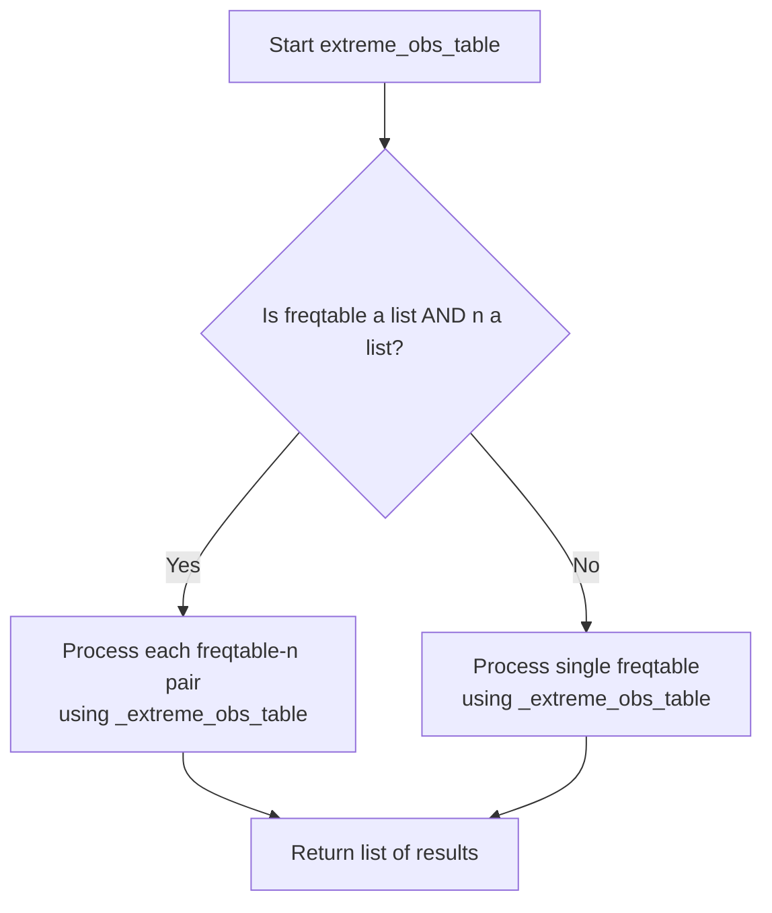

# `frequency_table_utils.py`

## `src.ydata_profiling.report.presentation.frequency_table_utils._frequency_table` · *function*

## Summary:
Processes a frequency table into a standardized list of dictionary entries for visualization, including handling overflow and missing values.

## Description:
Transforms a pandas Series containing frequency counts into a structured list of dictionaries suitable for rendering frequency tables in reports. This function manages special cases like "Other values" when the number of unique values exceeds the display limit, and accounts for missing data in the dataset. It normalizes frequencies for visualization purposes and ensures proper formatting for reporting UI components.

## Args:
    freqtable (pd.Series): A pandas Series containing frequency counts for different categories
    n (int): Total number of observations in the original dataset
    max_number_to_print (int): Maximum number of categories to display in the output

## Returns:
    List[Dict[str, Any]]: A list of dictionaries, each representing a row in the frequency table with keys:
        - "label": Category label or special labels like "Other values" or "(Missing)"
        - "width": Normalized width for visualization (frequency/max_frequency)
        - "count": Raw frequency count for the category
        - "percentage": Percentage of total observations (count/n), capped at 1.0
        - "n": Total number of observations
        - "extra_class": CSS class identifier for styling ("other" or "missing")

## Raises:
    None explicitly raised

## Constraints:
    Preconditions:
        - freqtable should be a valid pandas Series
        - n should be a non-negative integer representing total observations
        - max_number_to_print should be a non-negative integer
    
    Postconditions:
        - Returns an empty list if freqtable is empty or all frequencies are zero
        - All percentage values are bounded between 0.0 and 1.0 (capped at 1.0)
        - Width values are normalized relative to the maximum frequency
        - The returned list contains at most max_number_to_print + 2 entries (plus "Other values" and/or "Missing" entries)

## Side Effects:
    None

## Control Flow:
```mermaid
flowchart TD
    A[Start _frequency_table] --> B{max_number_to_print > n?}
    B -- Yes --> C[max_number_to_print = n]
    B -- No --> C
    C --> D{max_number_to_print < len(freqtable)?}
    D -- Yes --> E[freq_other = sum(freqtable[max_number_to_print:])]
    D -- No --> F[freq_other = 0]
    E --> G[min_freq = freqtable.values[max_number_to_print]]
    F --> G
    G --> H[freq_missing = n - sum(freqtable)]
    H --> I{len(freqtable) == 0?}
    I -- Yes --> J[Return []]
    I -- No --> K[max_freq = max(freqtable[0], freq_other, freq_missing)]
    K --> L{max_freq == 0?}
    L -- Yes --> M[Return []]
    L -- No --> N[Initialize rows list]
    N --> O[Process top max_number_to_print entries]
    O --> P{freq_other > min_freq?}
    P -- Yes --> Q[Add "Other values" entry]
    P -- No --> R[Skip "Other values"]
    Q --> S[Add "Missing" entry if freq_missing > min_freq]
    R --> S
    S --> T[Return rows]
```

## Examples:
    # Basic usage with a frequency table
    freq_series = pd.Series([10, 5, 3, 2])
    result = _frequency_table(freq_series, 20, 3)
    # Returns list of dictionaries with normalized widths and percentages
    
    # Usage with missing values
    freq_series = pd.Series([15, 3])
    result = _frequency_table(freq_series, 20, 5)
    # Handles missing values by calculating freq_missing = 20 - 18 = 2
    
    # Edge case: empty frequency table
    empty_series = pd.Series([], dtype='float64')
    result = _frequency_table(empty_series, 10, 3)
    # Returns empty list []
    
    # Edge case: all zero frequencies
    zero_series = pd.Series([0, 0, 0])
    result = _frequency_table(zero_series, 10, 3)
    # Returns empty list []
    
    # Edge case: max_number_to_print exceeds actual length
    freq_series = pd.Series([5, 3, 2])
    result = _frequency_table(freq_series, 10, 10)
    # max_number_to_print gets adjusted to 3 (length of freqtable)

## `src.ydata_profiling.report.presentation.frequency_table_utils.freq_table` · *function*

## Summary:
Creates standardized frequency table representations for visualization by processing raw frequency data through the internal `_frequency_table` function.

## Description:
Processes frequency count data into a uniform list of dictionary entries suitable for report visualization. This function acts as a dispatcher that handles both single frequency series and collections of frequency series, delegating the actual transformation logic to the internal `_frequency_table` function. It enables consistent presentation of frequency distributions regardless of whether data comes as a single series or multiple series.

## Args:
    freqtable (Union[pd.Series, List[pd.Series]]): Single frequency Series or list of frequency Series objects containing category counts
    n (Union[int, List[int]]): Total observation count(s) corresponding to the frequency data, either single integer or list matching frequency series count
    max_number_to_print (int): Maximum number of categories to display in the output visualization

## Returns:
    Union[List[Dict[str, Any]], List[List[Dict[str, Any]]]]: When input is single values, returns a list containing one processed frequency table. When inputs are lists, returns a list of processed frequency tables, each represented as a list of dictionaries with standardized keys.

## Raises:
    None explicitly raised

## Constraints:
    Preconditions:
        - freqtable must be either a pandas Series or a list of pandas Series
        - n must be either an integer or a list of integers with matching length to freqtable when it's a list
        - max_number_to_print must be a non-negative integer
        
    Postconditions:
        - Output follows the same structure as returned by _frequency_table function
        - When freqtable is a list, returns a list of lists of dictionaries
        - When freqtable is a single value, returns a list containing one list of dictionaries

## Side Effects:
    None

## Control Flow:
```mermaid
flowchart TD
    A[Start freq_table] --> B{isinstance(freqtable, list) AND isinstance(n, list)?}
    B -- Yes --> C[Process each freqtable-n pair with _frequency_table]
    B -- No --> D[Process single freqtable-n pair with _frequency_table]
    C --> E[Return list of processed tables]
    D --> E
```

## Examples:
    # Single frequency table processing
    import pandas as pd
    freq_series = pd.Series([10, 5, 3, 2])
    result = freq_table(freq_series, 20, 3)
    # Returns: [[{'label': 'value1', 'width': 0.5, 'count': 10, 'percentage': 0.5, 'n': 20, 'extra_class': ''}, ...]]

    # Multiple frequency tables processing  
    freq_series_list = [pd.Series([10, 5]), pd.Series([8, 3])]
    n_list = [20, 15]
    result = freq_table(freq_series_list, n_list, 2)
    # Returns: [[...], [...]] - list of two processed frequency tables

## `src.ydata_profiling.report.presentation.frequency_table_utils._extreme_obs_table` · *function*

## Summary:
Creates a formatted table representation of the most frequent observations from a frequency distribution.

## Description:
Processes a frequency table to extract the top observations and formats them into a structured list of dictionaries suitable for presentation. This function is designed to display the most extreme (highest frequency) observations in a visually proportional format, commonly used in data profiling reports to highlight dominant values. The function normalizes frequencies for proportional width calculations while maintaining percentage and count information.

## Args:
    freqtable (pandas.Series): A pandas Series containing frequency counts for various labels/categories, where the index represents labels and values represent frequencies
    number_to_print (int): The maximum number of top frequency observations to include in the result (must be non-negative)
    n (int): The total count of observations used to calculate percentages (must be positive)

## Returns:
    List[Dict[str, Any]]: A list of dictionaries, each representing a row in the formatted table with the following keys:
        - "label": The category/label name from the frequency table index
        - "width": Proportional width for visualization (frequency/max_frequency), or 0 if max_frequency is 0
        - "count": Raw frequency count from the frequency table
        - "percentage": Percentage of total observations (frequency/n) as a float
        - "extra_class": Empty string placeholder for CSS classes (currently unused)
        - "n": Total observation count passed as parameter

## Raises:
    None explicitly raised in the function body

## Constraints:
    Preconditions:
        - freqtable must be a valid pandas Series with numeric values
        - number_to_print must be a non-negative integer (0 means no observations)
        - n must be a positive integer (0 would cause division by zero in percentage calculation)
    Postconditions:
        - Returns exactly min(number_to_print, len(freqtable)) entries
        - All returned dictionaries contain the same set of keys
        - Width values are normalized between 0 and 1
        - Percentage values are calculated as float(frequency)/n

## Side Effects:
    None

## Control Flow:
```mermaid
flowchart TD
    A[Start _extreme_obs_table] --> B[Extract top observations<br/>obs_to_print = freqtable.iloc[:number_to_print]]
    B --> C[Calculate maximum frequency<br/>max_freq = obs_to_print.max()]
    C --> D{max_freq != 0?}
    D -->|Yes| E[Calculate proportional width<br/>width = freq / max_freq]
    D -->|No| F[Set width = 0]
    E --> G[Create row dictionary]
    F --> G
    G --> H[Add to rows list]
    H --> I[Return rows list]
```

## Examples:
    # Basic usage with sample data
    freq_data = pd.Series([100, 50, 25, 10], index=['A', 'B', 'C', 'D'])
    result = _extreme_obs_table(freq_data, 3, 185)
    # Returns list of 3 dictionaries showing top 3 frequencies with proportional widths
    # Each dictionary contains label, width, count, percentage, extra_class, and n fields

## `src.ydata_profiling.report.presentation.frequency_table_utils.extreme_obs_table` · *function*

## Summary:
Creates formatted table representations of extreme observations from frequency distributions for presentation purposes.

## Description:
Processes frequency distribution data to generate structured table representations suitable for reporting interfaces. This function serves as a wrapper that handles both single frequency tables and collections of frequency tables, delegating the actual formatting to the internal `_extreme_obs_table` function. It's commonly used in data profiling reports to display the most frequent observations in a visually proportional format.

## Args:
    freqtable (Union[pd.Series, List[pd.Series]]): Either a single pandas Series containing frequency counts or a list of such Series objects. When a list is provided, each Series represents a separate frequency distribution.
    number_to_print (int): Maximum number of top frequency observations to include in each result table. Must be non-negative (0 means no observations will be included).
    n (Union[int, List[int]]): Total count of observations used to calculate percentages. When a list is provided, it should correspond to each frequency table in the freqtable parameter.

## Returns:
    List[List[Dict[str, Any]]]: A nested list structure where each inner list represents a formatted table for one frequency distribution. Each dictionary in the inner list contains:
        - "label": Category/label name from the frequency table index
        - "width": Proportional width for visualization (frequency/max_frequency), or 0 if max_frequency is 0
        - "count": Raw frequency count from the frequency table
        - "percentage": Percentage of total observations (frequency/n) as a float
        - "extra_class": Empty string placeholder for CSS classes
        - "n": Total observation count passed as parameter

## Raises:
    None explicitly raised in the function body

## Constraints:
    Preconditions:
        - freqtable must be either a pandas Series or a list of pandas Series
        - number_to_print must be a non-negative integer
        - n must be a positive integer or a list of positive integers matching the length of freqtable
        - When lists are provided for both freqtable and n, they must have the same length
    Postconditions:
        - Returns a list of lists of dictionaries, where each inner list corresponds to one frequency table
        - Each dictionary contains the same set of keys
        - The number of dictionaries in each inner list is limited by number_to_print

## Side Effects:
    None

## Control Flow:


