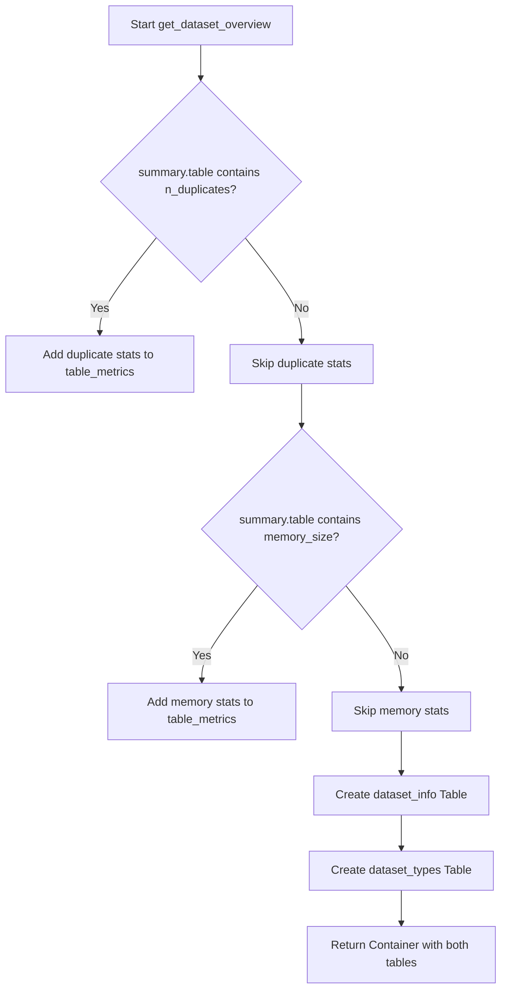
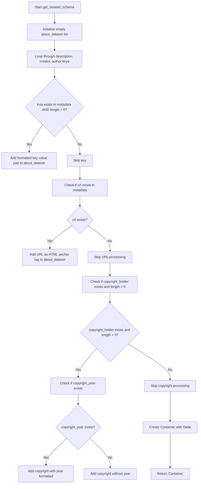
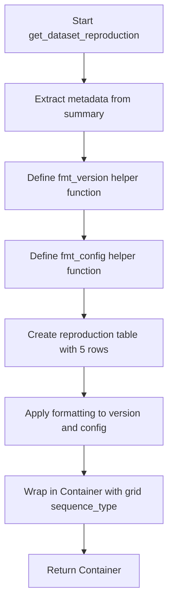
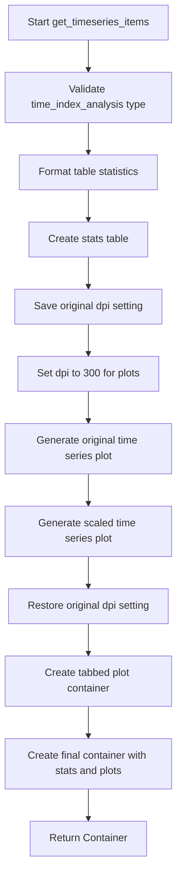
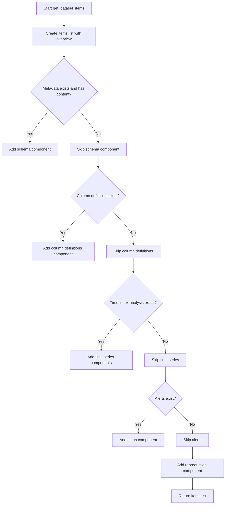

# `overview.py`

## `src.ydata_profiling.report.structure.overview.get_dataset_overview` · *function*

## Summary
Creates a structured overview of dataset statistics and variable types for reporting purposes.

## Description
Generates a formatted presentation of key dataset characteristics including variable counts, observation counts, missing data statistics, and variable type distributions. This function extracts and formats core dataset metadata into a standardized report structure that can be rendered in HTML reports.

The function is designed to be reusable across different report generation contexts and encapsulates the logic for creating consistent dataset overview sections regardless of the underlying data characteristics.

## Args
    config (Settings): Configuration settings that control report styling and formatting behavior
    summary (BaseDescription): Dataset summary containing statistical information and metadata

## Returns
    Renderable: A container object containing two tables - dataset statistics and variable types - arranged in a grid layout for presentation

## Raises
    None explicitly raised

## Constraints
    Preconditions:
    - config must be a valid Settings object with html and report attributes
    - summary must be a BaseDescription object with a table attribute containing required keys
    - summary.table must contain at minimum: n_var, n, n_cells_missing, p_cells_missing
    
    Postconditions:
    - Returns a Container object with exactly two child elements (dataset_info and dataset_types tables)
    - All returned values are properly formatted according to configuration settings

## Side Effects
    None

## Control Flow


## Examples
```python
# Basic usage with minimal summary data
config = Settings()
summary = BaseDescription()
# ... populate summary with data ...
overview_section = get_dataset_overview(config, summary)
```

## `src.ydata_profiling.report.structure.overview.get_dataset_schema` · *function*

## Summary
Creates a structured dataset metadata presentation component containing key dataset identification and attribution information.

## Description
Generates a Container component with a Table displaying essential dataset metadata such as description, creator, author, URL, and copyright information. This function extracts relevant metadata from the provided dictionary and formats it appropriately for display in profiling reports.

The function is extracted into its own component to encapsulate the logic for dataset schema presentation, separating concerns between data extraction and presentation layer. This promotes reusability and testability of the dataset metadata formatting logic.

## Args
- config (Settings): Configuration object containing HTML styling preferences for the presentation component
- metadata (dict): Dictionary containing dataset metadata fields including optional keys like 'description', 'creator', 'author', 'url', 'copyright_holder', and 'copyright_year'

## Returns
- Container: A Container component containing a Table with formatted dataset metadata rows. The table includes columns for metadata names and their corresponding values, with proper HTML formatting for URLs and copyright information.

## Raises
- None explicitly raised

## Constraints
- Preconditions:
  - config parameter must be a valid Settings object with html.style attribute
  - metadata parameter must be a dictionary-like object
- Postconditions:
  - Returns a Container object with properly formatted Table structure
  - All metadata values are processed through the fmt formatter for safe display
  - URL values are wrapped in HTML anchor tags
  - Copyright information is formatted with proper year handling

## Side Effects
- None: This function is pure and doesn't modify external state or perform I/O operations

## Control Flow


## Examples
```python
# Basic usage with minimal metadata
config = Settings()
metadata = {
    "description": "Sales data for Q1 2023",
    "creator": "Data Team",
    "author": "John Smith"
}
container = get_dataset_schema(config, metadata)

# Usage with full metadata including URL and copyright
metadata = {
    "description": "Customer demographics dataset",
    "creator": "Analytics Department",
    "author": "Jane Doe",
    "url": "https://example.com/dataset.csv",
    "copyright_holder": "Example Corp",
    "copyright_year": "2023"
}
container = get_dataset_schema(config, metadata)
```

## `src.ydata_profiling.report.structure.overview.get_dataset_reproduction` · *function*

## Summary:
Creates a reproducibility section for dataset profiling reports containing metadata about the analysis run.

## Description:
Generates a structured table with key metadata about the profiling analysis session, including timing information, software version, and configuration details. This function is part of the overview report structure and provides essential information for reproducing or auditing the profiling process.

The function extracts information from the analysis summary and formats it into a standardized table structure that can be rendered in HTML reports. It specifically focuses on making the analysis reproducible by including version information and downloadable configuration files.

## Args:
    config (Settings): Configuration object containing report formatting and display preferences
    summary (BaseDescription): Analysis summary containing metadata about the profiling run including package information and timing data

## Returns:
    Renderable: A Container object containing a Table with reproduction metadata that can be rendered in reports

## Raises:
    KeyError: If required keys ("ydata_profiling_version", "ydata_profiling_config") are missing from summary.package dictionary
    AttributeError: If summary.analysis doesn't contain date_start, date_end, or duration attributes

## Constraints:
    Preconditions:
    - summary.package must contain "ydata_profiling_version" and "ydata_profiling_config" keys
    - summary.analysis must have date_start, date_end, and duration attributes
    - config.html.style must be accessible for table styling
    
    Postconditions:
    - Returns a properly formatted Container with a Table inside
    - All timing information is formatted using appropriate formatters
    - Version and config links are properly encoded for web display

## Side Effects:
    None - This function is pure and doesn't modify any external state

## Control Flow:


## Examples:
```python
# Typical usage in report generation pipeline
from ydata_profiling.config import Settings
from ydata_profiling.model import BaseDescription
from ydata_profiling.report.structure.overview import get_dataset_reproduction

# Assuming config and summary are properly initialized
renderable = get_dataset_reproduction(config, summary)
# Result can be added to a report structure for rendering
```

## `src.ydata_profiling.report.structure.overview.get_dataset_column_definitions` · *function*

## Summary:
Creates a structured table presentation of dataset column definitions for report generation.

## Description:
Generates a formatted table containing column names and their associated definitions from a dictionary mapping column names to their descriptions. This function encapsulates the presentation logic for displaying variable definitions in profiling reports, separating the data preparation from the rendering concerns.

The function is extracted into its own component to enforce a clear separation between data processing and presentation layer concerns. Rather than inlining the table creation logic, this dedicated function ensures consistent formatting and presentation of column definitions across different report sections.

## Args:
    config (Settings): Configuration object containing HTML styling preferences and report settings
    definitions (dict): Dictionary mapping column names (str) to their descriptive values (Any)

## Returns:
    Container: A Container renderable component containing the formatted table of variable definitions, configured with grid sequence type for proper presentation layout

## Raises:
    None explicitly raised

## Constraints:
    Preconditions:
    - config parameter must be a valid Settings object with html.style attribute accessible
    - definitions parameter must be a dictionary-like object with string keys and any value types
    
    Postconditions:
    - Returns a Container instance with properly formatted Table content
    - All values in definitions are processed through the fmt() formatter function
    - The returned Container is configured with sequence_type="grid"

## Side Effects:
    None: This function performs no I/O operations or external state mutations

## Control Flow:
```mermaid
flowchart TD
    A[Start get_dataset_column_definitions] --> B[Create variable_descriptions list]
    B --> C[Iterate over definitions.items()]
    C --> D[Format each value with fmt()]
    D --> E[Create Table with formatted data]
    E --> F[Wrap Table in Container]
    F --> G[Return Container]
```

## Examples:
    >>> from ydata_profiling.config import Settings
    >>> config = Settings()
    >>> definitions = {
    ...     "age": "Age of the person in years",
    ...     "income": "Annual income in USD"
    ... }
    >>> result = get_dataset_column_definitions(config, definitions)
    >>> print(type(result))
    <class 'ydata_profiling.report.presentation.core.container.Container'>
```

## `src.ydata_profiling.report.structure.overview.get_dataset_alerts` · *function*

## Summary
Creates a unified Alerts presentation component from either a single list of alerts or a tuple of multiple alert collections, filtering out rejected alerts for count calculation.

## Description
This function processes alert data for report generation, handling both single and multiple report scenarios. When alerts are provided as a tuple (indicating multiple reports), it combines alerts by type and column name into a structured dictionary format where each key maps to a list of alerts from different reports. For single alert collections, it directly creates an Alerts component. The function excludes AlertType.REJECTED alerts from the displayed count while preserving them in the underlying data structure.

In data profiling contexts, this function enables consistent presentation of data quality alerts regardless of whether the analysis involves a single dataset or multiple datasets/reports. It abstracts away the complexity of handling different alert data structures, providing a uniform interface for report generation components.

The function is extracted into its own component to separate the alert processing logic from the report generation flow, ensuring clean separation of concerns and making the alert handling reusable across different report sections.

## Args
- config (Settings): Configuration settings for report generation, specifically accessing html.style for presentation styling
- alerts (list): Either a list of Alert objects or a tuple of lists of Alert objects representing data quality issues detected during profiling

## Returns
- Alerts: A presentation-ready Alerts component containing the processed alert data with appropriate styling and metadata. The alerts parameter passed to the Alerts constructor is either:
  - A list of Alert objects (when alerts is not a tuple)
  - A dictionary mapping string keys (format: "{alert_type}_{column_name}") to lists of Alert objects (when alerts is a tuple)

## Raises
- None explicitly raised by this function

## Constraints
- Preconditions: 
  - config must be a valid Settings object with html.style attribute
  - alerts must be either a list of Alert objects or a tuple of such lists
- Postconditions:
  - Returns an Alerts object with properly formatted alert data
  - Rejected alerts (AlertType.REJECTED) are excluded from the displayed count but preserved in the data structure

## Side Effects
- None

## Control Flow
```mermaid
flowchart TD
    A[Start get_dataset_alerts] --> B{Is alerts a tuple?}
    B -- Yes --> C[Initialize combined_alerts dict with keys from all alerts]
    C --> D[Iterate through each report in tuple]
    D --> E[For each alert in report, populate combined_alerts]
    E --> F[Calculate count (excluding REJECTED alerts)]
    F --> G[Return Alerts with combined_alerts dict]
    B -- No --> H[Calculate count (excluding REJECTED alerts)]
    H --> I[Return Alerts with original alerts list]
```

## Examples
```python
# Single alert list usage - typical for one dataset analysis
from ydata_profiling.model.alerts import Alert, AlertType
alerts_list = [
    Alert(AlertType.HIGH_CORRELATION, "column_a", "High correlation detected"),
    Alert(AlertType.MISSING, "column_b", "Missing values found")
]
result = get_dataset_alerts(config, alerts_list)

# Multiple report alerts usage - for comparing multiple datasets or analyses
alerts_tuple = (
    [Alert(AlertType.HIGH_CORRELATION, "col1", "Dataset 1 alert")],
    [Alert(AlertType.MISSING, "col2", "Dataset 2 alert")]
)
result = get_dataset_alerts(config, alerts_tuple)
```

## `src.ydata_profiling.report.structure.overview.get_timeseries_items` · *function*

## Summary:
Creates a structured container with time series statistics and visualization plots for inclusion in profiling reports.

## Description:
Generates a comprehensive time series overview section containing statistical summaries and visualizations. This function extracts key temporal characteristics from time-indexed data and presents them in a standardized report format, including numerical statistics and interactive plots showing the original and scaled time series data.

The function is designed to be called during report generation when time series data is detected in the dataset. It encapsulates the logic for formatting time series metadata and creating appropriate visual representations, separating this concern from the main report generation pipeline.

## Args:
    config (Settings): Configuration object containing report settings including plotting parameters and HTML styling options
    summary (BaseDescription): Data summary object containing time index analysis and variable information

## Returns:
    Container: A structured report component containing:
        - Table with time series statistics (number of series, length, start/end points, period)
        - Tabbed container with original and scaled time series plots

## Raises:
    AssertionError: When summary.time_index_analysis is not an instance of TimeIndexAnalysis

## Constraints:
    Preconditions:
    - summary must contain a valid time_index_analysis attribute of type TimeIndexAnalysis
    - config must be a properly initialized Settings object
    - summary.variables must contain time series data for plotting
    
    Postconditions:
    - Returns a properly structured Container with time series information
    - The returned Container is ready for report rendering

## Side Effects:
    - Temporarily modifies config.plot.dpi setting during plot generation
    - No persistent state changes outside the function scope

## Control Flow:


## Examples:
```python
# Typical usage in report generation
from ydata_profiling.config import Settings
from ydata_profiling.model import BaseDescription

config = Settings()
summary = BaseDescription()

# Assuming summary has time_index_analysis populated
timeseries_container = get_timeseries_items(config, summary)

# The returned container can be added to a larger report structure
report_section = Container([timeseries_container], name="Time Series Analysis")
```

## `src.ydata_profiling.report.structure.overview.get_dataset_items` · *function*

## Summary:
Creates a structured collection of report components for dataset overview, including metadata, schema, column definitions, time series analysis, alerts, and reproduction information.

## Description:
Generates a list of presentation components that together form the dataset overview section of a profiling report. This function serves as the main orchestrator that determines which report subsections to include based on available data and configuration settings. It calls several specialized functions to create individual report components and aggregates them into a cohesive dataset overview.

The function is extracted into its own component to separate the logic for determining which report sections to include from the individual component creation logic. This allows for flexible report generation where different sections are only included when relevant data is present, improving both performance and report clarity.

## Args:
    config (Settings): Configuration settings controlling report formatting, styling, and feature availability
    summary (BaseDescription): Dataset summary containing statistical information, metadata, and analysis results
    alerts (list): List of alert objects representing data quality issues detected during profiling

## Returns:
    list[Renderable]: A list of presentation components that together form the dataset overview section, including:
        - Dataset overview statistics
        - Schema metadata (if available)
        - Column definitions (if available)
        - Time series analysis (if applicable)
        - Alerts summary (if present)
        - Reproduction information

## Raises:
    None explicitly raised

## Constraints:
    Preconditions:
    - config must be a valid Settings object with proper initialization
    - summary must be a BaseDescription object with required attributes
    - alerts must be a list-like object (can be empty)
    
    Postconditions:
    - Returns a list of Renderable objects suitable for report rendering
    - The order of items in the returned list follows a logical progression from basic statistics to detailed analysis

## Side Effects:
    None - This function is pure and doesn't modify external state or perform I/O operations

## Control Flow:


## Examples:
```python
# Basic usage in report generation
from ydata_profiling.config import Settings
from ydata_profiling.model import BaseDescription

config = Settings()
summary = BaseDescription()
alerts = []

# Generate dataset overview components
items = get_dataset_items(config, summary, alerts)

# These items can be added to a larger report structure
from ydata_profiling.report.presentation.core import Container
report_section = Container(items, name="Dataset Overview")
```

