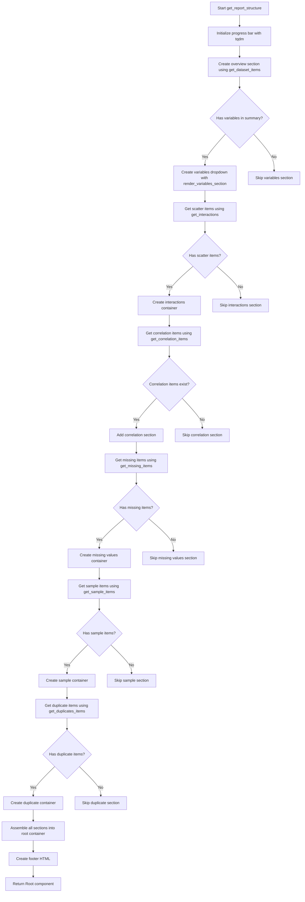

# `report.py`

## `src.ydata_profiling.report.structure.report.get_missing_items` · *function*

## Summary:
Creates presentation components for missing data visualization patterns in a data profiling report.

## Description:
Generates a list of renderable components that represent missing value patterns identified during data profiling. This function processes the missing data analysis results stored in the summary object and converts them into appropriate UI components for display in HTML reports. The function handles both single missing pattern visualizations and grouped visualizations with multiple related patterns.

The function is extracted into its own component to separate the logic of transforming missing data analysis results into presentation-ready renderables from the higher-level report generation process. This allows for cleaner separation of concerns and makes the missing data visualization logic reusable and testable independently.

## Args:
    config (Settings): Configuration settings controlling report formatting, styling, and visualization options including image format and HTML styling parameters
    summary (BaseDescription): Data profiling summary containing missing value pattern analysis results in the `missing` attribute

## Returns:
    list: A list of presentation components (ImageWidget or Container objects) representing missing data visualizations. Each component is configured with appropriate metadata including image format, alt text, names, anchor IDs, and captions.

## Raises:
    None explicitly raised - All exceptions would come from underlying dependencies like ImageWidget construction or rendering functions

## Constraints:
    Preconditions:
    - config must be a valid Settings object with properly initialized plot and html configuration
    - summary must be a BaseDescription object with a populated missing attribute
    - summary.missing must contain valid dictionary entries with "matrix", "name", and "caption" keys
    
    Postconditions:
    - Returns a list of renderable objects suitable for report rendering
    - All returned components are properly configured with appropriate metadata and styling

## Side Effects:
    None directly observable - The function only processes data and creates renderable objects without modifying external state

## Control Flow:
```mermaid
flowchart TD
    A[Start get_missing_items] --> B[Iterate through summary.missing.items()]
    B --> C{item["name"] is string?}
    C -->|Yes| D[Create ImageWidget component]
    C -->|No| E[Create Container with ImageWidgets]
    D --> F[Add to items list]
    E --> G[Create ImageWidgets for each item in name sequence]
    G --> H[Create Container with batch_grid sequence_type]
    H --> I[Add to items list]
    I --> J[Return items list]
```

## Examples:
```python
# Basic usage in report generation
from ydata_profiling.config import Settings
from ydata_profiling.model import BaseDescription

config = Settings()
summary = BaseDescription()

# Generate missing data visualization components
missing_items = get_missing_items(config, summary)

# These items can be added to a larger report structure
from ydata_profiling.report.presentation.core import Container
report_section = Container(missing_items, name="Missing Data Patterns")
```

## `src.ydata_profiling.report.structure.report.render_variables_section` · *function*

## Summary:
Converts variable analysis results into presentation-ready components for data profiling reports.

## Description:
Transforms individual variable analysis results from a BaseDescription summary into renderable Variable components for HTML reports. This function processes each variable's summary data, applies appropriate rendering logic based on data types, handles alerts and descriptions, and constructs presentation-ready components that can be displayed in profiling reports.

The function is extracted into its own component to separate the logic of converting variable analysis results into presentation-ready renderables from the higher-level report generation process. This architectural decision enables modular report construction where variable sections can be built independently and reused across different report templates. It also facilitates testing of variable rendering logic in isolation and allows for easier maintenance of presentation concerns separate from business logic.

## Args:
    config (Settings): Configuration object containing report settings including variable descriptions, alert handling, and rendering preferences
    dataframe_summary (BaseDescription): Data profiling summary containing variable-level analysis results and alerts

## Returns:
    list: A list of Variable renderable components, one for each variable in the dataframe summary, ready for report rendering

## Raises:
    ValueError: Raised when a variable has incompatible data types that cannot be resolved to a single type (specifically when types are not one of: {"Numeric", "Categorical"}, {"Categorical", "Unsupported"}, or {"Categorical", "Text"})

## Constraints:
    Preconditions:
    - config must be a valid Settings object with properly initialized configuration
    - dataframe_summary must be a BaseDescription object with populated variables and alerts attributes
    - Each variable summary in dataframe_summary.variables must contain required fields like "type" and "top"
    
    Postconditions:
    - Returns a list of Variable objects with proper configuration for presentation
    - All Variable objects are constructed with appropriate alert handling and description support

## Side Effects:
    None directly observable - The function only processes data and creates renderable objects without modifying external state

## Control Flow:
```mermaid
flowchart TD
    A[Start render_variables_section] --> B[Initialize empty templs list]
    B --> C[Get configuration values]
    C --> D[Get render_map from get_render_map()]
    D --> E[Iterate through dataframe_summary.variables.items()]
    E --> F{alerts is tuple?}
    F -->|No| G[Process alerts as list]
    F -->|Yes| H[Process alerts as tuple of lists]
    G --> I[Extract alerts, alert_fields, alert_types]
    H --> I
    I --> J[Create template_variables dict]
    J --> K[Update template_variables with summary data]
    K --> L{summary["type"] is list?}
    L -->|Yes| M[Resolve compatible types]
    L -->|No| N[Use summary["type"] directly]
    M --> O[Check type compatibility]
    O --> P{Types compatible?}
    P -->|No| Q[Raise ValueError]
    P -->|Yes| R[Set variable_type]
    N --> R
    R --> S[Get render_map_type from render_map]
    S --> T[Update template_variables with render_map_type result]
    T --> U{reject_variables enabled?}
    U -->|Yes| V[Check if AlertType.REJECTED in alert_types]
    U -->|No| W[Set ignore=False]
    V --> X[Set ignore based on rejection check]
    X --> Y[Prepare bottom component if needed]
    Y --> Z[Create Variable component]
    Z --> AA[Append to templs list]
    AA --> AB{More variables?}
    AB -->|Yes| E
    AB -->|No| AC[Return templs list]
```

## Examples:
```python
# Basic usage in report generation
from ydata_profiling.config import Settings
from ydata_profiling.model import BaseDescription
from ydata_profiling.report.structure.report import render_variables_section

config = Settings()
summary = BaseDescription()

# Generate variable section components
variable_components = render_variables_section(config, summary)

# These components can be added to a larger report structure
from ydata_profiling.report.presentation.core import Container
report_section = Container(variable_components, name="Variables")
```

## `src.ydata_profiling.report.structure.report.get_duplicates_items` · *function*

## Summary
Creates renderable duplicate data components for a profiling report from duplicate data records.

## Description
Processes duplicate data findings and transforms them into presentation-ready components that can be included in HTML reports. This function handles two distinct input formats: a single DataFrame containing duplicate records or a list of DataFrames for multiple duplicate sets. It generates Duplicate renderable objects with appropriate labels and anchor IDs for proper report navigation.

The function is extracted into its own component to separate the logic of converting duplicate data into presentation-ready renderables from the higher-level report generation process. This allows for cleaner separation of concerns and makes the duplicate data display logic reusable and testable independently.

## Args
- config (Settings): Configuration object containing report settings including HTML styling options and display preferences  
- duplicates (pd.DataFrame or list or None): Either a single DataFrame with duplicate records, a list of DataFrames containing different sets of duplicates, or None/empty data

## Returns
- list[Renderable]: A list of Duplicate renderable objects that can be included in report sections, or an empty list if no duplicate data is present or if a list contains None values

## Raises
- None explicitly raised

## Constraints
- Preconditions:
  - config must be a valid Settings object with properly initialized HTML configuration
  - duplicates must be either None, a pandas DataFrame, or a list of pandas DataFrames
  - When duplicates is a list, all elements must be valid DataFrames or None (though None elements result in empty return)
  - config.html.style._labels must be properly initialized if duplicates is a list

- Postconditions:
  - Returns a list of Renderable objects suitable for report rendering
  - If duplicates is None or empty (length 0), returns an empty list
  - If duplicates is a list, returns Duplicate components for each non-None DataFrame in the list
  - If duplicates is a single DataFrame, returns a single Duplicate component
  - All returned Duplicate components have anchor_id="duplicates"

## Side Effects
- None - This function is pure and doesn't modify external state or perform I/O operations

## Control Flow
```mermaid
flowchart TD
    A[Start get_duplicates_items] --> B{duplicates is not None and len(duplicates) > 0?}
    B -->|No| C[Return empty items list]
    B -->|Yes| D{duplicates is list?}
    D -->|Yes| E{Any None in list?}
    E -->|Yes| F[Return empty items list]
    E -->|No| G[Iterate through list items]
    G --> H[Create Duplicate component for each item]
    H --> I[Use config.html.style._labels[idx] for name]
    I --> J[Add to items list]
    J --> K[Return items list]
    D -->|No| L[Create single Duplicate component]
    L --> M[Use "Most frequently occurring" for name]
    M --> N[Add to items list]
    N --> K
```

## Examples
```python
# Example 1: Single duplicate DataFrame
from ydata_profiling.config import Settings
import pandas as pd

config = Settings()
duplicates_df = pd.DataFrame({'id': [1, 2, 1], 'value': ['A', 'B', 'A']})
items = get_duplicates_items(config, duplicates_df)

# Example 2: List of duplicate DataFrames
duplicates_list = [
    pd.DataFrame({'id': [1, 2, 1], 'value': ['A', 'B', 'A']}),
    pd.DataFrame({'id': [3, 4, 3], 'value': ['C', 'D', 'C']})
]
items = get_duplicates_items(config, duplicates_list)

# Example 3: Empty duplicates (returns empty list)
items = get_duplicates_items(config, None)
items = get_duplicates_items(config, pd.DataFrame())

# Example 4: List with None values (returns empty list)
items = get_duplicates_items(config, [None, pd.DataFrame()])
```

## `src.ydata_profiling.report.structure.report.get_definition_items` · *function*

## Summary:
Creates a renderable component for displaying column definitions in a data profiling report when definition data is available.

## Description:
Generates a Duplicate renderable component that displays column definitions from a DataFrame. This function is responsible for conditionally creating a visual representation of column metadata in data profiling reports. It only creates the renderable component when definition data is present (not None and has content), allowing for flexible report generation where sections are only included when relevant data exists.

This function is extracted into its own component to separate the logic for creating column definition displays from the higher-level report structure determination. This enables clean separation of concerns and allows the report generation process to conditionally include column definition sections based on data availability.

The Duplicate component created by this function is specifically designed to display tabular data containing column definitions, making it easy for users to understand the meaning and structure of dataset columns.

## Args:
    definitions (pd.DataFrame): A pandas DataFrame containing column definition information, or None if no definitions exist. When provided, this DataFrame should contain metadata about dataset columns.

## Returns:
    Sequence[Renderable]: A sequence containing a single Duplicate renderable component when definitions are present, or an empty sequence when no definitions exist. The Duplicate component is used to display tabular column definition data in the report.

## Raises:
    None explicitly raised

## Constraints:
    Preconditions:
    - The definitions parameter can be None or a pandas DataFrame
    - When definitions is a DataFrame, it should contain valid column definition data
    
    Postconditions:
    - Returns a sequence of Renderable objects (empty or containing one Duplicate component)
    - The returned sequence is suitable for inclusion in report generation pipelines

## Side Effects:
    None - This function is pure and doesn't modify external state or perform I/O operations

## Control Flow:
```mermaid
flowchart TD
    A[Start get_definition_items] --> B[Initialize empty items list]
    B --> C{definitions is not None AND len(definitions) > 0?}
    C -->|Yes| D[Create Duplicate component with definitions]
    D --> E[Append Duplicate to items list]
    C -->|No| F[Skip Duplicate creation]
    F --> G[Return items list]
    E --> G
```

## Examples:
```python
# Example 1: With column definitions present
import pandas as pd
from ydata_profiling.report.structure.report import get_definition_items

# Create sample column definitions DataFrame
definitions_df = pd.DataFrame({
    'column_name': ['age', 'income', 'category'],
    'description': ['Age of person', 'Annual income', 'Category classification']
})

# Generate definition items for report
definition_items = get_definition_items(definitions_df)
# Returns a list with one Duplicate component

# Example 2: With no definitions
definition_items = get_definition_items(None)
# Returns an empty list

# Example 3: With empty definitions DataFrame
empty_definitions = pd.DataFrame()
definition_items = get_definition_items(empty_definitions)
# Returns an empty list
```

## `src.ydata_profiling.report.structure.report.get_sample_items` · *function*

## Summary:
Processes sample data structures into renderable components for report generation, handling both single samples and batches of samples.

## Description:
The `get_sample_items` function transforms raw sample data structures into properly formatted renderable components suitable for inclusion in profiling reports. This function serves as a bridge between raw sample data and the presentation layer, ensuring that samples are correctly structured for display regardless of whether they come as a single sample or a batch of samples.

The function is designed to handle two distinct data structures:
1. When `sample` is a tuple: Processes multiple samples as a batch, creating Container components with grid layout
2. When `sample` is a sequence (list or other iterable): Processes individual samples directly as Sample components

This extraction into a separate function allows for consistent sample processing logic throughout the report generation pipeline while maintaining clean separation between data preparation and presentation concerns.

## Args:
    config (Settings): Configuration object containing report settings, including HTML style labels for naming samples
    sample (Sequence): Either a tuple of sample objects or a sequence/list of sample objects to be processed

## Returns:
    List[Renderable]: A list of renderable components representing the processed samples, either as individual Sample objects or grouped in Container objects with batch_grid sequence_type

## Raises:
    None explicitly raised by this function

## Constraints:
    Preconditions:
    - config must be a valid Settings object with proper HTML style configuration
    - sample must be either a tuple or a sequence of sample objects with required attributes (data, name, id, caption)
    - Each sample object in the sequence must have the following attributes:
      * data: The actual sample data to be displayed
      * name: Human-readable identifier for the sample  
      * id: Unique identifier for the sample
      * caption: Optional descriptive caption for the sample
    
    Postconditions:
    - Returns a list of Renderable objects that can be directly used in report construction
    - All returned objects maintain the original sample data integrity
    - The returned list is never None, though it may be empty

## Side Effects:
    None

## Control Flow:
```mermaid
flowchart TD
    A[Start get_sample_items] --> B{isinstance(sample, tuple)?}
    B -->|Yes| C[Process tuple as batch]
    B -->|No| D[Process as individual samples]
    C --> E[zip(*sample) to iterate over batches]
    E --> F[Create Container for each batch]
    F --> G[Add Sample objects to Container]
    G --> H[Append Container to items]
    D --> I[Iterate through sample items]
    I --> J[Create Sample for each item]
    J --> K[Append Sample to items]
    H --> L[Return items]
    K --> L
```

## Examples:
```python
# Example 1: Processing a single sample
from ydata_profiling.config import Settings
from ydata_profiling.report.presentation.core.sample import Sample

config = Settings()
single_sample = Sample(id="sample_001", data=df.head(10), name="First 10 Rows")
items = get_sample_items(config, single_sample)

# Example 2: Processing multiple samples as a batch
sample_tuple = (
    Sample(id="sample_001", data=df.head(10), name="First 10 Rows"),
    Sample(id="sample_002", data=df.tail(10), name="Last 10 Rows")
)
items = get_sample_items(config, sample_tuple)
```

## `src.ydata_profiling.report.structure.report.get_interactions` · *function*

## Summary:
Converts interaction plot data into renderable UI components for report visualization.

## Description:
Processes interaction data between variables and transforms it into structured UI components that can be rendered in profiling reports. This function organizes interaction plots into tabbed or select containers based on the number of interactions, supporting both single plots and multiple plots per variable pair.

## Args:
    config (Settings): Configuration object containing report settings including plot formatting options
    interactions (dict): Nested dictionary mapping variable names to their interaction plots, where keys are x variables and values are dictionaries of y variables mapped to plot data

## Returns:
    list[Renderable]: List of renderable UI components representing the interaction plots organized in containers

## Raises:
    None explicitly raised in the function body

## Constraints:
    Preconditions:
    - config must be a valid Settings object with plot.image_format attribute
    - interactions must be a dictionary with proper nesting structure
    - Each interaction value should either be a single plot object or a list of plot objects
    
    Postconditions:
    - Returns a list of Renderable objects suitable for report rendering
    - All returned objects are properly initialized with appropriate container structures

## Side Effects:
    None explicitly mentioned in the function body

## Control Flow:
```mermaid
flowchart TD
    A[Start get_interactions] --> B{interactions.items()}
    B --> C[x_col, y_cols = item}
    C --> D{y_cols.items()}
    D --> E[y_col, splot = item]
    E --> F{isinstance(splot, list)}
    F -- False --> G[Create ImageWidget]
    F -- True --> H[Create Container with batch_grid]
    G --> I[Add to items]
    H --> I
    I --> J{len(items) <= 10}
    J -- True --> K[sequence_type="tabs"]
    J -- False --> L[sequence_type="select"]
    K --> M[Create Container with tabs]
    L --> M
    M --> N[Add to titems]
    N --> O{More interactions?}
    O -- Yes --> B
    O -- No --> P[Return titems]
```

## Examples:
```python
# Basic usage with simple interactions
config = Settings()
interactions = {
    "var1": {
        "var2": "plot_data_1",
        "var3": "plot_data_2"
    }
}
renderables = get_interactions(config, interactions)
# Returns list of Container objects with ImageWidget children

# Usage with multiple plots per interaction
interactions = {
    "var1": {
        "var2": ["plot_data_1", "plot_data_2", ""]
    }
}
renderables = get_interactions(config, interactions)
# Returns list of Container objects with batch_grid layout
```

## `src.ydata_profiling.report.structure.report.get_report_structure` · *function*

## Summary:
Constructs a hierarchical report structure for data profiling by organizing various analytical sections into a navigable UI layout.

## Description:
Creates a complete report structure by assembling different analytical sections (overview, variables, interactions, correlations, missing values, sample data, and duplicates) into a unified hierarchical layout. This function orchestrates the generation of all report sections and combines them into a single Root component that can be rendered as an HTML report.

The function is extracted into its own component to separate the high-level report assembly logic from the individual section generation logic. This architectural decision enables modular report construction where each section can be built independently and reused across different report templates, while maintaining a clean separation between data processing and presentation concerns.

## Args:
    config (Settings): Configuration object containing report settings including progress bar visibility, HTML styling, and feature enablement flags
    summary (BaseDescription): Data profiling summary containing all analytical results and metadata from the data exploration process

## Returns:
    Root: A Root renderable component that serves as the top-level container for the entire report structure, including all sections and footer information

## Raises:
    None explicitly raised by this function

## Constraints:
    Preconditions:
    - config must be a valid Settings object with properly initialized attributes including progress_bar, html.full_width, and html.style
    - summary must be a BaseDescription object with populated attributes including variables, alerts, scatter, correlations, missing, sample, and duplicates
    - All helper functions (get_dataset_items, render_variables_section, get_interactions, etc.) must be properly implemented and available
    
    Postconditions:
    - Returns a properly structured Root component with all expected sections
    - The progress bar is updated exactly once during execution
    - All sections are properly ordered according to report conventions

## Side Effects:
    - Creates a progress bar display during execution (controlled by config.progress_bar)
    - Constructs multiple renderable components including Containers, Dropdowns, Images, HTML elements
    - Returns a Root component that can be rendered to HTML

## Control Flow:


## Examples:
```python
# Basic usage in report generation pipeline
from ydata_profiling.config import Settings
from ydata_profiling.model import BaseDescription
from ydata_profiling.report.structure.report import get_report_structure

config = Settings()
summary = BaseDescription()

# Generate complete report structure
report_root = get_report_structure(config, summary)

# The resulting Root component can be rendered to HTML
html_output = report_root.to_html()

# Example with disabled progress bar
config.progress_bar = False
report_root = get_report_structure(config, summary)
```

