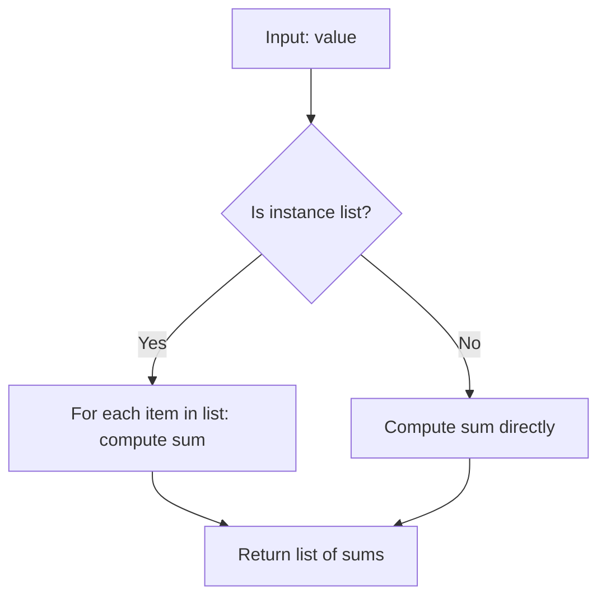
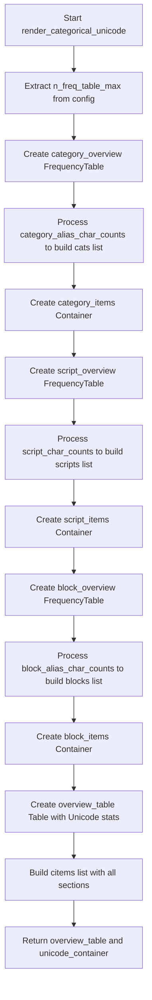

# `render_categorical.py`

## `src.ydata_profiling.report.structure.variables.render_categorical.render_categorical_frequency` · *function*

## Summary:
Creates a frequency table displaying unique value statistics for categorical variables in profiling reports.

## Description:
Generates a structured table showing the count and percentage of unique values for a categorical variable. This function is part of the categorical variable rendering pipeline and produces a formatted Table object suitable for inclusion in profiling report presentations.

The function extracts unique count and percentage information from the summary dictionary and formats them appropriately using specialized formatters. It also handles alert indicators based on predefined alert fields in the summary data.

## Args:
    config (Settings): Configuration object containing report settings including HTML styling options
    summary (dict): Dictionary containing variable summary statistics including 'n_unique', 'p_unique', and 'alert_fields'
    varid (str): Unique identifier for the variable, used to generate anchor IDs for report navigation

## Returns:
    Renderable: A Table object containing two rows with unique count and unique percentage statistics, properly formatted for report presentation

## Raises:
    None explicitly raised by this function

## Constraints:
    Preconditions:
    - The summary dictionary must contain keys 'n_unique', 'p_unique', and 'alert_fields'
    - The config parameter must be a valid Settings object with html.style attribute
    - The varid parameter must be a string

    Postconditions:
    - Returns a properly initialized Table object with correct styling
    - The returned table contains exactly two rows with the specified statistics

## Side Effects:
    None: This function has no side effects beyond returning a Renderable object

## Control Flow:
```mermaid
flowchart TD
    A[Start render_categorical_frequency] --> B[Extract n_unique from summary]
    B --> C[Format n_unique with fmt_number]
    C --> D[Extract p_unique from summary]
    D --> E[Format p_unique with fmt_percent]
    E --> F[Check alert status for n_unique]
    F --> G[Check alert status for p_unique]
    G --> H[Create Table with two rows]
    H --> I[Set name="Unique"]
    I --> J[Set anchor_id with varid]
    J --> K[Apply config.html.style]
    K --> L[Return Table object]
```

## Examples:
```python
# Basic usage in a profiling context
config = Settings()
summary = {
    "n_unique": 42,
    "p_unique": 0.85,
    "alert_fields": ["n_unique"]
}
varid = "category_column"

table = render_categorical_frequency(config, summary, varid)
# Returns a Table object with:
# Row 1: "Unique" with value "42" and alert indicator
# Row 2: "Unique (%)" with value "85.0%" and alert indicator
```

## `src.ydata_profiling.report.structure.variables.render_categorical.render_categorical_length` · *function*

## Summary:
Creates statistical summary and histogram visualization for categorical variable string lengths.

## Description:
Generates a table of length statistics (max, median, mean, min) and a histogram showing the distribution of string lengths in categorical variables. This function is part of the categorical variable reporting pipeline and provides visual and numerical insights into the length characteristics of categorical data.

## Args:
    config (Settings): Configuration object containing report and plot settings
    summary (dict): Dictionary containing length statistics including max_length, median_length, mean_length, min_length, and histogram_length
    varid (str): Variable identifier used for creating unique HTML anchor IDs

## Returns:
    Tuple[Renderable, Renderable]: A tuple containing:
        - Table: Statistical summary table of string lengths with formatted values using fmt_number and fmt_numeric
        - Image: Histogram visualization of length distribution

## Raises:
    None explicitly raised, but may raise exceptions from underlying histogram plotting functions when processing histogram_length data

## Constraints:
    Preconditions:
        - summary dictionary must contain keys: max_length, median_length, mean_length, min_length, histogram_length
        - config must be a valid Settings object with html and plot configurations
        - varid must be a valid string for HTML anchor ID creation

    Postconditions:
        - Returns exactly two Renderable objects in tuple format
        - Table contains exactly 4 rows with length statistics
        - Histogram image is properly formatted according to config.settings.plot.image_format
        - All numeric values in table are properly formatted using fmt_number or fmt_numeric with appropriate precision

## Side Effects:
    None directly, but may trigger image generation through histogram() function

## Control Flow:
```mermaid
flowchart TD
    A[Start render_categorical_length] --> B{histogram_length type}
    B -->|list| C[Extract x,y data from list of tuples]
    B -->|other| D[Unpack histogram_length data]
    C --> E[Call histogram() with extracted data]
    D --> E
    E --> F[Create Image object with histogram data]
    F --> G[Create Table object with length statistics]
    G --> H[Return (Table, Image) tuple]
```

## Examples:
```python
# Typical usage in report generation
config = Settings()
summary = {
    "max_length": 15,
    "median_length": 8,
    "mean_length": 9.2,
    "min_length": 2,
    "histogram_length": [(2, 5), (3, 8), (4, 12)]
}
varid = "category_var_1"
table, histogram_img = render_categorical_length(config, summary, varid)

# Alternative histogram format (tuple of arrays)
summary_alt = {
    "max_length": 15,
    "median_length": 8,
    "mean_length": 9.2,
    "min_length": 2,
    "histogram_length": ([2, 3, 4], [5, 8, 12])
}
table2, histogram_img2 = render_categorical_length(config, summary_alt, varid)
```

## `src.ydata_profiling.report.structure.variables.render_categorical._get_n` · *function*

## Summary:
Computes the sum of values from either a list of pandas objects or a single pandas DataFrame/Series.

## Description:
This utility function handles the computation of sums for categorical variable analysis. It processes different input types appropriately - when given a list of pandas objects (like Series), it computes the sum of each element in the list; when given a single pandas object, it computes the sum directly. This abstraction allows the categorical rendering logic to handle both single and multiple sum computations uniformly.

## Args:
    value (Union[list, pandas.DataFrame]): Input that can be either a list of pandas objects or a single pandas DataFrame/Series

## Returns:
    Union[int, List[int]]: When input is a list, returns a list of integers representing the sum of each element in the list. When input is a pandas object, returns a single integer representing the sum.

## Raises:
    AttributeError: If the input does not have a .sum() method (though this would be a programming error since the function assumes pandas objects)

## Constraints:
    Preconditions:
    - Input must be either a list of pandas objects or a single pandas DataFrame/Series
    - Each pandas object in the list must have a .sum() method
    - The .sum() method must return numeric values
    
    Postconditions:
    - Returns an integer when input is a pandas object
    - Returns a list of integers when input is a list of pandas objects

## Side Effects:
    None

## Control Flow:


## Examples:
    # Example 1: Single pandas Series
    series = pd.Series([1, 2, 3])
    result = _get_n(series)  # Returns 6
    
    # Example 2: List of pandas Series
    series1 = pd.Series([1, 2, 3])
    series2 = pd.Series([4, 5, 6])
    result = _get_n([series1, series2])  # Returns [6, 15]

## `src.ydata_profiling.report.structure.variables.render_categorical.render_categorical_unicode` · *function*

## Summary:
Renders Unicode character analysis for categorical variables, displaying frequency distributions across categories, scripts, and blocks.

## Description:
This function generates a comprehensive Unicode analysis report for categorical variables by creating frequency tables and containers that display character distributions across Unicode categories, scripts, and blocks. It processes summary data containing Unicode character properties and presents them in a structured, tabbed interface for easy consumption.

The function is designed to extract and format Unicode-specific categorical data from profiling summaries, separating the presentation logic from the data processing logic. It creates detailed frequency tables showing most common characters, categories, scripts, and blocks, along with summary statistics about the Unicode characteristics of the text data.

This function is typically called as part of the categorical variable reporting pipeline when analyzing text data with Unicode properties.

## Args:
    config (Settings): Configuration object containing report settings including frequency table limits and styling options
    summary (dict): Dictionary containing Unicode analysis results from categorical variable profiling, including:
        - "category_alias_counts": Series with category alias counts
        - "category_alias_char_counts": Dict mapping category aliases to character count Series
        - "script_counts": Series with script counts
        - "script_char_counts": Dict mapping script names to character count Series
        - "block_alias_counts": Series with block alias counts
        - "block_alias_char_counts": Dict mapping block aliases to character count Series
        - "character_counts": Series with character counts
        - "n_characters": Total number of characters
        - "n_characters_distinct": Number of distinct characters
        - "n_category": Number of distinct categories
        - "n_scripts": Number of distinct scripts
        - "n_block_alias": Number of distinct blocks
    varid (str): Unique identifier for the variable being analyzed, used for generating HTML anchors and identifiers

## Returns:
    Tuple[Renderable, Renderable]: A tuple containing:
        - overview_table (Table): Summary statistics table with character counts and Unicode property information
        - unicode_container (Container): Main container with tabs for Characters, Categories, Scripts, and Blocks sections

## Raises:
    None explicitly raised by this function, though underlying components may raise exceptions during rendering

## Constraints:
    Preconditions:
    - config must be a valid Settings object with n_freq_table_max attribute
    - summary must contain all required keys listed in Args section
    - varid must be a string for generating unique HTML identifiers

    Postconditions:
    - Returns properly formatted Renderable objects ready for report generation
    - All HTML anchor IDs are uniquely generated using the provided varid prefix
    - Frequency tables respect the n_freq_table_max limit from configuration

## Side Effects:
    None: This function is pure and does not modify external state or perform I/O operations

## Control Flow:


## Examples:
    # Basic usage in a profiling context
    from ydata_profiling.config import Settings
    from ydata_profiling.report.structure.variables.render_categorical import render_categorical_unicode
    
    config = Settings()
    summary = {
        "category_alias_counts": pd.Series([100, 50, 25]),
        "category_alias_char_counts": {"Letter": pd.Series([50, 30]), "Number": pd.Series([20, 10])},
        "script_counts": pd.Series([120, 80]),
        "script_char_counts": {"Latin": pd.Series([60, 40]), "Greek": pd.Series([30, 20])},
        "block_alias_counts": pd.Series([200, 150]),
        "block_alias_char_counts": {"Basic Latin": pd.Series([100, 80]), "Latin-1 Supplement": pd.Series([50, 40])},
        "character_counts": pd.Series([1000, 500, 200]),
        "n_characters": 10000,
        "n_characters_distinct": 500,
        "n_category": 10,
        "n_scripts": 5,
        "n_block_alias": 8
    }
    
    overview_table, unicode_container = render_categorical_unicode(config, summary, "var1")
    
    # The returned objects can be used in report generation
    # overview_table contains summary statistics
    # unicode_container contains tabbed interface with detailed Unicode analysis

## `src.ydata_profiling.report.structure.variables.render_categorical.render_categorical` · *function*

## Summary:
Generates comprehensive HTML template variables for rendering categorical variable reports with detailed statistics, frequency distributions, and optional visualizations.

## Description:
This function orchestrates the creation of a complete categorical variable report by combining various statistical summaries, frequency tables, and visualizations into a structured template variable dictionary. It serves as the main entry point for generating categorical variable profiles in data profiling reports.

The function leverages several helper functions to process different aspects of categorical data including basic statistics, frequency distributions, length analysis, Unicode character analysis, and visual plots. It dynamically constructs report sections based on configuration settings and available data.

Known callers within the codebase:
- Called by the main profiling pipeline when processing categorical variables
- Triggered during report generation when categorical variable summaries are available
- Part of the variable-specific rendering chain that handles different data types differently

This logic is extracted into its own function rather than inlined because it encapsulates the complex orchestration of multiple report components, handles conditional rendering based on configuration flags, and manages the hierarchical structure of categorical variable reports with proper section organization.

## Args:
    config (Settings): Configuration object containing report settings including:
        - vars.cat.n_obs: Maximum number of observations to display in frequency tables
        - vars.cat.words: Boolean flag indicating whether to include word analysis
        - vars.cat.characters: Boolean flag indicating whether to include character analysis
        - vars.cat.length: Boolean flag indicating whether to include length analysis
        - vars.cat.redact: Boolean flag indicating whether to redact sensitive information
        - plot.image_format: Format for generated images (png, svg, etc.)
        - plot.cat_freq.show: Boolean flag to enable/disable categorical frequency plots
        - plot.cat_freq.max_unique: Maximum number of unique categories to plot
        - html.style: HTML styling configuration
    summary (dict): Dictionary containing categorical variable statistics including:
        - varid: Variable identifier
        - varname: Variable name
        - type: Variable type information (can be list or string)
        - alerts: List of alerts associated with the variable
        - description: Variable description
        - n_distinct: Count of distinct values
        - p_distinct: Percentage of distinct values
        - n_missing: Count of missing values
        - p_missing: Percentage of missing values
        - memory_size: Memory usage in bytes
        - value_counts_without_nan: Frequency counts for categories (can be Series or list of Series)
        - count: Total count of observations
        - alert_fields: Fields that triggered alerts
        - first_rows: Sample rows of data
        - n_unique: Count of unique values
        - p_unique: Percentage of unique values
        - max_length: Maximum string length
        - median_length: Median string length
        - mean_length: Mean string length
        - min_length: Minimum string length
        - histogram_length: Length distribution data
        - word_counts: Word frequency counts
        - category_alias_counts: Category alias frequency counts
        - category_alias_char_counts: Character counts by category alias
        - script_counts: Script frequency counts
        - script_char_counts: Character counts by script
        - block_alias_counts: Block alias frequency counts
        - block_alias_char_counts: Character counts by block alias
        - character_counts: Character frequency counts
        - n_characters: Total character count
        - n_characters_distinct: Distinct character count
        - n_category: Number of categories
        - n_scripts: Number of scripts
        - n_block_alias: Number of blocks

## Returns:
    dict: Template variables dictionary containing:
        - top: Container with variable info, basic statistics table, and frequency table small
        - bottom: Container with tabs for Overview and Categories sections
        - freq_table_rows: Processed frequency table rows for general use
        - firstn_expanded: Expanded first N observations
        - lastn_expanded: Expanded last N observations

## Raises:
    None explicitly raised by this function, but may propagate exceptions from:
        - Underlying visualization functions when generating plots
        - Helper functions when processing summary data
        - Formatting functions when handling special data types

## Constraints:
    Preconditions:
        - config must be a valid Settings object with all required attributes
        - summary must contain all required keys for categorical variable analysis
        - All referenced keys in summary must be present and properly formatted
        - Variables in summary must be compatible with the expected data types

    Postconditions:
        - Returns a complete template_variables dictionary ready for HTML rendering
        - All returned containers are properly structured with correct sequence types
        - All HTML anchor IDs are properly prefixed with the variable ID
        - Conditional sections are only included when their respective configuration flags are enabled
        - When value_counts_without_nan is a list, appropriate handling is performed for plots

## Side Effects:
    None: This function is pure and does not modify external state or perform I/O operations

## Control Flow:
```mermaid
flowchart TD
    A[Start render_categorical] --> B[Initialize variables from config and summary]
    B --> C[Call render_common for base template variables]
    C --> D[Process type information (handle list case)]
    D --> E[Create VariableInfo component]
    E --> F[Create basic statistics Table]
    F --> G[Create FrequencyTableSmall]
    G --> H[Set template_variables['top'] with info, table, fqm]
    H --> I[Create frequency_table from template_variables['freq_table_rows']]
    I --> J[Call render_categorical_frequency for unique stats]
    J --> K[Initialize overview_items list]
    K --> L{length enabled AND max_length in summary?}
    L -- Yes --> M[Call render_categorical_length]
    M --> N[Add length_table to overview_items]
    N --> O{characters enabled AND category_alias_counts in summary?}
    O -- Yes --> P[Call render_categorical_unicode]
    P --> Q[Add overview_table_char to overview_items]
    Q --> R[Add unique_stats to overview_items]
    R --> S{redact disabled?}
    S -- Yes --> T[Create sample Table from first_rows (handle list vs scalar)]
    T --> U[Add sample to overview_items]
    U --> V[Initialize string_items with frequency_table]
    V --> W{length enabled AND max_length in summary?}
    W -- Yes --> X[Add length_histo to string_items]
    X --> Y[Check plot conditions for frequency plots]
    Y --> Z{show enabled AND max_unique > 0?}
    Z -- Yes --> AA{value_counts_without_nan is list?}
    AA -- Yes --> AB[Create batch grid Container with Image components]
    AA -- No --> AC{single label AND n_distinct <= max_unique?}
    AC -- Yes --> AD[Create single Image component]
    AC -- No --> AE[Create HTML placeholder]
    AB --> AF[Add plot Container to string_items]
    AD --> AF
    AE --> AF
    AF --> AG[Create bottom_items list with Overview and Categories containers]
    AG --> AH{words enabled AND word_counts in summary?}
    AH -- Yes --> AI[Create word frequency table]
    AI --> AJ[Add word container to bottom_items]
    AJ --> AK{characters enabled AND category_alias_counts in summary?}
    AK -- Yes --> AL[Add character container to bottom_items]
    AL --> AM[Set template_variables['bottom'] with bottom_items]
    AM --> AN[Return template_variables]
```

## Examples:
```python
# Basic usage in a profiling context
from ydata_profiling.config import Settings
from ydata_profiling.report.structure.variables.render_categorical import render_categorical

config = Settings()
summary = {
    "varid": "category_col",
    "varname": "Category Column",
    "type": "Categorical",
    "alerts": [],
    "description": "A sample categorical column",
    "n_distinct": 5,
    "p_distinct": 0.25,
    "n_missing": 2,
    "p_missing": 0.05,
    "memory_size": 1024,
    "value_counts_without_nan": pd.Series([10, 5, 3, 2, 1]),
    "count": 20,
    "alert_fields": [],
    "first_rows": [["A", "B", "C", "D", "E"]],
    "n_unique": 5,
    "p_unique": 0.25
}

template_vars = render_categorical(config, summary)
# Returns a complete template_variables dictionary ready for HTML rendering

# Usage with list-based value_counts
summary_list = {
    "varid": "multi_cat_col",
    "varname": "Multi Category Column",
    "type": "Categorical",
    "alerts": [],
    "description": "A multi-category column",
    "n_distinct": [5, 3],
    "p_distinct": [0.25, 0.15],
    "n_missing": [2, 1],
    "p_missing": [0.05, 0.03],
    "memory_size": 1024,
    "value_counts_without_nan": [pd.Series([10, 5, 3]), pd.Series([8, 2])],
    "count": [20, 10],
    "alert_fields": [],
    "first_rows": [["A", "B"], ["X", "Y"]]
}

template_vars_list = render_categorical(config, summary_list)
# Handles list-based inputs appropriately for multi-series analysis
```

