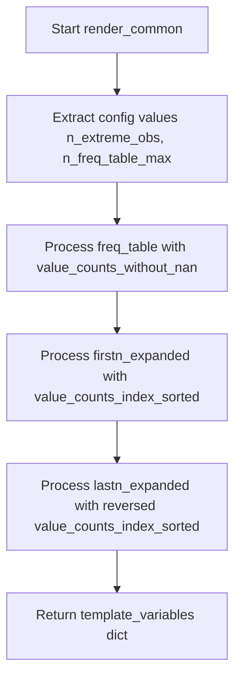

# `render_common.py`

## `src.ydata_profiling.report.structure.variables.render_common.render_common` · *function*

## Summary:
Generates standardized template variables for frequency table rendering in data profiling reports.

## Description:
Processes configuration settings and summary statistics to create structured template variables containing frequency table data and extreme observations for report generation. This function extracts common rendering logic for variable-level reports, enabling consistent presentation of frequency distributions across different variable types.

## Args:
    config (Settings): Configuration object containing rendering parameters such as maximum frequency table rows (n_freq_table_max) and extreme observation limits (n_extreme_obs)
    summary (dict): Dictionary containing variable summary statistics with the following required keys:
        - "value_counts_without_nan": pandas Series with frequency counts excluding NaN values
        - "value_counts_index_sorted": pandas Series with frequency counts sorted by index
        - "n": int representing total count of observations

## Returns:
    dict: Template variables dictionary containing:
        - "freq_table_rows": Formatted frequency table data for main display, created by calling freq_table function
        - "firstn_expanded": Extreme observations from the beginning of sorted frequencies, created by calling extreme_obs_table function
        - "lastn_expanded": Extreme observations from the end of sorted frequencies, created by calling extreme_obs_table function with reversed data

## Raises:
    None explicitly raised

## Constraints:
    Preconditions:
        - config must contain n_extreme_obs and n_freq_table_max attributes
        - summary must contain "value_counts_without_nan", "value_counts_index_sorted", and "n" keys
        - All referenced keys in summary must map to valid data structures (pandas Series, int, etc.)
        - The freq_table and extreme_obs_table functions must handle their respective input parameters correctly

    Postconditions:
        - Returns a dictionary with exactly the three specified keys
        - All values are properly formatted table data structures returned by the utility functions

## Side Effects:
    None

## Control Flow:

