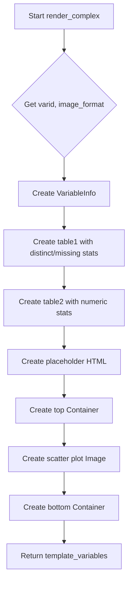

# `render_complex.py`

## `src.ydata_profiling.report.structure.variables.render_complex.render_complex` · *function*

## Summary:
Generates HTML presentation components for displaying complex number variable statistics and visualizations in a profiling report.

## Description:
Creates a structured report layout containing metadata, statistical summaries, and scatter plot visualization for complex number variables. This function extracts the presentation logic for complex variables into a dedicated component to maintain clean separation between data processing and UI rendering.

## Args:
    config (Settings): Configuration object containing report settings including styling and image format preferences
    summary (dict): Dictionary containing variable statistics including varid, varname, alerts, description, n_distinct, p_distinct, n_missing, p_missing, memory_size, mean, min, max, n_zeros, p_zeros, and scatter_data

## Returns:
    dict: Template variables dictionary containing 'top' and 'bottom' keys with presentation components for the complex variable report

## Raises:
    None explicitly raised in the function body

## Constraints:
    Preconditions:
    - summary dictionary must contain all required keys: varid, varname, alerts, description, n_distinct, p_distinct, n_missing, p_missing, memory_size, mean, min, max, n_zeros, p_zeros, scatter_data
    - config must be a valid Settings object with properly initialized html and plot configurations
    
    Postconditions:
    - Returns a dictionary with exactly two keys: 'top' and 'bottom'
    - The 'top' key contains a Container with VariableInfo, two Tables, and a placeholder
    - The 'bottom' key contains a Container with a scatter plot Image

## Side Effects:
    None

## Control Flow:


## Examples:
```python
# Basic usage
config = Settings()
summary = {
    "varid": "complex_var_1",
    "varname": "my_complex_variable",
    "alerts": [],
    "description": "A complex number variable",
    "n_distinct": 100,
    "p_distinct": 0.5,
    "n_missing": 5,
    "p_missing": 0.025,
    "memory_size": 1024,
    "mean": 3+4j,
    "min": 1+2j,
    "max": 5+6j,
    "n_zeros": 2,
    "p_zeros": 0.01,
    "scatter_data": [[1+2j, 3+4j, 5+6j]]
}
result = render_complex(config, summary)
# Returns template_variables dict with 'top' and 'bottom' containers
```

