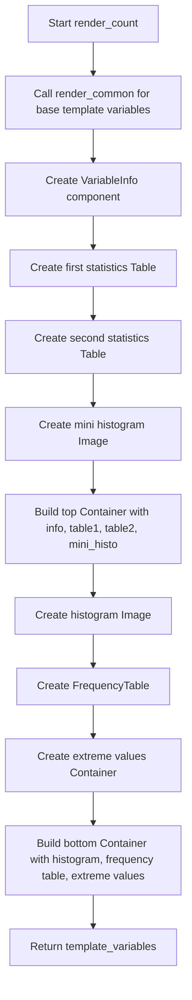

# `render_count.py`

## `src.ydata_profiling.report.structure.variables.render_count.render_count` · *function*

## Summary:
Generates HTML template variables for rendering count-based numerical variable statistics in data profiling reports.

## Description:
Creates a structured set of template variables containing all necessary components for displaying detailed statistical information about real number variables. This function orchestrates the presentation of key metrics, frequency distributions, and visualizations for continuous numerical data types.

The function builds upon common rendering logic provided by `render_common` and adds specific components for count-based variables including variable metadata, summary statistics tables, mini histograms, and detailed frequency distributions. It organizes these components into a hierarchical structure suitable for HTML report generation.

This logic is extracted into its own function rather than being inlined because it handles the specific presentation requirements for numerical variables, separating the concerns of data processing from visualization rendering while maintaining consistency with other variable type renderers.

## Args:
    config (Settings): Configuration object containing report settings including HTML styling, image format preferences, and display parameters such as precision and extreme observation limits.
    summary (dict): Dictionary containing comprehensive statistical summary of the variable with required keys:
        - "varid": Unique identifier for the variable
        - "varname": Human-readable name of the variable  
        - "alerts": List of alerts or warnings about the variable
        - "description": Description text for the variable
        - "n_distinct": Count of distinct values
        - "p_distinct": Percentage of distinct values
        - "n_missing": Count of missing values
        - "p_missing": Percentage of missing values
        - "mean": Mean value of the variable
        - "min": Minimum value of the variable
        - "max": Maximum value of the variable
        - "n_zeros": Count of zero values
        - "p_zeros": Percentage of zero values
        - "memory_size": Memory consumption of the variable
        - "histogram": Tuple containing histogram data (series, bins)
        - "value_counts_without_nan": pandas Series with frequency counts excluding NaN values
        - "value_counts_index_sorted": pandas Series with frequency counts sorted by index
        - "n": Total count of observations

## Returns:
    dict: Template variables dictionary containing:
        - "top": Container with variable information, basic statistics table, and mini histogram
        - "bottom": Container with histogram visualization, frequency table, and extreme values tabs

## Raises:
    None explicitly raised

## Constraints:
    Preconditions:
        - config must contain valid plot.image_format and html.style attributes
        - summary must contain all required keys with appropriate data types
        - All referenced keys in summary must map to valid data structures
        - The render_common function must successfully process the input parameters

    Postconditions:
        - Returns a dictionary with exactly the two keys "top" and "bottom"
        - Both returned containers are properly initialized with their respective components
        - All presentation components are correctly configured with appropriate styling and metadata

## Side Effects:
    None

## Control Flow:


## Examples:
```python
# Typical usage in report generation pipeline
config = Settings()
summary = {
    "varid": "age",
    "varname": "Age",
    "alerts": [],
    "description": "Age of participants",
    "n_distinct": 50,
    "p_distinct": 0.8,
    "n_missing": 5,
    "p_missing": 0.05,
    "mean": 35.2,
    "min": 18,
    "max": 85,
    "n_zeros": 0,
    "p_zeros": 0.0,
    "memory_size": 1024,
    "histogram": (np.array([1,2,3]), np.array([0,10,20,30])),
    "value_counts_without_nan": pd.Series([10, 5, 3]),
    "value_counts_index_sorted": pd.Series([3, 5, 10]),
    "n": 62
}

template_vars = render_count(config, summary)
# Result contains properly structured template variables for HTML report generation
```

