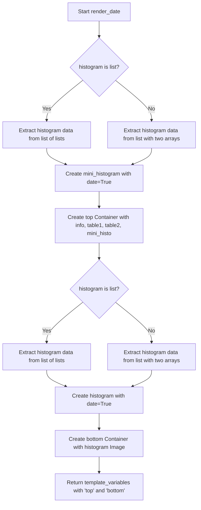

# `render_date.py`

## `src.ydata_profiling.report.structure.variables.render_date.render_date` · *function*

## Summary:
Creates HTML presentation components for date variable summaries in data profiling reports.

## Description:
Generates a dictionary of UI components (tables, images, metadata) that represent statistical summaries and visualizations of date variables for inclusion in HTML reports. This function extracts the presentation logic for date variables into a separate component to maintain clean separation between data processing and visualization rendering.

## Args:
    config (Settings): Configuration object containing report settings including HTML styling and plot preferences
    summary (Dict[str, Any]): Dictionary containing statistical summary data for a date variable with the following required keys:
        - 'varid': Variable identifier
        - 'varname': Variable name
        - 'alerts': List of alerts associated with the variable
        - 'description': Variable description
        - 'n_distinct': Number of distinct values
        - 'p_distinct': Percentage of distinct values
        - 'n_missing': Number of missing values
        - 'p_missing': Percentage of missing values
        - 'memory_size': Memory usage in bytes
        - 'min': Minimum date value
        - 'max': Maximum date value
        - 'histogram': Histogram data (either list of lists or list with two arrays)

## Returns:
    Dict[str, Container]: Dictionary containing two Container objects under keys 'top' and 'bottom':
        - 'top': Container with VariableInfo, summary statistics tables, and mini histogram
        - 'bottom': Container with full-size histogram image

## Raises:
    None explicitly raised - relies on underlying functions for error handling

## Constraints:
    Preconditions:
    - summary dictionary must contain all required keys listed above
    - config must have valid plot.image_format and html.style attributes
    - histogram data must be either a list of lists or a list with two arrays (series and bins)
    
    Postconditions:
    - Returns a dictionary with 'top' and 'bottom' keys containing properly formatted Container objects
    - All numerical values are formatted according to the configured formatters (fmt, fmt_percent, fmt_bytesize)
    - Histogram images are generated with appropriate date-specific formatting

## Side Effects:
    None - Pure function with no external state mutations

## Control Flow:


## Examples:
```python
# Basic usage
config = Settings()
summary = {
    "varid": "date_var_1",
    "varname": "purchase_date",
    "alerts": [],
    "description": "Purchase dates",
    "n_distinct": 100,
    "p_distinct": 0.5,
    "n_missing": 5,
    "p_missing": 0.025,
    "memory_size": 1024,
    "min": "2020-01-01",
    "max": "2023-12-31",
    "histogram": [[1, 2, 3], [10, 20, 30]]
}
result = render_date(config, summary)
# Returns dict with 'top' (Container) and 'bottom' (Container) keys
```

