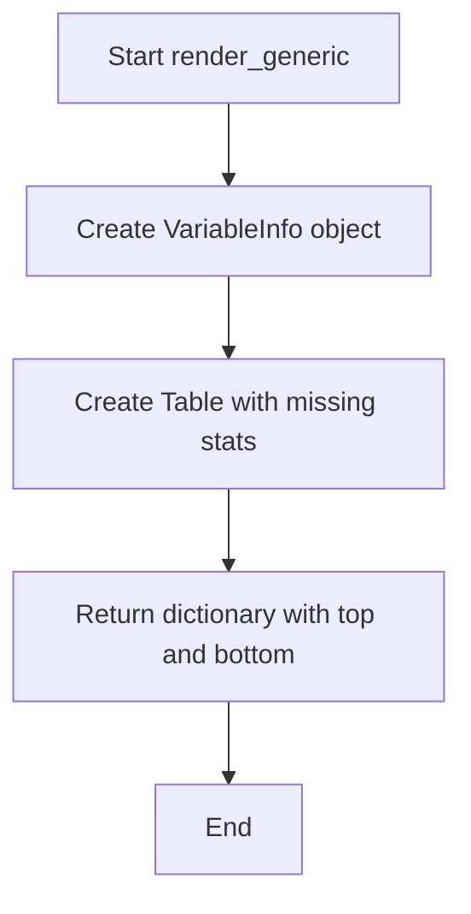

# `render_generic.py`

## `src.ydata_profiling.report.structure.variables.render_generic.render_generic` · *function*

## Summary:
Renders generic variable information for data profiling reports, displaying metadata and basic statistics for unsupported variable types.

## Description:
Creates a standardized presentation structure for variable information in data profiling reports. This function handles the rendering of basic variable metadata (name, description, alerts) and statistical summaries (missing values, memory usage) for variable types that are not specifically handled by more specialized rendering functions.

The function is designed to provide a consistent fallback presentation for variables that don't match specific type categories (like numerical, categorical, etc.), ensuring all variables in a dataset are displayed in a uniform manner regardless of their type. It serves as a universal renderer for variables that fall outside of specialized type handling.

## Args:
    config (Settings): Configuration object containing report settings including HTML styling options
    summary (dict): Dictionary containing variable summary information with keys:
        - "varid": Unique identifier for the variable
        - "alerts": List of alerts associated with the variable
        - "varname": Name of the variable
        - "description": Description of the variable
        - "n_missing": Count of missing values
        - "p_missing": Percentage of missing values
        - "memory_size": Memory usage in bytes
        - "alert_fields": Set of field names that have triggered alerts

## Returns:
    dict: A dictionary containing two keys:
        - "top": Container object containing VariableInfo, Table, and HTML elements arranged in a grid layout
        - "bottom": None (placeholder for future implementation)

## Raises:
    None: This function does not explicitly raise exceptions, though underlying component constructors may raise exceptions for invalid parameters.

## Constraints:
    Preconditions:
        - The summary dictionary must contain all required keys: "varid", "alerts", "varname", "description", "n_missing", "p_missing", "memory_size", "alert_fields"
        - The config parameter must be a valid Settings object with proper HTML styling configuration
        - All values in the summary dictionary must be compatible with the formatters and renderable components
        
    Postconditions:
        - Returns a properly structured dictionary with "top" and "bottom" keys
        - The "top" value contains a Container with VariableInfo, Table, and HTML elements
        - The "bottom" value is None

## Side Effects:
    None: This function has no side effects beyond creating objects and returning a dictionary structure.

## Control Flow:


## Examples:
```python
# Basic usage example
config = Settings()
summary = {
    "varid": "var_123",
    "alerts": ["high_missing"],
    "varname": "age",
    "description": "Age of participants",
    "n_missing": 5,
    "p_missing": 0.02,
    "memory_size": 1024,
    "alert_fields": {"n_missing"}
}

result = render_generic(config, summary)
# Returns a dictionary with "top" containing a Container and "bottom" set to None

# The returned structure allows for easy integration into larger report layouts
# where the "top" container can be rendered as part of a variable section
```

