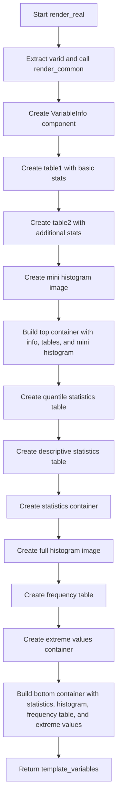

# `render_real.py`

## `src.ydata_profiling.report.structure.variables.render_real.render_real` · *function*

## Summary:
Generates HTML report structure for real number variables including statistical summaries, histograms, and frequency distributions.

## Description:
Creates a comprehensive HTML report structure for real number variables by combining statistical summaries, frequency distributions, and visualizations. This function orchestrates the presentation of key metrics such as mean, median, variance, skewness, and quantile statistics, along with both mini and full histogram visualizations.

The function leverages the `render_common` helper to obtain frequency table data and then constructs several report components including:
- Variable information header
- Basic statistics table (distinct values, missing values, infinite values, mean)
- Additional statistics table (min/max, zeros, negative values, memory usage)
- Quantile statistics table
- Descriptive statistics table (standard deviation, coefficient of variation, kurtosis, etc.)
- Histogram visualization
- Frequency table of common values
- Extreme values display

This logic is extracted into its own function to separate the concerns of real-number-specific report generation from general variable rendering logic, ensuring clean modularity and maintainability.

## Args:
    config (Settings): Configuration object containing report settings including HTML styling, image format, and precision preferences
    summary (dict): Dictionary containing variable summary statistics with keys:
        - "varid": Variable identifier
        - "varname": Variable name
        - "alerts": List of alerts associated with the variable
        - "description": Variable description text
        - "n_distinct": Count of distinct values
        - "p_distinct": Percentage of distinct values
        - "n_missing": Count of missing values
        - "p_missing": Percentage of missing values
        - "n_infinite": Count of infinite values
        - "p_infinite": Percentage of infinite values
        - "mean": Mean value
        - "min": Minimum value
        - "max": Maximum value
        - "n_zeros": Count of zero values
        - "p_zeros": Percentage of zero values
        - "n_negative": Count of negative values
        - "p_negative": Percentage of negative values
        - "memory_size": Memory usage in bytes
        - "histogram": Histogram data (either list of arrays or tuple of arrays)
        - "5%": 5th percentile value
        - "25%": 25th percentile value (Q1)
        - "50%": 50th percentile value (median)
        - "75%": 75th percentile value (Q3)
        - "95%": 95th percentile value
        - "range": Range of values (max - min)
        - "iqr": Interquartile range
        - "std": Standard deviation
        - "cv": Coefficient of variation
        - "kurtosis": Kurtosis measure
        - "mad": Median absolute deviation
        - "skewness": Skewness measure
        - "sum": Sum of all values
        - "variance": Variance measure
        - "monotonic": Monotonicity indicator
        - "alert_fields": Fields that triggered alerts

## Returns:
    dict: Template variables dictionary containing:
        - "top": Container with variable info, basic stats table, additional stats table, and mini histogram
        - "bottom": Container with statistics, histogram, frequency table, and extreme values

## Raises:
    None explicitly raised

## Constraints:
    Preconditions:
        - config must contain valid HTML style settings and image format configuration
        - summary must contain all required keys with appropriate data types
        - histogram data in summary must be either a list of arrays or tuple of arrays
        - All numeric values in summary must be convertible to float or int
        - All formatting functions (fmt, fmt_numeric, etc.) must handle their inputs appropriately

    Postconditions:
        - Returns a dictionary with exactly two keys: "top" and "bottom"
        - Both "top" and "bottom" values are Container instances
        - All table components are properly formatted with appropriate styling
        - Histogram images are generated with correct sizing and formatting

## Side Effects:
    - Calls external plotting functions (histogram, mini_histogram) that may generate temporary files or process data
    - Uses formatters to convert numeric values to human-readable strings
    - May generate HTML content for report rendering

## Control Flow:


## Examples:
    >>> config = Settings()
    >>> summary = {
    ...     "varid": "var1",
    ...     "varname": "age",
    ...     "alerts": [],
    ...     "description": "Age of participants",
    ...     "n_distinct": 50,
    ...     "p_distinct": 0.8,
    ...     "n_missing": 5,
    ...     "p_missing": 0.08,
    ...     "n_infinite": 0,
    ...     "p_infinite": 0.0,
    ...     "mean": 35.2,
    ...     "min": 18.0,
    ...     "max": 85.0,
    ...     "n_zeros": 0,
    ...     "p_zeros": 0.0,
    ...     "n_negative": 0,
    ...     "p_negative": 0.0,
    ...     "memory_size": 1024,
    ...     "histogram": ([0, 1, 2, 3], [10, 20, 15, 5]),
    ...     "5%": 20.0,
    ...     "25%": 25.0,
    ...     "50%": 35.0,
    ...     "75%": 45.0,
    ...     "95%": 70.0,
    ...     "range": 67.0,
    ...     "iqr": 20.0,
    ...     "std": 12.5,
    ...     "cv": 0.35,
    ...     "kurtosis": -0.5,
    ...     "mad": 10.0,
    ...     "skewness": 0.2,
    ...     "sum": 1760.0,
    ...     "variance": 156.25,
    ...     "monotonic": 1,
    ...     "alert_fields": []
    ... }
    >>> result = render_real(config, summary)
    >>> print(list(result.keys()))
    ['top', 'bottom']
```

