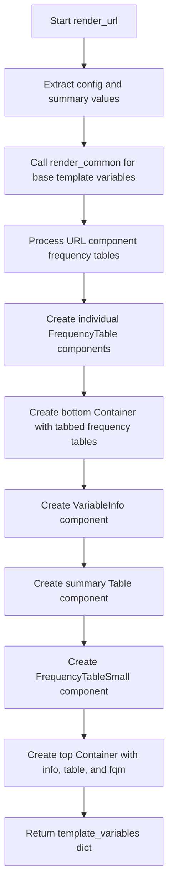

# `render_url.py`

## `src.ydata_profiling.report.structure.variables.render_url.render_url` · *function*

## Summary:
Generates template variables for URL-type variable reports, including frequency distributions for URL components and summary statistics.

## Description:
Processes URL variable summary statistics to create a comprehensive set of template variables for report generation. This function builds upon common rendering logic to create detailed frequency tables for different URL components (scheme, netloc, path, query, fragment) and combines them with summary statistics and metadata for presentation.

The function orchestrates the creation of multiple presentation components including frequency tables, summary tables, and containers to organize the URL-specific information in a structured report format. It's designed to be called by the main report generation pipeline when processing URL-type variables.

## Args:
    config (Settings): Configuration object containing rendering parameters such as maximum frequency table rows (n_freq_table_max) and categorical observation limits (vars.cat.n_obs)
    summary (dict): Dictionary containing URL variable summary statistics with required keys:
        - "varid": Variable identifier
        - "varname": Variable name
        - "alerts": List of alerts associated with the variable
        - "description": Variable description
        - "n_distinct": Number of distinct values
        - "p_distinct": Percentage of distinct values
        - "n_missing": Number of missing values
        - "p_missing": Percentage of missing values
        - "memory_size": Memory usage in bytes
        - "n": Total count of observations
        - "value_counts_without_nan": Frequency counts excluding NaN values
        - "alert_fields": Fields that triggered alerts
        - "scheme_counts", "netloc_counts", "path_counts", "query_counts", "fragment_counts": Frequency counts for each URL component

## Returns:
    dict: Template variables dictionary containing:
        - All keys from render_common output
        - "freqtable_scheme", "freqtable_netloc", "freqtable_path", "freqtable_query", "freqtable_fragment": Frequency tables for URL components
        - "top": Container with VariableInfo, summary Table, and FrequencyTableSmall
        - "bottom": Container with all URL frequency tables organized in tabs

## Raises:
    None explicitly raised

## Constraints:
    Preconditions:
        - config must contain n_freq_table_max attribute
        - summary must contain all required keys mentioned in Args section
        - All frequency count fields in summary must be valid pandas Series or compatible data structures
        - All referenced keys in summary must map to valid data structures

    Postconditions:
        - Returns a dictionary with all expected template variables for URL report rendering
        - All frequency tables are properly formatted and limited to configured maximum rows
        - Presentation components are correctly instantiated with appropriate parameters

## Side Effects:
    None

## Control Flow:


## Examples:
```python
# Typical usage in report generation pipeline
config = Settings()
summary = {
    "varid": "url_var_1",
    "varname": "website_url",
    "alerts": [],
    "description": "URLs of website pages",
    "n_distinct": 150,
    "p_distinct": 0.75,
    "n_missing": 5,
    "p_missing": 0.025,
    "memory_size": 1024,
    "n": 200,
    "value_counts_without_nan": pd.Series([10, 5, 3]),
    "alert_fields": [],
    "scheme_counts": pd.Series([15, 5]),
    "netloc_counts": pd.Series([20, 10, 5]),
    "path_counts": pd.Series([25, 15, 10, 5]),
    "query_counts": pd.Series([8, 4, 2]),
    "fragment_counts": pd.Series([3, 1])
}

template_vars = render_url(config, summary)
# Result contains all template variables needed for URL report rendering
```

