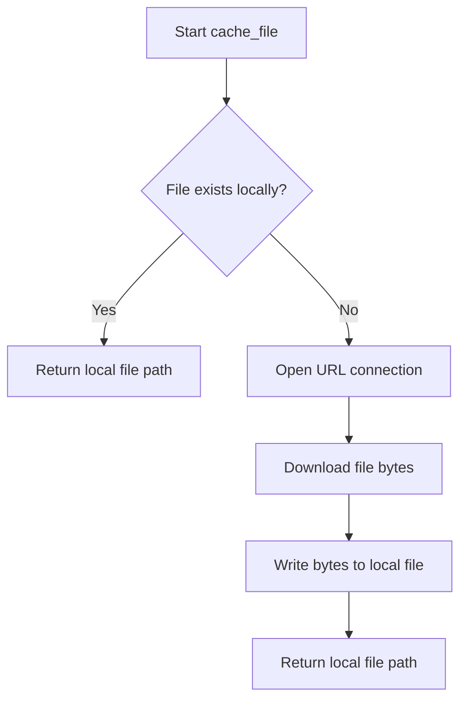
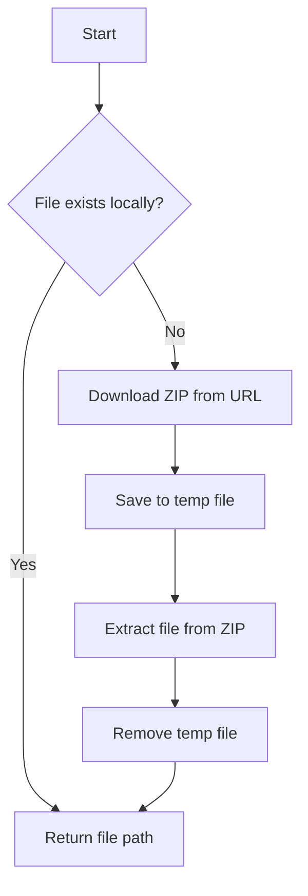

# `cache.py`

## `src.ydata_profiling.utils.cache.cache_file` · *function*

## Summary:
Downloads and caches a remote file to a local data directory, returning the local file path.

## Description:
This function manages downloading and caching remote files to avoid repeated network requests. It creates a local data directory if it doesn't exist, checks if the requested file is already cached locally, and downloads it from the provided URL only if it's missing.

## Args:
    file_name (str): Name of the file to cache locally
    url (str): URL from which to download the file if not already cached

## Returns:
    Path: Absolute path to the cached file (either existing local copy or newly downloaded file)

## Raises:
    URLError: When the URL cannot be accessed or the network request fails

## Constraints:
    Preconditions:
        - Valid string arguments for file_name and url
        - Network connectivity available for URL access (when download is required)
    Postconditions:
        - Local data directory exists
        - File is either already cached or successfully downloaded
        - Returned path points to an existing file

## Side Effects:
    - Creates local data directory if it doesn't exist
    - Downloads file from URL and writes to local filesystem
    - May perform network I/O operations

## Control Flow:


## Examples:
```python
# Cache a remote CSV file
file_path = cache_file("dataset.csv", "https://example.com/data/dataset.csv")
# Returns Path object pointing to local cached file

# Second call returns cached version immediately
cached_path = cache_file("dataset.csv", "https://example.com/data/dataset.csv")
# No network request made, returns same local path
```

## `src.ydata_profiling.utils.cache.cache_zipped_file` · *function*

## Summary:
Downloads and caches a zipped file from a URL, extracting a specific file from the archive to a local data directory.

## Description:
This function manages downloading and caching of zipped files from remote URLs. It ensures that files are only downloaded when they don't already exist locally, and handles the extraction process from ZIP archives. The function is designed to be used for caching datasets or other resources that are distributed as compressed archives.

## Args:
    file_name (str): The name of the file to extract from the ZIP archive and cache locally.
    url (str): The URL from which to download the ZIP archive containing the target file.

## Returns:
    Path: A pathlib.Path object pointing to the cached file location on the local filesystem. The file is guaranteed to exist after the function returns, whether it was newly downloaded or already existed locally.

## Raises:
    urllib.error.URLError: When the HTTP request to download the ZIP file fails.
    zipfile.BadZipFile: When the downloaded file is not a valid ZIP archive.
    KeyError: When the specified file_name is not found within the ZIP archive.

## Constraints:
    Preconditions:
        - The URL must be accessible and return a valid ZIP archive
        - The file_name must exist within the ZIP archive
        - The local data directory must be writable
    Postconditions:
        - The requested file is available at the returned path
        - Temporary files are cleaned up after processing

## Side Effects:
    - Creates a local data directory if it doesn't exist
    - Downloads data from a remote URL
    - Writes files to the local filesystem
    - Creates and removes temporary files during processing

## Control Flow:


## Examples:
```python
# Download and cache a CSV file from a ZIP archive
file_path = cache_zipped_file("dataset.csv", "https://example.com/data.zip")
# Returns Path object pointing to cached dataset.csv file
```

