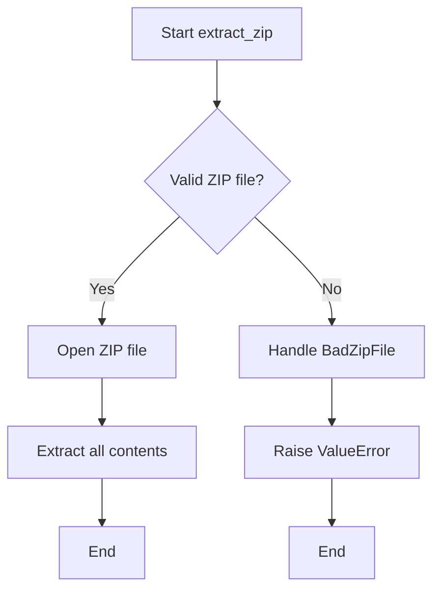

# `common.py`

## `src.ydata_profiling.utils.common.update` · *function*

## Summary:
Recursively updates a dictionary with values from another mapping, performing deep merging for nested dictionaries.

## Description:
This function performs a deep merge of two dictionaries, where nested dictionaries are merged recursively rather than replaced entirely. It modifies the first dictionary in-place and returns it. This utility is commonly used for configuration merging, where partial configurations need to be applied on top of base configurations while preserving nested structures.

## Args:
    d (dict): The dictionary to be updated with values from the second mapping. This dictionary is modified in-place.
    u (Mapping): The mapping containing values to update into the first dictionary. Can contain nested mappings.

## Returns:
    dict: The updated dictionary `d` with values from `u` merged in. This is the same object as the input `d`.

## Raises:
    None: This function does not explicitly raise any exceptions.

## Constraints:
    Preconditions:
        - `d` must be a dictionary
        - `u` must be a mapping (dict-like object)
    Postconditions:
        - All keys from `u` are present in `d`
        - Nested dictionaries in `u` are merged with corresponding dictionaries in `d`
        - Non-dictionary values in `u` overwrite corresponding values in `d`

## Side Effects:
    None: This function has no side effects beyond modifying the input dictionary `d`.

## Control Flow:
```mermaid
flowchart TD
    A[Start update(d, u)] --> B{Iterate u.items()}
    B --> C{v is Mapping?}
    C -->|Yes| D[update(d.get(k, {}), v)]
    C -->|No| E[d[k] = v]
    D --> F[Return merged result]
    E --> F
    F --> G[Return d]
```

## Examples:
```python
# Basic usage
base_config = {'a': 1, 'b': {'c': 2}}
updates = {'b': {'d': 3}, 'e': 4}
result = update(base_config, updates)
# Result: {'a': 1, 'b': {'c': 2, 'd': 3}, 'e': 4}

# Deep merge
config1 = {'database': {'host': 'localhost', 'port': 5432}}
config2 = {'database': {'port': 3306, 'username': 'admin'}}
result = update(config1, config2)
# Result: {'database': {'host': 'localhost', 'port': 3306, 'username': 'admin'}}
```

## `src.ydata_profiling.utils.common._copy` · *function*

## Summary:
Copies a file from the current path to a specified target location.

## Description:
A utility method that performs file copying operations from the current file path to a designated target path. This method ensures the source is a valid file before attempting the copy operation.

## Args:
    target (str or Path): The destination path where the file should be copied. Can be a string or another Path-like object.

## Returns:
    None: This method does not return any value.

## Raises:
    AssertionError: Raised when the current path does not represent a file (i.e., when self.is_file() returns False).

## Constraints:
    Preconditions:
        - The current object must represent a valid file path (self.is_file() must return True)
        - The source file must exist and be readable
    Postconditions:
        - The target file will be created with identical content to the source file
        - The target file will have the same permissions as the source file (on Unix systems)

## Side Effects:
    - Creates a new file at the target location
    - May modify filesystem state by creating new files
    - No external state mutations or service calls

## Control Flow:
```mermaid
flowchart TD
    A[Start _copy method]
    B{self.is_file() == True?}
    C[Assert True]
    D[Convert self to str]
    E[Call shutil.copy(str(self), target)]
    F[End]
    
    A --> B
    B -->|Yes| C
    C --> D
    D --> E
    E --> F
    B -->|No| G[AssertionError raised]
    G --> F
```

## `src.ydata_profiling.utils.common.extract_zip` · *function*

## Summary:
Extracts all contents from a ZIP archive file to a specified directory.

## Description:
This utility function opens a ZIP file and extracts all its contents to the designated target directory. It provides enhanced error handling by converting zipfile.BadZipFile exceptions into more descriptive ValueError exceptions with the message "Bad zip file".

## Args:
    outfile (str): Path to the ZIP file to be extracted.
    effective_path (str): Directory path where the ZIP contents will be extracted.

## Returns:
    None: This function does not return any value.

## Raises:
    ValueError: Raised when the specified file is not a valid ZIP file, with the message "Bad zip file".

## Constraints:
    Preconditions:
        - The `outfile` parameter must point to a valid file that exists on the filesystem.
        - The `effective_path` parameter must be a valid directory path that exists or can be created.
    Postconditions:
        - All contents of the ZIP file are extracted to the specified directory.
        - No files are left in an inconsistent state if extraction fails partway through.

## Side Effects:
    - Creates files and directories on the filesystem at the location specified by `effective_path`.
    - May modify the filesystem state by creating new files and directories.

## Control Flow:


## Examples:
```python
# Basic usage
extract_zip("data.zip", "/tmp/extracted")

# Error handling
try:
    extract_zip("corrupt.zip", "/tmp/extracted")
except ValueError as e:
    print(f"Extraction failed: {e}")
```

## `src.ydata_profiling.utils.common.test_jpeg1` · *function*

## Summary:
Tests if a file header contains JFIF signature to identify JPEG image files.

## Description:
This function performs a basic JPEG file type detection by examining the first 23 bytes of a file's header for the presence of the "JFIF" marker. It's typically used as part of a broader image file type identification system, likely integrated with Python's standard library `imghdr` module functionality. The function is designed to be compatible with the interface expected by `imghdr`'s test functions.

## Args:
    h (bytes): First 23 bytes of a file header, typically obtained by reading the beginning of a file.
    f (file-like object or None): File object being tested, though not directly used in this function's implementation.

## Returns:
    str or None: Returns "jpeg" if the JFIF signature is detected in the header bytes, otherwise returns None.

## Raises:
    None: This function does not explicitly raise exceptions.

## Constraints:
    Preconditions:
    - Parameter `h` should contain at least 0 bytes (can be empty) and should be a bytes object
    - The function assumes `h` is a bytes object
    
    Postconditions:
    - Function returns either "jpeg" or None
    - No modifications are made to input parameters

## Side Effects:
    None: This function has no side effects as it only performs a read-only check on input data.

## Control Flow:
```mermaid
flowchart TD
    A[Start test_jpeg1] --> B{b"JFIF" in h[:23]?}
    B -- Yes --> C[Return "jpeg"]
    B -- No --> D[Return None]
```

## Examples:
    # Basic usage with file header bytes
    header_bytes = open('image.jpg', 'rb').read(23)
    result = test_jpeg1(header_bytes, None)
    # result would be "jpeg" if it's a valid JPEG
    
    # Usage in a file type detection context
    def detect_file_type(file_path):
        with open(file_path, 'rb') as f:
            header = f.read(23)
            return test_jpeg1(header, f) or "unknown"
```

## `src.ydata_profiling.utils.common.test_jpeg2` · *function*

## Summary:
Tests if a file header corresponds to a JPEG image format using binary signature matching.

## Description:
This function implements a JPEG format detection algorithm by analyzing the first 32 bytes of a file header. It's designed to be compatible with Python's imghdr module format detection interface, where it receives a file header buffer and filename as arguments. The function checks for specific byte patterns that identify JPEG files according to the JPEG specification. It compares the header against a predefined JPEG marker pattern (JPEG_MARK) to determine file format.

## Args:
    h (bytes): File header bytes, typically the first 32 bytes of a file
    f (str): Filename or file path being tested (used for compatibility with imghdr interface)

## Returns:
    str: Returns "jpeg" if the header matches JPEG format criteria, None otherwise

## Raises:
    None explicitly raised

## Constraints:
    Preconditions:
    - The header buffer `h` must be a bytes object with length ≥ 32
    - The function assumes the header contains valid binary data for format detection
    
    Postconditions:
    - Function returns either "jpeg" string or None
    - No side effects or modifications to input parameters

## Side Effects:
    None

## Control Flow:
```mermaid
flowchart TD
    A[Start test_jpeg2] --> B{len(h) ≥ 32?}
    B -- No --> C[Return None]
    B -- Yes --> D{h[5] == 67?}
    D -- No --> C
    D -- Yes --> E{h[:32] == JPEG_MARK?}
    E -- No --> C
    E -- Yes --> F[Return "jpeg"]
```

## Examples:
    # Valid JPEG header (simplified example)
    result = test_jpeg2(b'\xff\xd8\xff\xe0\x00\x41JFIF\x00\x01\x01\x01\x00H\x00H\x00\x00\xff\xdb\x00\x43\x00\x08\x06\x06\x07\x06\x05\x08\x07\x07\x07\t\t\x08\n\x0c\x14\r\x0c\x0b\x0b\x0c\x19\x12\x13\x0f', 'image.jpg')
    # Returns: "jpeg"
    
    # Invalid header
    result = test_jpeg2(b'invalid_header_data', 'image.txt')
    # Returns: None

## `src.ydata_profiling.utils.common.test_jpeg3` · *function*

## Summary:
Determines if a byte sequence represents a JPEG image file by checking for valid JPEG file signatures.

## Description:
This function implements JPEG file type detection by examining the initial bytes of a file buffer. It checks for standard JPEG markers that indicate a valid JPEG file format. The function is designed to be used as part of a broader file type identification system, likely integrated with Python's `imghdr` module or similar file signature detection utilities. This function is typically called as part of a series of file type detection functions that share a common interface.

## Args:
    h (bytes): A bytes object containing the initial portion of a file buffer, typically used for magic number detection. Must support slicing operations.
    f (Any): Unused parameter, maintained for interface compatibility with other file type detection functions in the same detection suite.

## Returns:
    str: Returns "jpeg" if the byte sequence matches JPEG file signatures, otherwise implicitly returns None.

## Raises:
    None explicitly raised

## Constraints:
    Preconditions:
    - Parameter `h` must be a bytes object that supports slicing operations
    - The bytes object should contain at least 10 bytes for proper signature checking
    
    Postconditions:
    - Function returns "jpeg" only when JPEG signature markers are detected
    - Function does not modify the input parameters

## Side Effects:
    None

## Control Flow:
```mermaid
flowchart TD
    A[Start test_jpeg3] --> B{h[6:10] in (b"JFIF", b"Exif")?}
    B -- Yes --> C[Return "jpeg"]
    B -- No --> D{h[:2] == b"\\xff\\xd8"?}
    D -- Yes --> E[Return "jpeg"]
    D -- No --> F[Implicit Return None]
```

## Examples:
    # Valid JPEG file signature with JFIF marker
    result = test_jpeg3(b"\x00\x00\x00\x00\x00\x00JFIF\x00\x00\x00\x00", None)
    # Returns: "jpeg"
    
    # Valid JPEG signature with SOI marker
    result = test_jpeg3(b"\xff\xd8\xff\xe0\x00\x10JFIF\x00\x00\x00\x00", None)
    # Returns: "jpeg"
    
    # Invalid signature
    result = test_jpeg3(b"invalid_file_signature", None)
    # Returns: None

## `src.ydata_profiling.utils.common.convert_timestamp_to_datetime` · *function*

## Summary:
Converts a Unix timestamp integer into a Python datetime object, handling both positive and negative timestamp values.

## Description:
This utility function transforms Unix timestamps (seconds since January 1, 1970) into Python datetime objects. It provides special handling for negative timestamps that would otherwise cause issues with standard timestamp conversion methods.

## Args:
    timestamp (int): Unix timestamp in seconds. Can be positive (future or past dates) or negative (dates before Unix epoch).

## Returns:
    datetime: A Python datetime object representing the converted timestamp. For negative timestamps, the result is calculated by adding the seconds to the Unix epoch start (January 1, 1970).

## Raises:
    None explicitly raised. However, negative timestamps that are too large in magnitude could potentially cause overflow issues in timedelta calculations.

## Constraints:
    Precondition: The input must be an integer representing a valid Unix timestamp.
    Postcondition: The returned datetime object accurately represents the timestamp value, regardless of whether it's positive or negative.

## Side Effects:
    None

## Control Flow:
```mermaid
flowchart TD
    A[Start convert_timestamp_to_datetime] --> B{timestamp >= 0?}
    B -- Yes --> C[datetime.fromtimestamp(timestamp)]
    B -- No --> D[datetime(1970,1,1) + timedelta(seconds=int(timestamp))]
    C --> E[Return datetime]
    D --> E
```

## Examples:
    # Convert positive timestamp (e.g., 1609459200 = 2021-01-01 00:00:00 UTC)
    result = convert_timestamp_to_datetime(1609459200)
    # Returns: datetime.datetime(2021, 1, 1, 0, 0)
    
    # Convert negative timestamp (e.g., -86400 = 1969-12-31 00:00:00 UTC)
    result = convert_timestamp_to_datetime(-86400)
    # Returns: datetime.datetime(1969, 12, 31, 0, 0)
``

