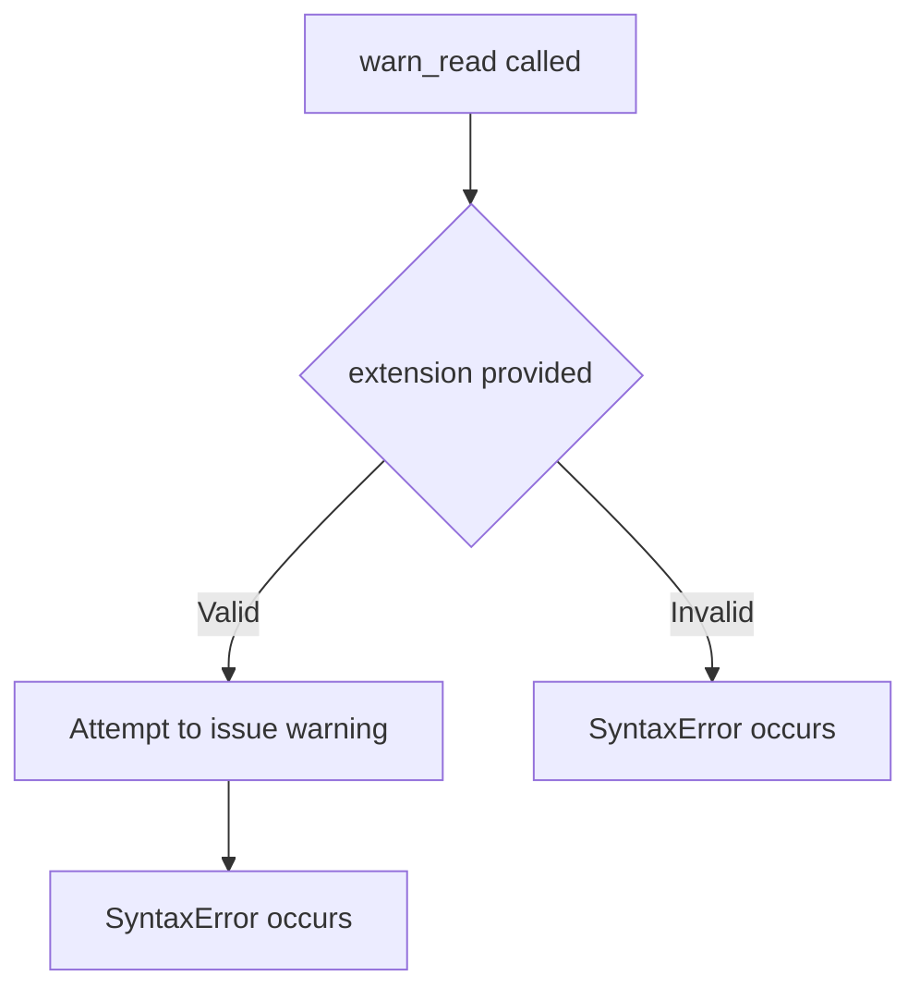
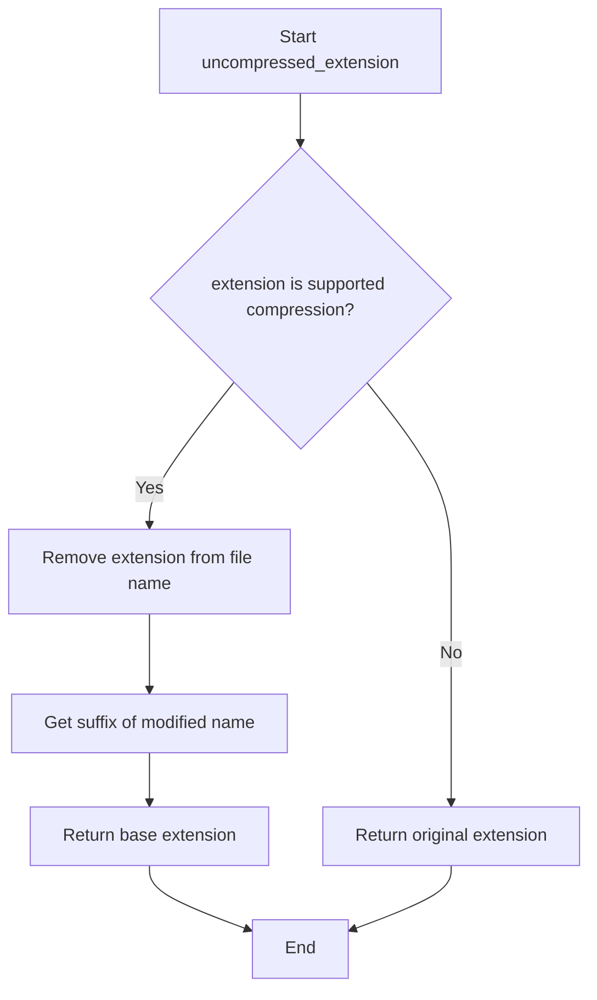
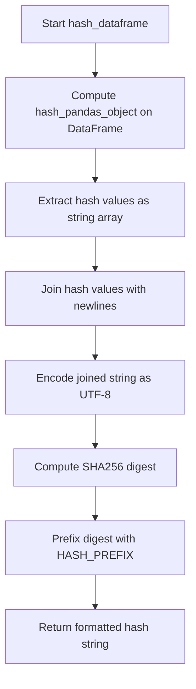
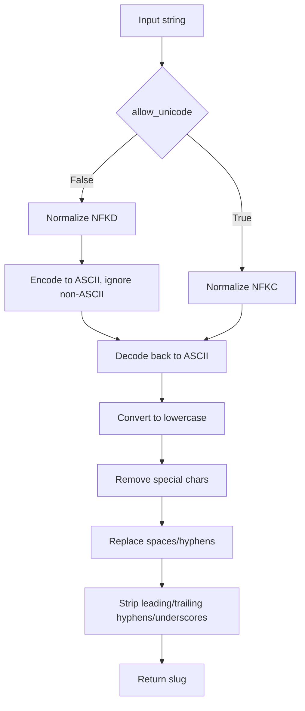

# `dataframe.py`

## `src.ydata_profiling.utils.dataframe.warn_read` · *function*

## Summary:
Function that issues a warning about reading files with a specific extension.

## Description:
This function is intended to issue a warning message when reading files with a particular extension. The function signature indicates it accepts an extension parameter and issues a warning, but the implementation appears to be incomplete or malformed in the provided code.

## Args:
    extension (str): The file extension that triggers the warning message.

## Returns:
    None: This function does not return any value.

## Raises:
    SyntaxError: The current implementation contains a syntax error due to incomplete `warnings.warn()` call.

## Constraints:
    Preconditions:
    - The extension parameter must be a string
    - The function currently has a syntax error preventing execution
    
    Postconditions:
    - Function would issue a warning if properly implemented

## Side Effects:
    - Would issue a warning message via Python's warnings module if properly implemented
    - No file I/O operations or external state mutations occur

## Control Flow:


## Examples:
    # This would normally issue a warning about CSV files
    # warn_read("csv")  # Currently fails with SyntaxError
    
    # This would normally issue a warning about Excel files  
    # warn_read("xlsx") # Currently fails with SyntaxError
```

## `src.ydata_profiling.utils.dataframe.is_supported_compression` · *function*

## Summary:
Determines whether a given file extension corresponds to a supported compression format.

## Description:
Checks if a file extension is one of the recognized compression formats (.bz2, .gz, .xz, .zip) to determine if a file requires decompression before processing. This function is used to validate compression support when reading files in the profiling pipeline.

## Args:
    file_extension (str): The file extension to check, including the leading dot (e.g., ".gz", ".zip"). Case-insensitive.

## Returns:
    bool: True if the file extension is one of the supported compression formats (.bz2, .gz, .xz, .zip), False otherwise.

## Raises:
    None: This function does not raise any exceptions.

## Constraints:
    Preconditions:
    - The input file_extension parameter must be a string
    - The file_extension should include the leading dot (e.g., ".gz" rather than "gz")
    
    Postconditions:
    - The function returns a boolean value (True or False)
    - The comparison is case-insensitive due to the .lower() conversion

## Side Effects:
    None: This function has no side effects and is purely a validation check.

## Control Flow:
```mermaid
flowchart TD
    A[Input file_extension] --> B{file_extension.lower() in [".bz2", ".gz", ".xz", ".zip"]}
    B -- True --> C[Return True]
    B -- False --> D[Return False]
```

## Examples:
    # Check supported compression formats
    is_supported_compression(".gz")     # Returns True
    is_supported_compression(".bz2")    # Returns True
    is_supported_compression(".xz")     # Returns True
    is_supported_compression(".zip")    # Returns True
    
    # Check unsupported formats
    is_supported_compression(".txt")    # Returns False
    is_supported_compression(".csv")    # Returns False
    
    # Case insensitive check
    is_supported_compression(".GZ")     # Returns True
```

## `src.ydata_profiling.utils.dataframe.remove_suffix` · *function*

## Summary:
Removes a specified suffix from a string if it exists at the end of the string.

## Description:
This utility function checks if the provided text ends with the specified suffix and removes it if present. If the suffix is empty or the text doesn't end with the suffix, the original text is returned unchanged. This function is commonly used for cleaning column names or processing string identifiers that may have standardized suffixes.

## Args:
    text (str): The input string from which to remove the suffix
    suffix (str): The suffix to remove from the end of the text

## Returns:
    str: The text with the suffix removed if it was present, otherwise the original text unchanged

## Raises:
    None

## Constraints:
    Preconditions:
        - Both `text` and `suffix` must be strings
        - The function handles empty strings gracefully
    
    Postconditions:
        - If suffix is empty, original text is returned
        - If text doesn't end with suffix, original text is returned
        - If text ends with suffix, the suffix is removed from the end

## Side Effects:
    None

## Control Flow:


## Examples:
    >>> remove_suffix("filename.txt", ".txt")
    "filename"
    
    >>> remove_suffix("data.csv", ".json")
    "data.csv"
    
    >>> remove_suffix("test", "")
    "test"
    
    >>> remove_suffix("", ".txt")
    ""
```

## `src.ydata_profiling.utils.dataframe.uncompressed_extension` · *function*

## Summary:
Extracts the base file extension by removing compression suffixes from compressed files.

## Description:
Returns the actual file extension of a file by stripping away compression suffixes (such as .gz, .bz2, .xz, .zip) to reveal the underlying file format. For example, given a file named "data.csv.gz", this function returns ".csv" representing the base file type before compression. For uncompressed files, it simply returns the file's extension.

## Args:
    file_name (Path): A pathlib.Path object representing the full path to a file

## Returns:
    str: The base file extension (including the leading dot) after removing compression suffixes, or the original extension if no compression is detected

## Raises:
    None

## Constraints:
    Preconditions:
        - The input file_name must be a valid pathlib.Path object
        - The file_name should represent a valid file path
        
    Postconditions:
        - The returned string always includes a leading dot (e.g., ".csv", ".txt")
        - The returned extension represents the actual file format, not the compressed version

## Side Effects:
    None

## Control Flow:


## Examples:
    >>> from pathlib import Path
    >>> uncompressed_extension(Path("data.csv.gz"))
    '.csv'
    
    >>> uncompressed_extension(Path("document.pdf"))
    '.pdf'
    
    >>> uncompressed_extension(Path("archive.tar.xz"))
    '.tar'
    
    >>> uncompressed_extension(Path("file.txt"))
    '.txt'
```

## `src.ydata_profiling.utils.dataframe.read_pandas` · *function*

## Summary:
Reads data files of various formats into a pandas DataFrame, automatically detecting and handling different file extensions.

## Description:
This function provides a unified interface for reading data files into pandas DataFrames by automatically detecting the file format based on its extension and using the appropriate pandas reading function. It handles common data formats including CSV, JSON, Excel, Stata, Parquet, Pickle, and SAS files, with special handling for compressed files through the `uncompressed_extension` helper function.

The function is designed to centralize file reading logic and provide consistent behavior across different data formats while maintaining compatibility with pandas' native reading methods. It serves as a wrapper around pandas' various file reading functions to simplify data loading in the profiling pipeline.

## Args:
    file_name (Path): A pathlib.Path object representing the full path to the data file to be read

## Returns:
    pd.DataFrame: A pandas DataFrame containing the data from the specified file

## Raises:
    ValueError: When attempting to read a tar-compressed file directly, which is not supported by pandas

## Constraints:
    Preconditions:
        - The file_name parameter must be a valid pathlib.Path object pointing to an existing file
        - The file must be readable and contain valid data for the specified format
        - The file extension must be recognizable by the function (or default to CSV parsing)
        
    Postconditions:
        - Returns a valid pandas DataFrame object
        - The returned DataFrame contains the data from the input file
        - If the file extension is not recognized, defaults to CSV parsing

## Side Effects:
    - May issue warnings via Python's warnings module when encountering unrecognized file extensions (though the current implementation has a syntax error in the warning function)
    - Performs file I/O operations to read the specified file
    - No external state mutations or database writes

## Control Flow:
```mermaid
flowchart TD
    A[Start read_pandas] --> B[Get file extension using uncompressed_extension]
    B --> C{Extension is .json?}
    C -- Yes --> D[Read with pd.read_json]
    C -- No --> E{Extension is .jsonl?}
    E -- Yes --> F[Read with pd.read_json(lines=True)]
    E -- No --> G{Extension is .dta?}
    G -- Yes --> H[Read with pd.read_stata]
    G -- No --> I{Extension is .tsv?}
    I -- Yes --> J[Read with pd.read_csv(sep="\\t")]
    I -- No --> K{Extension in [.xls, .xlsx]?}
    K -- Yes --> L[Read with pd.read_excel]
    K -- No --> M{Extension in [.hdf, .h5]?}
    M -- Yes --> N[Read with pd.read_hdf]
    M -- No --> O{Extension in [.sas7bdat, .xpt]?}
    O -- Yes --> P[Read with pd.read_sas]
    O -- No --> Q{Extension is .parquet?}
    Q -- Yes --> R[Read with pd.read_parquet]
    Q -- No --> S{Extension in [.pkl, .pickle]?}
    S -- Yes --> T[Read with pd.read_pickle]
    S -- No --> U{Extension is .tar?}
    U -- Yes --> V[Raise ValueError]
    U -- No --> W[Check if extension != .csv]
    W -- Yes --> X[Issue warning via warn_read]
    X --> Y[Read with pd.read_csv]
    W -- No --> Z[Read with pd.read_csv]
    D --> AA[Return DataFrame]
    F --> AA
    H --> AA
    J --> AA
    L --> AA
    N --> AA
    P --> AA
    R --> AA
    T --> AA
    Y --> AA
    Z --> AA
```

## Examples:
    # Reading a CSV file
    from pathlib import Path
    df = read_pandas(Path("data.csv"))
    
    # Reading a JSON file
    df = read_pandas(Path("data.json"))
    
    # Reading an Excel file
    df = read_pandas(Path("data.xlsx"))
    
    # Reading a Parquet file
    df = read_pandas(Path("data.parquet"))
```

## `src.ydata_profiling.utils.dataframe.rename_index` · *function*

## Summary:
Renames columns and index names in a DataFrame that are named "index" to "df_index".

## Description:
This function standardizes column and index names by replacing any occurrence of "index" with "df_index". This prevents naming conflicts with pandas' built-in index functionality and ensures consistent data representation. The function modifies the DataFrame in-place and returns the modified DataFrame.

## Args:
    df (pandas.DataFrame): Input pandas DataFrame that may contain columns or index names named "index"

## Returns:
    pandas.DataFrame: The same DataFrame object with "index" renamed to "df_index" in both columns and index names

## Raises:
    None explicitly raised

## Constraints:
    Preconditions:
    - Input must be a pandas DataFrame
    - DataFrame may have columns or index names containing "index"
    
    Postconditions:
    - All columns named "index" are renamed to "df_index"
    - All index names containing "index" are renamed to "df_index"
    - Original DataFrame is modified in-place

## Side Effects:
    - Modifies the input DataFrame in-place
    - Changes column names of the DataFrame
    - Changes index names of the DataFrame

## Control Flow:
```mermaid
flowchart TD
    A[Start rename_index] --> B{Column named "index"?}
    B -- Yes --> C[Rename column "index" to "df_index"]
    B -- No --> D[Skip column renaming]
    D --> E{Index name contains "index"?}
    E -- Yes --> F[Replace "index" with "df_index" in index names]
    E -- No --> G[Continue]
    C --> G
    F --> G
    G --> H[Return modified DataFrame]
```

## Examples:
```python
import pandas as pd

# Example 1: DataFrame with index column
df = pd.DataFrame({'index': [1, 2, 3], 'value': [4, 5, 6]})
result = rename_index(df)
# result.columns will be ['df_index', 'value']

# Example 2: DataFrame with named index
df = pd.DataFrame({'value': [4, 5, 6]})
df.index.name = 'index'
result = rename_index(df)
# result.index.name will be 'df_index'
```

## `src.ydata_profiling.utils.dataframe.expand_mixed` · *function*

## Summary:
Expands DataFrame columns containing list, dict, or tuple values into separate columns with prefixed names.

## Description:
Processes each column in a DataFrame to identify and expand mixed-type columns containing list, dict, or tuple values. When a column contains only non-nested instances of these types, it converts them into separate columns with prefixed names. The function recursively handles nested structures and modifies the DataFrame in-place before returning it.

This function is particularly useful for flattening complex data structures in DataFrames for further analysis or processing. It helps transform heterogeneous data into a more structured format suitable for statistical analysis or machine learning pipelines.

## Args:
    df (pandas.DataFrame): Input DataFrame to process
    types (Any, optional): List of types to consider for expansion. Defaults to [list, dict, tuple].

## Returns:
    pandas.DataFrame: DataFrame with mixed-type columns expanded into separate columns

## Raises:
    None explicitly raised

## Constraints:
    Preconditions:
    - Input must be a pandas DataFrame
    - Column values must be hashable for the expansion logic to work correctly
    - Function assumes that non-nested list/dict/tuple values can be converted to DataFrame rows
    
    Postconditions:
    - Columns containing list, dict, or tuple values are replaced with expanded columns
    - Original column names are preserved in the prefix of expanded columns
    - The function modifies the DataFrame in-place and returns the same object reference

## Side Effects:
    Modifies the input DataFrame in-place by dropping columns and adding new ones

## Control Flow:
```mermaid
flowchart TD
    A[Start expand_mixed] --> B{types is None?}
    B -- Yes --> C[Set types = [list, dict, tuple]]
    B -- No --> C
    C --> D[For each column_name in df.columns]
    D --> E{Column has NaN values?}
    E -- Yes --> F[Drop NaN values]
    E -- No --> F
    F --> G[Map values to check non-nested types]
    G --> H{All values satisfy condition?}
    H -- Yes --> I[Convert to DataFrame with dropna().tolist()]
    I --> J[Add prefix to column names]
    J --> K[Recursively call expand_mixed on expanded DataFrame]
    K --> L[Drop original column from original df]
    L --> M[Concatenate expanded data with original df]
    H -- No --> N[Continue to next column]
    M --> O[Return modified DataFrame]
```

## Examples:
    # Basic usage with default types
    import pandas as pd
    df = pd.DataFrame({'mixed_col': [[1, 2], [3, 4], [5, 6]]})
    result = expand_mixed(df)
    # Result will have columns: mixed_col_0, mixed_col_1
    
    # Usage with custom types
    df = pd.DataFrame({'custom_col': [{'a': 1}, {'b': 2}]})
    result = expand_mixed(df, types=[dict])
    # Result will have columns: custom_col_a, custom_col_b
    
    # Example with nested structures (no change)
    df = pd.DataFrame({'nested_col': [[1, [2, 3]], [4, 5]]})
    result = expand_mixed(df)
    # Result remains unchanged since second row contains nested list

## `src.ydata_profiling.utils.dataframe.hash_dataframe` · *function*

## Summary:
Computes a stable SHA256 hash of a pandas DataFrame for identification purposes.

## Description:
Generates a deterministic hash value for a pandas DataFrame by computing individual column hashes using pandas' built-in hashing mechanism and combining them into a single SHA256 digest. This hash can be used to uniquely identify DataFrame contents for caching, comparison, or change detection purposes. The resulting hash is prefixed with a constant `HASH_PREFIX` to distinguish it from other hash values in the system.

## Args:
    df (pd.DataFrame): Input pandas DataFrame to hash

## Returns:
    str: SHA256 hash value prefixed with HASH_PREFIX, representing the DataFrame's content

## Raises:
    None explicitly raised in the function body

## Constraints:
    Preconditions:
    - Input must be a valid pandas DataFrame
    - All columns in the DataFrame must be hashable
    
    Postconditions:
    - Output hash is deterministic for identical DataFrames
    - Different DataFrames will produce different hashes (with high probability)

## Side Effects:
    None

## Control Flow:


## Examples:
    # Basic usage
    import pandas as pd
    df = pd.DataFrame({'A': [1, 2], 'B': [3, 4]})
    hash_value = hash_dataframe(df)
    # Returns something like "hash_abc123def456..."
```

## `src.ydata_profiling.utils.dataframe.slugify` · *function*

## Summary:
Converts a string into a URL-safe slug by normalizing unicode characters, removing special characters, and replacing whitespace with hyphens.

## Description:
This function transforms arbitrary strings into URL-friendly identifiers by performing unicode normalization, character filtering, and whitespace replacement. It's commonly used to create safe filenames, URL segments, or identifier names from user input or column names.

The function handles two normalization modes:
- When `allow_unicode=False` (default): Removes unicode characters by converting to ASCII
- When `allow_unicode=True`: Preserves unicode characters through NFC normalization

## Args:
    value (str): The input string to convert into a slug
    allow_unicode (bool): Whether to preserve unicode characters (default: False)

## Returns:
    str: A URL-safe slug containing only lowercase letters, numbers, hyphens, and underscores

## Raises:
    None explicitly raised

## Constraints:
    Preconditions:
    - Input value must be convertible to string
    - Function assumes input is meant to become part of a URL or filename
    
    Postconditions:
    - Output contains only alphanumeric characters, hyphens, and underscores
    - Leading/trailing hyphens/underscores are stripped
    - Multiple consecutive hyphens/spaces are collapsed into single hyphens
    - All characters are converted to lowercase

## Side Effects:
    None

## Control Flow:


## Examples:
    >>> slugify("Hello World!")
    'hello-world'
    
    >>> slugify("Café & Restaurant")
    'cafe-restaurant'
    
    >>> slugify("Multiple   spaces   here", allow_unicode=True)
    'multiple-spaces-here'
    
    >>> slugify("Special@#$%Characters")
    'specialcharacters'

## `src.ydata_profiling.utils.dataframe.sort_column_names` · *function*

## Summary:
Sorts dictionary items by their keys in ascending or descending order while maintaining case-insensitive comparison.

## Description:
This utility function provides a standardized way to sort dictionary items by their keys, primarily used for organizing column names in data profiling reports. The sorting is performed in a case-insensitive manner to ensure consistent ordering regardless of letter casing.

## Args:
    dct (dict): Dictionary containing key-value pairs to be sorted
    sort (Optional[str]): Sorting direction - "ascending", "descending", or None. If None, the dictionary is returned unchanged.

## Returns:
    dict: A new dictionary with items sorted by keys according to the specified sort order. If sort is None, returns the original dictionary unchanged.

## Raises:
    ValueError: Raised when the sort parameter is not None, "ascending", or "descending". The error message specifically states that sort should be "ascending", "descending" or None.

## Constraints:
    Preconditions:
        - The input dictionary `dct` should be a valid dictionary object
        - The keys of the dictionary should be sortable (typically strings)
    Postconditions:
        - If sort is None, the returned dictionary is identical to the input dictionary
        - If sort is "ascending" or "descending", the returned dictionary contains the same key-value pairs but ordered by keys
        - All keys in the returned dictionary maintain their original values

## Side Effects:
    None: This function is pure and has no side effects.

## Control Flow:
```mermaid
flowchart TD
    A[sort_column_names called] --> B{sort is None?}
    B -- Yes --> C[Return dct]
    B -- No --> D[Convert sort to lowercase]
    D --> E{sort starts with "asc"?}
    E -- Yes --> F[Sort dct ascending by keys]
    E -- No --> G{sort starts with "desc"?}
    G -- Yes --> H[Sort dct descending by keys]
    G -- No --> I[Raise ValueError]
    F --> J[Return sorted dct]
    H --> J
    I --> J
```

## Examples:
    # Basic usage with ascending sort
    data = {'z': 1, 'a': 2, 'B': 3}
    result = sort_column_names(data, "ascending")
    # Returns: {'a': 2, 'B': 3, 'z': 1}

    # Basic usage with descending sort  
    data = {'z': 1, 'a': 2, 'B': 3}
    result = sort_column_names(data, "descending")
    # Returns: {'z': 1, 'B': 3, 'a': 2}

    # No sorting (sort=None)
    data = {'z': 1, 'a': 2, 'B': 3}
    result = sort_column_names(data, None)
    # Returns: {'z': 1, 'a': 2, 'B': 3} (unchanged)
```

