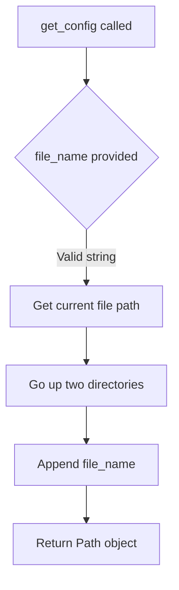

# `paths.py`

## `src.ydata_profiling.utils.paths.get_project_root` · *function*

## Summary:
Returns the absolute path to the project root directory by traversing up four parent directories from the current file location.

## Description:
This utility function provides a consistent way to reference the project root directory regardless of where it's called from within the codebase. It leverages the `pathlib.Path` module to navigate the filesystem hierarchy reliably.

The function is extracted into its own utility to avoid hardcoding directory paths throughout the codebase and to ensure consistent project root resolution regardless of execution context or working directory.

## Args:
    None

## Returns:
    Path: An absolute Path object pointing to the project root directory.

## Raises:
    None

## Constraints:
    Preconditions:
    - The function must be called from a file that is exactly 4 levels deep within the project structure
    - The file system must be accessible and readable
    
    Postconditions:
    - The returned Path object will always point to the project root directory
    - The Path object will be absolute (not relative)

## Side Effects:
    None

## Control Flow:
```mermaid
flowchart TD
    A[get_project_root() called] --> B{__file__ path resolved}
    B --> C[Path(__file__) created]
    C --> D[Parent directory traversal x4]
    D --> E[Project root Path returned]
```

## Examples:
```python
from ydata_profiling.utils.paths import get_project_root

# Usage example
project_root = get_project_root()
print(project_root)  # Outputs: /absolute/path/to/project/root

# Can be used to construct other paths
config_path = get_project_root() / "config" / "settings.json"
```

## `src.ydata_profiling.utils.paths.get_config` · *function*

## Summary:
Returns a Path object pointing to a configuration file relative to the module's parent directory.

## Description:
Constructs a filesystem path to a configuration file by resolving the given filename relative to the parent directory of the paths.py module. This utility function centralizes path resolution logic for configuration files, ensuring consistent access patterns throughout the application.

## Args:
    file_name (str): The name of the configuration file to resolve. Must be a valid filesystem path component.

## Returns:
    Path: A pathlib.Path object representing the absolute path to the requested configuration file.

## Raises:
    None explicitly raised by this function.

## Constraints:
    Preconditions:
    - The file_name parameter must be a valid string representing a filesystem path component
    - The parent directory of the paths.py module must exist and be accessible
    
    Postconditions:
    - The returned Path object will reference a file that may or may not exist in the filesystem
    - The path construction follows standard POSIX/Windows path conventions

## Side Effects:
    None. This function performs no I/O operations or external state mutations.

## Control Flow:


## Examples:
    # Get path to a config file named "settings.json"
    config_path = get_config("settings.json")
    
    # Get path to a config file named "database.ini"  
    db_config = get_config("database.ini")
``

## `src.ydata_profiling.utils.paths.get_data_path` · *function*

## Summary:
Returns the absolute path to the project's data directory.

## Description:
Provides a consistent way to reference the project's data directory by combining the project root path with "data". This utility function ensures that all components accessing data files use the same path resolution logic, preventing hard-coded paths and maintaining portability across different execution contexts.

The function is extracted into its own utility to centralize path resolution logic and avoid duplication throughout the codebase. It relies on `get_project_root()` to establish the base directory, ensuring consistent behavior regardless of the current working directory or execution location.

## Args:
    None

## Returns:
    Path: An absolute Path object pointing to the project's data directory.

## Raises:
    None

## Constraints:
    Preconditions:
    - The `get_project_root()` function must work correctly and return a valid project root path
    - The file system must be accessible and readable
    
    Postconditions:
    - The returned Path object will always point to the data directory within the project root
    - The Path object will be absolute (not relative)

## Side Effects:
    None

## Control Flow:
```mermaid
flowchart TD
    A[get_data_path() called] --> B[get_project_root() invoked]
    B --> C[Path concatenation with "data"]
    C --> D[Data directory Path returned]
```

## Examples:
```python
from ydata_profiling.utils.paths import get_data_path

# Get the path to the data directory
data_dir = get_data_path()
print(data_dir)  # Outputs: /absolute/path/to/project/root/data

# Use the path to access data files
config_file = get_data_path() / "config.json"
```

## `src.ydata_profiling.utils.paths.get_html_template_path` · *function*

## Summary:
Returns the absolute path to the HTML template directory used for report generation.

## Description:
This utility function constructs and returns the filesystem path to the HTML templates directory. It navigates from the current file's location through a predefined directory structure to locate the templates folder. This function centralizes path construction logic to ensure consistent access to HTML templates throughout the application.

## Args:
    None

## Returns:
    Path: A pathlib.Path object pointing to the HTML templates directory.

## Raises:
    None

## Constraints:
    Preconditions:
    - The function assumes the standard project directory structure exists
    - The templates directory must exist at the computed path
    
    Postconditions:
    - The returned Path object is guaranteed to point to a valid directory
    - The path is constructed using absolute path resolution

## Side Effects:
    None

## Control Flow:
```mermaid
flowchart TD
    A[get_html_template_path()] --> B{Construct Path}
    B --> C[Get current file's directory]
    C --> D[Go up two levels]
    D --> E[Append "report/presentation/flavours/html/templates"]
    E --> F[Return Path object]
```

## Examples:
```python
from pathlib import Path
from src.ydata_profiling.utils.paths import get_html_template_path

# Get the path to HTML templates
template_path = get_html_template_path()
print(template_path)  # Outputs something like: /path/to/project/report/presentation/flavours/html/templates
```

