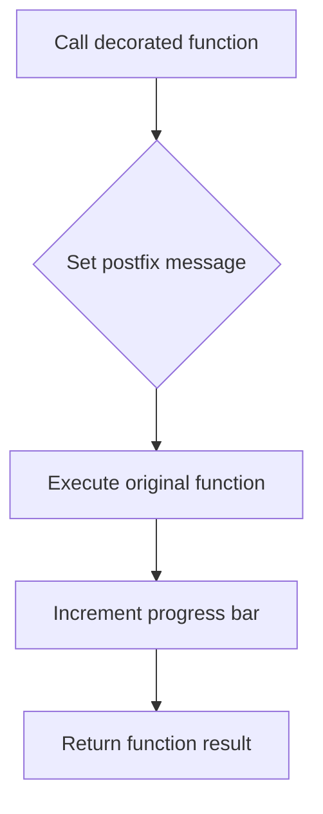

# `progress_bar.py`

## `src.ydata_profiling.utils.progress_bar.progress` · *function*

## Summary:
Decorator that wraps a function to update a progress bar with a message before execution and increment after completion.

## Description:
This function creates a decorator that enhances any callable with progress bar visualization capabilities. It sets a postfix message on the progress bar, executes the wrapped function, and increments the progress bar counter. This abstraction allows functions to be easily instrumented with progress tracking without modifying their core logic.

## Args:
    fn (Callable): The function to be wrapped with progress bar functionality
    bar (tqdm): A tqdm progress bar instance to be updated
    message (str): Message to display in the progress bar's postfix field

## Returns:
    Callable: A decorated version of the input function that updates the progress bar when called

## Raises:
    None explicitly raised - depends on the behavior of the wrapped function `fn`

## Constraints:
    Preconditions:
    - `bar` must be a valid tqdm progress bar instance
    - `message` must be a string
    - `fn` must be callable
    
    Postconditions:
    - The returned function maintains the same signature as `fn`
    - The progress bar's postfix is updated with the provided message before execution
    - The progress bar is incremented by one unit after execution

## Side Effects:
    - Modifies the state of the provided tqdm progress bar instance
    - Updates the progress bar's postfix string field
    - Increments the progress bar counter by one unit

## Control Flow:


## Examples:
```python
from tqdm import tqdm
from src.ydata_profiling.utils.progress_bar import progress

# Create a progress bar
bar = tqdm(total=100)

# Define a function to wrap
def process_item(item):
    # Some processing logic
    return item * 2

# Wrap the function with progress tracking
progress_func = progress(process_item, bar, "Processing items")

# Call the wrapped function
result = progress_func(5)  # Updates progress bar with "Processing items" message
```

