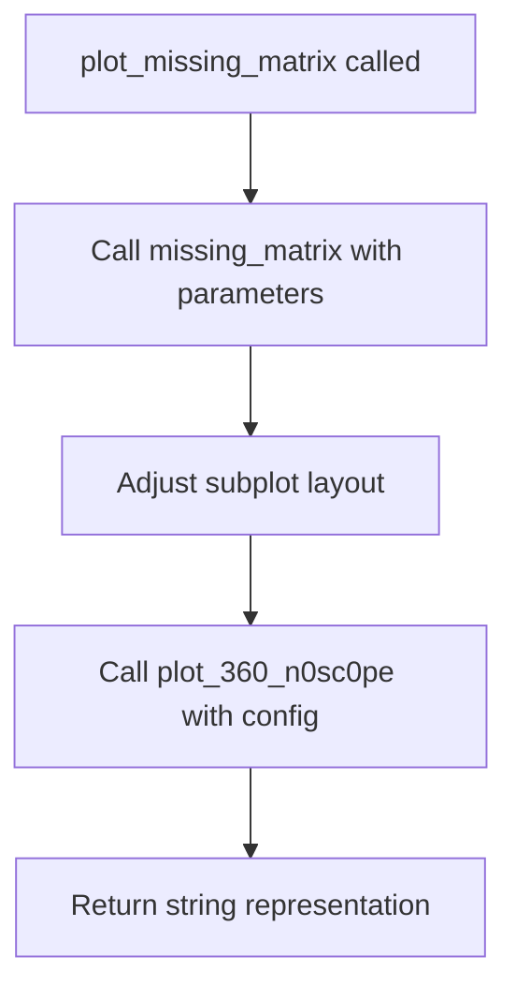

# `missing.py`

## `src.ydata_profiling.visualisation.missing.get_font_size` · *function*

*No documentation generated.*

## `src.ydata_profiling.visualisation.missing.plot_missing_matrix` · *function*

## Summary
Creates and returns a string representation of a missing data matrix visualization for a given dataset.

## Description
Generates a matrix-style visualization that displays the pattern of missing values across columns in a dataset. This function is part of the data profiling visualization suite and provides a compact view of where missing values occur in the data. The visualization helps identify patterns in missing data that could impact downstream analysis.

This function extracts the missing data matrix plotting logic into a dedicated component to separate visualization concerns from data processing and to enable reuse across different profiling contexts.

## Args
    config (Settings): Configuration object containing display preferences and styling options for the visualization
    notnull (Any): Boolean data structure (typically from DataFrame.notnull()) indicating presence (True) or absence (False) of values in the dataset
    columns (List[str]): List of column names to be displayed in the visualization
    nrows (int): Number of rows in the dataset, used to determine visualization dimensions

## Returns
    str: String representation of the missing data matrix visualization, typically in a format suitable for HTML embedding or file saving

## Raises
    ValueError: When the image format specified in config is not supported (only "png" or "svg" are accepted)

## Constraints
    Preconditions:
    - config must be a valid Settings instance with proper initialization
    - notnull must be a valid boolean data structure indicating data presence/absence
    - columns must be a non-empty list of strings
    - nrows must be a positive integer

    Postconditions:
    - The returned string contains a valid visualization representation
    - The matplotlib figure is properly configured with appropriate sizing and spacing

## Side Effects
    - Creates matplotlib figures and plots
    - May save files to disk if config.html.inline is False
    - Modifies matplotlib global state through subplot adjustments

## Control Flow


## Examples
```python
from ydata_profiling.config import Settings
from ydata_profiling.visualisation.missing import plot_missing_matrix

# Basic usage in a data profiling context
config = Settings()
notnull_data = df.notnull()  # Boolean DataFrame indicating data presence
columns = ['column_a', 'column_b', 'column_c']
nrows = len(df)

# Generate missing matrix visualization
matrix_visualization = plot_missing_matrix(config, notnull_data, columns, nrows)
```

## `src.ydata_profiling.visualisation.missing.plot_missing_bar` · *function*

## Summary:
Generates and formats a bar chart visualization showing missing value distributions across dataset columns.

## Description:
Creates a matplotlib bar chart displaying the count of non-null values for each column in a dataset, then applies formatting adjustments to optimize the visualization appearance. This function serves as a specialized plotting utility for missing data visualization within the profiling framework.

The function delegates the core chart creation to the `missing_bar` plotting function, then applies matplotlib-specific formatting such as removing grids and adjusting subplot spacing. It concludes by returning a processed visualization string representation suitable for embedding in reports.

This function is typically called during the generation of profiling reports when missing data visualization is enabled, specifically when bar chart representations are requested for missing value analysis.

## Args:
    config (Settings): Configuration object containing profiling settings and styling preferences for the visualization
    notnull_counts (list): List of counts representing the number of non-null values for each column in the dataset
    nrows (int): Total number of rows in the dataset, used for calculating percentages or scaling the visualization
    columns (List[str]): List of column names in the dataset, used for labeling and font size calculation

## Returns:
    str: String representation of the formatted missing value bar chart, typically suitable for HTML embedding or report generation

## Raises:
    None explicitly documented: Based on the source code, no specific exceptions are caught or raised by this function

## Constraints:
    Preconditions:
    - config must be a properly initialized Settings object with valid configuration
    - notnull_counts must be a list of numeric values representing non-null counts per column
    - nrows must be a positive integer representing total dataset rows
    - columns must be a list of strings representing column names

    Postconditions:
    - A matplotlib figure is created and modified with grid removal and subplot adjustment
    - The function returns a string representation of the visualization

## Side Effects:
    - Creates and modifies matplotlib figures and axes
    - Modifies global matplotlib state through plt.subplots_adjust() and axis grid settings
    - May affect subsequent matplotlib plotting operations due to global state changes

## Control Flow:
```mermaid
flowchart TD
    A[Start plot_missing_bar] --> B[Call missing_bar with parameters]
    B --> C[Iterate through axes and remove grid]
    C --> D[Adjust subplot layout]
    D --> E[Return plot_360_n0sc0pe(config)]
```

## Examples:
```python
from ydata_profiling.config import Settings

# Sample data
config = Settings()
notnull_counts = [95, 87, 100, 92]
nrows = 100
columns = ['column_A', 'column_B', 'column_C', 'column_D']

# Generate missing value bar chart
chart_string = plot_missing_bar(config, notnull_counts, nrows, columns)
```

## `src.ydata_profiling.visualisation.missing.plot_missing_heatmap` · *function*

## Summary:
Generates and formats a heatmap visualization showing correlations between missing value patterns across dataset columns.

## Description:
Creates a matplotlib heatmap displaying the correlation matrix of missing value patterns between columns in a dataset. This function dynamically adjusts visualization parameters such as figure height and font size based on the number of columns to ensure optimal display readability. The heatmap visualization helps identify relationships and patterns in missing data across different columns.

This function is typically called during the generation of profiling reports when missing data visualization is enabled and heatmap representations are requested for missing value analysis. It serves as a specialized plotting utility that encapsulates the complexity of creating and formatting missing value correlation heatmaps.

## Args:
    config (Settings): Configuration object containing profiling settings and styling preferences for the visualization, including color map and label forcing options
    corr_mat (Any): Correlation matrix data representing relationships between missing value patterns of different columns
    mask (Any): Masking data used to hide specific cells in the heatmap visualization
    columns (List[str]): List of column names in the dataset, used for determining visualization dimensions and font sizing

## Returns:
    str: String representation of the formatted missing value heatmap, typically suitable for HTML embedding or report generation

## Raises:
    None explicitly documented: Based on the source code, no specific exceptions are caught or raised by this function

## Constraints:
    Preconditions:
    - config must be a properly initialized Settings object with valid configuration
    - corr_mat must contain valid correlation matrix data for heatmap rendering
    - mask must be compatible with the correlation matrix dimensions
    - columns must be a list of strings representing column names

    Postconditions:
    - A matplotlib figure is created and displayed with heatmap visualization
    - The function returns a string representation of the visualization

## Side Effects:
    - Creates and modifies matplotlib figures and axes
    - Modifies global matplotlib state through plt.subplots_adjust() calls
    - May affect subsequent matplotlib plotting operations due to global state changes

## Control Flow:
```mermaid
flowchart TD
    A[Start plot_missing_heatmap] --> B[Calculate dynamic height based on column count]
    B --> C[Calculate dynamic font size (uses external get_font_size function)]
    C --> D[Call missing_heatmap with calculated parameters]
    D --> E[Adjust subplot layout based on column count]
    E --> F[Return plot_360_n0sc0pe(config)]
```

## Examples:
```python
from ydata_profiling.config import Settings

# Sample data
config = Settings()
corr_mat = [[1.0, 0.2, -0.1], [0.2, 1.0, 0.3], [-0.1, 0.3, 1.0]]
mask = [[False, True, False], [True, False, True], [False, True, False]]
columns = ['column_A', 'column_B', 'column_C']

# Generate missing value heatmap
heatmap_string = plot_missing_heatmap(config, corr_mat, mask, columns)
```

