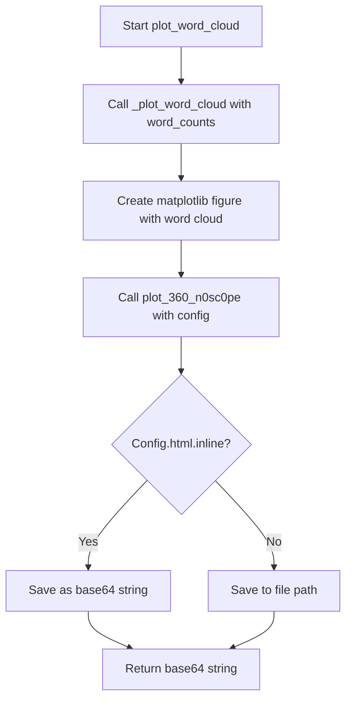
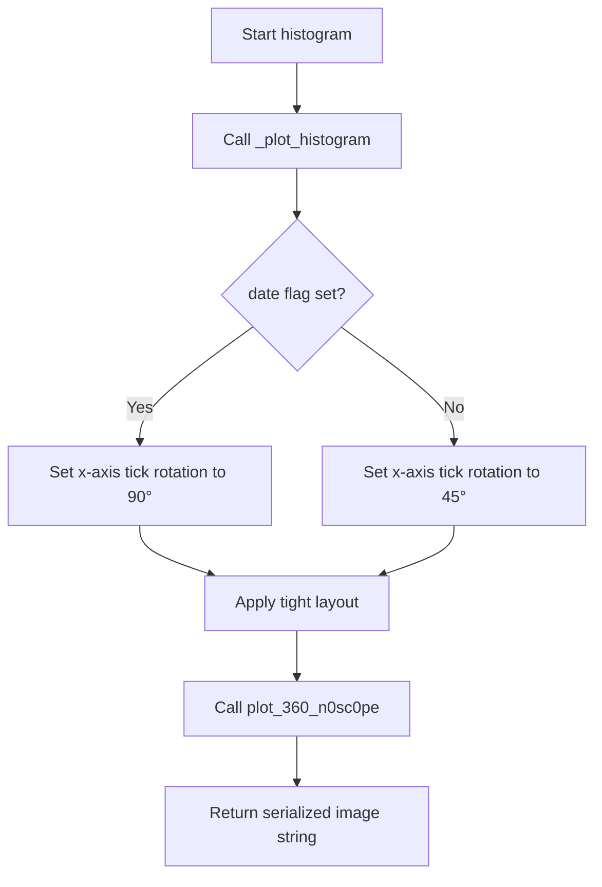
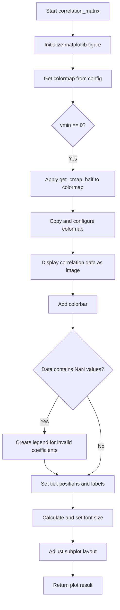
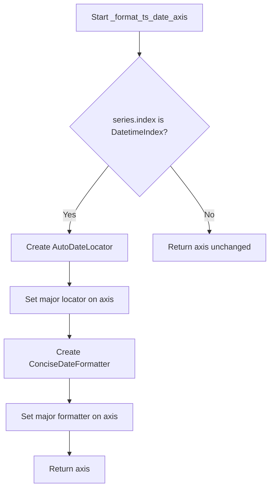
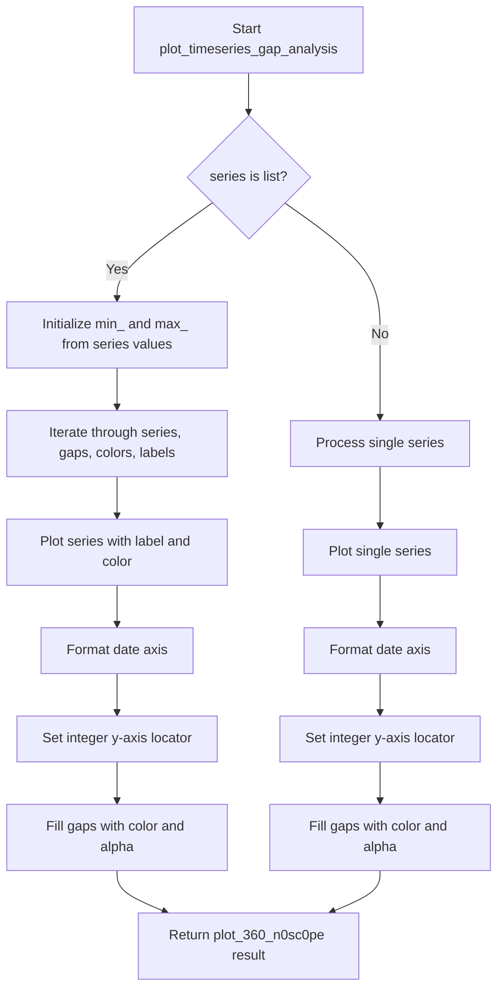
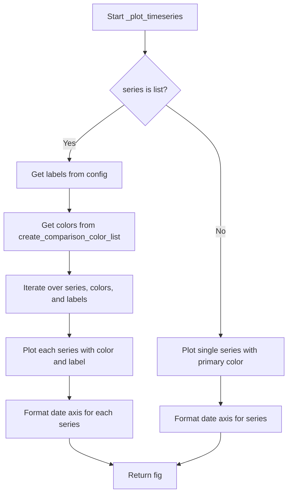

# `plot.py`

## `src.ydata_profiling.visualisation.plot.format_fn` · *function*

## Summary:
Formats numeric timestamp values into human-readable datetime strings for matplotlib axis tick labels.

## Description:
This function serves as a matplotlib tick formatter that converts Unix timestamp integers into formatted datetime strings. It is specifically designed to work with matplotlib's FuncFormatter class to display timestamp data in a readable format on plots. The function leverages the `convert_timestamp_to_datetime` utility to handle timestamp conversion, ensuring proper handling of both positive and negative timestamps.

## Args:
    tick_val (int): A Unix timestamp value (integer representing seconds since Unix epoch) to be formatted.
    tick_pos (Any): Position of the tick on the axis (required by matplotlib's FuncFormatter interface, but not used in this implementation).

## Returns:
    str: A formatted datetime string in the format "%Y-%m-%d %H:%M:%S" representing the timestamp.

## Raises:
    None explicitly raised. However, the underlying `convert_timestamp_to_datetime` function may raise exceptions for invalid timestamp values, such as those outside the representable range of Python's datetime objects.

## Constraints:
    Precondition: The tick_val parameter must be a valid integer representing a Unix timestamp.
    Postcondition: The returned string will always be in the format "YYYY-MM-DD HH:MM:SS".

## Side Effects:
    None

## Control Flow:
```mermaid
flowchart TD
    A[format_fn called with tick_val] --> B{tick_val is integer?}
    B -- Yes --> C[convert_timestamp_to_datetime(tick_val)]
    C --> D[strftime("%Y-%m-%d %H:%M:%S")]
    D --> E[Return formatted string]
    B -- No --> F[Exception or unexpected behavior]
```

## Examples:
    # Typical usage with matplotlib
    import matplotlib.pyplot as plt
    from matplotlib.ticker import FuncFormatter
    
    # Create a sample timestamp array
    timestamps = [1609459200, 1609545600, 1609632000]  # 2021-01-01, 2021-01-02, 2021-01-03
    
    # Apply the formatter to x-axis
    ax = plt.gca()
    ax.xaxis.set_major_formatter(FuncFormatter(format_fn))
    
    # Plot with timestamp data
    plt.plot(timestamps, [1, 2, 3])
    plt.show()
```

## `src.ydata_profiling.visualisation.plot._plot_word_cloud` · *function*

## Summary:
Creates a matplotlib figure containing one or more word clouds from pandas Series frequency data.

## Description:
Generates word cloud visualizations from frequency data contained in pandas Series objects. The function accepts either a single pandas Series or a list of pandas Series, creating separate word clouds for each. This utility function encapsulates the logic for word cloud creation to avoid code duplication in visualization routines.

## Args:
    series (Union[pandas.Series, List[pandas.Series]]): A single pandas Series or list of pandas Series containing word frequencies. Each Series should map words (string keys) to their respective frequencies (numeric values).
    figsize (tuple, optional): Figure size as (width, height) in inches. Defaults to (6, 4).

## Returns:
    matplotlib.figure.Figure: A matplotlib Figure object containing the word cloud(s) as subplots.

## Raises:
    None explicitly raised in the function body.

## Constraints:
    Preconditions:
    - Input series must be pandas Series objects or lists of pandas Series
    - Each Series should contain string keys representing words and numeric values representing frequencies
    - The wordcloud library must be available in the environment
    - The matplotlib backend should be properly configured
    
    Postconditions:
    - Returns a matplotlib Figure object with properly configured subplots
    - Each subplot displays a word cloud visualization with off-axis labels
    - The returned figure contains exactly one subplot per input Series

## Side Effects:
    - Creates a matplotlib figure using plt.figure()
    - Adds subplots to the matplotlib figure using add_subplot()
    - Uses matplotlib's imshow() to display word cloud images
    - May modify global matplotlib state through figure creation and subplot management

## Control Flow:
```mermaid
flowchart TD
    A[Start _plot_word_cloud] --> B{Is series list?}
    B -- No --> C[Wrap series in list]
    B -- Yes --> C
    C --> D[Create matplotlib figure with figsize]
    D --> E[Iterate over series in list]
    E --> F[Convert series to dictionary using to_dict()]
    F --> G[Generate word cloud from frequencies using WordCloud]
    G --> H[Add subplot to figure with 1 row, len(series) columns]
    H --> I[Display word cloud image using imshow()]
    I --> J[Turn off axis labels using axis("off")]
    J --> K[Next series?]
    K -- Yes --> E
    K -- No --> L[Return matplotlib figure]
```

## Examples:
```python
import pandas as pd
from matplotlib import pyplot as plt

# Single series example
word_freq = pd.Series({'python': 10, 'data': 5, 'analysis': 8})
fig = _plot_word_cloud(word_freq)

# Multiple series example  
word_freq1 = pd.Series({'python': 10, 'data': 5})
word_freq2 = pd.Series({'machine': 7, 'learning': 9})
fig = _plot_word_cloud([word_freq1, word_freq2])

# With custom figure size
fig = _plot_word_cloud(word_freq, figsize=(8, 6))
```

## `src.ydata_profiling.visualisation.plot._plot_histogram` · *function*

## Summary:
Creates a matplotlib histogram plot with customizable styling and formatting options for both regular and date-based data series.

## Description:
This private function generates histogram visualizations using matplotlib, supporting both single-series and multi-series histograms. It handles different data types including regular numerical data and timestamp/date data, applying appropriate styling based on configuration settings. The function is designed to be reusable across different visualization components within the ydata-profiling library.

Known callers within the codebase:
- Called by internal plotting functions in the visualisation module when generating histogram representations for data profiles
- Typically invoked during report generation when displaying distribution information for numerical variables

This logic is extracted into its own function rather than inlined because it encapsulates the complex logic for creating bar charts with proper binning, color handling, date formatting, and configuration-driven styling. This promotes code reuse and makes the visualization pipeline more modular and testable.

## Args:
- config (Settings): Configuration object containing styling and plotting preferences, including color schemes and label settings
- series (np.ndarray): Array of histogram values (frequencies) for each bin, can be 1D for single series or 2D for multiple series
- bins (Union[int, np.ndarray]): Bin edges for the histogram, either as an integer specifying number of bins or array of bin edges
- figsize (tuple, optional): Figure size as (width, height) in inches. Defaults to (6, 4)
- date (bool, optional): Flag indicating whether the data represents dates/timestamps requiring special formatting. Defaults to False
- hide_yaxis (bool, optional): Flag to hide the y-axis labels and ticks. Defaults to False

## Returns:
- plt.Axes: The matplotlib axes object containing the histogram plot

## Raises:
- None explicitly raised in the function body

## Constraints:
- Precondition: The config parameter must be a valid Settings object with properly initialized html.style attributes
- Precondition: The series parameter must be compatible with the bins parameter dimensions
- Precondition: When date=True, the format_fn function must be available for date formatting
- Postcondition: The returned axes will contain properly formatted histogram bars with appropriate labels and styling

## Side Effects:
- Creates and modifies matplotlib figure and axes objects
- May modify global matplotlib state through figure and axis configuration
- No external I/O operations or state mutations beyond matplotlib rendering

## Control Flow:
```mermaid
flowchart TD
    A[Start _plot_histogram] --> B{bins is list?}
    B -- Yes --> C[Multi-series histogram path]
    B -- No --> D[Single-series histogram path]
    C --> E[Initialize figure and subplot]
    E --> F[Loop through n_labels in reverse order]
    F --> G[Calculate bin differences]
    G --> H[Draw bar chart with colors from config]
    H --> I{date flag set?}
    I -- Yes --> J[Apply date formatter]
    I -- No --> K[Skip date formatting]
    J --> L[Check x_axis_labels setting]
    K --> L
    L --> M{hide_yaxis flag?}
    M -- Yes --> N[Hide y-axis]
    M -- No --> O[Show y-axis]
    O --> P[Set supylabel to "Frequency"]
    D --> Q[Initialize figure and subplot]
    Q --> R[Set ylabel to "Frequency" or hide]
    R --> S[Calculate bin differences]
    S --> T[Draw single bar chart]
    T --> U{date flag set?}
    U -- Yes --> V[Apply date formatter]
    U -- No --> W[Skip date formatting]
    V --> X[Check x_axis_labels setting]
    W --> X
    X --> Y[Return axes object]
```

## Examples:
```python
import numpy as np
from matplotlib import pyplot as plt
from ydata_profiling.config import Settings

# Example 1: Basic histogram
config = Settings()
series = np.array([10, 25, 30, 15, 5])
bins = np.array([0, 1, 2, 3, 4, 5])
axes = _plot_histogram(config, series, bins)

# Example 2: Date histogram
config = Settings()
series = np.array([10, 25, 30, 15, 5])
bins = np.array([0, 1, 2, 3, 4, 5])
axes = _plot_histogram(config, series, bins, date=True)

# Example 3: Multi-series histogram
config = Settings()
series = np.array([[10, 25, 30, 15, 5], [5, 15, 25, 35, 20]])
bins = [np.array([0, 1, 2, 3, 4, 5]), np.array([0, 1, 2, 3, 4, 5])]
axes = _plot_histogram(config, series, bins)
```

## `src.ydata_profiling.visualisation.plot.plot_word_cloud` · *function*

## Summary:
Generates and saves a word cloud visualization from frequency data, returning the appropriate string representation for display.

## Description:
Creates a word cloud visualization from pandas Series frequency data and handles the saving/formatting of the resulting plot. This function integrates the word cloud generation with the plotting framework's save mechanism to produce a complete visualization workflow.

## Args:
    config (Settings): Configuration settings that control the output format and saving behavior.
    word_counts (pd.Series): Pandas Series containing word frequencies, mapping words (string keys) to their respective counts (numeric values).

## Returns:
    str: String representation of the saved word cloud visualization. This could be a base64-encoded string for inline HTML display or a file path reference depending on the configuration settings.

## Raises:
    ValueError: Raised by `plot_360_n0sc0pe` when an unsupported image format is specified in the configuration.

## Constraints:
    Preconditions:
    - Input `word_counts` must be a pandas Series with string keys representing words and numeric values representing frequencies
    - The `config` parameter must be a valid Settings object with properly configured HTML and plot settings
    - The wordcloud library must be available in the environment
    - The matplotlib backend should be properly configured
    
    Postconditions:
    - A word cloud visualization is created and saved according to the configuration
    - The function returns a string representation suitable for embedding in HTML or referencing as a file path

## Side Effects:
    - Creates and modifies matplotlib figures internally through `_plot_word_cloud`
    - Saves the matplotlib figure using the plotting framework's save mechanism via `plot_360_n0sc0pe`
    - May close matplotlib figures after saving
    - Modifies global matplotlib state during figure creation and saving

## Control Flow:


## Examples:
```python
import pandas as pd
from ydata_profiling.config import Settings

# Create sample word frequency data
word_freq = pd.Series({'python': 10, 'data': 5, 'analysis': 8})

# Configure settings for inline display
config = Settings()
config.html.inline = True

# Generate word cloud and get string representation
result = plot_word_cloud(config, word_freq)
# Returns base64-encoded string for inline HTML embedding

# Configure settings for file-based output
config.html.inline = False
config.html.assets_path = "/path/to/assets"

# Generate word cloud and get file path reference
result = plot_word_cloud(config, word_freq)
# Returns file path string for external reference
```

## `src.ydata_profiling.visualisation.plot.histogram` · *function*

## Summary:
Generates a histogram visualization for data series with configurable styling and output formats.

## Description:
Creates a matplotlib histogram plot tailored for data profiling reports, handling both regular numerical data and date/time series. This function serves as the primary interface for generating histogram visualizations within the ydata-profiling library, managing the complete plotting pipeline from data processing to final image output.

The function delegates the core plotting logic to `_plot_histogram` while handling post-processing steps like tick rotation adjustment and final image serialization through `plot_360_n0sc0pe`. It's designed to integrate seamlessly with the HTML report generation system, supporting both inline display and file-based storage of visualizations.

Known callers within the codebase:
- Invoked by internal visualization components during report generation when displaying distribution information for numerical variables
- Called during data profiling workflows when histogram representations are required for variable analysis

This logic is extracted into its own function rather than inlined because it encapsulates the complete workflow for creating histogram visualizations, including configuration management, plot customization, and output serialization. This promotes reusability across different visualization contexts and maintains clean separation between plotting logic and presentation concerns.

## Args:
- config (Settings): Configuration object containing styling preferences, plot dimensions, and output format specifications
- series (np.ndarray): Array of histogram values (frequencies) for each bin, can represent single or multiple data series
- bins (Union[int, np.ndarray]): Bin specification for the histogram, either as an integer count or array of bin edges
- date (bool, optional): Flag indicating whether the data represents timestamps/dates requiring special formatting. Defaults to False

## Returns:
- str: Serialized representation of the histogram image, either as base64-encoded string for inline display or file path reference for external storage

## Raises:
- ValueError: When the image format specified in config is not supported (only "png" or "svg" are accepted)
- ValueError: When config.html.assets_path is None and file-based output is requested

## Constraints:
- Precondition: The config parameter must be a valid Settings object with properly initialized html.style attributes
- Precondition: The series parameter must be compatible with the bins parameter dimensions
- Precondition: When date=True, the underlying date formatting infrastructure must be available
- Postcondition: The returned string contains a valid serialized image representation according to the configuration

## Side Effects:
- Creates and modifies matplotlib figure and axes objects
- May modify global matplotlib state through figure and axis configuration
- Depending on configuration, may write files to disk or return base64-encoded strings for inline display
- Closes matplotlib figures after processing to prevent memory leaks

## Control Flow:


## Examples:
```python
import numpy as np
from ydata_profiling.config import Settings

# Create histogram for numerical data
config = Settings()
series = np.array([10, 25, 30, 15, 5])
bins = 10
result = histogram(config, series, bins)

# Create histogram for date data
config = Settings()
series = np.array([10, 25, 30, 15, 5])
bins = np.array([0, 1, 2, 3, 4, 5])
result = histogram(config, series, bins, date=True)
```

## `src.ydata_profiling.visualisation.plot.mini_histogram` · *function*

## Summary:
Generates a compact histogram visualization with customized formatting for data profiling reports.

## Description:
Creates a miniature histogram plot optimized for inclusion in data profiling reports, particularly for displaying variable distributions. This function builds upon the core histogram plotting functionality by applying specific styling and sizing constraints to produce a space-efficient visualization suitable for dashboard-style presentations.

Known callers within the codebase:
- Called by internal visualization components during report generation when creating compact distribution displays
- Typically invoked when rendering miniaturized histogram representations in HTML reports for quick data exploration

This logic is extracted into its own function rather than inlined because it encapsulates the specific formatting requirements for miniaturized plots while leveraging the robust histogram generation capabilities of `_plot_histogram`. This separation allows for consistent miniaturized histogram styling across the application while keeping the core histogram logic centralized.

## Args:
- config (Settings): Configuration object containing styling and plotting preferences for the visualization
- series (np.ndarray): Array of histogram values (frequencies) for each bin
- bins (Union[int, np.ndarray]): Bin edges for the histogram, either as an integer specifying number of bins or array of bin edges
- date (bool, optional): Flag indicating whether the data represents dates/timestamps requiring special formatting. Defaults to False

## Returns:
- str: Base64-encoded SVG or PNG image string representing the compact histogram visualization, or file path when not inline

## Raises:
- None explicitly raised in the function body

## Constraints:
- Precondition: The config parameter must be a valid Settings object with properly initialized html.style attributes
- Precondition: The series parameter must be compatible with the bins parameter dimensions
- Precondition: When date=True, the format_fn function must be available for date formatting
- Postcondition: The returned string contains a properly formatted compact histogram image

## Side Effects:
- Creates and modifies matplotlib figure and axes objects
- May modify global matplotlib state through figure and axis configuration
- No external I/O operations or state mutations beyond matplotlib rendering

## Control Flow:
```mermaid
flowchart TD
    A[Start mini_histogram] --> B[Call _plot_histogram with figsize=(3,2.25)]
    B --> C[Set plot face color to white]
    C --> D{date flag set?}
    D -- Yes --> E[Set x-axis tick font size to 6]
    D -- No --> F[Set x-axis tick font size to 8]
    E --> G[Set x-axis tick rotation to 90]
    F --> G
    G --> H[Apply tight layout to figure]
    H --> I[Return plot_360_n0sc0pe result]
```

## Examples:
```python
import numpy as np
from ydata_profiling.config import Settings

# Create a mini histogram for regular numerical data
config = Settings()
series = np.array([10, 25, 30, 15, 5])
bins = 10
histogram_svg = mini_histogram(config, series, bins)

# Create a mini histogram for date data
config = Settings()
series = np.array([10, 25, 30, 15, 5])
bins = np.array([0, 1, 2, 3, 4, 5])
histogram_svg = mini_histogram(config, series, bins, date=True)
```

## `src.ydata_profiling.visualisation.plot.get_cmap_half` · *function*

## Summary:
Creates a new colormap using only the upper half of colors from the input colormap.

## Description:
This function extracts the upper half of colors from a given colormap and constructs a new LinearSegmentedColormap from those colors. It's commonly used to create color schemes that emphasize lighter or more saturated colors from the original palette.

## Args:
    cmap (Union[Colormap, LinearSegmentedColormap, ListedColormap]): Input colormap object from which to extract colors. Must have an attribute N representing the number of colors in the colormap.

## Returns:
    LinearSegmentedColormap: A new colormap containing only the upper half of colors from the input colormap, with the same number of colors as the original colormap divided by two.

## Raises:
    None explicitly raised. However, if the input colormap doesn't have the expected attributes or methods, underlying matplotlib operations may raise exceptions.

## Constraints:
    Preconditions:
    - Input cmap must be a valid matplotlib colormap object with an N attribute
    - Input cmap must support indexing with numpy arrays
    
    Postconditions:
    - Returned colormap will have exactly half the number of colors as the input colormap (rounded down)
    - The returned colormap will be a LinearSegmentedColormap instance

## Side Effects:
    None

## Control Flow:
```mermaid
flowchart TD
    A[Input cmap] --> B{Validate cmap}
    B --> C[cmap(np.linspace(0.5, 1, cmap.N // 2))]
    C --> D[Create new LinearSegmentedColormap]
    D --> E[Return new colormap]
```

## Examples:
```python
# Create a half-color version of a matplotlib colormap
from matplotlib.pyplot import cm
import matplotlib.pyplot as plt

# Using a standard matplotlib colormap
viridis_half = get_cmap_half(cm.viridis)
print(viridis_half.N)  # Will show half the number of colors as original viridis

# Using seaborn color palette
import seaborn as sns
palette = sns.color_palette("husl", 10)
# Note: This would require conversion to matplotlib colormap first
```

## `src.ydata_profiling.visualisation.plot.get_correlation_font_size` · *function*

## Summary:
Determines appropriate font size for correlation plot labels based on the number of labels to ensure readability.

## Description:
This function calculates the optimal font size for displaying labels in correlation heatmaps or plots. As the number of labels increases, smaller font sizes are used to prevent overcrowding and maintain visual clarity. The function returns None for small label counts (≤40) to indicate that default font sizing should be used.

## Args:
    n_labels (int): The number of labels in the correlation plot. Must be a non-negative integer.

## Returns:
    Optional[int]: Font size value (4, 5, 6, or 8) for larger label counts, or None for small label counts (≤40).

## Raises:
    None

## Constraints:
    Preconditions:
        - n_labels must be a non-negative integer
    Postconditions:
        - Returns None when n_labels <= 40
        - Returns one of {4, 5, 6, 8} when n_labels > 40

## Side Effects:
    None

## Control Flow:
```mermaid
flowchart TD
    A[Start: get_correlation_font_size(n_labels)] --> B{n_labels > 100?}
    B -- Yes --> C[font_size = 4]
    B -- No --> D{n_labels > 80?}
    D -- Yes --> E[font_size = 5]
    D -- No --> F{n_labels > 50?}
    F -- Yes --> G[font_size = 6]
    F -- No --> H{n_labels > 40?}
    H -- Yes --> I[font_size = 8]
    H -- No --> J[return None]
    C --> K[return font_size]
    E --> K
    G --> K
    I --> K
    J --> K
```

## Examples:
    # For small number of labels
    get_correlation_font_size(20)  # Returns None
    
    # For moderate number of labels  
    get_correlation_font_size(60)  # Returns 6
    
    # For large number of labels
    get_correlation_font_size(120)  # Returns 4

## `src.ydata_profiling.visualisation.plot.correlation_matrix` · *function*

## Summary:
Creates a heatmap visualization of a correlation matrix with customizable color mapping and label formatting.

## Description:
Generates a correlation matrix heatmap visualization from a DataFrame of correlation coefficients. The function displays the correlation values as a color-coded grid, with optional handling of invalid (NaN) correlation coefficients through a legend. This visualization helps identify patterns and relationships between variables in a dataset.

## Args:
    config (Settings): Configuration object containing plotting settings such as colormap selection and bad color handling for invalid correlations.
    data (pd.DataFrame): DataFrame containing correlation coefficients to visualize. Should have equal dimensions for rows and columns.
    vmin (int, optional): Minimum value for color scaling. Defaults to -1, indicating a full range from -1 to 1 correlation values.

## Returns:
    str: Path or encoded string representation of the saved visualization, depending on configuration settings (inline vs file-based storage).

## Raises:
    None explicitly raised by this function. However, underlying matplotlib operations may raise exceptions related to invalid configurations or unsupported data types.

## Constraints:
    Preconditions:
        - config must be a valid Settings object with proper plot configuration
        - data must be a pandas DataFrame containing numeric correlation coefficients
        - data should have square dimensions (equal number of rows and columns)
        - config.plot.correlation.cmap must reference a valid matplotlib colormap
        - config.plot.correlation.bad must specify a valid color for invalid correlations

    Postconditions:
        - A matplotlib figure is created and displayed
        - The figure contains a properly scaled correlation matrix heatmap
        - Labels are appropriately rotated and sized for readability
        - Invalid correlation coefficients are visually indicated when present

## Side Effects:
    - Creates and modifies matplotlib figures and axes
    - May generate and save files to disk based on configuration settings
    - Modifies global matplotlib state through pyplot operations
    - Closes matplotlib figures after processing

## Control Flow:


## Examples:
```python
# Basic usage with default settings
import pandas as pd
from ydata_profiling.config import Settings

# Create sample correlation matrix
correlation_data = pd.DataFrame({
    'A': [1.0, 0.5, -0.3],
    'B': [0.5, 1.0, 0.2],
    'C': [-0.3, 0.2, 1.0]
})

config = Settings()
result = correlation_matrix(config, correlation_data)

# Usage with custom vmin setting
result = correlation_matrix(config, correlation_data, vmin=0)
```

## `src.ydata_profiling.visualisation.plot.scatter_complex` · *function*

## Summary:
Creates a complex plane scatter plot for complex number series with adaptive visualization based on data size.

## Description:
Generates a scatter plot visualization of complex numbers on the real-imaginary plane, automatically switching between hexbin and scatter plots based on the dataset size threshold. This function is designed for visualizing complex number distributions in data profiling contexts.

## Args:
    config (Settings): Configuration object containing visualization settings including HTML styling and plot thresholds
    series (pd.Series): Pandas Series containing complex numbers to visualize

## Returns:
    str: Path or base64 encoded string representing the saved visualization image file

## Raises:
    None explicitly raised in the function body

## Constraints:
    Preconditions:
    - The series parameter must contain complex numbers (real and imaginary components accessible via .real and .imag attributes)
    - Config must have valid html.style.primary_colors and plot.scatter_threshold attributes
    - The matplotlib.pyplot module must be properly initialized
    
    Postconditions:
    - A matplotlib figure is created and configured with appropriate axis labels
    - Either a hexbin or scatter plot is generated based on data size threshold
    - The matplotlib figure is closed and cleaned up appropriately

## Side Effects:
    - Creates matplotlib figure and modifies global pyplot state
    - May save image files to disk or return base64 encoded strings depending on configuration
    - Modifies global matplotlib state through pyplot calls

## Control Flow:
```mermaid
flowchart TD
    A[Start scatter_complex] --> B{len(series) > threshold?}
    B -- Yes --> C[Create light palette colormap]
    B -- No --> D[Use direct color]
    C --> E[Generate hexbin plot]
    D --> F[Generate scatter plot]
    E --> G[Return plot_360_n0sc0pe result]
    F --> G
    G --> H[End]
```

## Examples:
```python
# Basic usage with complex number series
import pandas as pd
from ydata_profiling.config import Settings

config = Settings()
complex_series = pd.Series([1+2j, 3+4j, 5+6j])
result = scatter_complex(config, complex_series)
```

## `src.ydata_profiling.visualisation.plot.scatter_series` · *function*

## Summary:
Creates a scatter plot or hexbin plot for visualizing series data points with adaptive rendering based on data size.

## Description:
This function generates a two-dimensional scatter visualization of data points from a pandas Series. It automatically chooses between a standard scatter plot and a hexbin plot depending on the number of data points, using a configurable threshold. The visualization is styled according to the application's color scheme and saved using the plot_360_n0sc0pe utility function.

## Args:
    config (Settings): Configuration object containing HTML styling and plot settings including scatter threshold and image format preferences
    series (pd.Series): A pandas Series containing coordinate pairs (x,y) to be plotted
    x_label (str, optional): Label for the x-axis. Defaults to "Width"
    y_label (str, optional): Label for the y-axis. Defaults to "Height"

## Returns:
    str: A string representation of the saved plot, either as inline base64 data or file path reference depending on configuration settings

## Raises:
    ValueError: When the image format specified in config is not supported (only "png" or "svg" are accepted)

## Constraints:
    Preconditions:
        - The series must contain coordinate pairs (x,y) that can be unpacked via zip(*series.tolist())
        - Config must have valid html.style.primary_colors and plot.scatter_threshold settings
        - The matplotlib.pyplot module must be properly initialized
    
    Postconditions:
        - A matplotlib figure is created and saved according to configuration
        - The matplotlib figure is closed after saving to prevent memory leaks
        - The returned string contains a valid reference to the saved visualization

## Side Effects:
    - Creates and modifies matplotlib figures and axes
    - May save files to disk or encode images as base64 strings depending on config.html.inline setting
    - Closes matplotlib figures to prevent resource leaks
    - May modify global matplotlib state through pyplot calls

## Control Flow:
```mermaid
flowchart TD
    A[Start scatter_series] --> B{len(series) > threshold?}
    B -- Yes --> C[Create light palette colormap]
    B -- No --> D[Use direct color]
    C --> E[Generate hexbin plot]
    D --> F[Generate scatter plot]
    E --> G[Save plot with plot_360_n0sc0pe]
    F --> G
    G --> H[Return plot reference]
```

## Examples:
    # Basic usage with default labels
    config = Settings()
    data_series = pd.Series([(1, 2), (3, 4), (5, 6)])
    plot_ref = scatter_series(config, data_series)
    
    # Usage with custom labels
    plot_ref = scatter_series(config, data_series, x_label="X Coordinate", y_label="Y Coordinate")
```

## `src.ydata_profiling.visualisation.plot.scatter_pairwise` · *function*

## Summary:
Creates a pairwise scatter plot between two pandas Series with adaptive visualization based on data size thresholds.

## Description:
This function generates a scatter plot visualization for two pandas Series, automatically choosing between hexagonal binning and regular scatter plots based on the dataset size. When the number of data points exceeds the configured threshold (config.plot.scatter_threshold), it uses hexagonal binning to better visualize density patterns; otherwise, it creates a standard scatter plot. The function handles missing data by filtering out NaN values and applies configured styling and axis labels.

## Args:
    config (Settings): Configuration object containing visualization settings including plot thresholds and styling options
    series1 (pd.Series): First data series to plot on x-axis
    series2 (pd.Series): Second data series to plot on y-axis  
    x_label (str): Label for the x-axis
    y_label (str): Label for the y-axis

## Returns:
    str: String representation of the generated plot, typically a base64-encoded image or file path depending on configuration settings

## Raises:
    None explicitly raised in the function body

## Constraints:
    Preconditions:
    - Both series must be pandas Series objects
    - Config must contain valid html.style.primary_colors and plot.scatter_threshold settings
    - Plotting libraries (matplotlib, seaborn) must be properly initialized
    
    Postconditions:
    - The matplotlib figure is closed after saving
    - Axis labels are set according to provided parameters
    - Missing data (NaN values) is filtered out before plotting using logical AND of notna() conditions
    - Plot is saved according to configuration settings

## Side Effects:
    - Modifies global matplotlib state (figure, axes)
    - Creates or saves plot files based on config.html.inline setting
    - May generate temporary files when not in inline mode

## Control Flow:
```mermaid
flowchart TD
    A[Start scatter_pairwise] --> B{len(series1) > scatter_threshold?}
    B -- Yes --> C[Get primary color from config]
    B -- No --> C
    C --> D[Create boolean mask for non-null values]
    D --> E{Data size exceeds threshold?}
    E -- Yes --> F[Generate light palette colormap]
    E -- No --> G[Use direct color]
    F --> H[Generate hexbin plot with gridsize=15]
    G --> H
    H --> I[Return plot_360_n0sc0pe result]
    I --> J[End]
```

## Examples:
```python
# Basic usage with two series
config = Settings()
series1 = pd.Series([1, 2, 3, 4, 5])
series2 = pd.Series([2, 4, 6, 8, 10])
result = scatter_pairwise(config, series1, series2, "X Label", "Y Label")

# With missing data - only complete pairs are plotted
series1_with_nan = pd.Series([1, 2, np.nan, 4, 5])
series2_with_nan = pd.Series([2, 4, 6, np.nan, 10])
result = scatter_pairwise(config, series1_with_nan, series2_with_nan, "X Label", "Y Label")
# This will plot points (1,2) and (5,10) - the NaN pairs are filtered out
```

## `src.ydata_profiling.visualisation.plot._plot_stacked_barh` · *function*

## Summary:
Creates a horizontal stacked bar chart with percentage labels and customizable legend visibility.

## Description:
Generates a horizontal stacked bar chart visualization from categorical data, displaying percentages and counts with automatic text color adjustment based on bar color brightness. This function is designed to create clean, informative bar charts suitable for data profiling visualizations.

## Args:
    data (pandas.Series): A pandas Series containing the values to be plotted as stacked bars, with index values serving as labels.
    colors (List[str]): A list of color specifications matching the number of bars to be drawn.
    hide_legend (bool, optional): Flag to control whether the legend should be displayed. Defaults to False.

## Returns:
    Tuple[matplotlib.axes.Axes, matplotlib.legend.Legend]: A tuple containing the matplotlib Axes object and the Legend object (or None if legend is hidden).

## Raises:
    None explicitly raised in the function body.

## Constraints:
    Preconditions:
    - The data parameter must be a pandas Series with numeric values
    - The colors list must contain at least as many color specifications as there are data points
    - The data series should not contain negative values for proper bar positioning
    
    Postconditions:
    - Returns a matplotlib Axes object with the bar chart drawn
    - Returns a Legend object if legend is not hidden, otherwise returns None
    - The chart is configured with fixed dimensions (7x2) and specific axis limits

## Side Effects:
    - Creates a matplotlib figure and axes using pyplot.subplots()
    - May add text labels to the chart using ax.bar_label() if conditions are met
    - May create a legend using ax.legend()

## Control Flow:
```mermaid
flowchart TD
    A[Start _plot_stacked_barh] --> B[Extract labels from data index]
    B --> C[Create subplot with figsize=(7,2)]
    C --> D[Turn off axis display]
    D --> E[Set x-axis limits to total sum]
    E --> F[Set y-axis limits to (0.4, 1.6)]
    F --> G[Initialize starts counter to 0]
    G --> H[Iterate through data, labels, and colors]
    H --> I[Draw bar with current data point]
    I --> J[Get face color of bar]
    J --> K[Determine text color based on brightness]
    K --> L[Calculate percentage of total]
    L --> M{Percentage > 8% AND bar_label available?}
    M -->|Yes| N[Add percentage/count label to bar]
    N --> O[Update starts position]
    O --> P[Loop to next bar]
    P --> Q[End iteration]
    Q --> R{Hide legend flag?}
    R -->|No| S[Create legend with specific formatting]
    S --> T[Return axes and legend]
    R -->|Yes| U[Skip legend creation]
    U --> T
    T --> V[End]
```

## Examples:
```python
import pandas as pd
import matplotlib.pyplot as plt

# Basic usage
data = pd.Series([10, 20, 30], index=['A', 'B', 'C'])
colors = ['#FF0000', '#00FF00', '#0000FF']
ax, legend = _plot_stacked_barh(data, colors)

# Usage with hidden legend
ax, legend = _plot_stacked_barh(data, colors, hide_legend=True)
```

## `src.ydata_profiling.visualisation.plot._plot_pie_chart` · *function*

## Summary:
Creates a pie chart visualization with customized percentage labels showing both percentage and raw counts.

## Description:
Generates a matplotlib pie chart from categorical data with formatted percentage labels that display both the percentage value and the absolute count. The chart can optionally include a legend positioned in the upper left corner.

This function is extracted to encapsulate the pie chart creation logic with custom formatting, separating visualization concerns from data processing and enabling reuse across different profiling visualizations.

## Args:
    data (pd.Series): Categorical data series where index represents categories and values represent counts/percentages
    colors (List): List of color specifications to be used for pie wedge coloring
    hide_legend (bool): Flag indicating whether to suppress legend display. Defaults to False

## Returns:
    Tuple[matplotlib.axes.Axes, Optional[matplotlib.legend.Legend]]: A tuple containing the matplotlib axes object and legend object (or None if legend is hidden)

## Raises:
    None explicitly raised

## Constraints:
    Preconditions:
    - data must be a pandas Series with numeric values
    - colors list must have at least as many elements as there are categories in data
    - data should not contain negative values for proper pie chart rendering
    
    Postconditions:
    - A matplotlib figure with a pie chart is created with size 4x4 inches
    - The returned axes object can be further modified for additional styling
    - The legend object, if created, contains properly labeled entries matching data categories

## Side Effects:
    - Creates a matplotlib figure with size 4x4 inches via plt.subplots()
    - Modifies global matplotlib state through plt.pie() and plt.legend() calls
    - May modify global matplotlib legend state if legend is displayed

## Control Flow:
```mermaid
flowchart TD
    A[Start _plot_pie_chart] --> B{hide_legend}
    B -- True --> C[Create 4x4 subplot]
    B -- False --> C[Create 4x4 subplot]
    C --> D[Create make_autopct closure]
    D --> E[Call plt.pie with data, autopct, colors]
    E --> F{legend needed?}
    F -- Yes --> G[Create legend with wedges and data index]
    F -- No --> H[Set legend=None]
    G --> I[Return (ax, legend)]
    H --> I
```

## Examples:
```python
import pandas as pd
import matplotlib.pyplot as plt

# Basic usage
data = pd.Series([30, 25, 45], index=['A', 'B', 'C'])
colors = ['#FF6B6B', '#4ECDC4', '#45B7D1']
ax, legend = _plot_pie_chart(data, colors)

# Usage with hidden legend
ax, legend = _plot_pie_chart(data, colors, hide_legend=True)
```

## `src.ydata_profiling.visualisation.plot.cat_frequency_plot` · *function*

## Summary:
Creates a categorical frequency plot (either bar or pie chart) from categorical data with configurable colors and display options.

## Description:
Generates either a horizontal stacked bar chart or pie chart visualization for categorical frequency data. This function serves as the main entry point for creating categorical frequency visualizations in the ydata-profiling system, supporting both bar and pie chart types with customizable color schemes and legend visibility.

The function extracts color configuration from the Settings object, handles color repetition when needed, and delegates to specialized plotting functions based on the configured plot type. It ensures proper legend handling and returns a formatted plot string suitable for inclusion in profiling reports.

## Args:
    config (Settings): Configuration object containing plot settings including color schemes and plot type preferences
    data (pd.Series): Categorical data series where index represents categories and values represent frequencies/counts

## Returns:
    str: A formatted plot string (SVG or PNG) that can be embedded in profiling reports, generated by the plot_360_n0sc0pe utility function

## Raises:
    ValueError: When an invalid plot type is specified in config.plot.cat_freq.type (only 'bar' or 'pie' are supported)

## Constraints:
    Preconditions:
    - config must be a valid Settings object with properly initialized plot configuration
    - data must be a pandas Series with categorical index and numeric values
    - config.plot.cat_freq.type must be either 'bar' or 'pie'
    
    Postconditions:
    - Returns a valid string representation of the generated plot
    - The returned plot maintains proper aspect ratio and legend positioning
    - Color handling ensures sufficient colors for all data categories

## Side Effects:
    - Creates matplotlib figures and axes through internal helper functions
    - May modify global matplotlib state through plt.subplots() and plt.savefig() calls
    - Generates and returns plot data in specified format (SVG or PNG)

## Control Flow:
```mermaid
flowchart TD
    A[Start cat_frequency_plot] --> B[Extract colors from config]
    B --> C{Colors None?}
    C -->|Yes| D[Use default matplotlib colors]
    C -->|No| E[Continue with config colors]
    D --> F[Fallback to default colors]
    E --> F
    F --> G{Color count < data length?}
    G -->|Yes| H[Repeat colors to match data]
    G -->|No| I[Use existing colors]
    H --> I
    I --> J[Get plot type from config]
    J --> K{Plot type is "bar"?}
    K -->|Yes| L[Call _plot_stacked_barh]
    K -->|No| M{Plot type is "pie"?}
    M -->|Yes| N[Call _plot_pie_chart]
    M -->|No| O[Raise ValueError]
    L --> P[Process bar chart result]
    N --> P
    O --> Q[End with error]
    P --> R[Prepare bbox_extra_artists]
    R --> S[Call plot_360_n0sc0pe]
    S --> T[Return plot string]
```

## Examples:
```python
import pandas as pd
from src.ydata_profiling.config import Settings

# Basic usage with default settings
data = pd.Series([10, 20, 30], index=['Category A', 'Category B', 'Category C'])
config = Settings()
plot_string = cat_frequency_plot(config, data)

# Usage with custom bar chart configuration
config.plot.cat_freq.type = "bar"
config.plot.cat_freq.colors = ["#FF6B6B", "#4ECDC4", "#45B7D1"]
plot_string = cat_frequency_plot(config, data)

# Usage with pie chart configuration
config.plot.cat_freq.type = "pie"
config.plot.cat_freq.colors = ["#FF6B6B", "#4ECDC4", "#45B7D1"]
plot_string = cat_frequency_plot(config, data)
```

## `src.ydata_profiling.visualisation.plot.create_comparison_color_list` · *function*

## Summary:
Generates a color palette for comparison visualizations by either returning existing primary colors or interpolating new ones based on label requirements.

## Description:
This function ensures that there are sufficient distinct colors for comparison plots by checking if the number of primary colors in the configuration matches the number of labels required. When there are insufficient primary colors, it creates a continuous color gradient between the first two primary colors to generate the necessary number of colors. This function is typically called during visualization generation to prepare appropriate color schemes for comparison charts.

The function extracts this logic into a separate utility to maintain clean separation between configuration access and color generation logic, making the visualization code more readable and reusable.

## Args:
    config (Settings): Configuration object containing HTML styling settings with primary_colors and _labels attributes.

## Returns:
    List[str]: A list of hexadecimal color codes, where the length equals the number of labels. If primary_colors contains sufficient colors, returns the original list. Otherwise, returns interpolated colors generated from the first two primary colors.

## Raises:
    None explicitly raised by this function.

## Constraints:
    Preconditions:
    - config.html.style.primary_colors must be a list of valid CSS color strings
    - config.html.style._labels must be a list of strings representing labels for comparison plots
    
    Postconditions:
    - The returned list will contain exactly as many color strings as there are labels in config.html.style._labels
    - All returned colors will be valid hexadecimal color codes

## Side Effects:
    None.

## Control Flow:
```mermaid
flowchart TD
    A[Start create_comparison_color_list] --> B{len(primary_colors) < len(_labels)?}
    B -- Yes --> C[Get first color from primary_colors]
    C --> D{Has second color?}
    D -- Yes --> E[Set end color to second primary color]
    D -- No --> F[Set end color to #000000]
    E --> G[Create LinearSegmentedColormap from [first, end] with len(_labels) colors]
    G --> H[Generate interpolated colors using rgb2hex]
    H --> I[Return interpolated colors]
    B -- No --> J[Return primary_colors]
    J --> K[End]
    I --> K
```

## Examples:
```python
# Example 1: Sufficient colors - returns original colors
config.html.style.primary_colors = ["#FF0000", "#00FF00", "#0000FF"]
config.html.style._labels = ["A", "B", "C"]
result = create_comparison_color_list(config)
# Returns: ["#FF0000", "#00FF00", "#0000FF"]

# Example 2: Insufficient colors - generates interpolated colors
config.html.style.primary_colors = ["#FF0000"]  # Only 1 color
config.html.style._labels = ["A", "B", "C", "D"]  # 4 labels
result = create_comparison_color_list(config)
# Returns: interpolated colors between red and black for 4 labels
```

## `src.ydata_profiling.visualisation.plot._format_ts_date_axis` · *function*

## Summary:
Formats the x-axis of a matplotlib plot for time series data by applying appropriate date locators and formatters when the series index is datetime-based.

## Description:
This utility function automatically configures the x-axis formatting for time series plots. When the input pandas Series has a DatetimeIndex, it applies matplotlib's AutoDateLocator to determine optimal tick positions and ConciseDateFormatter to display dates in a compact, readable format. This function is designed to handle time series visualization consistently across different plotting contexts.

## Args:
    series (pd.Series): A pandas Series whose index may be a DatetimeIndex for time series data
    axis (matplotlib.axis.Axis): The matplotlib axis object to format

## Returns:
    matplotlib.axis.Axis: The same axis object that was passed in, but with date formatting applied if the series index is DatetimeIndex

## Raises:
    None explicitly raised by this function

## Constraints:
    Preconditions:
        - The series parameter must be a valid pandas Series object
        - The axis parameter must be a valid matplotlib axis object
    Postconditions:
        - If series.index is DatetimeIndex, the axis x-axis will have AutoDateLocator and ConciseDateFormatter applied
        - If series.index is not DatetimeIndex, the axis remains unchanged

## Side Effects:
    None

## Control Flow:


## Examples:
```python
import pandas as pd
import matplotlib.pyplot as plt
from src.ydata_profiling.visualisation.plot import _format_ts_date_axis

# Create time series data
dates = pd.date_range('2023-01-01', periods=100, freq='D')
series = pd.Series(range(100), index=dates)

# Create plot
fig, ax = plt.subplots()
ax.plot(series.index, series.values)

# Format the date axis
_formatted_axis = _format_ts_date_axis(series, ax)
```

## `src.ydata_profiling.visualisation.plot.plot_timeseries_gap_analysis` · *function*

## Summary:
Creates a time series visualization highlighting data gaps with colored fill regions.

## Description:
Plots time series data with optional gap highlighting, where missing data periods are visually represented as semi-transparent colored regions. The function handles both single time series and multiple time series comparisons, automatically formatting date axes and applying appropriate color schemes. This function is typically used in data profiling to visualize temporal data gaps and patterns.

The logic is extracted into its own function to encapsulate the complexity of time series plotting with gap visualization, separating concerns between data visualization logic and general plotting utilities. This allows for cleaner reuse of the gap-highlighting functionality while maintaining proper axis formatting and color management.

## Args:
    config (Settings): Configuration object containing HTML styling settings and plot preferences
    series (Union[pd.Series, List[pd.Series]]): Single pandas Series or list of pandas Series objects to plot
    gaps (Union[pd.Series, List[pd.Series]]): Single pandas Series or list of pandas Series objects representing data gaps to highlight
    figsize (tuple): Figure size as (width, height) in inches. Defaults to (6, 3)

## Returns:
    matplotlib.figure.Figure: The matplotlib figure object containing the time series plot with gap highlights

## Raises:
    None explicitly raised by this function

## Constraints:
    Preconditions:
    - config must be a valid Settings object with html.style attributes
    - series must be either a single pandas Series or a list of pandas Series with compatible indices
    - gaps must be either a single pandas Series or a list of pandas Series matching the structure of series
    - figsize must be a tuple of two numeric values representing width and height in inches

    Postconditions:
    - Returns a matplotlib figure object with properly formatted time series plot
    - Gap regions are filled with semi-transparent colors matching the series color scheme
    - Date axes are properly formatted when series index is DatetimeIndex

## Side Effects:
    - Creates a matplotlib figure and subplot
    - Modifies the matplotlib figure's axes with formatting and plot elements
    - May close matplotlib figures depending on configuration (via plot_360_n0sc0pe)

## Control Flow:


## Examples:
```python
import pandas as pd
import matplotlib.pyplot as plt
from ydata_profiling.config import Settings
from src.ydata_profiling.visualisation.plot import plot_timeseries_gap_analysis

# Example 1: Single time series with gaps
dates = pd.date_range('2023-01-01', periods=100, freq='D')
series = pd.Series(range(100), index=dates)
gaps = pd.Series([pd.Timestamp('2023-02-01'), pd.Timestamp('2023-02-15')])
config = Settings()

fig = plot_timeseries_gap_analysis(config, series, gaps)
plt.show()

# Example 2: Multiple time series with gaps
series_list = [
    pd.Series(range(50), index=pd.date_range('2023-01-01', periods=50, freq='D')),
    pd.Series(range(50, 100), index=pd.date_range('2023-01-01', periods=50, freq='D'))
]
gaps_list = [
    pd.Series([pd.Timestamp('2023-01-15'), pd.Timestamp('2023-01-30')]),
    pd.Series([pd.Timestamp('2023-01-20'), pd.Timestamp('2023-02-05')])
]

fig = plot_timeseries_gap_analysis(config, series_list, gaps_list)
plt.show()
```

## `src.ydata_profiling.visualisation.plot.plot_overview_timeseries` · *function*

## Summary:
Creates a time series overview plot and returns its string representation for display or saving.

## Description:
Generates a matplotlib figure displaying time series data with optional scaling and multi-series support. The function handles both single time series and multiple time series with different line styles and colors. It supports data normalization when requested and integrates with the ydata-profiling plotting framework through the plot_360_n0sc0pe utility.

This function is extracted from inline plotting logic to provide a dedicated interface for time series visualization, separating concerns between data processing and visualization rendering. It enables flexible display of time series data while maintaining consistent styling and formatting conventions used throughout the profiling package.

## Args:
    config (Settings): Configuration object containing HTML and plotting settings for styling and output format preferences.
    variables (Any): Dictionary-like structure containing time series data with keys as column names and values containing metadata including 'type' and 'series'.
    figsize (tuple, optional): Figure size as (width, height) in inches. Defaults to (6, 4).
    scale (bool, optional): Whether to normalize time series data to [0,1] range. Defaults to False.

## Returns:
    str: String representation of the time series plot, either as base64-encoded data or file path depending on configuration settings.

## Raises:
    None explicitly raised by this function.

## Constraints:
    Preconditions:
    - variables dictionary must contain valid time series data with 'type' and 'series' keys
    - When variables[col]["type"] is a list, all elements must be "TimeSeries"
    - Config object must be properly initialized with valid plotting settings
    
    Postconditions:
    - A matplotlib figure is created internally for plotting
    - The returned string contains properly formatted time series visualization
    - Legend and subplot adjustments are applied consistently

## Side Effects:
    - Creates and modifies matplotlib figure and axes objects internally
    - Applies legend and subplot adjustments to the figure
    - May modify global matplotlib state through pyplot operations

## Control Flow:
```mermaid
flowchart TD
    A[Start plot_overview_timeseries] --> B{variables[col]["type"] is list?}
    B -- Yes --> C[Get colors from create_comparison_color_list]
    C --> D[Set line styles]
    D --> E[Iterate over variables]
    E --> F{All types are TimeSeries?}
    F -- Yes --> G[Iterate over series in data]
    G --> H{scale enabled?}
    H -- Yes --> I[Normalize series data]
    I --> J[Plot series with linestyle/color]
    H -- No --> K[Plot series without normalization]
    K --> L[Continue to next series]
    F -- No --> M[Skip to next variable]
    B -- No --> N[Iterate over variables]
    N --> O{data["type"] == "TimeSeries"?}
    O -- Yes --> P{scale enabled?}
    P -- Yes --> Q[Normalize series data]
    Q --> R[Plot series]
    P -- No --> S[Plot series without normalization]
    O -- No --> T[Skip to next variable]
    L --> U[Apply legend and subplot adjustments]
    S --> U
    R --> U
    U --> V[Return plot_360_n0sc0pe(config)]
```

## Examples:
```python
# Basic usage with single time series
config = Settings()
variables = {
    "ts_column": {
        "type": "TimeSeries",
        "series": pd.Series([1, 2, 3, 4], index=pd.date_range("2020-01-01", periods=4))
    }
}
plot_string = plot_overview_timeseries(config, variables)

# Usage with multiple time series and scaling
config = Settings()
variables = {
    "ts_col1": {
        "type": ["TimeSeries", "TimeSeries"],
        "series": [pd.Series([1, 2, 3]), pd.Series([4, 5, 6])]
    }
}
plot_string = plot_overview_timeseries(config, variables, scale=True)

# Usage with multiple time series but no scaling
config = Settings()
variables = {
    "ts_col1": {
        "type": ["TimeSeries", "TimeSeries"],
        "series": [pd.Series([1, 2, 3]), pd.Series([4, 5, 6])]
    }
}
plot_string = plot_overview_timeseries(config, variables, scale=False)
```

## `src.ydata_profiling.visualisation.plot._plot_timeseries` · *function*

## Summary:
Creates a matplotlib figure with time series plot(s) for either a single series or multiple series with appropriate date formatting.

## Description:
This function generates a time series visualization that handles both single pandas Series and lists of pandas Series. It automatically formats the x-axis for datetime data and applies appropriate styling based on the configuration. The function is designed to be a reusable component for time series visualization within the profiling framework.

Known callers within the codebase:
- This function is likely called by higher-level visualization functions in the profiling module when generating time series plots for data exploration and analysis.

This logic is extracted into its own function rather than being inlined because it encapsulates the complete workflow for creating time series plots including:
- Figure and subplot creation
- Handling of both single series and multiple series cases
- Proper date axis formatting
- Color management for comparisons
- Consistent styling based on configuration

## Args:
    config (Settings): Configuration object containing HTML styling settings, particularly primary colors and labels for comparison plots
    series (Union[list, pd.Series]): Either a single pandas Series or a list of pandas Series to be plotted
    figsize (tuple, optional): Figure size as (width, height) in inches. Defaults to (6, 4)

## Returns:
    matplotlib.figure.Figure: A matplotlib figure object containing the time series plot(s)

## Raises:
    None explicitly raised by this function

## Constraints:
    Preconditions:
        - config must be a valid Settings object with html.style attributes
        - series must be either a pandas Series or a list of pandas Series
        - If series is a list, config.html.style._labels must contain matching number of labels
        - If series is a list, config.html.style.primary_colors must contain sufficient colors for comparison
        
    Postconditions:
        - Returns a matplotlib figure with properly formatted time series plot(s)
        - If series has DatetimeIndex, x-axis will be formatted with AutoDateLocator and ConciseDateFormatter
        - Plot colors will be consistent with configuration settings

## Side Effects:
    - Creates a matplotlib figure and subplot
    - May modify matplotlib's global state through axis formatting operations
    - Uses matplotlib's pyplot interface for figure creation

## Control Flow:


## Examples:
```python
import pandas as pd
from ydata_profiling.config import Settings

# Example 1: Single time series
dates = pd.date_range('2023-01-01', periods=100, freq='D')
series = pd.Series(range(100), index=dates)
config = Settings()

fig = _plot_timeseries(config, series)
# Returns a matplotlib figure with single time series plot

# Example 2: Multiple time series
series_list = [
    pd.Series(range(100), index=dates),
    pd.Series(range(100, 200), index=dates)
]
config.html.style._labels = ['Series 1', 'Series 2']
config.html.style.primary_colors = ['#FF0000', '#00FF00']

fig = _plot_timeseries(config, series_list)
# Returns a matplotlib figure with multiple time series plot
```

## `src.ydata_profiling.visualisation.plot.mini_ts_plot` · *function*

## Summary:
Creates a formatted time series plot with customized tick formatting and returns it as a string representation for HTML display.

## Description:
Generates a time series visualization with specific formatting adjustments for better readability in profiling reports. This function takes a time series plot created by `_plot_timeseries`, applies additional styling such as rotated x-axis ticks and adjusted font sizes, and converts it to a string representation suitable for HTML embedding.

Known callers within the codebase:
- Called by higher-level visualization functions in the profiling module when generating compact time series plots for data exploration and analysis.

This logic is extracted into its own function rather than being inlined because it encapsulates the final formatting and conversion steps needed to prepare time series plots for display in HTML reports, ensuring consistent appearance and proper sizing.

## Args:
    config (Settings): Configuration object containing HTML styling settings and plot preferences
    series (Union[list, pd.Series]): Either a single pandas Series or a list of pandas Series to be plotted
    figsize (Tuple[float, float], optional): Figure size as (width, height) in inches. Defaults to (3, 2.25)

## Returns:
    str: String representation of the matplotlib figure, either as base64-encoded PNG, SVG data URI, or file path depending on configuration settings

## Raises:
    ValueError: When the image format specified in config is not supported (only "png" or "svg" are accepted)

## Constraints:
    Preconditions:
        - config must be a valid Settings object with proper HTML and plot configurations
        - series must be either a pandas Series or a list of pandas Series
        - If series is a list, config.html.style._labels must contain matching number of labels
        - If series is a list, config.html.style.primary_colors must contain sufficient colors for comparison
        
    Postconditions:
        - Returns a properly formatted string representation of the time series plot
        - X-axis tick rotation is set to 45 degrees
        - Y-axis tick font size is set to 3
        - X-axis tick font size is set to 6 for datetime indices or 8 for others
        - Figure layout is optimized with tight_layout

## Side Effects:
    - Modifies matplotlib figure properties including tick parameters and font sizes
    - Calls matplotlib's tight_layout() on the figure
    - May close matplotlib figures depending on inline configuration
    - Uses matplotlib's pyplot interface for figure manipulation

## Control Flow:
```mermaid
flowchart TD
    A[Start mini_ts_plot] --> B[Call _plot_timeseries]
    B --> C[Set x-axis tick rotation to 45]
    C --> D[Set ytick labelsize to 3]
    D --> E[Iterate over x-axis major ticks]
    E --> F{Is series index DatetimeIndex?}
    F -- Yes --> G[Set tick label fontsize to 6]
    F -- No --> H[Set tick label fontsize to 8]
    G --> I[Apply tight_layout]
    H --> I
    I --> J[Call plot_360_n0sc0pe]
    J --> K[Return string representation]
```

## Examples:
```python
import pandas as pd
from ydata_profiling.config import Settings

# Example 1: Single time series
dates = pd.date_range('2023-01-01', periods=100, freq='D')
series = pd.Series(range(100), index=dates)
config = Settings()

plot_string = mini_ts_plot(config, series)
# Returns a string representation of the formatted time series plot

# Example 2: Multiple time series
series_list = [
    pd.Series(range(100), index=dates),
    pd.Series(range(100, 200), index=dates)
]
config.html.style._labels = ['Series 1', 'Series 2']
config.html.style.primary_colors = ['#FF0000', '#00FF00']

plot_string = mini_ts_plot(config, series_list)
# Returns a string representation of the formatted multi-series time series plot
```

## `src.ydata_profiling.visualisation.plot._get_ts_lag` · *function*

## Summary:
Calculates the appropriate lag size for time series autocorrelation plots based on configuration and series length.

## Description:
This function determines the maximum lag value to use when plotting autocorrelation functions (ACF) and partial autocorrelation functions (PACF) for time series data. It ensures the lag doesn't exceed half the length of the series while respecting the configured maximum lag setting. This prevents overfitting and computational issues in autocorrelation analysis.

## Args:
    config (Settings): Configuration object containing time series settings, specifically the `pacf_acf_lag` parameter
    series (pd.Series): Time series data for which the lag is being calculated

## Returns:
    int: The calculated lag size, which is the minimum of the configured lag limit and half the series length minus one. Returns 0 for series with length less than 3.

## Raises:
    None explicitly raised

## Constraints:
    Preconditions:
    - The series parameter must be a valid pandas Series object
    - The config parameter must contain a valid Settings object with timeseries configuration
    - The series must have at least 1 element (though meaningful results require more)
    
    Postconditions:
    - The returned lag value will always be a non-negative integer
    - The returned lag will never exceed half the series length minus one
    - The returned lag will never exceed the configured pacf_acf_lag value
    - For series with length < 3, returns 0

## Side Effects:
    None

## Control Flow:
```mermaid
flowchart TD
    A[Start _get_ts_lag] --> B[Get config.pacf_acf_lag]
    B --> C[Calculate max_lag_size = (len(series) // 2) - 1]
    C --> D{Is max_lag_size < 0?}
    D -->|Yes| E[Return 0]
    D -->|No| F[Return min(lag, max_lag_size)]
```

## Examples:
    # Example 1: Normal case with sufficient data
    config = Settings()
    config.vars.timeseries.pacf_acf_lag = 20
    series = pd.Series(range(100))
    lag = _get_ts_lag(config, series)  # Returns 20 (limited by config)
    
    # Example 2: Case where series is too short
    config = Settings()
    config.vars.timeseries.pacf_acf_lag = 50
    series = pd.Series(range(10))  # Length 10
    lag = _get_ts_lag(config, series)  # Returns 4 (limited by series length: (10//2)-1 = 4)
    
    # Example 3: Very short series
    config = Settings()
    config.vars.timeseries.pacf_acf_lag = 10
    series = pd.Series([1, 2])  # Length 2
    lag = _get_ts_lag(config, series)  # Returns 0 (since (2//2)-1 = 0)

## `src.ydata_profiling.visualisation.plot._plot_acf_pacf` · *function*

## Summary:
Creates and returns a visualization of autocorrelation (ACF) and partial autocorrelation (PACF) functions for time series data.

## Description:
Generates side-by-side plots showing the Autocorrelation Function (ACF) and Partial Autocorrelation Function (PACF) for a given time series. This visualization helps identify patterns in time series data, such as seasonality and stationarity, by examining correlations at different lags. The function creates two subplots with appropriate styling and returns the rendered plot as a string representation.

## Args:
    config (Settings): Configuration object containing HTML and plotting settings, particularly the primary color for styling
    series (pd.Series): Time series data to analyze for autocorrelations
    figsize (tuple, optional): Figure size as (width, height) in inches. Defaults to (15, 5)

## Returns:
    str: String representation of the rendered plot, either as inline base64-encoded image data or file path depending on configuration

## Raises:
    None explicitly raised

## Constraints:
    Preconditions:
    - The series parameter must be a valid pandas Series object
    - The config parameter must be a valid Settings object with proper HTML and plotting configurations
    - The series should have sufficient data points for meaningful autocorrelation analysis
    
    Postconditions:
    - Two subplots are created with ACF and PACF data
    - Both plots use the primary color from config for consistent styling
    - All plot elements are properly formatted and styled
    - The returned string contains a valid representation of the plot

## Side Effects:
    - Creates matplotlib figures and subplots
    - Modifies plot styling by setting face colors on polygon collections
    - May save files to disk or encode images in-memory depending on config.html.inline setting
    - Closes matplotlib figures after processing

## Control Flow:
```mermaid
flowchart TD
    A[Start _plot_acf_pacf] --> B[Get primary color from config]
    B --> C[Calculate appropriate lag size]
    C --> D[Create 1x2 subplot grid]
    D --> E[Plot ACF on left subplot]
    E --> F[Plot PACF on right subplot]
    F --> G[Apply color styling to plot elements]
    G --> H[Return plot as string]
```

## Examples:
    # Basic usage with default figure size
    config = Settings()
    series = pd.Series([1, 2, 3, 4, 5, 6, 7, 8, 9, 10])
    plot_string = _plot_acf_pacf(config, series)
    
    # Usage with custom figure size
    config = Settings()
    series = pd.Series([1, 2, 3, 4, 5, 6, 7, 8, 9, 10])
    plot_string = _plot_acf_pacf(config, series, figsize=(20, 8))
```

## `src.ydata_profiling.visualisation.plot._plot_acf_pacf_comparison` · *function*

## Summary:
Creates side-by-side Autocorrelation Function (ACF) and Partial Autocorrelation Function (PACF) plots for multiple time series, displaying them in a grid layout with consistent coloring.

## Description:
This function generates comparative ACF and PACF plots for time series data, which are essential tools for identifying patterns and determining appropriate models in time series analysis. It creates a grid of subplots where each row displays the ACF and PACF for a different time series, with matching colors for each series across both plot types. The function handles proper color assignment, lag calculation, and formatting of the plots.

The function is extracted into its own component to encapsulate the complex logic of creating multiple time series comparisons with consistent visual styling, separating this concern from the higher-level visualization orchestration code.

## Args:
    config (Settings): Configuration object containing HTML styling settings and time series parameters including primary colors, labels, and PACF/ACF lag limits
    series (List[pd.Series]): A list of pandas Series objects representing different time series to analyze
    figsize (tuple, optional): Figure size as (width, height) in inches. Defaults to (15, 5)

## Returns:
    str: The result of the plot_360_n0sc0pe function, which typically returns either a base64-encoded image string or a file path depending on the configuration settings

## Raises:
    None explicitly raised by this function

## Constraints:
    Preconditions:
    - config must be a valid Settings object with properly initialized HTML styling and time series configuration
    - series must be a list of valid pandas Series objects
    - Each series should contain numeric data suitable for autocorrelation analysis
    - config.html.style.primary_colors should be a list of valid CSS color strings
    - config.html.style._labels should be a list of strings representing labels for comparison plots
    
    Postconditions:
    - The function returns a string representation of the generated plot
    - All series in the input list will have their ACF and PACF plots displayed
    - Colors are consistently applied across ACF and PACF plots for the same series
    - The returned string can be used directly in HTML rendering

## Side Effects:
    - Creates matplotlib figure and subplots
    - Modifies matplotlib axis collections to apply consistent coloring
    - May save files to disk if config.html.inline is False
    - Closes matplotlib figures after processing

## Control Flow:
```mermaid
flowchart TD
    A[Start _plot_acf_pacf_comparison] --> B[Get color list via create_comparison_color_list]
    B --> C[Create subplot grid with nrows=len(_labels), ncols=2]
    C --> D{For each series, axis pair, and color}
    D --> E[Calculate lag using _get_ts_lag]
    E --> F[Plot ACF with specified parameters]
    F --> G[Plot PACF with specified parameters]
    G --> H[Set facecolor for PolyCollection items]
    H --> I[Return result from plot_360_n0sc0pe]
```

## Examples:
```python
# Basic usage with multiple time series
config = Settings()
series_list = [
    pd.Series([1, 2, 3, 4, 5, 6, 7, 8, 9, 10]),
    pd.Series([2, 4, 6, 8, 10, 12, 14, 16, 18, 20])
]
result = _plot_acf_pacf_comparison(config, series_list)

# Usage with custom figure size
result = _plot_acf_pacf_comparison(config, series_list, figsize=(20, 10))
```

## `src.ydata_profiling.visualisation.plot.plot_acf_pacf` · *function*

## Summary:
Dispatches to appropriate autocorrelation visualization functions based on input data type, generating ACF and PACF plots for time series analysis.

## Description:
This function serves as a dispatcher that determines whether to generate a single time series autocorrelation plot or a comparison plot for multiple time series. It accepts either a single pandas Series or a list of pandas Series and routes the request to the appropriate internal plotting function. This design enables consistent handling of both individual and comparative time series analysis while maintaining clean separation of concerns between different visualization approaches.

The function is extracted into its own component to encapsulate the routing logic and provide a unified interface for ACF/PACF visualization regardless of input data structure, simplifying the calling code's responsibility to just providing the appropriate data format.

## Args:
    config (Settings): Configuration object containing HTML and plotting settings, particularly the primary color for styling and plot format preferences
    series (Union[list, pd.Series]): Either a single pandas Series for individual time series analysis or a list of pandas Series for comparative analysis
    figsize (tuple, optional): Figure size as (width, height) in inches. Defaults to (15, 5)

## Returns:
    str: String representation of the rendered plot, either as inline base64-encoded image data or file path depending on configuration settings in config.html.inline

## Raises:
    None explicitly raised by this function

## Constraints:
    Preconditions:
    - The config parameter must be a valid Settings object with proper HTML and plotting configurations
    - When series is a list, all elements must be valid pandas Series objects
    - When series is a pandas Series, it should contain numeric data suitable for autocorrelation analysis
    - The figsize parameter must be a tuple of two positive numbers
    
    Postconditions:
    - Returns a valid string representation of the generated plot
    - The returned string can be used directly in HTML rendering contexts
    - Appropriate plotting function is selected based on input data type

## Side Effects:
    - Creates matplotlib figures and subplots through the helper functions
    - May save files to disk or encode images in-memory depending on config.html.inline setting
    - Closes matplotlib figures after processing through the helper functions

## Control Flow:
```mermaid
flowchart TD
    A[Start plot_acf_pacf] --> B{Is series a list?}
    B -->|Yes| C[Call _plot_acf_pacf_comparison]
    B -->|No| D[Call _plot_acf_pacf]
    C --> E[Return result]
    D --> E[Return result]
```

## Examples:
    # Single time series usage
    config = Settings()
    series = pd.Series([1, 2, 3, 4, 5, 6, 7, 8, 9, 10])
    plot_string = plot_acf_pacf(config, series)
    
    # Multiple time series usage
    config = Settings()
    series_list = [
        pd.Series([1, 2, 3, 4, 5, 6, 7, 8, 9, 10]),
        pd.Series([2, 4, 6, 8, 10, 12, 14, 16, 18, 20])
    ]
    plot_string = plot_acf_pacf(config, series_list)

## `src.ydata_profiling.visualisation.plot._prepare_heatmap_data` · *function*

## Summary:
Prepares grouped and binned data for heatmap visualization by aggregating entity counts across sorted value bins.

## Description:
Processes a DataFrame to create structured data suitable for heatmap visualization. The function groups data by entity and bins of a sorting column, counts occurrences, and reshapes the data into a pivot table format. This prepares data for heatmaps showing entity distribution across sorted value ranges.

## Args:
    dataframe (pd.DataFrame): Input DataFrame containing the data to process
    entity_column (str): Name of the column representing entities to group by
    sortby (Optional[Union[str, list]], optional): Column(s) to sort by for binning. Defaults to None, which uses DataFrame index.
    max_entities (int, optional): Maximum number of entities to include in result when selected_entities is None. Defaults to 5.
    selected_entities (Optional[List[str]], optional): Specific entities to include in the result. When provided, overrides max_entities. Defaults to None.

## Returns:
    pd.DataFrame: Pivot table with entities as rows and value bins as columns, containing count values for each entity-bin combination

## Raises:
    ValueError: When a column specified in sortby has object dtype that cannot be converted to datetime

## Constraints:
    Preconditions:
        - dataframe must be a valid pandas DataFrame
        - entity_column must exist in dataframe
        - sortby column(s) must exist in dataframe when provided
    Postconditions:
        - Returned DataFrame has entities as row index and bins as columns
        - All returned values are integer counts
        - Result contains at most max_entities rows when selected_entities is None

## Side Effects:
    None

## Control Flow:
```mermaid
flowchart TD
    A[Start _prepare_heatmap_data] --> B{sortby is None?}
    B -- Yes --> C[Create df with index as sortbykey]
    B -- No --> D[Create df with sortby columns]
    C --> E{sortbykey dtype is Object?}
    D --> E
    E -- Yes --> F[Try to convert sortbykey to datetime]
    F --> G{Conversion successful?}
    G -- No --> H[Raise ValueError]
    G -- Yes --> I[Continue processing]
    E -- No --> I
    I --> J[Calculate nbins]
    J --> K[Create bins with pd.cut]
    K --> L[Group by entity and bins]
    L --> M[Count occurrences]
    M --> N[Reset index and pivot]
    N --> O{selected_entities provided?}
    O -- Yes --> P[Filter to selected entities]
    O -- No --> Q[Limit to max_entities]
    P --> R[Return result]
    Q --> R
```

## Examples:
```python
# Basic usage with default sorting by index
result = _prepare_heatmap_data(df, "category")

# Usage with custom sorting column
result = _prepare_heatmap_data(df, "category", sortby="date")

# Usage with specific entities selection
result = _prepare_heatmap_data(df, "category", sortby="value", selected_entities=["A", "B"])

# Usage with maximum entities limit
result = _prepare_heatmap_data(df, "category", sortby="value", max_entities=10)
```

## `src.ydata_profiling.visualisation.plot._create_timeseries_heatmap` · *function*

## Summary:
Creates a heatmap visualization for time series data with customizable color scheme and figure size.

## Description:
This function generates a matplotlib heatmap visualization for time series data, where each cell's color intensity represents the magnitude of values in the DataFrame. It's designed specifically for visualizing temporal data patterns with a customizable color gradient from white to a specified color.

## Args:
    df (pd.DataFrame): A DataFrame containing time series data where rows represent time periods and columns represent different variables or features.
    figsize (Tuple[int, int], optional): Figure size as (width, height) in inches. Defaults to (12, 5).
    color (str, optional): Hex color code for the heatmap color gradient. Defaults to "#337ab7" (a blue shade).

## Returns:
    plt.Axes: The matplotlib Axes object containing the heatmap visualization.

## Raises:
    None explicitly raised in the function body.

## Constraints:
    Preconditions:
    - df must be a pandas DataFrame
    - figsize must be a tuple of two integers
    - color must be a valid hex color string
    
    Postconditions:
    - A matplotlib figure is created with the specified size
    - The returned Axes object contains a properly formatted heatmap
    - Y-axis tick labels are set to match DataFrame index values
    - X-axis is hidden (no ticks) as it represents time progression

## Side Effects:
    - Creates a new matplotlib figure using plt.subplots()
    - Modifies the matplotlib axes object by setting various properties
    - May affect global matplotlib state through plt.subplots() call

## Control Flow:
```mermaid
flowchart TD
    A[Start _create_timeseries_heatmap] --> B[Create matplotlib figure]
    B --> C[Create colormap from white to specified color]
    C --> D[Create pcolormesh with DataFrame data]
    D --> E[Set color limits to max value in DataFrame]
    E --> F[Set y-axis ticks and labels]
    F --> G[Hide x-axis ticks]
    G --> H[Set x-axis label to "Time"]
    H --> I[Invert y-axis]
    I --> J[Return Axes object]
```

## Examples:
```python
import pandas as pd
import matplotlib.pyplot as plt
import numpy as np

# Create sample time series data
dates = pd.date_range('2023-01-01', periods=10, freq='D')
data = np.random.rand(10, 5)
df = pd.DataFrame(data, index=dates, columns=['A', 'B', 'C', 'D', 'E'])

# Create heatmap with default settings
ax = _create_timeseries_heatmap(df)

# Create heatmap with custom settings
ax = _create_timeseries_heatmap(df, figsize=(15, 8), color="#e74c3c")

plt.show()
```

## `src.ydata_profiling.visualisation.plot.timeseries_heatmap` · *function*

## Summary:
Creates a time series heatmap visualization for grouped entities over time.

## Description:
Generates a heatmap plot displaying temporal patterns for multiple entities in a time series dataset. This function orchestrates the creation of a time series heatmap by preparing the data structure and rendering the visualization using matplotlib.

## Args:
    dataframe (pd.DataFrame): Input DataFrame containing time series data with timestamp and entity columns.
    entity_column (str): Name of the column identifying different entities in the time series.
    sortby (Optional[Union[str, list]], optional): Column(s) to sort entities by. Defaults to None.
    max_entities (int, optional): Maximum number of entities to display. Defaults to 5.
    selected_entities (Optional[List[str]], optional): Specific entities to include in the heatmap. Defaults to None.
    figsize (Tuple[int, int], optional): Figure size as (width, height) in inches. Defaults to (12, 5).
    color (str, optional): Hex color code for the heatmap cells. Defaults to "#337ab7".

## Returns:
    plt.Axes: Matplotlib axes object containing the time series heatmap visualization.

## Raises:
    None explicitly raised in this function.

## Constraints:
    Preconditions:
    - The dataframe must contain the specified entity_column
    - The entity_column should have string or categorical values
    - If selected_entities is provided, all values must exist in the entity_column
    
    Postconditions:
    - Returns a matplotlib Axes object with a properly formatted heatmap
    - The aspect ratio of the heatmap is set to 1:1 for square cells

## Side Effects:
    - Creates a matplotlib figure and axes
    - Sets the aspect ratio of the returned axes to 1
    - May modify global matplotlib settings through the context manager

## Control Flow:
```mermaid
flowchart TD
    A[Start timeseries_heatmap] --> B[Prepare heatmap data]
    B --> C[Create heatmap plot]
    C --> D[Set aspect ratio to 1]
    D --> E[Return axes]
```

## Examples:
```python
import pandas as pd
from ydata_profiling.visualisation.plot import timeseries_heatmap

# Basic usage
df = pd.DataFrame({
    'timestamp': pd.date_range('2020-01-01', periods=100, freq='D'),
    'entity': ['A'] * 50 + ['B'] * 50,
    'value': range(100)
})
ax = timeseries_heatmap(df, 'entity')
```

## `src.ydata_profiling.visualisation.plot._set_visibility` · *function*

## Summary:
Hides axis spines and configures tick mark visibility for clean visualization styling.

## Description:
Configures a matplotlib axis by hiding all border spines and setting tick mark positions. This utility function is commonly used to create clean, minimalistic plots by removing default axis borders and controlling tick appearance.

## Args:
    axis (matplotlib.axis.Axis): The matplotlib axis object to configure
    tick_mark (str, optional): Tick mark position setting. Defaults to "none".

## Returns:
    matplotlib.axis.Axis: The modified axis object with updated visibility settings

## Raises:
    None explicitly raised

## Constraints:
    Preconditions:
    - The axis parameter must be a valid matplotlib axis object
    - The tick_mark parameter must be a valid string accepted by matplotlib's set_ticks_position method
    
    Postconditions:
    - All four spines (top, right, bottom, left) will be invisible
    - Tick marks will be positioned according to the tick_mark parameter

## Side Effects:
    None

## Control Flow:
```mermaid
flowchart TD
    A[Start _set_visibility] --> B{axis.spines[anchor].set_visible(False)}
    B --> C{axis.xaxis.set_ticks_position}
    C --> D{axis.yaxis.set_ticks_position}
    D --> E[Return modified axis]
```

## Examples:
```python
import matplotlib.pyplot as plt
import numpy as np

# Create sample plot
fig, ax = plt.subplots()
x = np.linspace(0, 10, 100)
y = np.sin(x)
ax.plot(x, y)

# Apply clean styling
ax = _set_visibility(ax, tick_mark="none")
plt.show()
```

## `src.ydata_profiling.visualisation.plot.missing_bar` · *function*

## Summary:
Creates a bar chart visualization showing the percentage of non-null values for each column in a dataset, with optional raw count overlay.

## Description:
This function generates a bar chart displaying the proportion of non-null values for each column in a dataset. It automatically switches between vertical and horizontal bar chart layouts based on the number of columns (≤50 columns use vertical bars, >50 use horizontal bars). The function creates twin axes to display both percentage values on the primary axis and raw count values on the secondary axis, providing a comprehensive view of missing data patterns.

The function is designed to be part of the data profiling visualization suite and is typically called during the missing data analysis phase of exploratory data analysis. It's extracted into its own function to encapsulate the complex logic of creating dual-axis bar charts with appropriate formatting and layout decisions.

## Args:
    notnull_counts (pandas.Series): Series containing the count of non-null values for each column
    nrows (int): Total number of rows in the original dataset
    figsize (Tuple[float, float], optional): Figure size as (width, height) in inches. Defaults to (25, 10)
    fontsize (float, optional): Font size for axis labels and tick labels. Defaults to 16
    labels (bool, optional): Whether to display y-axis labels. Defaults to True
    color (Tuple[float, ...], optional): RGB color tuple for the bars. Defaults to (0.41, 0.41, 0.41)
    label_rotation (int, optional): Rotation angle for x-axis labels. Defaults to 45

## Returns:
    matplotlib.axis.Axis: The primary matplotlib axis object containing the bar chart with percentage values displayed

## Raises:
    None explicitly raised

## Constraints:
    Preconditions:
    - notnull_counts must be a pandas Series with numeric values representing non-null counts
    - nrows must be a positive integer representing total rows in the dataset
    - All values in notnull_counts should be less than or equal to nrows
    
    Postconditions:
    - Returns a matplotlib axis object with properly formatted bar chart
    - The returned axis displays percentage values on the primary axis
    - The twin axis displays raw count values
    - Axis formatting follows the specified parameters

## Side Effects:
    None

## Control Flow:
```mermaid
flowchart TD
    A[Start missing_bar] --> B{len(notnull_counts) ≤ 50?}
    B -->|Yes| C[Create vertical bar chart]
    B -->|No| D[Create horizontal bar chart]
    C --> E[Set x-axis tick labels]
    D --> F[Set y-axis tick labels]
    E --> G[Create twin x-axis]
    F --> G
    G --> H[Set twin x-axis labels]
    H --> I[Apply _set_visibility to both axes]
    I --> J[Return primary axis]
```

## Examples:
```python
import pandas as pd
import matplotlib.pyplot as plt
from ydata_profiling.visualisation.plot import missing_bar

# Sample data
data = {'A': [1, 2, None, 4], 'B': [None, 2, 3, 4], 'C': [1, None, 3, None]}
df = pd.DataFrame(data)
notnull_counts = df.count()
nrows = len(df)

# Create missing data bar chart
ax = missing_bar(notnull_counts, nrows, figsize=(15, 8), fontsize=12)
plt.show()
```

## `src.ydata_profiling.visualisation.plot.missing_matrix` · *function*

## Summary:
Creates a heatmap visualization of missing data patterns across columns and rows.

## Description:
Generates a matrix plot showing the distribution of missing values in a dataset, where filled cells represent non-missing values and white cells represent missing values. This visualization helps identify patterns in missing data across different features and observations.

## Args:
    notnull (Any): Boolean array or mask indicating which values are not null. Shape should match (height, width) of the resulting grid.
    columns (List[str]): List of column names to display on the x-axis.
    height (int): Number of rows in the visualization grid.
    figsize (Tuple[float, float], optional): Figure size in inches (width, height). Defaults to (25, 10).
    color (Tuple[float, ...], optional): RGB color tuple for representing non-missing values. Defaults to (0.41, 0.41, 0.41).
    fontsize (float, optional): Font size for axis labels. Defaults to 16.
    labels (bool, optional): Whether to display column labels on x-axis. Defaults to True.
    label_rotation (int, optional): Rotation angle for x-axis labels in degrees. Defaults to 45.

## Returns:
    matplotlib.axis.Axis: The matplotlib axis object containing the created visualization.

## Raises:
    None explicitly raised

## Constraints:
    Preconditions:
    - The `notnull` parameter must be a boolean array with shape matching (height, width)
    - The `columns` list length must equal the width dimension
    - The `height` parameter must be a positive integer
    - Color values must be valid RGB components in the range [0, 1]

    Postconditions:
    - Returns a matplotlib axis object with properly configured missing data visualization
    - The returned axis has clean styling with hidden spines and appropriate tick positioning

## Side Effects:
    - Creates a matplotlib figure and axis using plt.subplots()
    - Modifies the matplotlib axis object to configure visualization properties
    - May affect global matplotlib state through subplot creation

## Control Flow:
```mermaid
flowchart TD
    A[Start missing_matrix] --> B[Calculate width from columns length]
    B --> C[Initialize 3D grid with zeros]
    C --> D[Set non-null positions to specified color]
    D --> E[Set null positions to white]
    E --> F[Create matplotlib subplot]
    F --> G[Display grid using imshow]
    G --> H[Configure axis properties]
    H --> I[Set x-axis ticks and labels]
    I --> J[Set y-axis ticks and labels]
    J --> K[Add vertical separator lines]
    K --> L{Labels disabled and width > 50?}
    L -->|Yes| M[Hide x-axis labels]
    M --> N[Apply visibility styling via _set_visibility]
    L -->|No| N
    N --> O[Return axis object]
```

## Examples:
```python
import numpy as np
import matplotlib.pyplot as plt
from ydata_profiling.visualisation.plot import missing_matrix

# Sample data
notnull = np.array([[True, False, True], [False, True, True], [True, True, False]])
columns = ['A', 'B', 'C']
height = 3

# Create missing matrix visualization
ax = missing_matrix(notnull, columns, height, figsize=(15, 5))
plt.show()
```

## `src.ydata_profiling.visualisation.plot.missing_heatmap` · *function*

## Summary:
Creates a formatted heatmap visualization for correlation or missing data matrices with customizable styling and annotation.

## Description:
Generates a heatmap plot using seaborn to visualize correlation or missing data patterns. The function provides extensive customization options for figure size, color schemes, labeling, and text formatting. It's designed to create publication-ready heatmaps with clean styling and proper numerical display formatting.

This function extracts the heatmap creation and formatting logic into a reusable component to avoid code duplication and ensure consistent visualization styling across the profiling system. The function handles both labeled and unlabeled heatmaps, applies custom text formatting for correlation values, and ensures proper axis styling.

## Args:
    corr_mat (Any): Correlation matrix or data matrix to visualize. Expected to be a 2D array-like structure compatible with seaborn.heatmap.
    mask (Any): Mask array to hide specific cells in the heatmap. Should be the same shape as corr_mat.
    figsize (Tuple[float, float], optional): Figure size as (width, height) in inches. Defaults to (20, 12).
    fontsize (float, optional): Font size for axis labels and annotations. Defaults to 16.
    labels (bool, optional): Whether to show cell annotations with values. Defaults to True.
    label_rotation (int, optional): Rotation angle for x-axis labels in degrees. Defaults to 45.
    cmap (str, optional): Colormap name for the heatmap. Defaults to "RdBu".
    normalized_cmap (bool, optional): Whether to normalize the colormap to [-1, 1] range. Defaults to True.
    cbar (bool, optional): Whether to show the colorbar. Defaults to True.
    ax (matplotlib.axis.Axis, optional): Existing matplotlib axis to draw on. If None, a new figure is created. Defaults to None.

## Returns:
    matplotlib.axis.Axis: The matplotlib axis object containing the heatmap plot.

## Raises:
    None explicitly raised

## Constraints:
    Preconditions:
    - corr_mat and mask must be compatible shapes
    - If ax is provided, it must be a valid matplotlib axis object
    - All parameters must be of the expected types (e.g., figsize must be a tuple of floats)
    
    Postconditions:
    - Returns a matplotlib axis object with properly configured heatmap
    - Axis labels and tick marks are formatted according to parameters
    - Text annotations are formatted with special handling for boundary values

## Side Effects:
    - Creates a new matplotlib figure if no axis is provided
    - Modifies the provided axis object in-place
    - May modify existing matplotlib state if no axis is provided

## Control Flow:
```mermaid
flowchart TD
    A[Start missing_heatmap] --> B{ax provided?}
    B -->|Yes| C[Use provided axis]
    B -->|No| D[Create new figure with subplots]
    C --> E[Set normalization arguments]
    D --> E
    E --> F{labels enabled?}
    F -->|Yes| G[Call sns.heatmap with annotations]
    F -->|No| H[Call sns.heatmap without annotations]
    G --> I[Configure x-axis labels]
    H --> I
    I --> J[Configure y-axis labels]
    J --> K[Apply _set_visibility]
    K --> L[Format text annotations]
    L --> M[Return axis]
```

## Examples:
```python
import matplotlib.pyplot as plt
import seaborn as sns
import numpy as np

# Basic usage with default parameters
corr_matrix = np.random.rand(5, 5)
mask = np.triu(np.ones_like(corr_matrix, dtype=bool))
ax = missing_heatmap(corr_matrix, mask)

# Customized usage
ax = missing_heatmap(
    corr_matrix, 
    mask, 
    figsize=(15, 10), 
    fontsize=12, 
    cmap="viridis",
    normalized_cmap=False,
    labels=False
)

plt.show()
```

