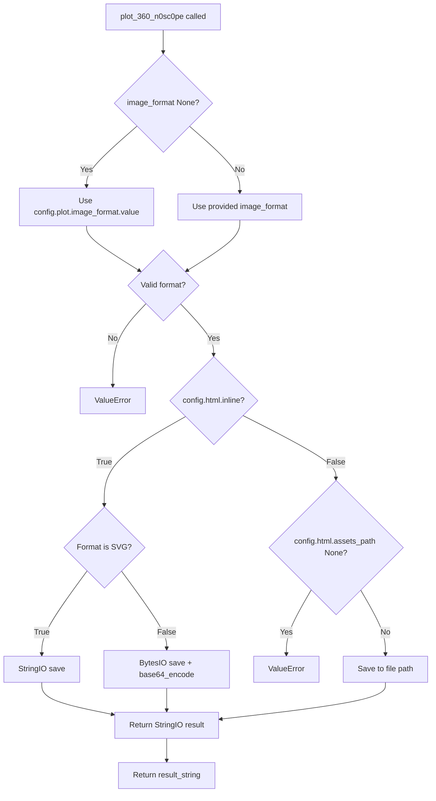

# `utils.py`

## `src.ydata_profiling.visualisation.utils.hex_to_rgb` · *function*

## Summary:
Converts a hexadecimal color string to an RGB or RGBA tuple with normalized values between 0 and 1.

## Description:
Transforms a hexadecimal color representation (like "#FF0000" for red) into a tuple of floating-point values representing the red, green, and blue components normalized to the range [0, 1]. For 8-character hex strings, the fourth component represents alpha (opacity). This normalization is commonly required by visualization libraries like matplotlib.

## Args:
    hex (str): Hexadecimal color string, optionally prefixed with "#". Valid formats include "#FF0000", "FF0000", "#00FF00", "#0000FF80", etc.

## Returns:
    Tuple[float, float, float] or Tuple[float, float, float, float]: RGB or RGBA color components as floating-point values in the range [0, 1]. Returns a 3-tuple for RGB colors and a 4-tuple for RGBA colors.

## Raises:
    ValueError: When the hex string contains invalid hexadecimal characters.

## Constraints:
    Preconditions:
        - Input must be a string
        - Hex string must contain only valid hexadecimal characters (0-9, A-F, a-f)
    Postconditions:
        - Output tuple values are always in the range [0, 1]
        - Output tuple length is either 3 (RGB) or 4 (RGBA)

## Side Effects:
    None

## Control Flow:
```mermaid
flowchart TD
    A[Input hex string] --> B[Strip # prefix if present]
    B --> C[Calculate hex length]
    C --> D[Create chunks of size hlen//3]
    D --> E[Convert each chunk to int and normalize to [0,1]]
    E --> F[Return tuple of normalized values]
    F --> G[Output]
```

## Examples:
    >>> hex_to_rgb("#FF0000")
    (1.0, 0.0, 0.0)
    
    >>> hex_to_rgb("00FF00")
    (0.0, 1.0, 0.0)
    
    >>> hex_to_rgb("#0000FF80")
    (0.0, 0.0, 1.0, 0.5)
```

## `src.ydata_profiling.visualisation.utils.base64_image` · *function*

## Summary:
Converts binary image data into a base64-encoded data URI string for web embedding.

## Description:
Transforms raw binary image data into a data URI format suitable for embedding directly in HTML, CSS, or JavaScript. This utility function handles the encoding and formatting required to represent binary image data as a string that can be used in web contexts without requiring separate file storage or HTTP requests.

## Args:
    image (bytes): Raw binary image data to encode
    mime_type (str): MIME type of the image (e.g., 'image/png', 'image/jpeg')

## Returns:
    str: A data URI string in the format "data:mime_type;base64,encoded_data"

## Raises:
    None explicitly raised

## Constraints:
    Preconditions:
        - image parameter must be valid binary data
        - mime_type must be a valid MIME type string
    Postconditions:
        - Returns a properly formatted data URI string
        - The returned string is safe for use in HTML/CSS contexts

## Side Effects:
    None

## Control Flow:
```mermaid
flowchart TD
    A[base64_image function] --> B[image bytes input]
    B --> C[base64.b64encode(image)]
    C --> D[quote(base64_data)]
    D --> E[Return data URI string]
```

## Examples:
```python
# Basic usage
image_bytes = b'\x89PNG\r\n\x1a\n...'
mime_type = 'image/png'
data_uri = base64_image(image_bytes, mime_type)
# Returns: "data:image/png;base64,iVBORw0KGgoAAAANSUhEUgAAAAEAAAABCAYAAAAfFcSJAAAADUlEQVR42mP8/5+hHgAHggJ/PchI7wAAAABJRU5ErkJggg=="
```

## `src.ydata_profiling.visualisation.utils.plot_360_n0sc0pe` · *function*

## Summary:
Generates and saves matplotlib plots in either inline base64-encoded format or file-based format based on configuration settings.

## Description:
This utility function handles the saving of matplotlib plots according to the application's configuration. When HTML inline rendering is enabled, it saves plots as base64-encoded strings for direct embedding in HTML documents. When disabled, it saves plots to files in the configured assets directory with unique filenames. The function specifically supports PNG and SVG image formats.

## Args:
    config (Settings): Configuration object containing HTML and plot settings
    image_format (Optional[str]): Image format to use ('png' or 'svg'). Defaults to None, which uses config.plot.image_format.value
    bbox_extra_artists (Optional[List[Artist]]): List of artists to include in bounding box calculation
    bbox_inches (Optional[str]): Bounding box inches specification for plot saving

## Returns:
    str: Either a base64-encoded data URI string for inline display or a file path string for file-based storage

## Raises:
    ValueError: When image_format is not 'png' or 'svg', or when config.html.assets_path is None in file-based mode

## Constraints:
    Preconditions:
        - config must be a valid Settings object with proper html and plot configurations
        - image_format must be either 'png' or 'svg' if explicitly provided
        - config.html.assets_path must not be None when in file-based mode
    Postconditions:
        - Returns a valid string representing either a data URI or file path
        - The matplotlib figure is closed after saving to prevent memory leaks

## Side Effects:
    - Creates temporary file objects (BytesIO/StringIO) when processing inline images
    - Writes files to disk when in file-based mode (config.html.inline = False)
    - Closes matplotlib figures to prevent memory leaks

## Control Flow:


## Examples:
```python
# Inline PNG generation
config = Settings()
config.html.inline = True
config.plot.image_format.value = "png"
config.plot.dpi = 300
result = plot_360_n0sc0pe(config, "png")
# Returns base64-encoded PNG string

# File-based SVG generation  
config = Settings()
config.html.inline = False
config.html.assets_path = "/tmp/assets"
config.html.assets_prefix = "report"
result = plot_360_n0sc0pe(config, "svg")
# Returns file path string like "report/images/a1b2c3d4e5f67890.svg"
```

