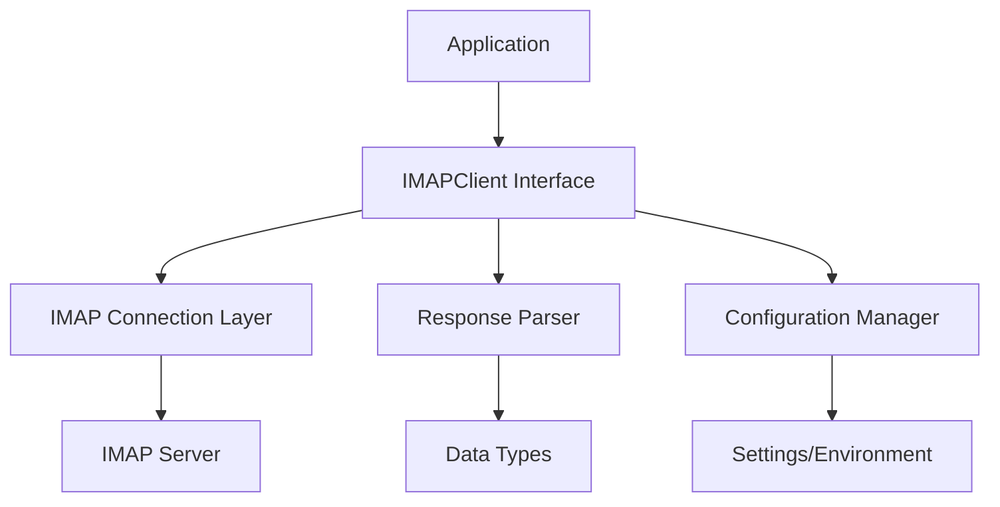

# `IMAPClient`

## Repository Overview

### Tree Structure
```
IMAPClient/
└── imapclient/
    ├── __init__.py
    ├── config.py
    ├── datetime_util.py
    ├── fixed_offset.py
    ├── imap4.py
    ├── imap_utf7.py
    ├── interact.py
    ├── response_lexer.py
    ├── response_parser.py
    ├── response_types.py
    ├── testable_imapclient.py
    ├── tls.py
    ├── util.py
    └── version.py
```

### Purpose

IMAPClient is a comprehensive Python library for interacting with IMAP (Internet Message Access Protocol) servers. It provides a clean, Pythonic interface for email account management, message retrieval, folder operations, and advanced IMAP features like searching and tagging.

This library serves developers who need to build applications that interact with email servers programmatically, such as email clients, archiving tools, email processing pipelines, and automation scripts.

### Architecture



Key architectural patterns:
- **Layered Architecture**: Separation of concerns between connection management, parsing, and application logic
- **Adapter Pattern**: Wraps standard library IMAP functionality with enhanced features
- **Configuration Management**: Flexible configuration via files, environment variables, or programmatic settings
- **Extensible Design**: Modular components that can be extended or replaced

### Entry Points

1. **Importable API**: `from imapclient import IMAPClient`
   - Primary interface for connecting to and interacting with IMAP servers
   - Target audience: Developers building email applications

2. **Command Line Interface**: `imapclient.interact.main`
   - Interactive shell for exploring IMAP servers
   - Target audience: Developers debugging or testing IMAP connections

3. **Configuration-based Client Creation**: `imapclient.config.create_client_from_config`
   - Creates IMAP clients from configuration files or environment variables
   - Target audience: Applications requiring flexible deployment configurations

### Core Features

1. **IMAP Connection Management** - Secure SSL/TLS connections, timeouts, and connection pooling
   - Implemented in: `imapclient.imap4`, `imapclient.tls`

2. **Message Fetching and Parsing** - Retrieve messages with envelopes, bodies, and metadata
   - Implemented in: `imapclient.response_parser`, `imapclient.response_types`

3. **Search and Filtering** - Advanced IMAP search capabilities with various criteria
   - Implemented in: `imapclient.IMAPClient.search`

4. **Folder Operations** - Manage mailboxes including creation, deletion, renaming
   - Implemented in: `imapclient.IMAPClient.*folder* methods`

5. **Authentication Support** - Username/password, OAuth2, and STARTTLS support
   - Implemented in: `imapclient.config`, `imapclient.tls`

6. **UTF-7 Encoding** - Proper handling of internationalized mailbox names
   - Implemented in: `imapclient.imap_utf7`

7. **Configuration Management** - Flexible configuration via files, environment, or defaults
   - Implemented in: `imapclient.config`

### Dependencies

- **Python Standard Library**: `imaplib`, `ssl`, `socket`, `configparser`, `argparse`, `os`, `time`, `urllib`, `json`, `logging`
- **Third-party Libraries**: 
  - `ptpython` (optional, for interactive shell)
  - `IPython` (optional, for interactive shell)
  - `email.utils` (for address formatting)

### Extension Points

1. **Custom Connection Classes**: Subclass `IMAPClient` to customize connection behavior
2. **Response Parsers**: Extend `response_parser` for custom response handling
3. **Authentication Providers**: Implement custom authentication flows
4. **Configuration Sources**: Add new configuration file formats or sources
5. **Middleware**: Wrap client calls for logging, caching, or rate limiting

---

## Modules

- [`imapclient`](imapclient.md)

