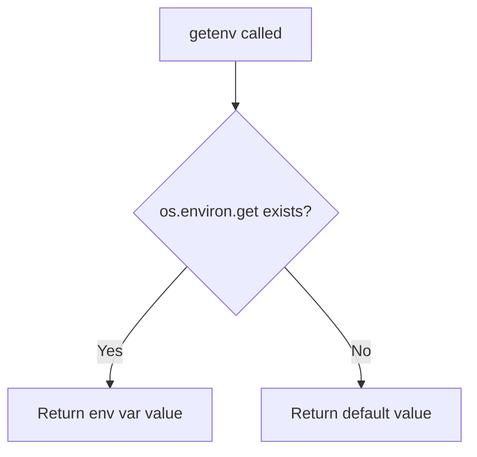
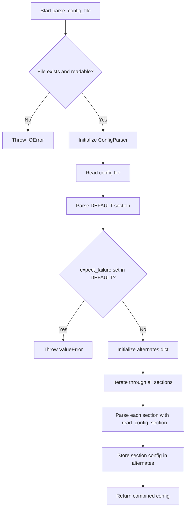
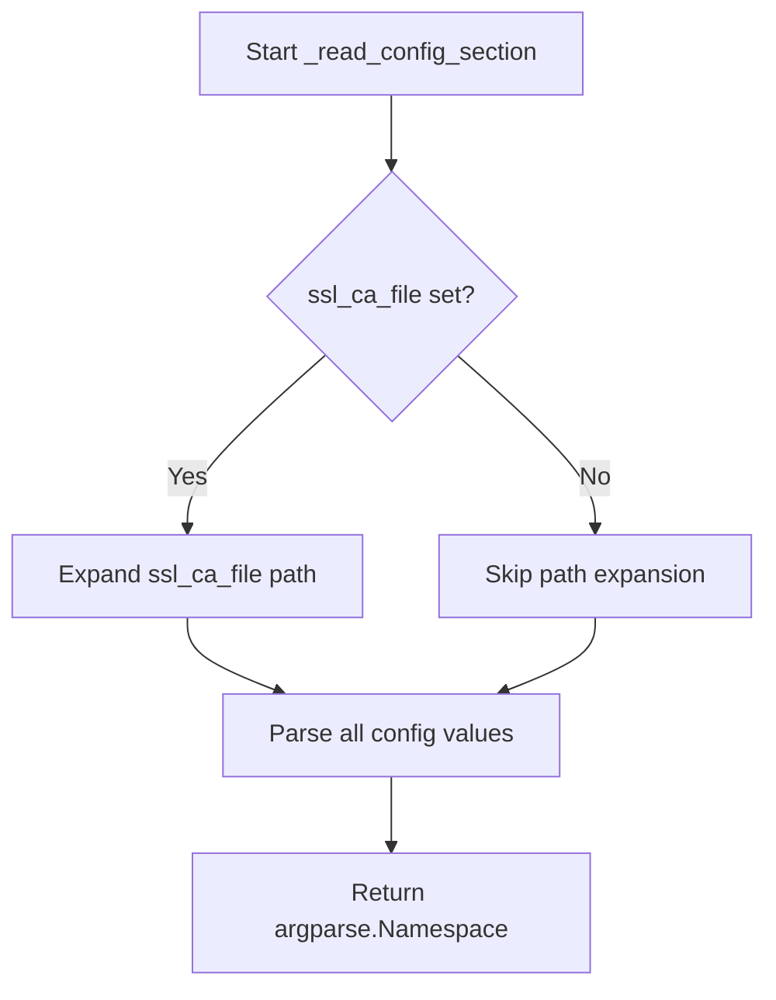
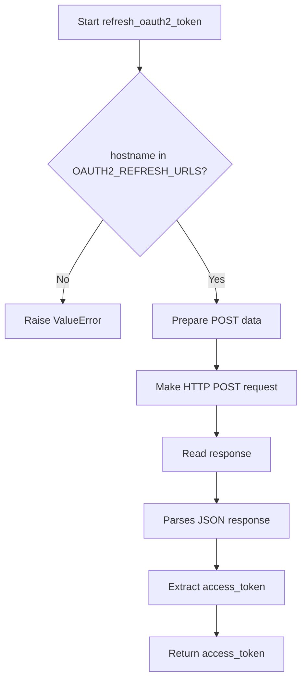
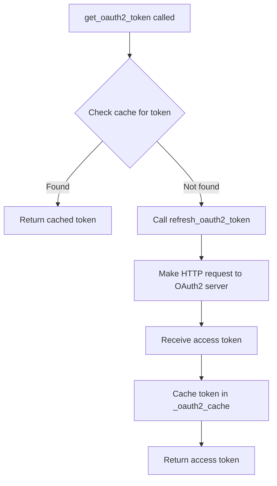

# `config.py`

## `imapclient.config.getenv` · *function*

## Summary:
Retrieves environment variables with a prefixed name for IMAP client configuration.

## Description:
This utility function provides a standardized way to access environment variables used by the IMAP client configuration system. It automatically prefixes the requested variable name with "imapclient_" to avoid naming conflicts with other environment variables in the system.

## Args:
    name (str): The base name of the environment variable to retrieve (without the "imapclient_" prefix)
    default (Optional[str]): The default value to return if the environment variable is not set

## Returns:
    Optional[str]: The value of the environment variable if it exists, or the default value if it doesn't exist

## Raises:
    None

## Constraints:
    Preconditions:
        - The `name` parameter must be a string
        - The `default` parameter can be None or a string
    Postconditions:
        - Returns either the environment variable value or the provided default value
        - Never raises an exception

## Side Effects:
    None

## Control Flow:


## Examples:
    # Get IMAP server host with default fallback
    host = getenv("host", "localhost")
    
    # Get IMAP port with default fallback  
    port = getenv("port", "993")
    
    # Get username with no default (returns None if not set)
    username = getenv("username", None)
```

## `imapclient.config.get_config_defaults` · *function*

## Summary:
Returns a dictionary of default configuration values for an IMAP client connection, with environment variable overrides for sensitive credentials.

## Description:
This function provides default configuration settings for connecting to IMAP servers. It establishes sensible defaults for connection parameters while allowing credential values to be overridden via environment variables. The function is designed to be called early in the application lifecycle to establish baseline configuration values before user-specific overrides are applied.

The configuration includes standard connection parameters like SSL/TLS settings, authentication methods, and timeout configurations. Sensitive information such as username and password are retrieved from environment variables using the `getenv` helper function, which prefixes variable names with "imapclient_" to avoid conflicts.

## Args:
    None

## Returns:
    Dict[str, Any]: A dictionary containing default configuration values with the following keys:
        - "username": Username for authentication, read from environment variable "imapclient_username" or None
        - "password": Password for authentication, read from environment variable "imapclient_password" or None
        - "ssl": Boolean indicating whether to use SSL/TLS encryption (default: True)
        - "ssl_check_hostname": Boolean indicating whether to verify SSL certificate hostname (default: True)
        - "ssl_verify_cert": Boolean indicating whether to verify SSL certificates (default: True)
        - "ssl_ca_file": Path to CA certificate file for SSL verification or None (default: None)
        - "timeout": Connection timeout in seconds or None (default: None)
        - "starttls": Boolean indicating whether to use STARTTLS (default: False)
        - "stream": Boolean indicating whether to use streaming mode (default: False)
        - "oauth2": Boolean indicating whether to use OAuth2 authentication (default: False)
        - "oauth2_client_id": OAuth2 client ID from environment variable "imapclient_oauth2_client_id" or None
        - "oauth2_client_secret": OAuth2 client secret from environment variable "imapclient_oauth2_client_secret" or None
        - "oauth2_refresh_token": OAuth2 refresh token from environment variable "imapclient_oauth2_refresh_token" or None
        - "expect_failure": Expected failure condition or None (default: None)

## Raises:
    None

## Constraints:
    Preconditions:
        - The `getenv` helper function must be available in the module scope
        - Environment variables should be properly formatted if they exist
    Postconditions:
        - Returns a dictionary with all expected configuration keys
        - All values are of appropriate types (strings for credentials, booleans for flags, None for optional values)

## Side Effects:
    - Reads from environment variables using os.environ.get()
    - No external state mutations or I/O operations beyond environment variable access

## Control Flow:
```mermaid
flowchart TD
    A[Start get_config_defaults] --> B{Return dict with defaults}
    B --> C[Set username from getenv("username", None)]
    C --> D[Set password from getenv("password", None)]
    D --> E[Set ssl=True]
    E --> F[Set ssl_check_hostname=True]
    F --> G[Set ssl_verify_cert=True]
    G --> H[Set ssl_ca_file=None]
    H --> I[Set timeout=None]
    I --> J[Set starttls=False]
    J --> K[Set stream=False]
    K --> L[Set oauth2=False]
    L --> M[Set oauth2_client_id from getenv("oauth2_client_id", None)]
    M --> N[Set oauth2_client_secret from getenv("oauth2_client_secret", None)]
    N --> O[Set oauth2_refresh_token from getenv("oauth2_refresh_token", None)]
    O --> P[Set expect_failure=None]
    P --> Q[Return completed dict]
```

## Examples:
```python
# Basic usage
defaults = get_config_defaults()
print(defaults["ssl"])  # Output: True
print(defaults["username"])  # Output: None (unless IMAPCLIENT_USERNAME env var set)

# With environment variables set
import os
os.environ["IMAPCLIENT_USERNAME"] = "test@example.com"
os.environ["IMAPCLIENT_PASSWORD"] = "secret123"

defaults = get_config_defaults()
print(defaults["username"])  # Output: "test@example.com"
print(defaults["password"])  # Output: "secret123"
```

## `imapclient.config.parse_config_file` · *function*

## Summary
Parses an INI-style configuration file and returns a namespace object containing connection settings for IMAP clients.

## Description
This function reads a configuration file in INI format and extracts connection parameters for IMAP servers. It processes the DEFAULT section first, then iterates through all available sections to build a complete configuration structure. The function enforces that the expect_failure setting is not used in the DEFAULT section while allowing it in individual server sections.

## Args
    filename (str): Path to the configuration file to parse

## Returns
    argparse.Namespace: Configuration object containing:
        - host (str): IMAP server hostname
        - port (int): IMAP server port number
        - ssl (bool): Whether to use SSL/TLS encryption
        - starttls (bool): Whether to upgrade connection with STARTTLS
        - ssl_check_hostname (bool): Whether to verify SSL certificate hostname
        - ssl_verify_cert (bool): Whether to verify SSL certificate validity
        - ssl_ca_file (str): Path to CA certificate file for SSL verification
        - timeout (float): Connection timeout in seconds
        - stream (bool): Whether to use streaming mode
        - username (str): Authentication username
        - password (str): Authentication password
        - oauth2 (bool): Whether to use OAuth2 authentication
        - oauth2_client_id (str): OAuth2 client ID
        - oauth2_client_secret (str): OAuth2 client secret
        - oauth2_refresh_token (str): OAuth2 refresh token
        - expect_failure (str): Expected failure condition (only allowed in non-DEFAULT sections)
        - alternates (dict): Dictionary mapping section names to their respective configuration objects

## Raises
    ValueError: When expect_failure is set in the DEFAULT section of the configuration file

## Constraints
    Preconditions:
        - The filename parameter must point to a readable file
        - The configuration file must be in valid INI format
        - The DEFAULT section must not contain expect_failure setting
    
    Postconditions:
        - Returns a populated argparse.Namespace with all configuration options
        - The alternates dictionary contains entries for all sections in the config file
        - All string values are properly parsed from the configuration file

## Side Effects
    - Reads from the filesystem to load the configuration file
    - Expands user home directory paths in ssl_ca_file if present

## Control Flow


## Examples
    # Basic usage with a configuration file
    config = parse_config_file("/path/to/config.ini")
    
    # Accessing configuration values
    server_host = config.host
    server_port = config.port
    use_ssl = config.ssl
    
    # Accessing alternate configurations
    alternate_config = config.alternates["work_server"]
    work_host = alternate_config.host
``

## `imapclient.config.get_string_config_defaults` · *function*

*No documentation generated.*

## `imapclient.config._read_config_section` · *function*

## Summary:
Parses IMAP configuration section from a ConfigParser and returns standardized connection parameters as an argparse.Namespace.

## Description:
Extracts IMAP connection configuration parameters from a specified section of a configparser.ConfigParser object. This function centralizes the parsing logic for IMAP client configuration options, providing consistent handling of various data types including strings, booleans, integers, and floats. It handles path expansion for SSL CA files and gracefully manages missing configuration options by returning None for optional fields.

## Args:
    parser (configparser.ConfigParser): Configuration parser containing the configuration sections
    section (str): Name of the configuration section to parse

## Returns:
    argparse.Namespace: Namespace object containing parsed configuration parameters with the following attributes:
        - host (str): IMAP server hostname
        - port (Optional[int]): IMAP server port number
        - ssl (bool): Whether to use SSL/TLS connection
        - starttls (bool): Whether to upgrade connection with STARTTLS
        - ssl_check_hostname (bool): Whether to verify SSL certificate hostname
        - ssl_verify_cert (bool): Whether to verify SSL certificate validity
        - ssl_ca_file (Optional[str]): Path to SSL CA certificate file
        - timeout (Optional[float]): Connection timeout in seconds
        - stream (bool): Whether to use streaming mode
        - username (str): Authentication username
        - password (str): Authentication password
        - oauth2 (bool): Whether to use OAuth2 authentication
        - oauth2_client_id (str): OAuth2 client identifier
        - oauth2_client_secret (str): OAuth2 client secret
        - oauth2_refresh_token (str): OAuth2 refresh token
        - expect_failure (str): Expected failure condition description

## Raises:
    configparser.NoOptionError: When a required configuration option is missing from the section
    ValueError: When a configuration value cannot be converted to the expected type (e.g., invalid integer or float)

## Constraints:
    Preconditions:
        - parser must be a valid configparser.ConfigParser instance
        - section must be a string representing an existing section in the parser
        - All required configuration options must be present in the specified section
    Postconditions:
        - Returns an argparse.Namespace with all configuration parameters properly parsed
        - ssl_ca_file paths are expanded using os.path.expanduser() when present

## Side Effects:
    - Expands user home directory references in ssl_ca_file path using os.path.expanduser()
    - Reads configuration values from the parser object (no external I/O)

## Control Flow:


## Examples:
    # Basic usage with minimal configuration
    parser = configparser.ConfigParser()
    parser.read_string('''
    [imap]
    host = imap.example.com
    port = 993
    ssl = true
    username = test@example.com
    password = secret
    ''')
    
    config = _read_config_section(parser, 'imap')
    print(config.host)  # Output: 'imap.example.com'
    print(config.port)  # Output: 993
    print(config.ssl)   # Output: True
    
    # Usage with optional parameters
    parser = configparser.ConfigParser()
    parser.read_string('''
    [imap]
    host = imap.example.com
    port = 993
    ssl = true
    ssl_ca_file = ~/.ssl/certs/ca.pem
    timeout = 30.5
    username = test@example.com
    password = secret
    ''')
    
    config = _read_config_section(parser, 'imap')
    print(config.ssl_ca_file)  # Output: '/home/user/.ssl/certs/ca.pem' (expanded path)
    print(config.timeout)      # Output: 30.5
```

## `imapclient.config.refresh_oauth2_token` · *function*

## Summary:
Refreshes an OAuth2 access token using a refresh token for a specified IMAP server hostname.

## Description:
This function implements the OAuth2 token refresh mechanism by sending a POST request to the appropriate OAuth2 refresh endpoint for the given hostname. It exchanges a refresh token for a new access token, which is commonly needed when working with IMAP servers that use OAuth2 authentication.

The function is designed to be called when an existing access token has expired or become invalid, allowing the application to obtain a fresh token without requiring user re-authentication.

## Args:
    hostname (str): The IMAP server hostname for which to refresh the OAuth2 token. This determines which OAuth2 refresh endpoint to use.
    client_id (str): The OAuth2 client identifier registered with the authorization server.
    client_secret (str): The OAuth2 client secret associated with the client identifier.
    refresh_token (str): The refresh token previously obtained during the OAuth2 authorization process.

## Returns:
    str: The newly acquired OAuth2 access token that can be used for authenticating IMAP operations.

## Raises:
    ValueError: When the hostname is not recognized and no OAuth2 refresh URL is available for that hostname.

## Constraints:
    Preconditions:
        - The hostname must be a recognized IMAP server hostname that has a corresponding OAuth2 refresh endpoint configured
        - All parameters must be valid strings with appropriate OAuth2 credentials
    Postconditions:
        - Returns a valid OAuth2 access token string upon successful refresh
        - The returned token is suitable for immediate use in IMAP authentication

## Side Effects:
    - Makes an outbound HTTPS network request to the OAuth2 authorization server
    - Performs HTTP I/O operations including request serialization and response parsing

## Control Flow:


## Examples:
```python
# Typical usage in an IMAP client context
try:
    new_token = refresh_oauth2_token(
        hostname="imap.gmail.com",
        client_id="my_client_id",
        client_secret="my_client_secret", 
        refresh_token="my_refresh_token"
    )
    # Use new_token for IMAP authentication
except ValueError as e:
    print(f"Token refresh failed: {e}")
```

## `imapclient.config.get_oauth2_token` · *function*

## Summary:
Retrieves an OAuth2 access token for an IMAP server using cached credentials when available, otherwise refreshing the token from the server.

## Description:
This function implements a caching layer for OAuth2 token retrieval. When called with the same hostname, client ID, client secret, and refresh token parameters, it first checks an in-memory cache for a previously obtained token. If found, it returns the cached token immediately. Otherwise, it calls the underlying `refresh_oauth2_token` function to obtain a fresh token from the OAuth2 server, caches it for future use, and returns it.

The function is designed to avoid unnecessary network requests to refresh tokens by leveraging a simple in-memory cache keyed by authentication parameters.

## Args:
    hostname (str): The IMAP server hostname for which the OAuth2 token is needed
    client_id (str): The OAuth2 client identifier registered with the service provider
    client_secret (str): The OAuth2 client secret associated with the client identifier
    refresh_token (str): The refresh token used to obtain new access tokens

## Returns:
    str: An OAuth2 access token that can be used to authenticate with the IMAP server

## Raises:
    ValueError: When the hostname does not correspond to a known OAuth2 refresh URL in the configuration

## Constraints:
    Preconditions:
        - All string parameters must be valid and non-empty
        - The hostname must be configured in the OAUTH2_REFRESH_URLS mapping
        - The refresh_token must be valid for the given client credentials
    
    Postconditions:
        - Returns a valid OAuth2 access token string
        - The returned token is stored in the internal cache for subsequent calls with identical parameters

## Side Effects:
    - Makes HTTP network requests to the OAuth2 server when a cached token is not available
    - Updates the internal `_oauth2_cache` dictionary with newly acquired tokens
    - May perform DNS resolution and TLS handshake during HTTP requests

## Control Flow:


## Examples:
```python
# Typical usage pattern
token = get_oauth2_token(
    hostname="imap.gmail.com",
    client_id="my_client_id",
    client_secret="my_client_secret",
    refresh_token="my_refresh_token"
)
# Subsequent calls with same parameters will return cached token
cached_token = get_oauth2_token(...)
```

## `imapclient.config.create_client_from_config` · *function*

## Summary:
Creates and configures an IMAP client instance based on configuration parameters, optionally performing authentication.

## Description:
This function serves as a factory for creating IMAP client instances with proper SSL/TLS configuration and authentication. It centralizes the logic for establishing IMAP connections with various authentication mechanisms (OAuth2, standard login, or no login) and SSL settings.

The function is extracted from inline logic to provide a clean separation between connection setup and authentication concerns, making it easier to test and reuse across different parts of the application.

## Args:
    conf (argparse.Namespace): Configuration namespace containing connection parameters including host, port, SSL settings, authentication credentials, and timeout values.
    login (bool, optional): Flag indicating whether to perform authentication after connecting. Defaults to True.

## Returns:
    imapclient.IMAPClient: Configured IMAP client instance ready for use.

## Raises:
    AssertionError: When required configuration values are missing (host, OAuth2 credentials, username, or password).
    Exception: Propagates any exceptions that occur during connection establishment or authentication attempts.

## Constraints:
    Preconditions:
        - conf.host must be specified
        - For OAuth2 authentication: conf.oauth2_client_id, conf.oauth2_client_secret, and conf.oauth2_refresh_token must be provided
        - For standard authentication: conf.username and conf.password must be provided
    Postconditions:
        - Returns a fully configured IMAPClient instance
        - If login=False, returns client without authentication
        - If login=True and authentication fails, client is shut down before raising exception

## Side Effects:
    - Establishes network connection to the IMAP server
    - May make HTTP requests to OAuth2 token refresh endpoints (when using OAuth2)
    - Calls client.shutdown() on authentication failure to clean up resources

## Control Flow:
```mermaid
flowchart TD
    A[Start create_client_from_config] --> B{conf.host set?}
    B -- No --> C[AssertionError]
    B -- Yes --> D[Create SSL context]
    D --> E{conf.ssl?}
    E -- Yes --> F[Setup SSL context]
    E -- No --> G[Skip SSL setup]
    F --> G
    G --> H[Create IMAPClient]
    H --> I{login=False?}
    I -- Yes --> J[Return client]
    I -- No --> K{conf.starttls?}
    K -- Yes --> L[client.starttls()]
    K -- No --> M[Skip STARTTLS]
    L --> M
    M --> N{conf.oauth2?}
    N -- Yes --> O[Validate OAuth2 creds]
    O --> P[Get OAuth2 token]
    P --> Q[client.oauth2_login()]
    N -- No --> R[Check conf.stream]
    R -- No --> S[Validate username/password]
    S --> T[client.login()]
    R -- Yes --> U[Skip auth]
    Q --> V[Return client]
    T --> V
    U --> V
    V --> W{Exception occurred?}
    W -- Yes --> X[client.shutdown()]
    X --> Y[Raise exception]
```

## Examples:
```python
# Basic usage with authentication
import argparse
conf = argparse.Namespace(
    host="imap.example.com",
    port=993,
    ssl=True,
    ssl_check_hostname=True,
    ssl_verify_cert=True,
    username="user@example.com",
    password="secret_password",
    timeout=30
)
client = create_client_from_config(conf)

# Usage without authentication
client = create_client_from_config(conf, login=False)

# OAuth2 usage
conf.oauth2 = True
conf.oauth2_client_id = "client_id"
conf.oauth2_client_secret = "client_secret"
conf.oauth2_refresh_token = "refresh_token"
client = create_client_from_config(conf)
```

