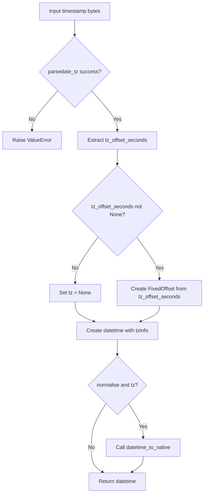
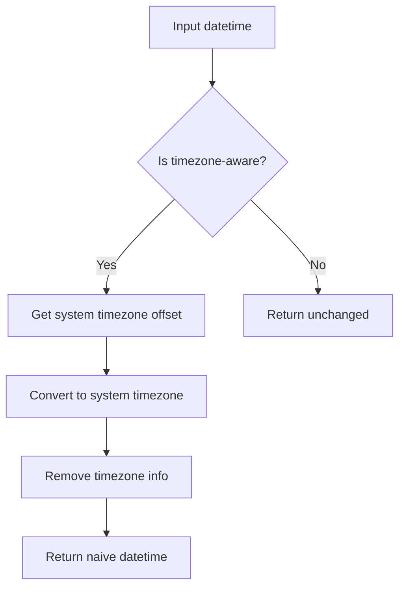
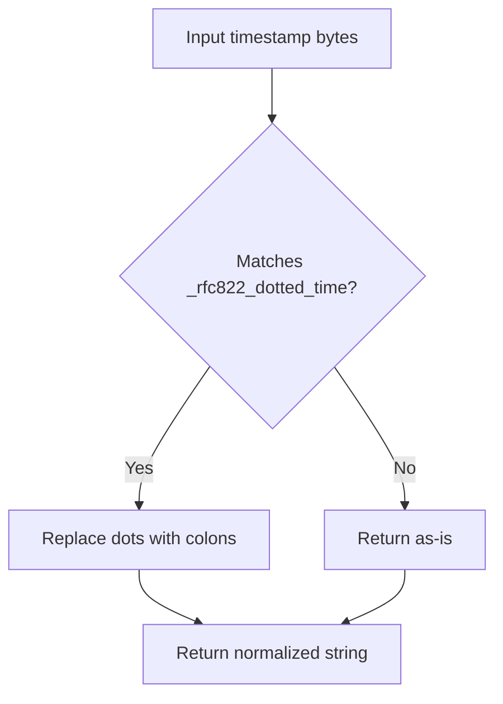

# `datetime_util.py`

## `imapclient.datetime_util.parse_to_datetime` · *function*

## Summary:
Converts an IMAP timestamp byte string into a timezone-aware datetime object.

## Description:
Parses an IMAP timestamp represented as bytes into a Python datetime object, handling timezone information and optional normalization to local time. This function extracts timezone offset information from the timestamp and constructs a proper datetime object with timezone awareness.

## Args:
    timestamp (bytes): IMAP timestamp in bytes format, typically from IMAP server responses
    normalise (bool): When True (default), converts the datetime to local system timezone and removes timezone info; when False, preserves original timezone information

## Returns:
    datetime: A timezone-aware datetime object representing the parsed timestamp. If normalise=True and timezone information exists, returns naive datetime in local system timezone.

## Raises:
    ValueError: When the timestamp cannot be parsed by the underlying parser (parsedate_tz returns None)

## Constraints:
    Preconditions:
        - timestamp must be a valid bytes object containing a recognizable date/time format
        - timestamp should be in a format compatible with email.utils.parsedate_tz
    
    Postconditions:
        - Returned datetime object is either timezone-aware or naive depending on normalise parameter
        - Timezone information is properly converted to FixedOffset representation

## Side Effects:
    None

## Control Flow:


## Examples:
    >>> parse_to_datetime(b"15-Nov-2023 14:30:00 +0500")
    datetime.datetime(2023, 11, 15, 14, 30, 0)
    
    >>> parse_to_datetime(b"15-Nov-2023 14:30:00 +0500", normalise=False)
    datetime.datetime(2023, 11, 15, 14, 30, 0, tzinfo=FixedOffset(300))
``

## `imapclient.datetime_util.datetime_to_native` · *function*

## Summary:
Converts a timezone-aware datetime to the system's local timezone and removes timezone information.

## Description:
This function transforms a datetime object with timezone information into a naive datetime object representing the same moment in time but in the system's local timezone. This is useful for standardizing datetime representations when timezone information is not required or when working with systems that expect naive datetime objects.

The function internally uses `FixedOffset.for_system()` to determine the system's local timezone offset and applies this conversion to the input datetime.

## Args:
    dt (datetime): A timezone-aware datetime object to convert to system local time.

## Returns:
    datetime: A naive datetime object representing the same moment in time as the input, but in the system's local timezone.

## Raises:
    None explicitly raised by this function.

## Constraints:
    Preconditions:
    - Input `dt` must be a timezone-aware datetime object (have non-None tzinfo)
    - Input `dt` must be a valid datetime object
    
    Postconditions:
    - Output datetime will have tzinfo=None (naive datetime)
    - Output datetime represents the same moment in time as input
    - Output datetime will be in the system's local timezone

## Side Effects:
    None

## Control Flow:


## Examples:
```python
from datetime import datetime, timezone
from imapclient.datetime_util import datetime_to_native

# Convert UTC datetime to local timezone
utc_dt = datetime(2023, 6, 15, 12, 0, 0, tzinfo=timezone.utc)
local_dt = datetime_to_native(utc_dt)
# Result: naive datetime in system's local timezone

# Convert already local datetime to system local timezone
local_tz_dt = datetime(2023, 6, 15, 12, 0, 0, tzinfo=timezone.utc)
local_dt = datetime_to_native(local_tz_dt)
# Result: naive datetime in system's local timezone
```

## `imapclient.datetime_util.datetime_to_INTERNALDATE` · *function*

## Summary:
Converts a datetime object to an IMAP INTERNALDATE string format.

## Description:
Transforms a Python datetime object into the IMAP INTERNALDATE format required by IMAP servers for date-related operations. This function ensures timezone awareness and formats the date according to IMAP specifications.

## Args:
    dt (datetime): A datetime object to convert to INTERNALDATE format. If the datetime has no timezone information, it will be localized to the system timezone.

## Returns:
    str: A string representing the datetime in IMAP INTERNALDATE format (e.g., "01-Jan-2023 12:30:45 +0000").

## Raises:
    None explicitly raised in the function body.

## Constraints:
    Preconditions:
    - Input must be a datetime object
    - The datetime object should ideally have timezone information, though it's handled automatically
    
    Postconditions:
    - Output is always a properly formatted IMAP INTERNALDATE string
    - Timezone information is always included in the output

## Side Effects:
    None

## Control Flow:
```mermaid
flowchart TD
    A[Start datetime_to_INTERNALDATE] --> B{dt.tzinfo}
    B -- None --> C[dt.replace(tzinfo=FixedOffset.for_system())]
    B -- Has tzinfo --> D[Skip timezone adjustment]
    C --> E[fmt = "%d-" + _SHORT_MONTHS[dt.month] + "-%Y %H:%M:%S %z"]
    D --> E
    E --> F[dt.strftime(fmt)]
    F --> G[Return formatted string]
```

## Examples:
    # Basic usage with timezone-aware datetime
    dt = datetime(2023, 1, 15, 14, 30, 0, tzinfo=timezone.utc)
    result = datetime_to_INTERNALDATE(dt)
    # Returns: "15-Jan-2023 14:30:00 +0000"
    
    # Usage with naive datetime (will use system timezone)
    dt = datetime(2023, 1, 15, 14, 30, 0)
    result = datetime_to_INTERNALDATE(dt)
    # Returns: "15-Jan-2023 14:30:00 +0100" (or appropriate system offset)

## `imapclient.datetime_util._munge` · *function*

## Summary:
Converts timestamp bytes to properly formatted string for email date parsing by normalizing time separators.

## Description:
Processes timestamp bytes by decoding them using latin-1 encoding and normalizing time separator characters. When the timestamp matches RFC822 dotted time format (containing dots in time components), it converts dots to colons to ensure proper parsing by email utilities.

## Args:
    timestamp (bytes): Raw timestamp data that needs processing, typically from IMAP responses

## Returns:
    str: Processed timestamp string with normalized time separators, suitable for email date parsing

## Raises:
    UnicodeDecodeError: When the timestamp bytes cannot be decoded using latin-1 encoding

## Constraints:
    Preconditions:
        - Input must be valid bytes object containing timestamp data
        - The timestamp should be in a format compatible with email date parsing requirements
    
    Postconditions:
        - Output string is properly formatted for email date parsing
        - Time components use standard colon separators instead of dots where applicable

## Side Effects:
    None

## Control Flow:


## Examples:
    >>> _munge(b"Mon, 01 Jan 2024 12.30.45 +0000")
    "Mon, 01 Jan 2024 12:30:45 +0000"
    
    >>> _munge(b"Tue, 02 Jan 2024 14:20:30 +0000")
    "Tue, 02 Jan 2024 14:20:30 +0000"
```

## `imapclient.datetime_util.format_criteria_date` · *function*

## Summary:
Formats a datetime object into a standardized IMAP date string format for search criteria.

## Description:
Converts a Python datetime object into a byte string formatted as "DD-MMM-YYYY" (e.g., "01-Jan-2023") suitable for use in IMAP search criteria. This function extracts the day, month, and year from the datetime object and formats them according to IMAP specifications.

## Args:
    dt (datetime): A Python datetime object containing the date to be formatted.

## Returns:
    bytes: A byte string representation of the date in "DD-MMM-YYYY" format encoded in ASCII.

## Raises:
    TypeError: If dt is not a datetime object.
    ValueError: If dt contains invalid date values.
    IndexError: If _SHORT_MONTHS array does not contain a valid entry for the month.

## Constraints:
    Preconditions:
        - The input dt must be a valid datetime object
        - The datetime object must have valid day, month, and year values (1-31 for day, 1-12 for month)
        - The _SHORT_MONTHS constant must be defined as an array of 12 abbreviated month names indexed by month number (1-12)
    
    Postconditions:
        - The returned value is always a byte string encoded in ASCII
        - The format is always "DD-MMM-YYYY" where DD is zero-padded day, MMM is abbreviated month name, YYYY is 4-digit year

## Side Effects:
    None.

## Control Flow:
```mermaid
flowchart TD
    A[Input datetime] --> B{Valid datetime?}
    B -->|Yes| C[Extract day, month, year]
    C --> D[Get month abbreviation from _SHORT_MONTHS]
    D --> E[Format as "DD-MMM-YYYY"]
    E --> F[Encode as ASCII bytes]
    F --> G[Return bytes]
    B -->|No| H[Raises TypeError/ValueError from datetime operations]
```

## Examples:
    >>> from datetime import datetime
    >>> dt = datetime(2023, 1, 15)
    >>> format_criteria_date(dt)
    b'15-Jan-2023'
    
    >>> dt = datetime(2024, 12, 25)
    >>> format_criteria_date(dt)
    b'25-Dec-2024'

