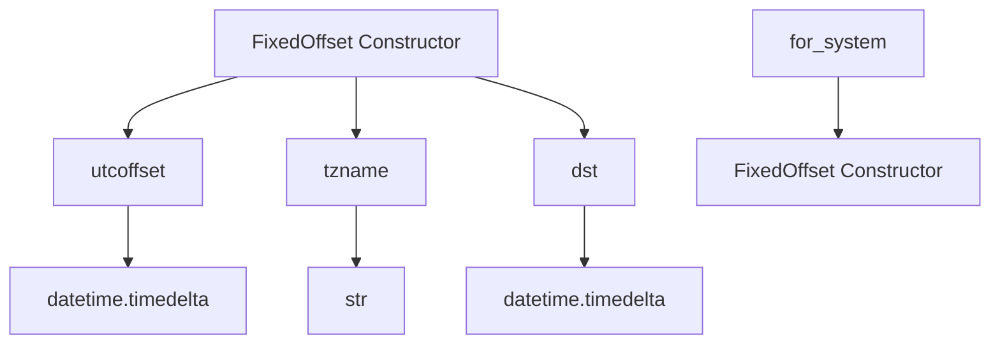

# `fixed_offset.py`

## `imapclient.fixed_offset.FixedOffset` · *class*

## Summary:
A timezone information class that represents a fixed timezone offset from UTC, used primarily by the IMAP client for handling timezone-aware datetime objects.

## Description:
The FixedOffset class implements Python's datetime.tzinfo abstract base class to represent a timezone with a constant offset from UTC. It is specifically designed for use with IMAP client operations where timezone information needs to be handled consistently. The class provides methods required by Python's datetime module to determine UTC offset, timezone name, and daylight saving time adjustments for datetime objects.

This class can be instantiated directly with a minute offset or created using the system timezone detection method `for_system()`. The implementation ensures proper formatting of timezone names according to standard conventions (e.g., +0200, -0500).

## State:
- `__offset`: datetime.timedelta - represents the fixed offset from UTC
- `__name`: str - formatted timezone name in HHMM or -HHMM format (e.g., "+0200", "-0500")

## Lifecycle:
- Creation: Instances can be created via `FixedOffset(minutes)` constructor or `FixedOffset.for_system()` class method
- Usage: Typically used with datetime objects to provide timezone context for IMAP operations
- Destruction: No special cleanup required; follows standard Python object lifecycle

## Method Map:


## Raises:
- No explicit exceptions are raised by the constructor
- The constructor accepts any numeric value for minutes, but invalid values may cause unexpected behavior in the timedelta conversion
- The `dst()` method always returns a zero timedelta, indicating no daylight saving time adjustment

## Example:
```python
# Create a timezone offset of UTC+2 hours for IMAP operations
tz = FixedOffset(120)

# Create a timezone based on system settings for IMAP client
tz = FixedOffset.for_system()

# Use with datetime for IMAP operations
import datetime
dt = datetime.datetime(2023, 1, 1, 12, 0, 0, tzinfo=tz)
```

### `imapclient.fixed_offset.FixedOffset.__init__` · *method*

## Summary:
Initializes a FixedOffset timezone object with a specified offset in minutes and generates a formatted timezone name.

## Description:
This method constructs a FixedOffset timezone object by converting the provided minute offset into a datetime.timedelta and creating a standardized name representation. It's part of the datetime.tzinfo interface implementation for fixed timezone offsets.

## Args:
    minutes (float): Timezone offset in minutes from UTC. Positive values represent eastward offsets, negative values represent westward offsets.

## Returns:
    None: This method initializes the object's internal state and returns nothing.

## Raises:
    No explicit exceptions are raised by this method.

## State Changes:
    Attributes READ: None
    Attributes WRITTEN: 
        - self.__offset: Stores the timezone offset as a datetime.timedelta object
        - self.__name: Stores the formatted timezone name string in HHMM format

## Constraints:
    Preconditions: The minutes parameter should be a valid numeric value representing a timezone offset.
    Postconditions: The object will have properly initialized __offset and __name attributes that can be used by other timezone methods.

## Side Effects:
    None: This method performs no I/O operations or external service calls. It only initializes internal object attributes.

### `imapclient.fixed_offset.FixedOffset.utcoffset` · *method*

## Summary:
Returns the UTC offset for this fixed timezone.

## Description:
This method implements the `datetime.tzinfo.utcoffset()` interface requirement. It returns the fixed UTC offset that was configured when this timezone instance was created. This offset represents how many minutes this timezone is offset from UTC.

## Args:
    _ (Optional[datetime.datetime]): Ignored parameter required by the datetime.tzinfo interface. The datetime argument is not used in this implementation.

## Returns:
    datetime.timedelta: A timedelta object representing the fixed UTC offset for this timezone.

## Raises:
    None: This method does not raise any exceptions.

## State Changes:
    Attributes READ: self.__offset
    Attributes WRITTEN: None

## Constraints:
    Preconditions: The FixedOffset instance must have been properly initialized with a valid minutes value.
    Postconditions: The returned timedelta will always represent the same fixed offset that was set during initialization.

## Side Effects:
    None: This method performs no I/O operations or external service calls. It only accesses internal state.

### `imapclient.fixed_offset.FixedOffset.tzname` · *method*

## Summary:
Returns the name of this fixed timezone offset as a formatted string.

## Description:
This method implements the standard `tzinfo.tzname()` interface required by Python's datetime module. It returns the pre-computed timezone name that was constructed during object initialization based on the offset minutes. This method is called by Python's datetime formatting functions to obtain the human-readable name for this timezone.

## Args:
    _: Optional[datetime.datetime] - A datetime object (ignored in this implementation)

## Returns:
    str - The timezone name in format "+HHMM" or "-HHMM" where HH represents hours and MM represents minutes

## Raises:
    None - This method does not raise any exceptions

## State Changes:
    Attributes READ: self.__name
    Attributes WRITTEN: None

## Constraints:
    Preconditions: The FixedOffset object must have been properly initialized with a valid offset
    Postconditions: The returned string is always in the format "+HHMM" or "-HHMM"

## Side Effects:
    None - This method performs no I/O operations or external service calls

### `imapclient.fixed_offset.FixedOffset.dst` · *method*

## Summary:
Returns the daylight saving time offset for this fixed timezone, which is always zero.

## Description:
This method implements the `datetime.tzinfo.dst()` interface requirement. It returns the daylight saving time offset for this timezone instance. Since `FixedOffset` represents a timezone with a fixed offset that does not observe daylight saving time changes, this method consistently returns zero regardless of the input datetime parameter.

## Args:
    _ (Optional[datetime.datetime]): A datetime object representing the date/time for which DST is being calculated. This parameter is unused in the implementation.

## Returns:
    datetime.timedelta: Always returns a zero timedelta representing no daylight saving time offset.

## Raises:
    None: This method does not raise any exceptions.

## State Changes:
    Attributes READ: None - this method only reads the implicit ZERO constant
    Attributes WRITTEN: None - this method does not modify any instance attributes

## Constraints:
    Preconditions: None - the method accepts any datetime object or None
    Postconditions: The returned timedelta is always zero

## Side Effects:
    None: This method performs no I/O operations or external service calls.

### `imapclient.fixed_offset.FixedOffset.for_system` · *method*

## Summary:
Creates a FixedOffset instance representing the system's current local timezone offset.

## Description:
A class method that constructs a FixedOffset timezone object based on the system's local timezone settings. This method automatically detects whether daylight saving time is currently in effect and selects the appropriate timezone offset accordingly.

## Args:
    cls: The FixedOffset class itself (implicit parameter for classmethod)

## Returns:
    FixedOffset: An instance representing the system's local timezone offset, with the offset expressed in minutes.

## Raises:
    None explicitly raised

## State Changes:
    None - This method is immutable and doesn't modify any instance attributes

## Constraints:
    Preconditions:
        - System time functions must be available (time module)
        - The system must have valid timezone configuration
    Postconditions:
        - Returns a valid FixedOffset instance with correct timezone offset
        - The returned instance represents the current system timezone

## Side Effects:
    None - This method is pure and doesn't cause any I/O or external service calls

