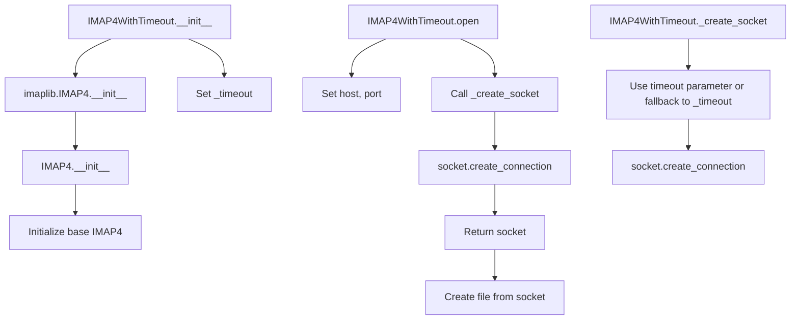

# `imap4.py`

## `imapclient.imap4.IMAP4WithTimeout` · *class*

## Summary:
IMAP4WithTimeout is a subclass of imaplib.IMAP4 that adds configurable timeout support for IMAP connections.

## Description:
This class extends the standard IMAP4 client to provide configurable timeout behavior for network operations. It allows setting a default timeout that can be overridden on a per-operation basis. The class is designed to be used when establishing IMAP connections that require explicit timeout control to prevent hanging operations.

The class is typically instantiated by connection management code or directly by applications that need IMAP functionality with timeout capabilities. It serves as a drop-in replacement for imaplib.IMAP4 when timeout control is required.

## State:
- `_timeout`: Optional[float] - The default timeout value used for socket connections. Can be None to indicate no timeout.
- `host`: str - The hostname of the IMAP server (set during open())
- `port`: int - The port number of the IMAP server (set during open())
- `sock`: socket.socket - The underlying socket connection (set during open())
- `file`: BufferedReader - The file-like object for reading from the socket (set during open())

## Lifecycle:
- Creation: Instantiate with address (str), port (int), and timeout (Optional[float])
- Usage: Call open() to establish connection, then use standard IMAP methods
- Destruction: Should be closed using close() or context manager protocol

## Method Map:


## Raises:
- `socket.timeout`: When socket operations exceed the specified timeout
- `socket.error`: When socket connection fails
- `OSError`: When underlying OS operations fail

## Example:
```python
# Create IMAP client with 30-second timeout
imap_client = IMAP4WithTimeout('imap.example.com', 993, timeout=30.0)

# Connect to server
imap_client.open('imap.example.com', 993)

# Perform IMAP operations
imap_client.login('user', 'password')
imap_client.select('INBOX')
typ, data = imap_client.search(None, 'ALL')

# Close connection
imap_client.close()
imap_client.logout()
```

### `imapclient.imap4.IMAP4WithTimeout.__init__` · *method*

## Summary:
Initializes an IMAP4WithTimeout instance with connection parameters and timeout configuration.

## Description:
Configures the IMAP client with network connection settings and timeout behavior. This method sets up the internal timeout attribute and initializes the underlying IMAP4 connection using the provided address and port.

## Args:
    address (str): The hostname or IP address of the IMAP server.
    port (int): The port number to connect to on the IMAP server.
    timeout (Optional[float]): Connection timeout in seconds, or None for no timeout.

## Returns:
    None: This method initializes the object and does not return a value.

## Raises:
    None explicitly raised by this method, though underlying socket operations may raise exceptions.

## State Changes:
    Attributes READ: None
    Attributes WRITTEN: 
        - self._timeout: Set to the provided timeout value
        - self.host: Set by parent class imaplib.IMAP4.__init__
        - self.port: Set by parent class imaplib.IMAP4.__init__

## Constraints:
    Preconditions:
        - address must be a valid string representing a network address
        - port must be a valid integer representing a network port
        - timeout must be either a positive float or None
    Postconditions:
        - self._timeout is set to the provided timeout value
        - The underlying IMAP4 connection is initialized with the given address and port

## Side Effects:
    None: This method does not perform I/O operations or external service calls directly. However, the parent class initialization may establish network connections depending on implementation details.

### `imapclient.imap4.IMAP4WithTimeout.open` · *method*

## Summary:
Establishes a network connection to an IMAP server by creating a socket and file-like object for communication.

## Description:
Configures the IMAP client to connect to a specified host and port, setting up the underlying socket connection with optional timeout support. This method initializes the network connection state required for IMAP operations.

## Args:
    host (str): The hostname or IP address of the IMAP server. Defaults to empty string.
    port (int): The port number to connect to. Defaults to 143 (standard IMAP port).
    timeout (Optional[float]): Connection timeout in seconds. If None, uses the instance's default timeout.

## Returns:
    None: This method does not return a value.

## Raises:
    socket.error: When the socket connection fails or times out.
    OSError: When there are issues creating the socket or network connection.

## State Changes:
    Attributes READ: self._timeout
    Attributes WRITTEN: self.host, self.port, self.sock, self.file

## Constraints:
    Preconditions: The method can be called at any time to reconfigure the connection parameters.
    Postconditions: After successful execution, the instance has configured host, port, socket, and file attributes ready for IMAP communication.

## Side Effects:
    I/O: Creates a network socket connection to the specified host and port.
    External service calls: Connects to the remote IMAP server.
    Mutations: Modifies instance attributes self.host, self.port, self.sock, and self.file.

### `imapclient.imap4.IMAP4WithTimeout._create_socket` · *method*

## Summary:
Creates a socket connection to the configured host and port with specified timeout.

## Description:
This method establishes a network socket connection to the IMAP server using the host and port stored in the instance. It allows specifying a custom timeout value, falling back to the instance's default timeout if none is provided. This method is designed to encapsulate socket creation logic for consistent connection handling throughout the IMAP client.

## Args:
    timeout (Optional[float]): Connection timeout in seconds. If None, uses the instance's default timeout (_timeout attribute). Defaults to None.

## Returns:
    socket.socket: A connected socket object ready for IMAP communication.

## Raises:
    socket.timeout: When the connection attempt exceeds the specified timeout.
    socket.gaierror: When DNS resolution fails for the host.
    ConnectionRefusedError: When the server refuses the connection.
    OSError: For other socket-related errors such as network issues.

## State Changes:
    Attributes READ: self.host, self.port, self._timeout
    Attributes WRITTEN: None

## Constraints:
    Preconditions: 
    - self.host must be a valid hostname or IP address string
    - self.port must be a valid integer port number
    - self._timeout must be a positive float or None
    Postconditions: 
    - Returns a connected socket object that can be used for IMAP operations

## Side Effects:
    I/O operation: Creates a network connection to the remote IMAP server
    External service call: Makes a DNS lookup and TCP connection to the specified host and port

