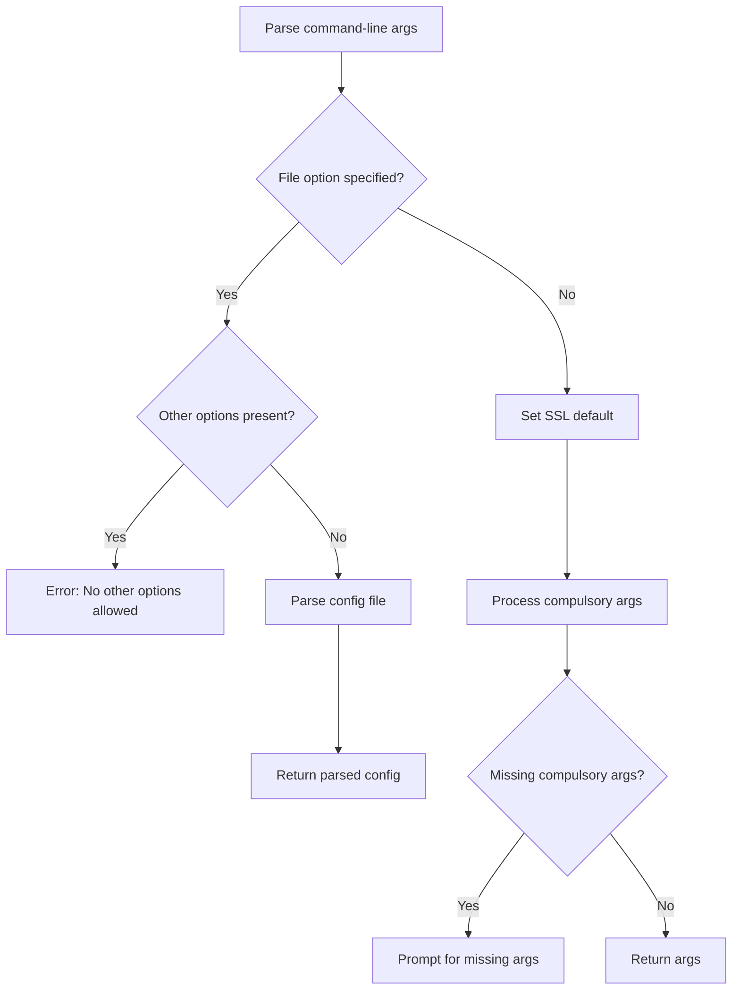

# `interact.py`

## `imapclient.interact.command_line` · *function*

## Summary:
Parses command-line arguments for configuring an IMAP client connection, supporting both direct CLI options and configuration file input.

## Description:
This function processes command-line arguments to configure IMAP client connection parameters. It supports direct command-line specification of connection settings or reading configuration from a file. When configuration is loaded from a file, it validates that no conflicting command-line options are provided. The function also handles interactive prompting for required credentials when they are not provided via command-line arguments.

## Args:
    None (reads from sys.argv automatically)

## Returns:
    argparse.Namespace: Parsed command-line arguments containing IMAP connection configuration including host, username, password, port, SSL settings, and other connection parameters.

## Raises:
    SystemExit: When invalid arguments are provided or when a configuration file is specified with other options.

## Constraints:
    Preconditions:
    - If a configuration file is specified via -f/--file, no other command-line options can be used
    - Host, username, and password are required parameters that must be provided either via command-line or through interactive prompts
    
    Postconditions:
    - All required configuration parameters are populated in the returned namespace
    - SSL configuration is properly resolved (ssl=True when --ssl or neither --ssl nor --insecure is specified, ssl=False when --insecure is specified)

## Side Effects:
    - May prompt user for input via stdin when required credentials are missing
    - Reads configuration files from disk when -f/--file option is used

## Control Flow:


## Examples:
```python
# Direct CLI usage
args = command_line()  # Parses sys.argv

# With configuration file
# command_line() would be called with -f config.ini

# Interactive prompting
# If host, username, or password not provided, user will be prompted
```

## `imapclient.interact.main` · *function*

## Summary:
Launches an interactive IMAP client session with multiple shell fallback options.

## Description:
This function serves as the main entry point for an interactive IMAP client interface. It processes command-line arguments to configure the IMAP connection, establishes a connection to the mail server, and provides an interactive Python shell environment where users can manipulate the IMAP client instance. The function attempts to use increasingly sophisticated interactive shells (ptpython, various IPython versions) with fallback to the standard Python `code.interact` if none are available. This function is intended to be called as a command-line script entry point.

## Args:
    None - This function does not accept any direct arguments. Configuration is derived from command-line arguments parsed via the global `command_line()` function.

## Returns:
    int: Always returns 0 to indicate successful completion of the interactive session.

## Raises:
    ImportError: When required interactive shell libraries are not installed (ptpython, IPython variants).
    Exception: Any exceptions raised during IMAP connection establishment or authentication are propagated up.

## Constraints:
    Preconditions:
    - Command-line arguments must be properly formatted (host, username, password)
    - Required shell libraries must be available (ptpython, IPython, or standard library)
    - Network connectivity to the specified IMAP server must be available
    
    Postconditions:
    - An IMAP client connection is established and available in the interactive shell as variable "c"
    - The interactive shell session is launched with appropriate banner message

## Side Effects:
    - Prints connection status messages to stdout
    - Establishes network connection to IMAP server
    - Launches interactive shell process (blocking operation)
    - May import additional modules dynamically during shell selection

## Control Flow:
```mermaid
flowchart TD
    A[Start main()] --> B[Parsing command-line arguments via command_line()]
    B --> C[Create IMAP client via create_client_from_config()]
    C --> D[Define shell attempt functions]
    D --> E[Attempt shell 1 (ptpython)]
    E --> F{Import Success?}
    F -->|No| G[Attempt shell 2 (IPython 4.0+)]
    F -->|Yes| H[Break loop and execute shell]
    G --> I{Import Success?}
    I -->|No| J[Attempt shell 3 (IPython 0.11)]
    I -->|Yes| H
    J --> K{Import Success?}
    K -->|No| L[Attempt shell 4 (IPython 0.10)]
    K -->|Yes| H
    L --> M{Import Success?}
    M -->|No| N[Attempt shell 5 (builtin code.interact)]
    M -->|Yes| H
    N --> O{Import Success?}
    O -->|No| P[All shells failed - error]
    O -->|Yes| H
    H --> Q[Execute selected shell]
    Q --> R[Return 0]
```

## Examples:
```python
# Typical usage from command line:
# python -m imapclient.interact -H imap.example.com -u user@example.com -p password

# After execution, user gets interactive prompt:
# IMAPClient instance is "c"
# >>> c.list_folders()
# >>> c.select_folder('INBOX')
# >>> c.search(['UNSEEN'])
```

