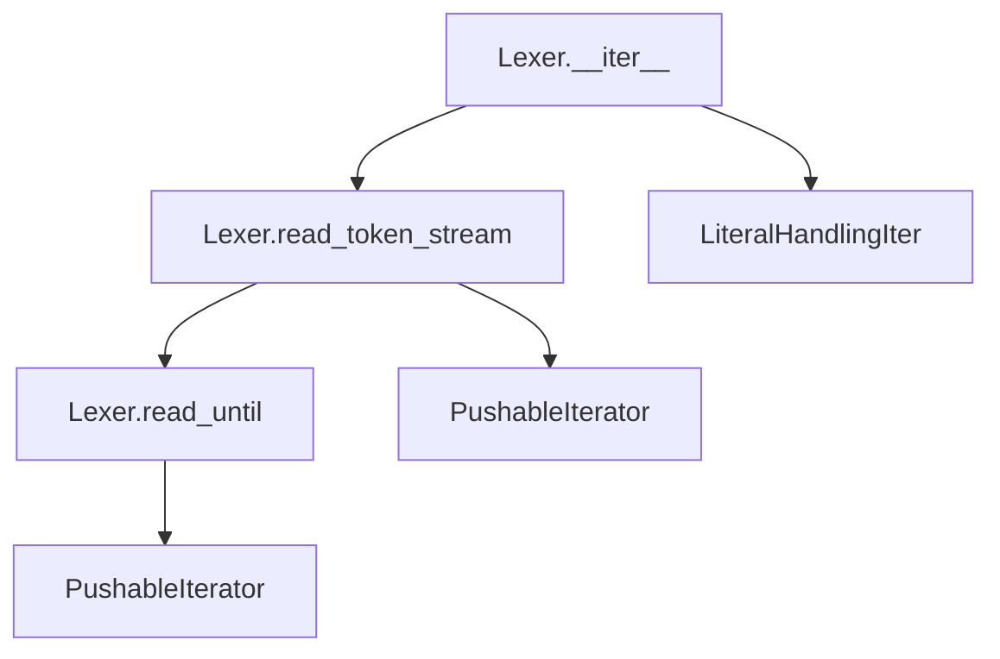
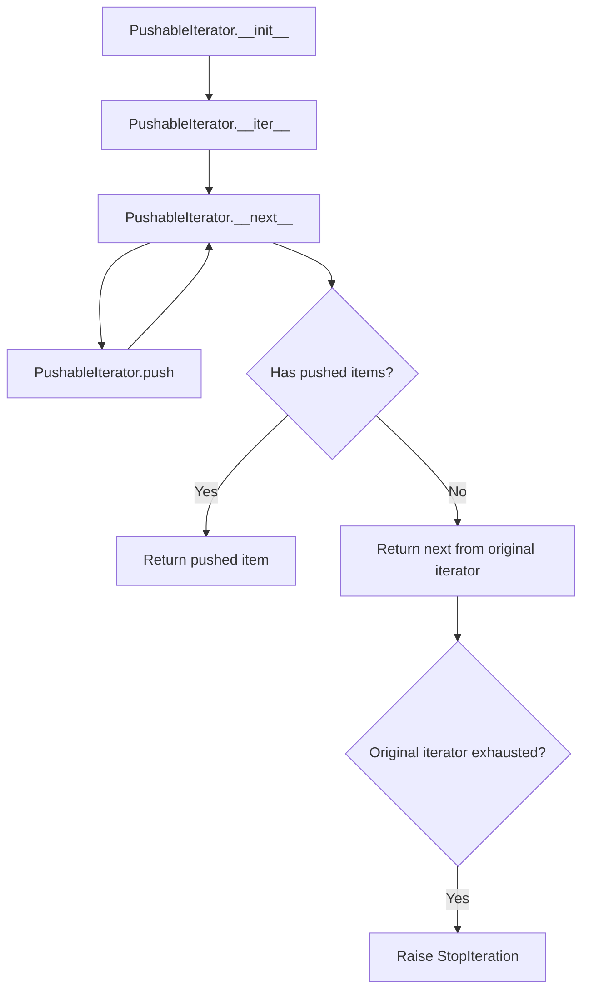

# `response_lexer.py`

## `imapclient.response_lexer.TokenSource` · *class*

## Summary:
A wrapper class that provides token iteration capabilities for IMAP protocol response parsing.

## Description:
TokenSource serves as an interface for iterating over tokens extracted from IMAP protocol responses. It encapsulates a Lexer instance that processes raw byte responses into tokens, and provides convenient access to the current token literal and iteration capabilities.

This class acts as a bridge between raw IMAP response data and token-based parsing operations, making it easier to process IMAP protocol messages sequentially.

## State:
- `lex`: Lexer instance that handles the actual tokenization of input text
- `src`: Iterator over the token stream produced by the Lexer instance

## Lifecycle:
- Creation: Instantiated with a list of bytes representing IMAP protocol responses
- Usage: Typically used in a for-loop context via the __iter__ method, or by accessing current_literal property
- Destruction: No explicit cleanup required; relies on Python's garbage collection

## Method Map:
```mermaid
graph TD
    A[TokenSource.__init__] --> B[Lexer(text)]
    B --> C[TokenSource.src = iter(Lexer)]
    A --> D[TokenSource.current_literal]
    C --> E[TokenSource.__iter__]
    E --> F[Returns src iterator]
```

## Raises:
- No explicit exceptions raised by __init__ method
- Exceptions may be raised by underlying Lexer or PushableIterator implementations during iteration

## Example:
```python
# Create a TokenSource with IMAP response data
response_data = [b'* OK [CAPABILITY IMAP4REV1] Hello']
token_source = TokenSource(response_data)

# Iterate over tokens
for token in token_source:
    print(token)

# Access current literal
current = token_source.current_literal
```

### `imapclient.response_lexer.TokenSource.__init__` · *method*

*No documentation generated.*

### `imapclient.response_lexer.TokenSource.current_literal` · *method*

## Summary:
Returns the literal data associated with the currently processed source in the token stream, or None if no literal data is present.

## Description:
Provides access to literal bytes from the current source being parsed by the IMAP response lexer. This property is essential during IMAP protocol parsing when encountering literal data (such as message bodies or binary content) embedded within protocol responses. The method is typically called during token iteration when the parser needs to access the literal portion of a token that contains embedded data.

This method exists as a dedicated property rather than being inlined because it provides a clean abstraction layer for accessing literal data while maintaining the separation between tokenization and literal extraction logic. It allows the parser to inspect literal content without directly manipulating the lexer's internal state.

## Args:
    None

## Returns:
    Optional[bytes]: The literal data from the current source, or None if no literal data is available for the current source. Literal data typically represents embedded binary content in IMAP responses.

## Raises:
    None

## State Changes:
    Attributes READ: self.lex, self.lex.current_source
    Attributes WRITTEN: None

## Constraints:
    Preconditions: The TokenSource must have been initialized with text data and the lexer must be actively processing tokens via iteration. The current_source must not be None (though this is enforced by a type checking assertion).
    Postconditions: The returned value is either bytes representing literal data or None, with no modification to the object's state.

## Side Effects:
    None

### `imapclient.response_lexer.TokenSource.__iter__` · *method*

## Summary:
Returns an iterator over the tokenized IMAP protocol response.

## Description:
Provides iteration capability over the parsed tokens from an IMAP response. This method enables clients to consume the tokenized response sequentially using standard Python iteration protocols.

## Args:
    None

## Returns:
    Iterator[bytes]: An iterator that yields individual tokens (as bytes) from the parsed IMAP response.

## Raises:
    None

## State Changes:
    Attributes READ: self.src
    Attributes WRITTEN: None

## Constraints:
    Preconditions: The TokenSource must have been properly initialized with valid IMAP response data.
    Postconditions: The returned iterator will yield bytes representing tokens from the IMAP protocol response.

## Side Effects:
    None

## `imapclient.response_lexer.Lexer` · *class*

## Summary:
A lexical analyzer for parsing IMAP protocol responses into tokens.

## Description:
The Lexer class processes IMAP protocol responses by breaking them into meaningful tokens. It handles various IMAP syntax elements including quoted strings, literal data, and special characters. The lexer is designed to work with IMAP server responses that may contain literal data blocks and follows IMAP protocol conventions for tokenization. It creates token streams from input byte sequences using helper iterators.

## State:
- sources: Generator expression producing LiteralHandlingIter objects from input byte sequences
- current_source: Reference to the currently active LiteralHandlingIter during iteration, or None if not processing

## Lifecycle:
- Creation: Instantiate with a list of bytes representing IMAP protocol responses
- Usage: Iterate over the Lexer instance to get parsed tokens
- Destruction: No explicit cleanup required; uses standard Python garbage collection

## Method Map:


## Raises:
- ValueError: When encountering unclosed delimiters such as quotes or square brackets
- ProtocolError: From assert_imap_protocol when IMAP protocol violations are detected (e.g., malformed literals)

## Example:
```python
# Create lexer with IMAP response data
response_data = [b'* OK [CAPABILITY IMAP4REV1] Logged in\r\n']
lexer = Lexer(response_data)

# Iterate through tokens
for token in lexer:
    print(token)  # Outputs individual tokens like b'*', b'OK', b'[CAPABILITY', etc.
```

### `imapclient.response_lexer.Lexer.__init__` · *method*

## Summary:
Initializes a Lexer instance with a list of byte chunks for parsing IMAP protocol responses.

## Description:
The `__init__` method sets up the Lexer's internal state by preparing data sources from the provided byte chunks. These sources are used during the tokenization process of IMAP protocol responses. The method initializes the current source pointer to None, which will be updated during iteration.

## Args:
    text (List[bytes]): A list of byte sequences representing parts of an IMAP protocol response to be parsed.

## Returns:
    None: This method initializes the object's state and does not return a value.

## Raises:
    None explicitly raised: The method itself does not raise exceptions, though underlying operations in `LiteralHandlingIter` construction or iteration may raise exceptions.

## State Changes:
    Attributes READ: None
    Attributes WRITTEN: 
        - self.sources: Set to a generator that provides iterable sources for parsing IMAP responses
        - self.current_source: Initialized to None

## Constraints:
    Preconditions:
        - The `text` parameter must be a list of bytes objects
        - Each item in the list should represent a valid portion of an IMAP protocol response
    Postconditions:
        - The `self.sources` attribute is initialized to provide data for parsing
        - The `self.current_source` attribute is initialized to None

## Side Effects:
    None: This method performs no I/O operations or external service calls. It only initializes internal state attributes.

### `imapclient.response_lexer.Lexer.read_until` · *method*

## Summary:
Extracts a token from a stream up to and including a specified end character, with optional backslash escape handling.

## Description:
This utility method reads characters from a PushableIterator until the specified end character is encountered. It is primarily used by the IMAP response lexer to parse tokens such as quoted strings and bracketed literals. When escape is enabled (default), backslash characters are processed to allow escaping of the end character or the backslash itself. Invalid escape sequences (backslash followed by a character other than backslash or end character) preserve the backslash in the output. This method is called internally by the token stream reader during IMAP protocol parsing.

## Args:
    stream_i (PushableIterator): An iterator that supports pushing characters back, used to read input characters
    end_char (int): The ASCII code of the character that signals the end of the token
    escape (bool, optional): Whether to process backslash escape sequences. Defaults to True

## Returns:
    bytearray: A byte array containing all characters read from the stream up to and including the end character

## Raises:
    ValueError: When the end character is not found in the stream, indicating a malformed input

## State Changes:
    Attributes READ: None
    Attributes WRITTEN: None

## Constraints:
    Preconditions:
        - The stream_i must be a valid PushableIterator
        - end_char must be a valid ASCII character code (integer)
        - The stream must eventually contain the end_char or raise StopIteration
    
    Postconditions:
        - The returned bytearray includes all characters read from the stream up to and including the end character
        - If escape=True and an invalid escape sequence is encountered, the backslash is preserved in the output

## Side Effects:
    - Consumes characters from the input stream
    - May push characters back onto the stream if escape processing occurs
    - Raises ValueError if end character is not found

### `imapclient.response_lexer.Lexer.read_token_stream` · *method*

## Summary:
Processes a character stream into tokens, handling whitespace, word characters, bracketed expressions, and quoted strings.

## Description:
This method implements a streaming tokenizer that consumes characters from a PushableIterator and yields tokens as bytearrays. It handles several token types:
- Whitespace is skipped at the beginning of tokens
- Word characters are grouped into tokens
- Bracketed expressions enclosed in square brackets are captured as single tokens
- Quoted strings are captured as single tokens, with validation that no token is currently being built
- Single special characters are yielded as individual tokens

The method is designed to work with IMAP protocol responses and maintains proper token boundaries according to protocol rules.

## Args:
    stream_i (PushableIterator): An iterator providing characters with push-back capability for lookahead.

## Returns:
    Iterator[bytearray]: Sequence of tokens extracted from the input stream, each represented as a bytearray.

## Raises:
    AssertionError: When a double quote character is encountered while building another token (via assert_imap_protocol).

## State Changes:
    Attributes READ: None - this method only accesses the input stream and uses self.read_until
    Attributes WRITTEN: None - this method doesn't modify any instance attributes

## Constraints:
    Preconditions: 
    - The input stream must support the PushableIterator interface
    - The stream should contain valid IMAP protocol characters
    
    Postconditions:
    - All tokens are yielded in the correct order from the input stream
    - Bracketed expressions are captured completely including brackets
    - Quoted strings are captured completely including quotes
    - Token boundaries are properly maintained

## Side Effects:
    None - this method is pure and doesn't perform I/O or mutate external state

### `imapclient.response_lexer.Lexer.__iter__` · *method*

## Summary:
Returns an iterator that processes multiple data sources and yields parsed tokens as bytes.

## Description:
Implements the iterator protocol for the Lexer class, enabling iteration over tokenized data from multiple sources. This method processes each source sequentially, setting the current source context and yielding tokens as bytes.

## Args:
    None

## Returns:
    Iterator[bytes]: An iterator that yields individual tokens as bytes from all sources.

## Raises:
    ValueError: When parsing encounters unclosed delimiters or malformed tokens in the input data.

## State Changes:
    Attributes READ: self.sources, self.current_source
    Attributes WRITTEN: self.current_source (updated for each source)

## Constraints:
    Preconditions: The Lexer instance must have been initialized with valid text sources.
    Postconditions: The method consumes all sources and produces a complete sequence of tokens.

## Side Effects:
    None

## `imapclient.response_lexer.LiteralHandlingIter` · *class*

## Summary:
Handles IMAP protocol responses that may contain literal data by separating source text from literal content and providing an iterator for parsing.

## Description:
The `LiteralHandlingIter` class is designed to process IMAP protocol responses that may contain literal data. In IMAP, literal data is represented as `{size}\r\n<data>` where the size indicates the number of bytes in the following data. This class separates the protocol text from the literal data and provides a `PushableIterator` for efficient parsing of the source text.

This class acts as a factory for `PushableIterator` objects, making it easier to work with IMAP responses that contain embedded literals by abstracting away the complexity of literal handling.

## State:
- `src_text`: bytes - The source text portion of the IMAP response, typically ending with a literal size indicator like `{size}`
- `literal`: Optional[bytes] - The actual literal data content, or None if no literal is present

## Lifecycle:
- Creation: Instantiate with either a tuple of (source_text, literal_data) or just source_text bytes
- Usage: Call `__iter__()` to get a `PushableIterator` for parsing the source text
- Destruction: Managed by Python's garbage collection; no explicit cleanup required

## Method Map:
```mermaid
graph TD
    A[LiteralHandlingIter.__init__] --> B[LiteralHandlingIter.__iter__]
    B --> C[PushableIterator]
    A --> D{resp_record is tuple?}
    D -->|Yes| E[src_text = resp_record[0]]
    D -->|No| F[src_text = resp_record]
    E --> G[assert_imap_protocol(src_text.endswith(b"}"))]
    G --> H[literal = resp_record[1]]
    F --> I[literal = None]
```

## Raises:
- `ProtocolError`: Raised by `assert_imap_protocol` when the source text doesn't end with "}" indicating a malformed IMAP literal

## Example:
```python
# Creating with literal data
response_tuple = (b'* 1 FETCH (RFC822 {12}\r\nHello World)', b'Hello World')
handler = LiteralHandlingIter(response_tuple)
iterator = iter(handler)  # Returns PushableIterator over the source text

# Creating without literal data  
simple_response = b'* 1 FETCH (RFC822)'
handler = LiteralHandlingIter(simple_response)
iterator = iter(handler)  # Returns PushableIterator over the simple response
```

### `imapclient.response_lexer.LiteralHandlingIter.__init__` · *method*

## Summary:
Initializes a LiteralHandlingIter object by parsing an IMAP response record and setting up source text and literal data attributes.

## Description:
This method configures the iterator's internal state by processing an IMAP response record. It handles two formats: a tuple containing source text and literal data, or a single bytes object representing plain text. When processing a tuple, it validates that the source text follows IMAP literal syntax by ensuring it ends with a closing brace.

## Args:
    resp_record (Union[Tuple[bytes, bytes], bytes]): An IMAP response record that can be either:
        - A tuple of (source_text: bytes, literal: bytes) where source_text ends with "}" indicating a literal
        - A single bytes object representing plain text without literal data

## Returns:
    None: This method initializes instance attributes and does not return a value.

## Raises:
    exceptions.ProtocolError: When resp_record is a tuple and the source_text does not end with b"}" character, indicating invalid IMAP protocol syntax.

## State Changes:
    Attributes READ: None
    Attributes WRITTEN: 
        - self.src_text: Set to resp_record[0] when resp_record is a tuple, or resp_record when it's bytes
        - self.literal: Set to resp_record[1] when resp_record is a tuple, or None when it's bytes

## Constraints:
    Preconditions:
        - When resp_record is a tuple, the first element must end with b"}" to comply with IMAP literal syntax
        - The resp_record parameter must be either a tuple of bytes or bytes
    
    Postconditions:
        - self.src_text is always set to a bytes object
        - self.literal is always set to either bytes or None

## Side Effects:
    None: This method performs no I/O operations or external service calls. It only sets internal attributes.

### `imapclient.response_lexer.LiteralHandlingIter.__iter__` · *method*

*No documentation generated.*

## `imapclient.response_lexer.PushableIterator` · *class*

## Summary:
A pushable iterator that allows items to be pushed back onto the iteration stream for reprocessing.

## Description:
The PushableIterator class extends standard iterator behavior by providing the ability to push items back onto the iteration stream. This is useful in parsing scenarios where tokens need to be "unread" or reprocessed. The class wraps an underlying iterator and maintains a stack of pushed-back items that are returned before consuming from the original iterator.

This abstraction is particularly valuable in IMAP protocol parsing where tokens may need to be peeked at or returned to the stream for subsequent processing. The class acts as a buffered iterator that can temporarily hold items for later consumption.

## State:
- `it`: Iterator[bytes] - The underlying iterator being wrapped (converted from bytes input)
- `pushed`: List[int] - Stack of integers that have been pushed back for reprocessing  
- `NO_MORE`: object - Sentinel value indicating end of iteration (defined but not actively used in current implementation)

## Lifecycle:
- Creation: Instantiate with a bytes object that will be converted to an iterator
- Usage: Call __next__() or next() to retrieve items; push() to add items back to the stream for later consumption
- Destruction: No explicit cleanup required; relies on Python's garbage collection

## Method Map:


## Raises:
- StopIteration: Raised when the underlying iterator is exhausted and no items remain to be pushed back

## Example:
```python
# Create a pushable iterator from bytes
data = b'abc'
it = PushableIterator(data)

# Consume items normally
first = next(it)  # Returns 97 (ASCII 'a')
second = next(it)  # Returns 98 (ASCII 'b')

# Push an item back
it.push(97)  # Push 'a' back

# Next item will be the pushed item
third = next(it)  # Returns 97 (ASCII 'a') again

# Continue with remaining items
fourth = next(it)  # Returns 99 (ASCII 'c')
```

### `imapclient.response_lexer.PushableIterator.__init__` · *method*

## Summary:
Initializes a PushableIterator object that wraps a bytes iterator with push-back capability.

## Description:
Constructs a PushableIterator instance that can iterate over bytes while supporting the ability to push elements back into the iteration stream. This allows for peeking and conditional reprocessing of bytes during parsing operations.

## Args:
    it (bytes): The bytes object to iterate over. This will be converted to an iterator internally.

## Returns:
    None: This method initializes the object's state and returns nothing.

## Raises:
    None: This method does not raise any exceptions directly.

## State Changes:
    Attributes READ: None
    Attributes WRITTEN: 
    - self.it: Set to an iterator over the input bytes
    - self.pushed: Initialized as an empty list to store pushed-back elements

## Constraints:
    Preconditions:
    - The input `it` parameter must be a bytes object
    - The bytes object must be iterable
    
    Postconditions:
    - self.it is initialized as an iterator over the input bytes
    - self.pushed is initialized as an empty list
    - The iterator is ready for consumption via __next__ method

## Side Effects:
    None: This method performs no I/O operations or external service calls. It only initializes internal state.

### `imapclient.response_lexer.PushableIterator.__iter__` · *method*

## Summary:
Makes the PushableIterator object iterable by returning itself.

## Description:
This method implements Python's iterator protocol by returning the instance itself, allowing the PushableIterator to be used in for-loops and other iteration contexts. It enables the class to function as an iterator without requiring a separate iterator object.

## Args:
    None

## Returns:
    PushableIterator: The instance itself, making it iterable.

## Raises:
    None

## State Changes:
    Attributes READ: None
    Attributes WRITTEN: None

## Constraints:
    Preconditions: None
    Postconditions: The object remains unchanged and is now iterable.

## Side Effects:
    None

### `imapclient.response_lexer.PushableIterator.__next__` · *method*

## Summary:
Returns the next integer value from the iterator, prioritizing pushed values over the underlying iterator.

## Description:
Implements the iterator protocol's `__next__` method for PushableIterator. This method provides a way to retrieve values sequentially while supporting the ability to push values back into the iteration stream. When values have been pushed using the `push` method, those values are returned in LIFO (last-in-first-out) order before consuming from the underlying iterator.

## Args:
    None

## Returns:
    int: The next integer value from either the pushed values queue or the underlying iterator.

## Raises:
    StopIteration: When the underlying iterator is exhausted and no values remain in the pushed queue.

## State Changes:
    Attributes READ: self.pushed, self.it
    Attributes WRITTEN: self.pushed (when popping from it)

## Constraints:
    Preconditions: The PushableIterator instance must be properly initialized with an iterable.
    Postconditions: If pushed values exist, the most recently pushed value is removed from the pushed queue and returned. Otherwise, the next value from the underlying iterator is returned.

## Side Effects:
    None

### `imapclient.response_lexer.PushableIterator.push` · *method*

## Summary:
Appends an integer item to the internal pushed stack for later retrieval during iteration.

## Description:
This method adds an integer value to the internal `pushed` list, which will be returned by subsequent calls to `__next__` before consuming items from the original iterator. This provides a mechanism for temporarily "pushing back" items during iteration, allowing for lookahead or deferred processing in parsing operations.

## Args:
    item (int): An integer value to be pushed onto the internal stack for later retrieval.

## Returns:
    None: This method does not return a value.

## Raises:
    None: This method does not raise any exceptions.

## State Changes:
    Attributes READ: None
    Attributes WRITTEN: self.pushed

## Constraints:
    Preconditions: The object must be properly initialized with a valid iterator and pushed list.
    Postconditions: The item is appended to the end of self.pushed list.

## Side Effects:
    None: This method only modifies the internal state of the object.

