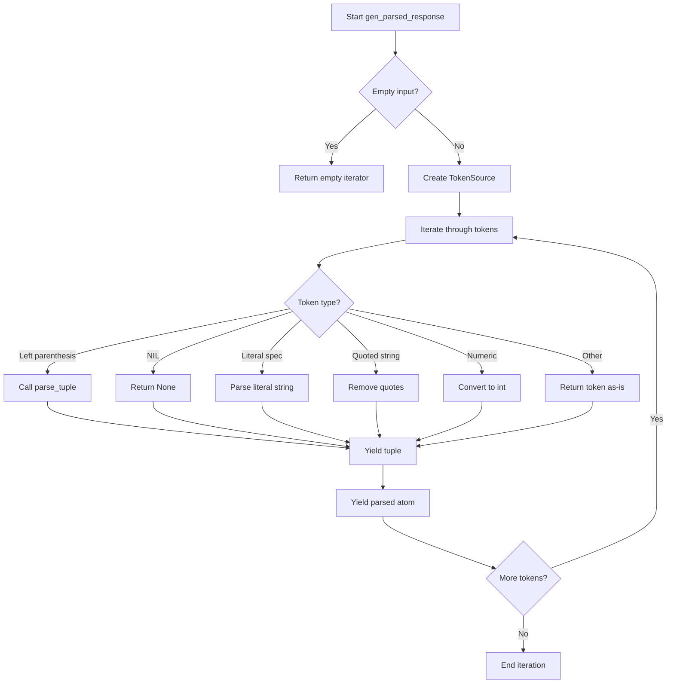
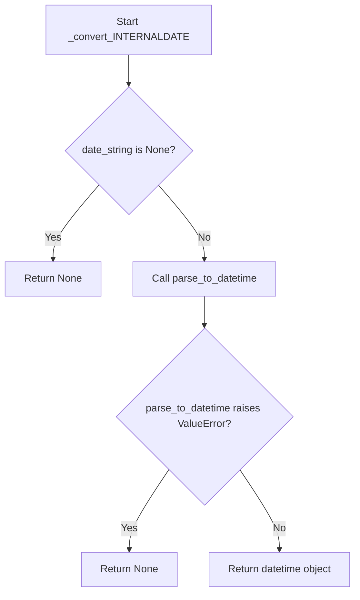
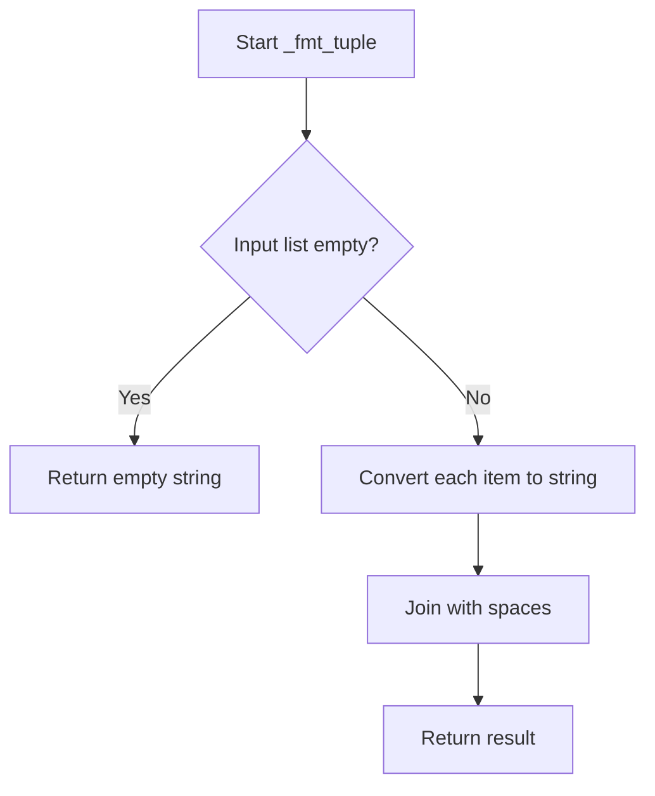

# `response_parser.py`

## `imapclient.response_parser.parse_response` · *function*

## Summary:
Parses raw IMAP server response data into structured atomic values for further processing.

## Description:
Converts a list of byte-encoded IMAP protocol responses into a tuple of parsed atomic values. This function serves as the primary interface for parsing IMAP command responses, handling the special case of empty responses and delegating to the core parsing logic.

The parsing process involves tokenizing the input data using a specialized lexer, then converting tokens into appropriate Python objects through a series of parsing functions (`atom`, `parse_tuple`). This extraction into a separate function enables clean separation between response preparation and parsing logic, making the parsing reusable across different IMAP command implementations.

## Args:
    data (List[bytes]): Raw IMAP response data as a list of byte strings. Each item represents a segment of the response.

## Returns:
    Tuple[_Atom, ...]: Parsed response elements as a tuple. Each element can be a string, integer, None, or nested tuple representing the structured IMAP response. Returns an empty tuple when input is [None]. The _Atom type represents the basic IMAP response element types supported by the parser.

## Raises:
    ProtocolError: When the IMAP protocol parsing fails due to malformed responses or mismatched parentheses in tuple structures.

## Constraints:
    Preconditions:
        - Input data must be a list of bytes representing valid IMAP protocol fragments
        - Each byte string in the list should be properly formatted according to IMAP specifications
    
    Postconditions:
        - Output is always a tuple of parsed atomic values
        - Empty input list results in empty tuple return
        - Special case [None] input returns empty tuple

## Side Effects:
    None

## Control Flow:
```mermaid
flowchart TD
    A[parse_response called] --> B{data == [None]?}
    B -- Yes --> C[Return empty tuple]
    B -- No --> D[Call gen_parsed_response]
    D --> E[Tokenize with TokenSource]
    E --> F[Process tokens via atom() and parse_tuple()]
    F --> G[Return parsed tuple]
```

## Examples:
```python
# Basic usage with simple response
response_data = [b'OK', b'Success']
result = parse_response(response_data)
# Returns: (b'OK', b'Success')

# Empty response case
empty_data = [None]
result = parse_response(empty_data)
# Returns: ()

# Complex nested response
complex_data = [b'(', b'1', b'2', b')']
result = parse_response(complex_data)
# Returns: (tuple([1, 2]),)
```

## `imapclient.response_parser.parse_message_list` · *function*

## Summary:
Parses IMAP message ID lists from server responses into structured SearchIds objects with optional modification sequence data.

## Description:
Extracts message identifiers from IMAP SEARCH command responses and optionally processes additional metadata such as modification sequences (modseq) and other integer values. This function is designed to handle the specific format of IMAP message list responses where message IDs are followed by optional tagged data.

The parsing logic is separated from the main IMAP client logic to provide a clean interface for processing server responses containing message identifiers, ensuring proper handling of various data formats and extracting structured metadata.

## Args:
    data (List[Union[bytes, str]]): A list containing a single element representing the raw IMAP message list response. The element can be either bytes or string format.

## Returns:
    SearchIds: An object containing parsed message IDs as integers, with an optional modseq attribute set if present in the response, and additional integer values appended if found.

## Raises:
    ValueError: When the input data contains zero or multiple elements, or when the message list format doesn't match the expected pattern.

## Constraints:
    Precondition: Input data must be a list with exactly one element containing the message list data.
    Postcondition: Returns a SearchIds object with message IDs parsed from the input, and modseq/integers extracted if present.

## Side Effects:
    None

## Control Flow:
```mermaid
flowchart TD
    A[Start parse_message_list] --> B{len(data) != 1?}
    B -- Yes --> C[Raise ValueError]
    B -- No --> D{message_data is empty?}
    D -- Yes --> E[Return empty SearchIds()]
    D -- No --> F{message_data is bytes?}
    F -- Yes --> G[Decode to ASCII string]
    F -- No --> H[Use message_data directly]
    H --> I[Match _msg_id_pattern]
    I -- No match --> J[Raise ValueError]
    I -- Match --> K[Parse message IDs]
    K --> L[Extract extra data]
    L --> M{Extra data exists?}
    M -- No --> N[Return SearchIds]
    M -- Yes --> O[Parse extra data with parse_response]
    O --> P{Item is tuple with modseq?}
    P -- Yes --> Q[Set ids.modseq]
    P -- No --> R{Item is int?}
    R -- Yes --> S[Append to ids]
    R -- No --> T[Continue parsing]
    Q --> U[Return SearchIds]
    S --> U
    T --> U
```

## Examples:
```python
# Basic usage with message IDs
data = [b"1 2 3 4 5"]
result = parse_message_list(data)
# Returns SearchIds([1, 2, 3, 4, 5])

# Usage with modseq information
data = [b"1 2 3 (MODSEQ 12345)"]
result = parse_message_list(data)
# Returns SearchIds([1, 2, 3]) with result.modseq = 12345

# Empty response
data = [b""]
result = parse_message_list(data)
# Returns empty SearchIds()
```

## `imapclient.response_parser.gen_parsed_response` · *function*

## Summary:
Generates parsed IMAP protocol response atoms from raw byte tokens.

## Description:
Processes a list of raw IMAP response tokens (as bytes) and yields parsed atoms representing structured data according to the IMAP protocol specification. This function consumes tokens from a TokenSource and applies semantic parsing to convert them into appropriate Python native types.

The function handles various IMAP data types including:
- Parenthesized tuples containing nested structures
- NIL values represented as None
- Literal strings with length specifications
- Quoted strings
- Numeric values
- Raw tokens

## Args:
    text (List[bytes]): List of raw IMAP protocol response tokens as bytes

## Returns:
    Iterator[_Atom]: Iterator yielding parsed atoms representing structured IMAP response data. Each atom can be one of:
        - bytes: For quoted strings or raw tokens
        - int: For numeric values
        - None: For NIL values
        - tuple: For parenthesized structures (tuples)
        - bytes: For literal strings with length specifications

## Raises:
    ProtocolError: When encountering malformed IMAP protocol responses, including:
        - Incomplete tuples
        - Mismatched literal lengths
        - Invalid token sequences
        - Unexpected end of data

## Constraints:
    Preconditions:
        - Input text must be a list of bytes representing valid IMAP protocol tokens
        - Each token in the list should be properly formatted according to IMAP protocol
    
    Postconditions:
        - Returns an empty iterator if input text is empty
        - All yielded atoms are properly parsed according to IMAP protocol semantics
        - Parsing errors result in ProtocolError exceptions

## Side Effects:
    None

## Control Flow:


## Examples:
```python
# Basic usage with simple tokens
tokens = [b'1', b'SEARCH', b'OK']
parsed = list(gen_parsed_response(tokens))
# Result: [1, b'SEARCH', b'OK']

# With nested structures
tokens = [b'(', b'1', b'2', b')']
parsed = list(gen_parsed_response(tokens))
# Result: [(1, 2)]

# With NIL values
tokens = [b'NIL']
parsed = list(gen_parsed_response(tokens))
# Result: [None]

# With literal strings
tokens = [b'{5}', b'hello']
parsed = list(gen_parsed_response(tokens))
# Result: [b'hello']
```

## `imapclient.response_parser.parse_fetch_response` · *function*

## Summary:
Parses IMAP FETCH command responses into structured data organized by message ID.

## Description:
Processes raw IMAP server responses from FETCH commands and converts them into a structured dictionary format. The function handles various message attributes like UID, INTERNALDATE, ENVELOPE, BODY, and BODYSTRUCTURE, normalizing timestamps and parsing complex data structures. It's designed to handle IMAP protocol responses that contain multiple messages with their associated data.

This function was extracted from inline processing logic to centralize the parsing of FETCH responses, providing a clean interface for consuming IMAP server data while handling protocol-specific parsing complexities.

## Args:
    text (List[bytes]): Raw IMAP response data as list of byte strings
    normalise_times (bool): Whether to normalize datetime values to UTC. Defaults to True
    uid_is_key (bool): Whether to use UID as dictionary key instead of sequence number. Defaults to True

## Returns:
    defaultdict[int, _ParseFetchResponseInnerDict]: Dictionary mapping message IDs to their parsed attributes. Each inner dictionary contains message metadata keyed by attribute names as bytes.

## Raises:
    ProtocolError: When encountering malformed IMAP responses such as invalid message IDs, unexpected EOF, or uneven response items.

## Constraints:
    Preconditions:
    - Input text must be a list of bytes representing valid IMAP protocol responses
    - Each message response must be a tuple with even number of elements
    - Message IDs must be convertible to integers
    
    Postconditions:
    - Returns a defaultdict with integer keys representing message identifiers
    - All returned dictionaries contain a SEQ entry with the sequence number
    - UID entries are handled according to uid_is_key parameter

## Side Effects:
    None

## Control Flow:
    ```mermaid
    flowchart TD
        A[Start parse_fetch_response] --> B{text == [None]?}
        B -- Yes --> C[Return empty defaultdict]
        B -- No --> D[Call gen_parsed_response]
        D --> E[Initialize parsed_response defaultdict]
        E --> F[Loop while True]
        F --> G[Get msg_id from response]
        G --> H{StopIteration?}
        H -- Yes --> I[Break loop]
        H -- No --> J[Get msg_response tuple]
        J --> K{msg_response is tuple?}
        K -- No --> L[ProtocolError: bad response type]
        K -- Yes --> M{len(msg_response) % 2 == 0?}
        M -- No --> N[ProtocolError: uneven number of response items]
        M -- Yes --> O[Initialize msg_data dict with SEQ]
        O --> P[Loop through msg_response 2 at a time]
        P --> Q[Process each attribute-value pair]
        Q --> R{word == b"UID"?}
        R -- Yes --> S{uid_is_key?}
        S -- Yes --> T[Set msg_id = uid]
        S -- No --> U[Store uid in msg_data]
        R -- No --> V{word == b"INTERNALDATE"?}
        V -- Yes --> W[Convert INTERNALDATE]
        V -- No --> X{word == b"ENVELOPE"?}
        X -- Yes --> Y[Convert ENVELOPE]
        X -- No --> Z{word in (b"BODY", b"BODYSTRUCTURE")?}
        Z -- Yes --> AA[Create BodyData]
        Z -- No --> AB[Store value directly]
        AB --> AC[Update parsed_response[msg_id] with msg_data]
        AC --> AD[Continue loop]
    ```

## Examples:
    Basic usage:
    ```python
    # Assuming raw IMAP response data
    response_data = [b'* 1 FETCH (UID 1234 INTERNALDATE "01-Jan-2023 12:00:00 +0000" ...)']
    result = parse_fetch_response(response_data)
    # Returns defaultdict with message ID 1234 mapped to parsed attributes
    ```

## `imapclient.response_parser._int_or_error` · *function*

## Summary:
Converts an IMAP protocol atom value to an integer, raising a protocol error if conversion fails.

## Description:
This utility function safely converts an IMAP protocol atom (typically received from IMAP server responses) to an integer value. It is used throughout the IMAP client's response parsing logic to handle numeric values that may be represented as strings or other types in the protocol stream.

The function extracts the conversion logic into a reusable component to avoid duplication in various parsing contexts where integer values are expected from IMAP responses.

## Args:
    value (_Atom): The IMAP protocol atom value to convert to integer. This can be a string, bytes, or other type that can be converted to int.
    error_text (str): A descriptive error message prefix to include in the ProtocolError if conversion fails.

## Returns:
    int: The integer representation of the input value.

## Raises:
    ProtocolError: When the value cannot be converted to an integer, with a message containing the error_text and the problematic value representation.

## Constraints:
    Preconditions:
        - The value parameter must be convertible to an integer
        - The error_text parameter must be a string
    Postconditions:
        - If successful, returns an integer value
        - If unsuccessful, raises ProtocolError with formatted message

## Side Effects:
    None

## Control Flow:
```mermaid
flowchart TD
    A[Start _int_or_error] --> B{Try int(value)}
    B -- Success --> C[Return int(value)]
    B -- Failure --> D{TypeError or ValueError}
    D -- Yes --> E[Raise ProtocolError]
    E --> F[End]
    C --> F
```

## Examples:
    # Successful conversion
    result = _int_or_error("123", "Invalid sequence number")
    # Returns: 123
    
    # Failed conversion
    try:
        _int_or_error("abc", "Invalid sequence number")
    except ProtocolError as e:
        print(str(e))
        # Output: "Invalid sequence number: 'abc'"
```

## `imapclient.response_parser._convert_INTERNALDATE` · *function*

## Summary:
Converts an IMAP INTERNALDATE string representation into a timezone-aware datetime object.

## Description:
This function parses IMAP INTERNALDATE formatted strings (typically received from IMAP server responses) into Python datetime objects. It serves as a utility for converting date/time information from IMAP protocol format to standard Python datetime objects for easier manipulation and processing.

The function is designed to handle malformed date strings gracefully by returning None instead of raising exceptions, making it suitable for parsing potentially unreliable IMAP server responses.

## Args:
    date_string (_Atom): The IMAP INTERNALDATE string to convert, typically provided as bytes. Can be None.
    normalise_times (bool): When True, normalizes timezone-aware datetimes to local time. Defaults to True.

## Returns:
    Optional[datetime.datetime]: A timezone-aware datetime object representing the parsed date, or None if the input is None or parsing fails.

## Raises:
    None: This function catches ValueError exceptions internally and returns None instead.

## Constraints:
    Preconditions:
        - The date_string parameter should be either None or a valid IMAP INTERNALDATE formatted string
        - When provided, date_string should be of type bytes (as indicated by TYPE_CHECKING assertion)
    
    Postconditions:
        - Returns None when input is None
        - Returns None when parsing fails due to invalid date format
        - Returns a properly parsed datetime object when successful

## Side Effects:
    None: This function performs no I/O operations or external state mutations.

## Control Flow:


## Examples:
    # Successful conversion
    result = _convert_INTERNALDATE(b'15-Jul-2023 14:30:45 +0200')
    # Returns: datetime.datetime(2023, 7, 15, 14, 30, 45, tzinfo=FixedOffset(120))

    # None input
    result = _convert_INTERNALDATE(None)
    # Returns: None

    # Invalid date format
    result = _convert_INTERNALDATE(b'invalid-date')
    # Returns: None
```

## `imapclient.response_parser._convert_ENVELOPE` · *function*

## Summary:
Converts raw IMAP envelope response data into a structured Envelope object with parsed date, subject, and address information.

## Description:
Processes IMAP server envelope responses by extracting and converting date, subject, message ID, and address information into a standardized Envelope data structure. This function handles the conversion of raw byte-encoded IMAP data into Python-native objects while managing various edge cases such as missing dates or address lists.

The function is extracted into its own component to encapsulate the complex parsing logic for IMAP envelope responses, separating the data transformation concerns from the higher-level IMAP command processing logic.

## Args:
    envelope_response (_Atom): Raw IMAP envelope response data, typically a tuple containing date, subject, and address information in specific positions
    normalise_times (bool): When True, normalizes datetime values to local timezone; when False, preserves original timezone information. Defaults to True

## Returns:
    Envelope: Structured envelope data containing parsed date, subject, and address information organized by type (from, sender, reply_to, to, cc, bcc)

## Raises:
    None explicitly raised, though ValueError may be raised internally by parse_to_datetime when date parsing fails

## Constraints:
    Preconditions:
    - envelope_response must be a tuple-like structure with at least 10 elements
    - envelope_response[0] (date) should be bytes or None
    - envelope_response[1] (subject) should be bytes
    - envelope_response[8] (in_reply_to) should be bytes
    - envelope_response[9] (message_id) should be bytes
    - Address list elements (positions 2-7) should be tuples or None
    
    Postconditions:
    - Returns an Envelope object with properly parsed fields
    - Date field will be None if parsing fails or input is None
    - Address fields will be None or tuples of Address objects
    - Subject, in_reply_to, and message_id will be preserved as bytes

## Side Effects:
    None

## Control Flow:
```mermaid
flowchart TD
    A[Start _convert_ENVELOPE] --> B{envelope_response[0] exists?}
    B -- Yes --> C[Try parse_to_datetime]
    C --> D{parse succeeds?}
    D -- Yes --> E[Set dt = parsed datetime]
    D -- No --> F[Set dt = None]
    E --> G
    F --> G
    B -- No --> G[Set dt = None]
    G --> H[Extract subject, in_reply_to, message_id]
    H --> I[Process address lists 2-7]
    I --> J{addr_list exists?}
    J -- Yes --> K[Process addr_tuple elements]
    K --> L{addr_tuple exists?}
    L -- Yes --> M[Create Address object]
    M --> N[Add to addrs list]
    L -- No --> N
    N --> O[Append tuple(addrs) to addresses]
    J -- No --> P[Append None to addresses]
    O --> Q
    P --> Q
    Q --> R[Return Envelope object]
```

## Examples:
    # Basic usage with complete envelope data
    envelope_data = (
        b'15-Nov-2023 14:30:00 +0000',  # date
        b'Hello World',                  # subject
        ((b'John', b'', b'john@example.com', b'example.com'),),  # from
        (),                              # sender
        (),                              # reply_to
        (),                              # to
        (),                              # cc
        (),                              # bcc
        b'<msg123@example.com>',         # in_reply_to
        b'<msg456@example.com>'          # message_id
    )
    
    result = _convert_ENVELOPE(envelope_data)
    # Returns Envelope with parsed date, subject, from address, and message identifiers

## `imapclient.response_parser.atom` · *function*

## Summary:
Parses IMAP protocol tokens into appropriate Python native types.

## Description:
Converts raw IMAP protocol tokens into their corresponding Python representations. This function serves as a core parsing utility in the IMAP response parser, handling various token formats including NIL values, quoted strings, numeric values, literal data, and nested tuples.

The function is designed to be called recursively by `parse_tuple` when processing nested IMAP data structures. It handles the conversion of IMAP protocol elements into Python-native types that can be easily consumed by higher-level application logic.

## Args:
    src (TokenSource): Source of IMAP protocol tokens, used for retrieving literal data and parsing nested structures.
    token (bytes): Raw IMAP protocol token to be parsed into a Python type.

## Returns:
    _Atom: Parsed Python value representing the token, which can be:
        - None for NIL tokens
        - bytes for quoted strings (with quotes removed) or literal text
        - int for numeric tokens
        - tuple for nested structures (when token is "(")
        - bytes for unhandled tokens

## Raises:
    ProtocolError: When a literal token has no corresponding literal data, or when literal data length doesn't match expected size.

## Constraints:
    Preconditions:
        - The token parameter must be a valid IMAP protocol token
        - For literal tokens (starting with "{"), src.current_literal must be set
        - src must be a valid TokenSource with proper token iteration capability
    
    Postconditions:
        - Returns a properly typed Python object matching the IMAP token semantics
        - All quoted strings have their surrounding quotes stripped
        - Numeric tokens are converted to integers (with leading zero validation)
        - Literal tokens are validated for size consistency

## Side Effects:
    - May access and consume literal data from the TokenSource
    - Raises ProtocolError for malformed protocol data

## Control Flow:
```mermaid
flowchart TD
    A[Start atom()] --> B{token == b"("}
    B -- Yes --> C[parse_tuple(src)]
    B -- No --> D{token == b"NIL"}
    D -- Yes --> E[return None]
    D -- No --> F{token[:1] == b"{")
    F -- Yes --> G[Validate literal length]
    G --> H{len(literal_text) != literal_len}
    H -- Yes --> I[ProtocolError]
    H -- No --> J[return literal_text]
    F -- No --> K{token[:1] == token[-1:] == b'"'}
    K -- Yes --> L[return token[1:-1]]
    K -- No --> M{token.isdigit()}
    M -- Yes --> N{token[:1] != b"0" OR len(token) == 1}
    N -- Yes --> O[return int(token)]
    N -- No --> P[return token]
    M -- No --> Q[return token]
```

## Examples:
```python
# Parsing NIL value
result = atom(src, b"NIL")  # Returns None

# Parsing quoted string
result = atom(src, b'"Hello World"')  # Returns b'Hello World'

# Parsing integer
result = atom(src, b"123")  # Returns 123

# Parsing literal
src.current_literal = b"Hello world"
result = atom(src, b"{11}")  # Returns b"Hello world"

# Parsing tuple (calls parse_tuple internally)
result = atom(src, b"(")  # Returns tuple of parsed elements
```

## `imapclient.response_parser.parse_tuple` · *function*

## Summary:
Parses a tuple structure from a stream of tokens, recursively handling nested tuples.

## Description:
This function processes tokens from a TokenSource to construct a tuple structure, handling nested tuples recursively. It reads tokens sequentially until encountering a closing parenthesis, converting each token into appropriate Python types using the atom parser.

The function is designed to handle IMAP protocol responses where tuples are fundamental data structures. It's extracted into its own function to encapsulate the tuple parsing logic and enable recursive parsing of nested tuple structures.

## Args:
    src (TokenSource): A token source iterator that provides IMAP protocol tokens for parsing.

## Returns:
    _Atom: A tuple containing parsed elements from the token stream. Elements within the tuple can be of various types including str, bytes, int, None, or nested tuples.

## Raises:
    ProtocolError: When the tuple structure is incomplete (no closing parenthesis found) or when there's a mismatch in literal sizes.

## Constraints:
    Preconditions:
    - The TokenSource must contain valid IMAP protocol tokens
    - The token stream must begin with an opening parenthesis "(" (this is implied by the calling context)
    - Tokens must be properly formatted according to IMAP protocol specifications
    
    Postconditions:
    - Returns a properly formed tuple with all elements converted to appropriate Python types
    - The returned tuple contains all elements from the token stream up to the closing parenthesis

## Side Effects:
    None

## Control Flow:
```mermaid
flowchart TD
    A[Start parse_tuple] --> B{Next token}
    B -->|Closing paren ")"| C[Return tuple(out)]
    B -->|Other token| D[Call atom(src, token)]
    D --> E{atom result}
    E -->|Nested tuple| F[Recursive parse_tuple call]
    F --> G[Return nested tuple]
    G --> H[Append to out list]
    H --> I[Loop back to B]
```

## Examples:
```python
# Basic usage with simple tuple
src = TokenSource([b"(", b"test", b"123", b")"])
result = parse_tuple(src)  # Returns ("test", 123)

# Nested tuple parsing
src = TokenSource([b"(", b"test", b"(", b"nested", b")", b")"])
result = parse_tuple(src)  # Returns ("test", ("nested",))

# Incomplete tuple raises ProtocolError
src = TokenSource([b"(", b"test", b"123"])
# parse_tuple(src) raises ProtocolError: Tuple incomplete before "(test 123"
```

## `imapclient.response_parser._fmt_tuple` · *function*

## Summary:
Formats a list of IMAP protocol atoms into a space-delimited string representation.

## Description:
Converts a list of IMAP protocol atoms (typically parsed tokens from IMAP server responses) into a single space-separated string. This utility function is used internally by the IMAP response parser to normalize atom sequences into readable string representations.

## Args:
    t (List[_Atom]): A list of IMAP protocol atoms to be formatted. Each atom is typically a string or token parsed from an IMAP server response.

## Returns:
    str: A space-delimited string containing all atoms from the input list, with each atom converted to its string representation.

## Raises:
    None: This function does not raise any exceptions under normal operation.

## Constraints:
    Preconditions:
        - Input parameter `t` must be a list-like object
        - Each item in the list must be convertible to a string via `str()`
    
    Postconditions:
        - Returns a string with space delimiters between atom representations
        - Empty input list returns empty string
        - Single item list returns string representation of that item

## Side Effects:
    None: This function has no side effects beyond standard Python string operations.

## Control Flow:


## Examples:
    >>> _fmt_tuple(['INBOX', 'SUBSCRIBED'])
    'INBOX SUBSCRIBED'
    
    >>> _fmt_tuple(['flag1', 'flag2', 'flag3'])
    'flag1 flag2 flag3'
    
    >>> _fmt_tuple([])
    ''
```

