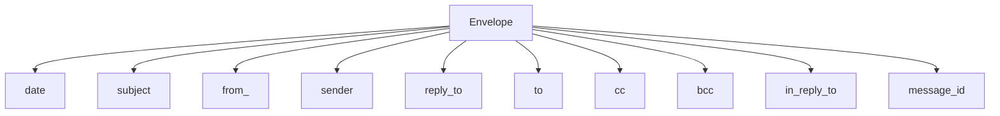
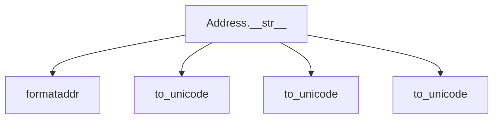
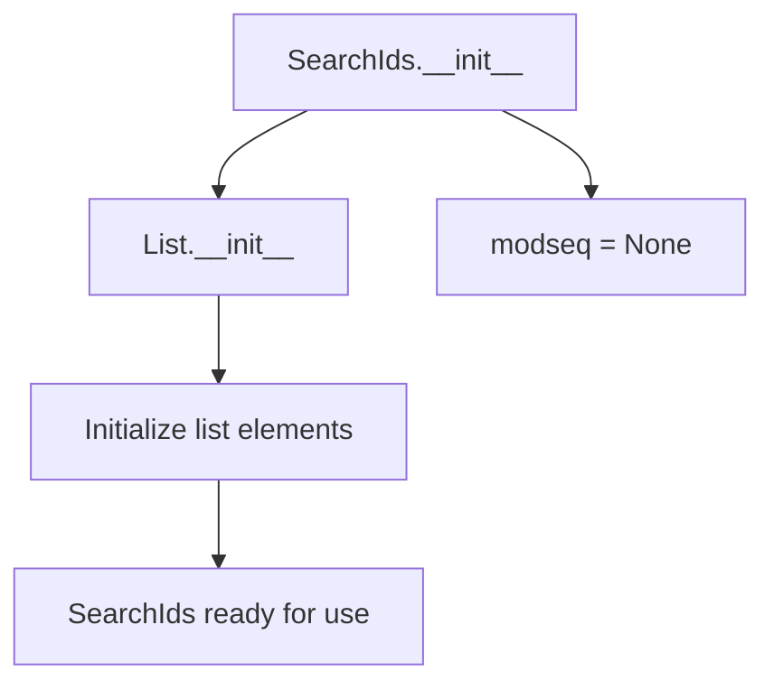
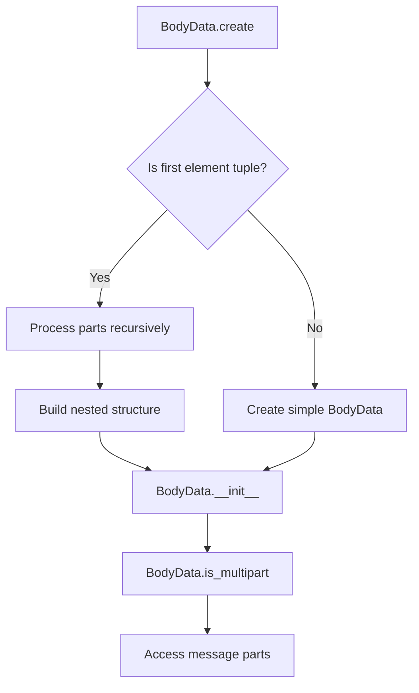

# `response_types.py`

## `imapclient.response_types.Envelope` · *class*

## Summary:
Represents the envelope information of an email message, containing metadata such as date, subject, and addressing information.

## Description:
The Envelope class encapsulates the fundamental metadata of an email message as returned by IMAP servers. It serves as a structured representation of email envelope data that can be used for parsing and processing IMAP responses. This class is designed as a dataclass to provide clean, immutable storage of email header information.

## State:
- date: Optional[datetime.datetime] - The date and time the message was sent, or None if not available
- subject: bytes - The raw subject line of the email message encoded in bytes
- from_: Optional[Tuple["Address", ...]] - The sender address(es) of the email, or None if not available
- sender: Optional[Tuple["Address", ...]] - The explicit sender address(es), or None if not available  
- reply_to: Optional[Tuple["Address", ...]] - Reply-to address(es), or None if not available
- to: Optional[Tuple["Address", ...]] - Primary recipient address(es), or None if not available
- cc: Optional[Tuple["Address", ...]] - Carbon copy recipient address(es), or None if not available
- bcc: Optional[Tuple["Address", ...]] - Blind carbon copy recipient address(es), or None if not available
- in_reply_to: bytes - The message ID this message is replying to, encoded in bytes
- message_id: bytes - The unique identifier of this message, encoded in bytes

## Lifecycle:
- Creation: Instances are typically created by IMAP response parsers when processing server responses. As a dataclass, instances can be created using keyword arguments matching the field names.
- Usage: Fields are accessed directly for retrieving email metadata. The class is immutable by design as it's intended to represent fixed envelope information.
- Destruction: No special cleanup required; standard Python garbage collection applies.

## Method Map:


## Raises:
No exceptions are raised by the class constructor as it's a simple data container with no validation logic.

## Example:
```python
# Typical usage through IMAP response parsing
envelope = Envelope(
    date=datetime.datetime(2023, 1, 15, 10, 30, 0),
    subject=b"Meeting Notes",
    from_=(Address(name=b"John Doe", route=b"", mailbox=b"john", host=b"example.com"),),
    sender=None,
    reply_to=None,
    to=None,
    cc=None,
    bcc=None,
    in_reply_to=b"<original-message-id@example.com>",
    message_id=b"<unique-message-id@example.com>"
)

# Accessing envelope fields
print(envelope.subject.decode('utf-8'))  # "Meeting Notes"
print(envelope.date)  # datetime object
```

## `imapclient.response_types.Address` · *class*

## Summary:
Represents an email address with name, route, mailbox, and host components in IMAP responses.

## Description:
The Address class is used to model email addresses returned by IMAP servers. It stores address components as bytes and provides string representation formatting using standard email address formatting conventions. This class is typically created by IMAP parsing functions when processing address-related fields in IMAP responses such as FROM, TO, CC headers.

## State:
- name: bytes - The display name portion of the email address
- route: bytes - The routing information for the email address (typically empty in most cases)
- mailbox: bytes - The mailbox/local part of the email address
- host: bytes - The domain/host portion of the email address

All attributes are initialized as bytes and converted to unicode strings when needed for display purposes.

## Lifecycle:
- Creation: Instances are typically constructed by IMAP parsing code when processing server responses
- Usage: The __str__ method returns a formatted email address string when invoked
- Destruction: No special cleanup required; standard Python garbage collection applies

## Method Map:


## Raises:
No exceptions are raised by the __str__ method. The class assumes valid byte sequences for its attributes.

## Example:
```python
# Typical usage when processing IMAP responses
address = Address(name=b"John Doe", route=b"", mailbox=b"john", host=b"example.com")
print(str(address))  # Output: "John Doe <john@example.com>"
```

### `imapclient.response_types.Address.__str__` · *method*

## Summary:
Converts an Address object to a formatted email address string with proper encoding handling.

## Description:
This method transforms an Address instance into a properly formatted email address string suitable for use in email headers. It handles both cases where both mailbox and host are present, and where only one is available. The method ensures proper Unicode conversion of all byte fields and applies standard email formatting conventions.

## Args:
    None - This is a special method that operates on the instance itself

## Returns:
    str: A formatted email address string in the format "Name <mailbox@host>" or just "mailbox@host" when name is not present

## Raises:
    None explicitly raised - though underlying to_unicode() may raise Unicode-related issues during decoding

## State Changes:
    Attributes READ: self.mailbox, self.host, self.name
    Attributes WRITTEN: None - this method is read-only

## Constraints:
    Preconditions: 
    - The Address instance must have valid mailbox and/or host attributes (can be bytes or str)
    - The name attribute can be bytes or str
    
    Postconditions:
    - Returns a properly formatted email address string
    - All byte fields are converted to Unicode strings
    - The returned string follows standard email address formatting conventions

## Side Effects:
    None - This method is pure and doesn't cause any I/O or external service calls

## `imapclient.response_types.SearchIds` · *class*

## Summary:
A specialized list type for IMAP search results that tracks a modification sequence number.

## Description:
The SearchIds class extends Python's built-in List[int] to represent IMAP search results, adding the capability to track a modification sequence number (modseq) that indicates when the mailbox was last modified. This is commonly used in IMAP operations to enable efficient incremental synchronization.

## State:
- modseq: Optional[int] - Tracks the modification sequence number of the mailbox. Initially set to None, indicating no modification sequence has been associated with these search results. When set, it represents the highest modification sequence number among the messages in the search result.

## Lifecycle:
- Creation: Instantiate with any arguments compatible with list construction (e.g., list of integers, another iterable, or no arguments)
- Usage: Behaves like a regular list of integers, with additional modseq tracking capability
- Destruction: Inherits standard Python list destruction behavior

## Method Map:


## Raises:
- No explicit exceptions raised by __init__
- Inherited exceptions from list constructor may be raised if invalid arguments are provided

## Example:
```python
# Create empty SearchIds
ids = SearchIds()

# Create with initial values
ids = SearchIds([1, 2, 3, 4])

# Use like a regular list
ids.append(5)
print(len(ids))  # 5

# Set modification sequence
ids.modseq = 12345
print(ids.modseq)  # 12345
```

### `imapclient.response_types.SearchIds.__init__` · *method*

## Summary:
Initializes a SearchIds instance with optional arguments and sets the modseq attribute to None.

## Description:
This constructor initializes a SearchIds object, which is a specialized list for storing IMAP search results. It delegates initialization to the parent List[int] class and sets up the modseq attribute for tracking modification sequences.

## Args:
    *args (Any): Variable length argument list passed to the parent List[int] constructor. These arguments are typically integers representing message IDs from IMAP search operations.

## Returns:
    None: This method initializes the object in-place and does not return a value.

## Raises:
    TypeError: If the arguments passed to the parent List constructor are incompatible with list initialization.

## State Changes:
    Attributes READ: None
    Attributes WRITTEN: self.modseq (set to None)

## Constraints:
    Preconditions: The arguments passed to *args must be compatible with List[int] initialization.
    Postconditions: The object is initialized as a List[int] containing the provided message IDs, with modseq attribute set to None.

## Side Effects:
    None: This method performs no I/O operations or external service calls.

## `imapclient.response_types.BodyData` · *class*

## Summary:
Represents parsed IMAP message body data with support for recursive multipart message handling.

## Description:
The BodyData class encapsulates IMAP message body structure information, providing methods to parse and identify multipart message formats. It serves as a structured representation of message body data received from IMAP servers, supporting both single-part and multipart message structures through recursive parsing.

This class is typically instantiated through the `create` classmethod which processes raw IMAP response tuples into structured objects. The class enables applications to distinguish between simple and complex message structures for proper processing.

## State:
- `response` (Tuple[_Atom, ...]): The underlying IMAP response data structure containing parsed message body information
- The class maintains hierarchical structure of message parts through inheritance from `_BodyDataType`
- When representing multipart messages, the first element is a list containing nested BodyData objects

## Lifecycle:
- Creation: Instances are created via the `create` classmethod which accepts a tuple response from IMAP server
- Usage: Typically accessed through the `is_multipart` property to determine message structure type, followed by accessing nested parts
- Destruction: Inherits standard Python object lifecycle management

## Method Map:


## Raises:
- TypeError: If the input response tuple doesn't conform to expected IMAP response structure
- ValueError: If the response data cannot be properly parsed into a valid BodyData structure

## Example:
```python
# Creating a BodyData instance from IMAP response
raw_response = (b'1', b'TEXT', b'PLAIN', b'UTF-8', b'7bit')
body_data = BodyData.create(raw_response)

# Creating multipart BodyData (recursive structure)
multipart_response = ((b'1', b'TEXT', b'PLAIN'), (b'2', b'TEXT', b'HTML'))
multipart_body = BodyData.create(multipart_response)

# Checking if message is multipart
if body_data.is_multipart:
    # Handle multipart message - access parts through indexing
    pass
else:
    # Handle single part message
    pass
```

### `imapclient.response_types.BodyData.create` · *method*

## Summary:
Creates a BodyData instance from an IMAP response tuple, handling both single-part and multipart email body structures.

## Description:
This classmethod constructs a BodyData object from an IMAP server response tuple according to the IMAP protocol specification. It intelligently handles multipart email messages by recursively processing nested tuples while preserving the structure of the original response. The method serves as a key parser for IMAP BODY responses, converting raw server data into structured BodyData objects that can be used for further processing.

The create method distinguishes between simple (single-part) and complex (multipart) email bodies by examining the structure of the response tuple. For multipart messages, it iterates through the tuple elements, recursively processing constituent parts represented as nested tuples until it encounters byte data that signals the end of the part structure.

## Args:
    cls: The BodyData class (used for classmethod)
    response (Tuple[_Atom, ...]): An IMAP response tuple containing email body data. _Atom represents IMAP response data types including bytes, strings, and tuples. For multipart messages, the tuple structure contains nested tuples representing individual message parts, terminated by byte data indicating the end of the body structure.

## Returns:
    BodyData: A new BodyData instance constructed from the response tuple

## Raises:
    None explicitly raised - though underlying constructor may raise exceptions for invalid data

## State Changes:
    Attributes READ: None (this is a classmethod that doesn't modify instance state)
    Attributes WRITTEN: None (this is a classmethod that creates new instances)

## Constraints:
    Preconditions:
    - The response parameter must be a tuple of _Atom objects following IMAP protocol structure
    - For multipart messages, the first element of response must be a tuple when processing nested parts
    - The response structure must conform to IMAP BODY response format expectations
    
    Postconditions:
    - Returns a valid BodyData instance
    - For multipart messages, the returned instance will have is_multipart=True
    - For single-part messages, the returned instance will have is_multipart=False

## Side Effects:
    None - This method performs no I/O operations or external service calls

### `imapclient.response_types.BodyData.is_multipart` · *method*

## Summary:
Determines whether the email body data contains multiple parts (multipart format).

## Description:
This property checks if the email body data is structured as multipart content by examining whether the first element of the body data is a list. Multipart emails contain multiple sections such as HTML and plain text versions, or include attachments.

## Args:
    None

## Returns:
    bool: True if the body data contains multiple parts (first element is a list), False otherwise.

## Raises:
    None

## State Changes:
    Attributes READ: self[0] - accesses the first element of the body data structure
    Attributes WRITTEN: None

## Constraints:
    Preconditions: The BodyData instance must be properly initialized with valid response data
    Postconditions: The returned boolean value accurately reflects the multipart nature of the body data structure

## Side Effects:
    None

