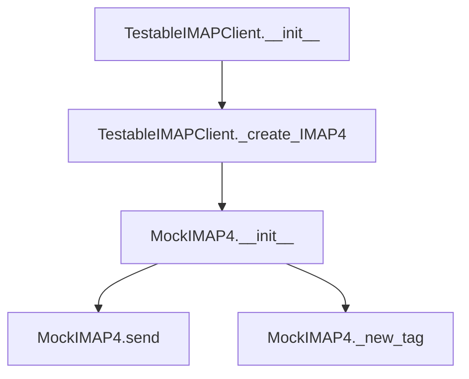

# `testable_imapclient.py`

## `imapclient.testable_imapclient.TestableIMAPClient` · *class*

## Summary:
A testable wrapper around IMAPClient that provides mockable IMAP4 connections for unit testing.

## Description:
TestableIMAPClient is a subclass of IMAPClient designed specifically for testing purposes. It overrides the internal _create_IMAP4 method to return a MockIMAP4 instance instead of a real IMAP4 connection. This allows unit tests to run without requiring actual network connectivity to an IMAP server.

This class serves as a factory for creating testable IMAP client instances that can simulate IMAP server interactions without making real network calls.

## State:
- host (inherited from IMAPClient): String representing the IMAP server hostname. In this implementation, it's hardcoded to "somehost" in __init__.
- use_uid (inherited from IMAPClient): Boolean flag indicating whether to use UID commands. Default is False, but MockIMAP4 sets it to True.
- sent (MockIMAP4 attribute): Bytes buffer that accumulates data sent to the mock server.
- tagged_commands (MockIMAP4 attribute): Dictionary storing tagged IMAP commands for testing verification.
- _starttls_done (MockIMAP4 attribute): Boolean flag tracking TLS negotiation status.

## Lifecycle:
- Creation: Instantiated with no arguments, automatically initializes with "somehost" as the IMAP server address
- Usage: Typically used in unit tests where real IMAP connections would be undesirable or impossible
- Destruction: Inherits standard Python object lifecycle management; no special cleanup required

## Method Map:


## Raises:
- None explicitly raised by __init__
- Exceptions from parent IMAPClient.__init__ if "somehost" is invalid or inaccessible

## Example:
```python
# Create testable IMAP client
client = TestableIMAPClient()

# The client uses a mock IMAP4 connection internally
# All operations are simulated without network calls

# Access the underlying mock for inspection
mock_connection = client._create_IMAP4()
```

### `imapclient.testable_imapclient.TestableIMAPClient.__init__` · *method*

## Summary:
Initializes a TestableIMAPClient instance with a fixed test hostname.

## Description:
This constructor initializes the TestableIMAPClient by calling the parent IMAPClient constructor with a predetermined hostname "somehost". This design allows for consistent testing behavior without requiring external configuration during unit tests.

## Args:
    None

## Returns:
    None

## Raises:
    Exception: Any exceptions raised by the parent IMAPClient.__init__ method when initializing with the hostname "somehost"

## State Changes:
    Attributes READ: None
    Attributes WRITTEN: Initializes all parent IMAPClient instance attributes through the super().__init__ call

## Constraints:
    Preconditions: None
    Postconditions: The instance is properly initialized as an IMAPClient with hostname "somehost"

## Side Effects:
    I/O: May establish network connection to the test host "somehost" during initialization
    External service calls: Calls parent IMAPClient constructor which may connect to the specified host

### `imapclient.testable_imapclient.TestableIMAPClient._create_IMAP4` · *method*

## Summary:
Creates and returns a new mock IMAP4 connection instance for testing purposes.

## Description:
This method serves as a factory for creating MockIMAP4 instances, enabling testable IMAP client behavior without requiring actual network connections. It is designed to support unit testing by providing a mock implementation of the IMAP4 protocol interface.

## Args:
    None

## Returns:
    MockIMAP4: A new instance of the MockIMAP4 class.

## Raises:
    None

## State Changes:
    Attributes READ: None
    Attributes WRITTEN: None

## Constraints:
    Preconditions: None
    Postconditions: Returns a MockIMAP4 instance.

## Side Effects:
    None

## `imapclient.testable_imapclient.MockIMAP4` · *class*

## Summary:
MockIMAP4 is a testable mock implementation of an IMAP4 client that extends unittest.mock.Mock for use in testing scenarios.

## Description:
This class provides a mock implementation of an IMAP4 client specifically designed for testing purposes. It inherits from unittest.mock.Mock and adds IMAP-specific attributes and behaviors to simulate real IMAP communication while allowing test control over responses and interactions. The mock accumulates sent data and maintains IMAP session state for verification during tests.

## State:
- use_uid: bool, always set to True, indicating UID-based operations are enabled
- sent: bytes, accumulates all data sent through the send() method
- tagged_commands: dict, stores tagged IMAP commands for tracking and mocking responses
- _starttls_done: bool, tracks whether STARTTLS has been completed in the session

## Lifecycle:
- Creation: Instantiated like any Mock object, typically by test code to replace real IMAP connections
- Usage: Methods can be called to simulate IMAP operations; sent data is accumulated for verification
- Destruction: Inherits standard Mock cleanup behavior; no special cleanup required

## Method Map:
```mermaid
graph TD
    A[MockIMAP4.__init__] --> B[MockIMAP4.send]
    A --> C[MockIMAP4._new_tag]
    B --> D[Updates self.sent]
    C --> E[Returns "tag"]
```

## Raises:
- No explicit exceptions raised by __init__
- All exceptions would come from the parent Mock class behavior

## Example:
```python
# Create mock IMAP client
mock_client = MockIMAP4()

# Send data (accumulated in self.sent)
mock_client.send(b"LOGIN user password\r\n")

# Verify what was sent
assert mock_client.sent == b"LOGIN user password\r\n"

# Check other attributes
assert mock_client.use_uid == True
assert mock_client._starttls_done == False
```

### `imapclient.testable_imapclient.MockIMAP4.__init__` · *method*

## Summary:
Initializes a mock IMAP client instance with test-specific configurations and state tracking.

## Description:
This method sets up a mock IMAP client that simulates an IMAP connection for testing purposes. It configures the mock to use UID operations by default and initializes internal state variables needed for tracking communication and command execution during tests.

## Args:
    *args (Any): Variable length argument list passed to the parent Mock constructor
    **kwargs (Any): Arbitrary keyword arguments passed to the parent Mock constructor

## Returns:
    None: This method initializes the object and returns nothing

## Raises:
    None: This method does not raise any exceptions explicitly

## State Changes:
    Attributes READ: None
    Attributes WRITTEN: 
    - self.use_uid: Set to True to enable UID-based operations
    - self.sent: Initialized as empty bytes to accumulate sent command data
    - self.tagged_commands: Initialized as empty dictionary to track tagged IMAP commands
    - self._starttls_done: Initialized as False to track TLS negotiation status

## Constraints:
    Preconditions: None
    Postconditions: 
    - The object is initialized as a Mock instance with IMAP client interface
    - All internal tracking attributes are properly initialized
    - The use_uid flag is set to True for UID operations

## Side Effects:
    None: This method performs no external I/O or service calls

### `imapclient.testable_imapclient.MockIMAP4.send` · *method*

## Summary:
Accumulates sent data into the internal buffer for testing message transmission.

## Description:
This method is used in test environments to capture and track data sent over the IMAP connection. It appends the provided byte data to an internal buffer (`self.sent`) that can be inspected later to verify communication with the IMAP server.

## Args:
    data (bytes): The raw byte data to be accumulated in the sent buffer.

## Returns:
    None: This method does not return any value.

## Raises:
    None: This method does not raise any exceptions.

## State Changes:
    Attributes READ: self.sent
    Attributes WRITTEN: self.sent

## Constraints:
    Preconditions: The object must be properly initialized with a `sent` attribute of type bytes.
    Postconditions: The `self.sent` attribute will contain the concatenation of all previously sent data plus the new data.

## Side Effects:
    None: This method only modifies the internal state of the object and does not perform any I/O operations or external service calls.

### `imapclient.testable_imapclient.MockIMAP4._new_tag` · *method*

## Summary:
Generates and returns a fixed tag string for use in IMAP command identification during testing.

## Description:
This method serves as a placeholder implementation for generating IMAP command tags in mock environments. It returns a constant "tag" string to facilitate predictable testing behavior. The method is typically called during IMAP command execution to associate commands with their expected responses.

## Args:
    None

## Returns:
    str: Always returns the string "tag"

## Raises:
    None

## State Changes:
    Attributes READ: None
    Attributes WRITTEN: None

## Constraints:
    Preconditions: None
    Postconditions: Always returns "tag" string

## Side Effects:
    None

